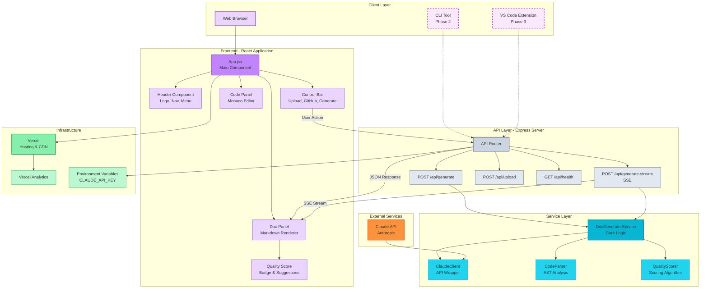

# CodeScribe AI - System Architecture

> **Quick Visual Reference:** This document provides an interactive Mermaid diagram and high-level architecture overview.
> **For Deep Technical Details:** See [ARCHITECTURE.md](ARCHITECTURE.md) for comprehensive architecture documentation including security, performance, scalability, and deployment strategies.

This diagram shows the complete system architecture for CodeScribe AI across all planned phases.

## Architecture Overview

### Client Layer
- **Web Browser**: Primary interface for Phase 1 (MVP)
- **CLI Tool**: Command-line interface (Phase 2)
- **VS Code Extension**: IDE integration (Phase 3)

### Frontend (React Application)
- **App.jsx**: Main application component and state management
- **Header**: Branding and navigation
- **Control Bar**: File upload, GitHub integration, and generation controls
- **Code Panel**: Monaco editor for code input
- **Doc Panel**: Markdown renderer for generated documentation
- **Quality Score**: Visual scoring with improvement suggestions

### API Layer (Express Server)
- **POST /api/generate**: Standard documentation generation endpoint
- **POST /api/generate-stream**: Server-Sent Events (SSE) streaming endpoint
- **POST /api/upload**: File upload handling
- **GET /api/health**: Health check endpoint

### Service Layer
- **DocGeneratorService**: Core orchestration logic for documentation generation
- **ClaudeClient**: Wrapper for Anthropic Claude API with retry logic
- **CodeParser**: AST-based code analysis using Acorn
- **QualityScorer**: Documentation quality assessment algorithm

### External Services
- **Claude API**: Anthropic's Claude Sonnet 4.5 for AI generation

### Infrastructure
- **Vercel**: Hosting platform with CDN
- **Vercel Analytics**: Usage tracking and performance monitoring
- **Environment Variables**: Secure configuration management (API keys, etc.)

## Data Flow

1. User inputs code via browser → React App
2. User triggers generation → API request to Express server
3. Server routes request → DocGeneratorService
4. DocGenerator orchestrates:
   - CodeParser extracts structure (functions, classes, exports)
   - ClaudeClient sends enriched prompt to Claude API
   - Claude streams response back through SSE
   - QualityScorer analyzes generated documentation
5. Documentation and quality score → Frontend for display

## Technology Stack

**Frontend**: React 18, Vite, Tailwind CSS, Monaco Editor, react-markdown
**Backend**: Node.js, Express, Anthropic SDK, Acorn (AST parser)
**Infrastructure**: Vercel, Server-Sent Events (SSE)
**AI**: Claude Sonnet 4.5 (claude-sonnet-4-20250514)