# CodeScribe AI - System Architecture

> **Quick Visual Reference:** This document provides an interactive Mermaid diagram and high-level architecture overview.
> **For Deep Technical Details:** See [ARCHITECTURE.md](ARCHITECTURE.md) for comprehensive architecture documentation including security, performance, scalability, and deployment strategies.

This diagram shows the complete system architecture for CodeScribe AI across all planned phases.

```mermaid
%%{init: {'theme':'base', 'themeVariables': { 'primaryColor':'#faf5ff','primaryTextColor':'#1f2937','primaryBorderColor':'#9333ea','lineColor':'#64748b','secondaryColor':'#ecfeff','tertiaryColor':'#fff7ed','clusterBkg':'#fafafa','clusterBorder':'#9333ea'}, 'flowchart': {'padding': 15, 'nodeSpacing': 50, 'rankSpacing': 80, 'subGraphTitleMargin': {'top': 5, 'bottom': 5}}}}%%
graph TB
    subgraph client ["Client Layer"]
        Browser[Web Browser]
        CLI[CLI Tool<br/>Phase 2]
        VSCode[VS Code Extension<br/>Phase 3]
    end

    subgraph frontend ["Frontend - React Application"]
        App[App.jsx<br/>Main Component<br/>+ Hooks + State]
        Header[Header Component<br/>Logo, Nav, RateLimitIndicator]
        MobileMenu[Mobile Menu<br/>Slide-in Navigation]
        ControlBar[Control Bar<br/>Doc Type, Upload, Generate]
        ErrorBanner[Error Banner<br/>Inline Errors + Timer]
        CodePanel[Code Panel<br/>+ LazyMonacoEditor]
        DocPanel[Doc Panel Lazy<br/>Markdown + Mermaid]
        QualityScore[Quality Score<br/>Badge + Modal]
        Toaster[Toast System<br/>Notifications + History]

        App --> Header
        App --> MobileMenu
        App --> ControlBar
        App --> ErrorBanner
        App --> CodePanel
        App --> DocPanel
        App --> Toaster
        DocPanel --> QualityScore
    end

    subgraph api ["API Layer - Express Server"]
        Router[API Router]
        Middleware[Middleware Stack<br/>CORS + RateLimit + Parser]
        GenerateRoute[POST /api/generate]
        StreamRoute[POST /api/generate-stream<br/>Fetch ReadableStream]
        UploadRoute[POST /api/upload<br/>Multer 500KB]
        HealthRoute[GET /api/health]
        ErrorHandler[Error Handler<br/>User-friendly Messages]

        Router --> Middleware
        Middleware --> GenerateRoute
        Middleware --> StreamRoute
        Middleware --> UploadRoute
        Router --> HealthRoute
        Router --> ErrorHandler
    end

    subgraph services ["Service Layer - Singleton Pattern"]
        DocGen[DocGeneratorService<br/>4 Prompt Strategies]
        ClaudeClient[ClaudeClient<br/>3-Retry Exponential]
        CodeParser[CodeParser<br/>Acorn AST + 14 Metrics]
        QualityScorer[QualityScorer<br/>5 Criteria Algorithm]

        GenerateRoute --> DocGen
        StreamRoute --> DocGen
        DocGen --> ClaudeClient
        DocGen --> CodeParser
        DocGen --> QualityScorer
    end

    subgraph external ["External Services"]
        Claude[Claude API<br/>Sonnet 4.5<br/>claude-sonnet-4-20250514]
        Claude --> ClaudeClient
    end

    subgraph infra ["Infrastructure"]
        Vercel[Vercel Production<br/>codescribeai.com<br/>Hosting & CDN]
        Analytics[Vercel Analytics<br/>Performance Monitoring]
        Env[Environment Variables<br/>CLAUDE_API_KEY + Config]
        Performance[Performance<br/>Bundle: 78KB -85%<br/>Lighthouse: 75 +67%]
    end

    subgraph legend ["🗺️ LEGEND"]
        L["🟣 Purple - Client/Frontend<br/>⚪ Slate - API Layer<br/>🔵 Indigo - Services<br/>🟡 Yellow - External<br/>🟢 Green - Infrastructure<br/>--- Dashed - Future"]
    end

    Browser --> App
    CLI -.-> Router
    VSCode -.-> Router

    ControlBar --> |User Action| Router
    Router --> |JSON Response| DocPanel
    StreamRoute --> |SSE Stream| DocPanel

    App --> Vercel
    Vercel --> Analytics
    Router --> Env

    style Browser fill:#e9d5ff,stroke:#9333ea,stroke-width:2px
    style CLI fill:#fae8ff,stroke:#c026d3,stroke-width:2px
    style VSCode fill:#fae8ff,stroke:#c026d3,stroke-width:2px
    style App fill:#c084fc,stroke:#9333ea,stroke-width:2px
    style Header fill:#e9d5ff,stroke:#9333ea
    style MobileMenu fill:#e9d5ff,stroke:#9333ea
    style ControlBar fill:#e9d5ff,stroke:#9333ea
    style ErrorBanner fill:#e9d5ff,stroke:#9333ea
    style CodePanel fill:#e9d5ff,stroke:#9333ea
    style DocPanel fill:#e9d5ff,stroke:#9333ea
    style QualityScore fill:#e9d5ff,stroke:#9333ea
    style Toaster fill:#e9d5ff,stroke:#9333ea
    style Router fill:#cbd5e1,stroke:#475569,stroke-width:2px
    style Middleware fill:#e2e8f0,stroke:#64748b
    style GenerateRoute fill:#e2e8f0,stroke:#64748b
    style StreamRoute fill:#e2e8f0,stroke:#64748b
    style UploadRoute fill:#e2e8f0,stroke:#64748b
    style HealthRoute fill:#e2e8f0,stroke:#64748b
    style ErrorHandler fill:#e2e8f0,stroke:#64748b
    style DocGen fill:#c7d2fe,stroke:#4338ca,stroke-width:2px
    style ClaudeClient fill:#e0e7ff,stroke:#4f46e5
    style CodeParser fill:#e0e7ff,stroke:#4f46e5
    style QualityScorer fill:#e0e7ff,stroke:#4f46e5
    style Claude fill:#fbbf24,stroke:#ca8a04,stroke-width:2px
    style Vercel fill:#86efac,stroke:#16a34a,stroke-width:2px
    style Analytics fill:#bbf7d0,stroke:#22c55e
    style Env fill:#bbf7d0,stroke:#22c55e
    style Performance fill:#bbf7d0,stroke:#22c55e

    classDef phase2 stroke-dasharray: 5 5
    classDef phase3 stroke-dasharray: 5 5
    class CLI phase2
    class VSCode phase3

    style L fill:#ffffff,stroke:none,text-align:left
    style legend fill:#ffffff,stroke:#e2e8f0,stroke-width:2px
```

### Color Legend (Detailed)

The diagram includes an interactive legend. Here's the complete color system:

| Color | Layer | Purpose | Design System | Usage |
|-------|-------|---------|---------------|-------|
| 🟣 **Purple** | Client & Frontend | User-facing components and interfaces | Primary brand color | Buttons, links, client-side UI |
| ⚪ **Slate Gray** | API Layer | Backend routing and request handling | Neutral palette | Express routes, middleware |
| 🔵 **Indigo** | Service Layer | Core business logic and processing | Secondary brand color | Services, business logic, algorithms |
| 🟡 **Yellow** | External Services | Third-party APIs and external dependencies | Warning/dependency color | Claude API, external integrations |
| 🟢 **Green** | Infrastructure | Hosting, deployment, and environment | Success/production color | Vercel, analytics, environment config |

**Visual Indicators:**
- **Solid border (—)** = Phase 1 (Current MVP) - actively implemented
- **Dashed border (- - -)** = Future phases (CLI in Phase 2, VS Code Extension in Phase 3)
- **Thicker borders** = Primary/main components in each layer
- **Color consistency** = All colors match the brand palette from `docs/design/brand-color-palette.html`

---

## Architecture Overview

### Client Layer
- **Web Browser**: Primary interface for Phase 1 (MVP)
- **CLI Tool**: Command-line interface (Phase 2)
- **VS Code Extension**: IDE integration (Phase 3)

### Frontend (React Application)
- **App.jsx**: Main application component with hooks-based state management
- **Header**: Branding, navigation, and RateLimitIndicator
- **MobileMenu**: Responsive slide-in navigation for mobile devices
- **Control Bar**: Doc type selector, file upload, and generation controls
- **Code Panel**: LazyMonacoEditor wrapper for Monaco editor (lazy loaded)
- **Doc Panel**: Markdown renderer with LazyMermaidRenderer (lazy loaded)
- **Quality Score**: Visual scoring badge with modal breakdown
- **ErrorBanner**: Inline error display with retry timer and animations
- **Toast System**: Notification system with history (react-hot-toast)

### API Layer (Express Server)
- **Middleware Stack**: CORS → Rate Limiting → Body Parser → Routes → Error Handler
- **POST /api/generate**: Standard documentation generation endpoint
- **POST /api/generate-stream**: Streaming endpoint using Fetch API ReadableStream
- **POST /api/upload**: File upload with Multer (500KB limit, 10+ file types)
- **GET /api/health**: Health check endpoint with uptime and version info
- **Rate Limiting**: Two-tier system (10/min per IP, 100/hour for generation)
- **Error Handling**: Custom error handler middleware with user-friendly messages

### Service Layer
- **DocGeneratorService**: Core orchestration with 4 prompt strategies (README, JSDoc, API, ARCHITECTURE)
- **ClaudeClient**: Wrapper for Anthropic Claude API with 3-retry exponential backoff
- **CodeParser**: Acorn AST parser with 14 metrics and fallback regex parsing for non-JS
- **QualityScorer**: 5-criteria algorithm (Overview, Installation, Examples, API Docs, Structure)
- **Pattern**: All services use Singleton pattern for single instance across requests

### External Services
- **Claude API**: Anthropic's Claude Sonnet 4.5 (model: claude-sonnet-4-20250514)
  - Streaming via SDK async iterators
  - 200K token context window
  - Max tokens: 4000 per request

### Infrastructure
- **Vercel**: ✅ **Deployed to Production** ([codescribeai.com](https://codescribeai.com))
  - Hosting platform with global CDN
  - GitHub Actions CI/CD with test-gated Deploy Hooks
- **Vercel Analytics**: Usage tracking and performance monitoring
- **Environment Variables**: Secure configuration management (API keys, secrets)

## Data Flow

1. User inputs code via browser → React App
2. User triggers generation → API request to Express server
3. Server routes request → DocGeneratorService
4. DocGenerator orchestrates:
   - CodeParser extracts structure (functions, classes, exports)
   - ClaudeClient sends enriched prompt to Claude API
   - Claude streams response back through SSE
   - QualityScorer analyzes generated documentation
5. Documentation and quality score → Frontend for display

## Technology Stack

> **📊 Accurate Versions**: These versions are from the version checker script. Run `npm run versions` to verify current installations.

**Frontend**:
- React 19.2.0, Vite 7.1.9, Tailwind CSS 3.4.18
- Monaco Editor 4.7.0 (lazy loaded), react-markdown 10.1.0 (lazy loaded)
- Mermaid 11.12.0 (lazy loaded), react-hot-toast 2.6.0
- Lucide React 0.545.0 (icons)

**Backend**:
- Node.js 22.19.0, npm 11.6.0, Express 5.1.0
- @anthropic-ai/sdk 0.65.0, Acorn 8.15.0 (AST parser)
- Multer 2.0.2 (file upload), express-rate-limit 8.1.0, cors 2.8.5

**Infrastructure**:
- Vercel (✅ deployed to production), GitHub Actions (CI/CD)
- Fetch API with ReadableStream (streaming), Environment Variables (.env)

**AI**: Claude Sonnet 4.5 (claude-sonnet-4-20250514)

**Performance**:
- Bundle: 78 KB gzipped (85% reduction from 516 KB)
- Lighthouse: 75/100 (+67% improvement from 45)
- Core Web Vitals: FCP -89%, LCP -93%, TBT -30%