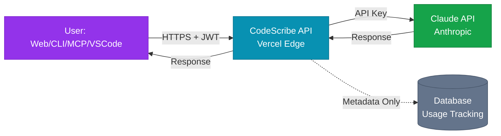
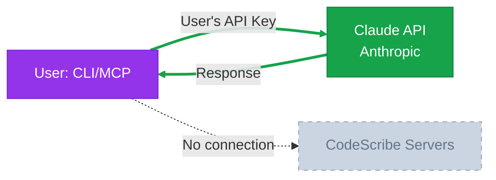

# CodeScribe AI - Deployment Modes & Privacy Architecture

**Last Updated:** October 30, 2025
**Status:** Design Documentation (Epics 5.1, 5.2, 5.3 - Planned)

---

## Overview

CodeScribe AI offers multiple deployment modes to serve different use cases, from individual developers to enterprise teams. Each mode balances convenience, privacy, and automation differently.

**Key Principle:** Privacy and security are user-controlled. Users can choose between cloud-hosted convenience or local-only processing for maximum privacy.

---

## Deployment Modes Comparison

| Mode | Privacy Level | Best For | Authentication | Availability |
|------|--------------|----------|----------------|--------------|
| **Web App** | Standard | Interactive documentation, learning | OAuth/Email | ✅ Live (v2.3.0) |
| **CLI Tool (Cloud)** | Standard | CI/CD pipelines, automation | JWT | 🔮 Epic 5.1 |
| **CLI Tool (Local)** | Maximum | Privacy-sensitive codebases | User's API key | 🔮 Epic 5.1 |
| **MCP Server (Cloud)** | Standard | Claude-native workflows | JWT | 🔮 Epic 5.2 |
| **MCP Server (Local)** | Maximum | Private repos in Claude/Cursor | User's API key | 🔮 Epic 5.2 |
| **VS Code Extension** | Standard/Maximum | IDE-integrated workflow | JWT or API key | 🔮 Epic 5.3 |

---

## 1. Web Application (Live)

### Overview
The primary web-based interface at [codescribeai.com](https://codescribeai.com). Best for interactive documentation generation, exploring features, and learning.

### Privacy & Security Model

**Data Flow:**
```
User Browser → Vercel (HTTPS) → CodeScribe API → Claude API → Response
     ↓
Code stored in memory only (never persisted to database)
```

**Security Features:**
- ✅ All code processing happens in memory (no file storage)
- ✅ HTTPS/TLS encryption for all data in transit
- ✅ Rate limiting (10/min, 100/hour per IP)
- ✅ Input validation and sanitization
- ✅ File upload security checks (MIME type validation, size limits)
- ✅ Session management with secure cookies
- ✅ CORS protection
- ✅ HSTS headers

**Database Storage (Optional - Only if Authenticated):**
- User account data (email, hashed password, OAuth tokens)
- Usage tracking (daily/monthly doc counts)
- Session data (authentication state)
- **Never stored:** Source code, generated documentation, file contents

**Privacy Guarantees:**
- Code is processed in real-time and immediately discarded
- No code retention or training on user data
- Claude API: "We do not train our generative AI models on inputs and outputs through our API" ([Anthropic Commercial Terms](https://www.anthropic.com/legal/commercial-terms))
- Anonymous usage allowed (no account required for Free tier)

### Use Cases
- Individual developers exploring the tool
- Learning documentation best practices via quality scoring
- One-off documentation generation
- Mobile/tablet usage (responsive design)

### Authentication
- GitHub OAuth (instant access to private repos)
- Email/password with password reset flow
- Optional: Anonymous usage (no login required)

---

## 2. CLI Tool (Epic 5.1 - Planned)

### Overview
Command-line interface for automation, CI/CD pipelines, and batch processing. Supports two modes: **Cloud** (default) and **Local** (privacy-first).

### Installation
```bash
npm install -g codescribe-ai
```

### Cloud Mode (Default)

**Privacy Model:** Same as web app - code sent to CodeScribe API → Claude API

**Authentication:**
```bash
# First-time setup (opens browser for OAuth)
codescribe login

# Generates and stores JWT token locally (~/.codescribe/token)
# Token valid for 30 days, auto-refresh
```

**Usage:**
```bash
# Single file
codescribe generate src/utils/helpers.js --type=jsdoc

# Directory with glob patterns
codescribe generate "src/**/*.js" --type=api

# Configuration file
codescribe generate --config .codescriberc
```

**Data Flow:**
```
CLI → CodeScribe API (JWT auth) → Claude API → CLI Output
```

**Benefits:**
- ✅ Usage tracking and tier management
- ✅ Shared quota with web app
- ✅ Team collaboration (organization accounts)
- ✅ Automatic updates and feature releases

**Privacy Considerations:**
- Code sent to CodeScribe servers (same as web app)
- Metadata logged: file count, doc type, generation time
- No source code retention

---

### Local Mode (Privacy-First)

**Privacy Model:** Code **never leaves user's machine** - sent directly to Claude API using user's own API key

**Setup:**
```bash
# Set your Claude API key
export ANTHROPIC_API_KEY="sk-ant-..."

# Or store in config file
echo "anthropic_api_key: sk-ant-..." > ~/.codescribe/config.yml
```

**Usage:**
```bash
# Use --local flag to bypass CodeScribe servers
codescribe generate src/app.py --type=readme --local

# All processing happens locally
codescribe generate . --type=architecture --local --recursive
```

**Data Flow:**
```
CLI → Claude API (direct, using user's key) → CLI Output
          ↑
    No CodeScribe servers involved
```

**Benefits:**
- ✅ **Maximum privacy:** Code never touches CodeScribe servers
- ✅ No usage tracking or logging
- ✅ Full control over API costs (pay Anthropic directly)
- ✅ Works in air-gapped environments (with internet for Claude API)
- ✅ No account required

**Limitations:**
- ❌ No usage dashboard or quota management
- ❌ No quality history or saved projects
- ❌ User pays for Claude API usage directly (~$3 per million input tokens)
- ❌ No automatic updates to prompts/features (uses CLI version's logic)

**Use Cases:**
- Enterprise environments with strict data policies
- Pre-commit hooks (auto-generate docs before commit)
- CI/CD pipelines (GitHub Actions, GitLab CI, Jenkins)
- Open-source projects with sensitive code

---

### Configuration File (.codescriberc)

```yaml
# .codescriberc example
mode: local  # or "cloud" (default)
anthropic_api_key: sk-ant-...  # Only for local mode
doc_type: api
output_dir: ./docs
patterns:
  - "src/**/*.js"
  - "!src/**/*.test.js"
quality_threshold: 80  # Fail if score < 80
```

---

## 3. MCP Server (Epic 5.2 - Planned)

### Overview
Model Context Protocol server for Claude-native workflows. Works out-of-the-box in **Claude Desktop**, **Claude Code**, **Cursor**, and **Zed**.

**MCP Introduction:** MCP is an open protocol by Anthropic that allows Claude to interact with external tools and data sources. Think of it as "plugins for Claude" - tools that extend Claude's capabilities beyond just text generation.

### Installation
```bash
npm install -g @codescribe/mcp-server

# Configure in Claude Desktop settings
# ~/.config/Claude/claude_desktop_config.json (macOS)
# %APPDATA%\Claude\claude_desktop_config.json (Windows)
```

### Cloud Mode (Default)

**Privacy Model:** Same as web app and CLI cloud mode

**Configuration (claude_desktop_config.json):**
```json
{
  "mcpServers": {
    "codescribe": {
      "command": "codescribe-mcp",
      "args": ["--mode", "cloud"]
    }
  }
}
```

**Authentication:**
```bash
# First-time setup (similar to CLI)
codescribe-mcp login
```

**Usage in Claude/Cursor:**
```
User: "Document this entire repository"
Claude: [Uses MCP tool: generate_docs with current directory]

User: "Analyze src/services/docGenerator.js and score it"
Claude: [Uses MCP tool: analyze_code, then score_quality]

User: "Generate API docs for https://github.com/user/repo"
Claude: [Uses MCP tool: generate_docs with GitHub URL]
```

**MCP Tools Provided:**
- `generate_docs` - Generate documentation for file/directory/GitHub URL
- `analyze_code` - Parse and analyze code structure
- `score_quality` - Evaluate documentation quality (0-100 scale)

**Data Flow:**
```
Claude/Cursor → MCP Server → CodeScribe API (JWT) → Claude API → Response
```

---

### Local Mode (Privacy-First)

**Privacy Model:** Code never leaves user's machine - direct Claude API calls

**Configuration (claude_desktop_config.json):**
```json
{
  "mcpServers": {
    "codescribe": {
      "command": "codescribe-mcp",
      "args": ["--mode", "local"],
      "env": {
        "ANTHROPIC_API_KEY": "sk-ant-..."
      }
    }
  }
}
```

**Usage:**
```
User: "Document this private repo in local mode"
Claude: [Uses MCP tool with --local flag, bypasses CodeScribe servers]
```

**Data Flow:**
```
Claude/Cursor → MCP Server → Claude API (direct) → Response
                    ↑
          No CodeScribe servers
```

**Benefits:**
- ✅ Maximum privacy (same as CLI local mode)
- ✅ Natural language interface ("document this repo")
- ✅ Context-aware (Claude can analyze code before generating docs)
- ✅ Works in Cursor, Claude Desktop, Claude Code, Zed

**Use Cases:**
- Private repositories in Cursor/Claude workflows
- AI-native developers who live in Claude/Cursor
- Exploratory documentation ("what does this file do?")
- Iterative refinement ("improve this README, add examples")

---

## 4. VS Code Extension (Epic 5.3 - Planned)

### Overview
Native VS Code extension for IDE-integrated documentation workflows. Two implementation options: **native extension** or **MCP integration via Cline**.

**Note:** Cursor users should use MCP Server (Epic 5.2) as Cursor has native MCP support.

### Installation
```bash
# VS Code Marketplace
code --install-extension codescribe-ai.codescribe
```

### Authentication & Privacy

**Cloud Mode (Default):**
- OAuth login flow (same as web app)
- JWT token stored in VS Code SecretStorage (encrypted)
- Code sent to CodeScribe API → Claude API

**Local Mode (Privacy-First):**
- User provides Claude API key in extension settings
- Code sent directly to Claude API (no CodeScribe servers)

### Features

**Right-Click Menu:**
- Right-click any file → "Generate Documentation"
- Select text → "Document Selection"
- Right-click folder → "Document Directory"

**Status Bar:**
- Quality score indicator (0-100)
- Tier usage (e.g., "7/10 docs this month")

**WebView Panel:**
- Inline documentation preview
- Markdown rendering with syntax highlighting
- Copy/download options

**Problems Panel:**
- Quality suggestions ("Missing usage examples")
- Actionable improvements ("Add installation instructions")

**Settings:**
```json
{
  "codescribe.mode": "cloud",  // or "local"
  "codescribe.apiKey": "",  // Only for local mode
  "codescribe.docType": "auto",  // or "readme", "jsdoc", "api", "architecture"
  "codescribe.autoGenerate": false,  // Auto-generate on save
  "codescribe.qualityThreshold": 80
}
```

### Use Cases
- Real-time documentation as you code
- Pre-commit documentation checks
- Team-wide quality standards (shared .vscode/settings.json)
- Onboarding new developers (explore codebase via docs)

---

## Privacy Comparison Matrix

| Feature | Web App | CLI (Cloud) | CLI (Local) | MCP (Cloud) | MCP (Local) | VS Code |
|---------|---------|-------------|-------------|-------------|-------------|---------|
| **Code leaves machine** | Yes | Yes | **No** | Yes | **No** | Optional |
| **Anthropic training** | No | No | No | No | No | No |
| **CodeScribe retention** | No | No | No | No | No | No |
| **Usage tracking** | Yes | Yes | No | Yes | No | Optional |
| **Metadata logging** | Yes | Yes | No | Yes | No | Optional |
| **Requires account** | Optional | Yes | No | Yes | No | Optional |
| **Works offline** | No | No | No* | No | No* | No* |
| **User pays Claude** | No | No | Yes | No | Yes | Optional |
| **Air-gapped support** | No | No | No | No | No | No |

*Requires internet for Claude API, but no CodeScribe servers

---

## Security Best Practices

### For All Modes

1. **API Key Security (Local Mode)**
   - Never commit API keys to version control
   - Use environment variables: `export ANTHROPIC_API_KEY=sk-ant-...`
   - Store in secure config: `~/.codescribe/config.yml` (chmod 600)
   - Rotate keys regularly

2. **Sensitive Code**
   - Use `.codescribeignore` file (like `.gitignore`)
   - Exclude secrets, credentials, tokens
   - Review generated docs before sharing

3. **Rate Limiting**
   - Cloud mode: 10/min, 100/hour per user
   - Local mode: Anthropic's rate limits apply

4. **HTTPS/TLS**
   - All API communication encrypted in transit
   - Certificate pinning in CLI/MCP/extension

### For Enterprise Users

1. **Self-Hosted Option (Epic 6.3)**
   - Deploy CodeScribe on your infrastructure
   - Full control over data flow and retention
   - Air-gapped environment support
   - License key validation

2. **SSO Integration (Epic 6.1)**
   - SAML 2.0 with Okta, Auth0, Azure AD
   - Just-In-Time (JIT) user provisioning
   - Role-based access control (RBAC)

3. **Audit Logs (Epic 6.2)**
   - Comprehensive logging of all API calls
   - Export to SIEM (Splunk, Datadog, etc.)
   - GDPR/SOC 2 compliance tools

---

## Use Case Recommendations

### Individual Developer (Open Source)
**Recommended:** Web App (anonymous) or CLI Local Mode
- No account needed
- Maximum privacy
- Pay Anthropic directly (~$0.01 per doc)

### Startup/Small Team
**Recommended:** Web App + CLI Cloud Mode
- Shared quota management
- Usage dashboard
- Team collaboration (coming in Epic 2.6)

### Enterprise (Strict Privacy)
**Recommended:** CLI Local Mode + Self-Hosted (Epic 6.3)
- Code never leaves network
- Full audit trail
- Integration with existing SSO

### AI-Native Developer
**Recommended:** MCP Server (Cloud or Local)
- Works in Cursor, Claude Desktop, Zed
- Natural language interface
- Context-aware documentation

### CI/CD Pipeline
**Recommended:** CLI Local Mode
- Pre-commit hooks
- GitHub Actions integration
- Fail builds on low quality scores

---

## Cost Comparison

| Mode | Cost Model | Typical Cost per Doc | Notes |
|------|-----------|----------------------|-------|
| Web App (Free) | Free | $0 | 10 docs/month |
| Web App (Starter) | $12/month | $0.24 | 50 docs/month |
| Web App (Pro) | $29/month | $0.145 | 200 docs/month |
| CLI Cloud | Same as web | Same as web | Shared quota with web |
| CLI Local | Pay Anthropic | ~$0.01-0.03 | Depends on code size |
| MCP Cloud | Same as web | Same as web | Shared quota |
| MCP Local | Pay Anthropic | ~$0.01-0.03 | Direct API costs |

**Anthropic Pricing (as of Oct 2025):**
- Sonnet 4.5 Input: $3 per million tokens
- Sonnet 4.5 Output: $15 per million tokens
- Typical doc: 1K-5K input tokens, 500-2K output tokens
- **Rough estimate:** $0.01-0.03 per document in local mode

---

## Privacy Statement

**CodeScribe AI Privacy Commitments:**

1. **No Code Retention:** Source code is processed in memory and immediately discarded. We never store, log, or persist your source code.

2. **No Training:** We do not train any AI models on your code or generated documentation. Anthropic has the same policy for API usage.

3. **Metadata Only:** In cloud mode, we log only metadata (file count, doc type, generation time, user ID) for usage tracking and billing.

4. **Local Mode:** In local mode, zero data reaches CodeScribe servers. Your code goes directly from your machine to Anthropic's Claude API.

5. **Encryption:** All data in transit uses HTTPS/TLS 1.3. Authentication tokens are encrypted at rest.

6. **User Control:** You choose your privacy level. Local mode exists specifically for users with strict data policies.

7. **GDPR/CCPA Compliant:** Right to access, right to deletion, right to data portability (Epic 2.7).

---

## Roadmap

| Epic | Feature | Status | Timeline |
|------|---------|--------|----------|
| ✅ Web App | Interactive documentation | Live | v2.3.0 |
| 🔮 5.1 | CLI Tool (Cloud + Local) | Planned | Q1 2026 |
| 🔮 5.2 | MCP Server (Cloud + Local) | Planned | Q1 2026 |
| 🔮 5.3 | VS Code Extension | Planned | Q2 2026 |
| 🔮 6.3 | Self-Hosted Deployment | Planned | Q3 2026 |
| 🔮 6.1 | SSO & SAML Integration | Planned | Q3 2026 |

---

## FAQs

### Can I use CodeScribe without creating an account?
**Yes.** The web app supports anonymous usage. Local mode (CLI/MCP) requires no account at all.

### Does my code leave my machine in local mode?
**Yes, but only to Anthropic.** Your code goes directly to Claude API (https://api.anthropic.com). It never touches CodeScribe servers.

### Can Anthropic see my code?
**Yes, when using Claude API.** However, Anthropic's [Commercial Terms](https://www.anthropic.com/legal/commercial-terms) state: "We do not train our generative AI models on inputs and outputs through our API."

### What if I need true air-gapped processing?
**Self-Hosted Deployment (Epic 6.3)** will support running CodeScribe entirely on your infrastructure with no external API calls. ETA: Q3 2026.

### Which mode should I use for a private company repository?
**Options:**
1. **Best privacy:** CLI Local Mode (code goes to Anthropic only)
2. **Balanced:** Web App with GitHub OAuth (code processed in memory, not stored)
3. **Maximum control:** Wait for Self-Hosted (Epic 6.3)

### Can I mix modes?
**Yes.** You can use the web app for exploration, CLI cloud mode for CI/CD, and CLI local mode for sensitive repos. Authentication is shared (JWT tokens work across web/CLI/MCP).

---

## Technical Architecture Diagrams

### Cloud Mode Architecture


### Local Mode Architecture


**Legend:**
- 🟣 Purple: Client applications (Web, CLI, MCP, VS Code)
- 🔵 Cyan: CodeScribe platform (API, database)
- 🟢 Green: External services (Claude API)
- ⚪ Gray (dashed): No connection in local mode

---

## Contact & Support

- **Privacy Questions:** privacy@codescribeai.com
- **Security Issues:** security@codescribeai.com
- **Documentation:** [docs.codescribeai.com](https://docs.codescribeai.com)
- **GitHub:** [github.com/codescribe-ai](https://github.com/codescribe-ai)

---

**Last Updated:** October 30, 2025
**Version:** 1.0.0
**Related Docs:** [ARCHITECTURE.md](ARCHITECTURE.md), [API-Reference.md](../api/API-Reference.md), [ROADMAP.md](../planning/roadmap/ROADMAP.md)
