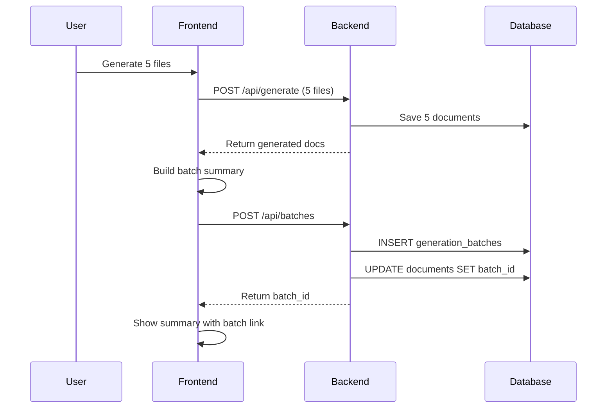
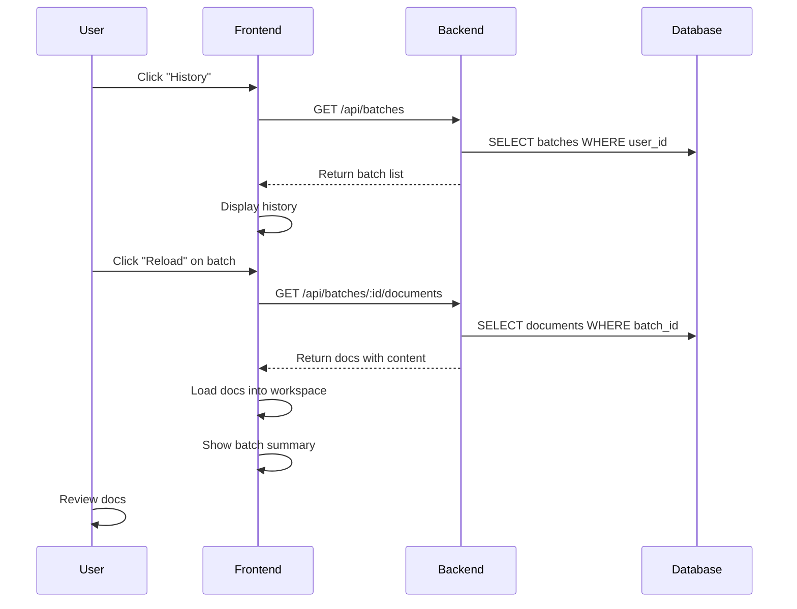

# Generated Documentation History - Feature Specification

**Status:** Planning
**Priority:** Medium
**Complexity:** Medium
**Est. Implementation:** 2-3 days
**Last Updated:** November 21, 2025

---

## Overview

Provide users with a complete audit trail of their documentation generation activity by storing batch generation summaries and enabling them to view, browse, and reload past generated documentation.

### Key Benefits

- **Audit Trail** - Complete history of all documentation generations
- **Easy Recovery** - Reload previously generated docs without re-generating
- **Quality Insights** - Track quality scores and patterns over time
- **Batch Context** - See which files were generated together
- **Professional UX** - Industry-standard history/activity log

---

## User Stories

**As a Pro user, I want to:**
1. View a list of all my past documentation generations grouped by batch
2. See when each generation occurred and how many files were processed
3. Click on a past batch to reload all those docs into my workspace
4. See the quality scores for past generations without re-generating
5. Have a complete audit trail of my CodeScribe AI activity

**As a developer, I want to:**
- Ensure all generation activity is logged for debugging
- Track usage patterns and quality metrics
- Support data recovery if users accidentally clear their workspace

---

## Database Schema

### New Table: `generation_batches`

```sql
CREATE TABLE generation_batches (
  -- Identity
  id UUID PRIMARY KEY DEFAULT gen_random_uuid(),
  user_id INTEGER NOT NULL REFERENCES users(id) ON DELETE CASCADE,

  -- Batch Metadata
  batch_type VARCHAR(50) NOT NULL, -- 'batch' | 'single'
  total_files INTEGER NOT NULL,
  success_count INTEGER NOT NULL DEFAULT 0,
  fail_count INTEGER NOT NULL DEFAULT 0,

  -- Quality Metrics
  avg_quality_score DECIMAL(5,2), -- e.g., 85.50
  avg_grade VARCHAR(2), -- A, B, C, D, F

  -- Summary Content
  summary_markdown TEXT, -- The full Generation Summary markdown
  error_details JSONB, -- Array of failed files: [{filename, error}]

  -- Timestamps
  created_at TIMESTAMP WITH TIME ZONE DEFAULT NOW(),

  -- Indexes
  CONSTRAINT valid_batch_type CHECK (batch_type IN ('batch', 'single')),
  CONSTRAINT valid_counts CHECK (total_files = success_count + fail_count)
);

-- Indexes for performance
CREATE INDEX idx_generation_batches_user_created
  ON generation_batches(user_id, created_at DESC);
CREATE INDEX idx_generation_batches_user_type
  ON generation_batches(user_id, batch_type);
```

### Modified Table: `documents`

```sql
-- Add batch tracking to existing documents table
ALTER TABLE documents
ADD COLUMN batch_id UUID REFERENCES generation_batches(id) ON DELETE SET NULL;

-- Index for batch lookups
CREATE INDEX idx_documents_batch ON documents(batch_id);
```

---

## API Endpoints

### 1. Create Generation Batch (Internal)

**Endpoint:** `POST /api/batches`
**Auth:** Required (Bearer token)
**Purpose:** Create batch record after generation completes

**Request Body:**
```json
{
  "batch_type": "batch",
  "total_files": 5,
  "success_count": 4,
  "fail_count": 1,
  "avg_quality_score": 87.25,
  "avg_grade": "B",
  "summary_markdown": "# Generation Summary\n...",
  "error_details": [
    {
      "filename": "broken.js",
      "error": "Invalid syntax"
    }
  ]
}
```

**Response:**
```json
{
  "batch_id": "550e8400-e29b-41d4-a716-446655440000",
  "created_at": "2025-11-21T04:15:00.000Z"
}
```

### 2. Get Generation History

**Endpoint:** `GET /api/batches?limit=50&offset=0`
**Auth:** Required (Bearer token)
**Purpose:** List user's generation batches

**Query Parameters:**
- `limit` (default: 50, max: 100)
- `offset` (default: 0)
- `type` (optional: 'batch' | 'single')

**Response:**
```json
{
  "batches": [
    {
      "id": "550e8400-e29b-41d4-a716-446655440000",
      "batch_type": "batch",
      "total_files": 5,
      "success_count": 5,
      "fail_count": 0,
      "avg_quality_score": 87.25,
      "avg_grade": "B",
      "created_at": "2025-11-21T04:15:00.000Z",
      "file_count": 5 // Number of documents in this batch
    }
  ],
  "total": 42,
  "limit": 50,
  "offset": 0
}
```

### 3. Get Batch Details

**Endpoint:** `GET /api/batches/:batch_id`
**Auth:** Required (Bearer token)
**Purpose:** Get full batch details including summary markdown

**Response:**
```json
{
  "id": "550e8400-e29b-41d4-a716-446655440000",
  "batch_type": "batch",
  "total_files": 5,
  "success_count": 5,
  "fail_count": 0,
  "avg_quality_score": 87.25,
  "avg_grade": "B",
  "summary_markdown": "# Generation Summary\n...",
  "error_details": [],
  "created_at": "2025-11-21T04:15:00.000Z",
  "documents": [
    {
      "id": "doc-uuid-1",
      "filename": "Button.jsx",
      "doc_type": "README",
      "quality_score": { "score": 85, "grade": "B" }
    }
  ]
}
```

### 4. Load Batch into Workspace

**Endpoint:** `GET /api/batches/:batch_id/documents`
**Auth:** Required (Bearer token)
**Purpose:** Get all documents from a batch for workspace reload

**Response:**
```json
{
  "batch": {
    "id": "550e8400-...",
    "created_at": "2025-11-21T04:15:00.000Z"
  },
  "documents": [
    {
      "id": "doc-uuid-1",
      "filename": "Button.jsx",
      "language": "javascript",
      "doc_type": "README",
      "documentation": "# Button Component\n...",
      "quality_score": { "score": 85, "grade": "B" },
      "created_at": "2025-11-21T04:15:00.000Z"
    }
  ]
}
```

### 5. Delete Batch

**Endpoint:** `DELETE /api/batches/:batch_id`
**Auth:** Required (Bearer token)
**Purpose:** Delete a batch record (documents remain, just unlinked)

**Response:**
```json
{
  "success": true,
  "message": "Batch deleted successfully"
}
```

---

## Frontend Components

### 1. History Page/Modal

**Location:** `/history` route or modal from sidebar
**Access:** Pro+ users only

**UI Structure:**
```
┌─────────────────────────────────────────┐
│ Generated Documentation History         │
├─────────────────────────────────────────┤
│ Filter: [All ▾] [Batch ▾] [Single ▾]   │
├─────────────────────────────────────────┤
│                                         │
│ ┌─ Nov 21, 2024 - 4:15 PM ────────────┐│
│ │ 📦 Batch Generation                  ││
│ │ 5 files • Avg: 87/100 (B) • 100% ✓  ││
│ │ [View Summary] [Reload Docs]         ││
│ └──────────────────────────────────────┘│
│                                         │
│ ┌─ Nov 21, 2024 - 2:30 PM ────────────┐│
│ │ 📄 Single File                       ││
│ │ Button.jsx • 92/100 (A)              ││
│ │ [View Doc] [Reload]                  ││
│ └──────────────────────────────────────┘│
│                                         │
│ ┌─ Nov 20, 2024 - 11:45 AM ───────────┐│
│ │ 📦 Batch Generation (Partial)        ││
│ │ 3 files • 2 success, 1 failed        ││
│ │ Avg: 78/100 (C) • 67% ✓              ││
│ │ [View Summary] [Reload Success]      ││
│ └──────────────────────────────────────┘│
│                                         │
│ [Load More...]                          │
└─────────────────────────────────────────┘
```

### 2. Batch Summary View

**Modal/Page that shows:**
- Full generation summary markdown (rendered)
- Links to individual files
- Option to reload all docs
- Option to export all as ZIP

### 3. Sidebar Integration

**Add "History" menu item:**
```jsx
<SidebarMenuItem
  icon={<History />}
  label="History"
  onClick={() => navigate('/history')}
  badge={recentBatchCount}
/>
```

---

## Implementation Phases

### Phase 1: Database & Backend (Day 1)

1. **Database Migration**
   - Create `generation_batches` table
   - Add `batch_id` column to `documents`
   - Add indexes
   - Test migration locally
   - Deploy to Neon dev database

2. **API Routes** (server/src/routes/)
   - `POST /api/batches` - Create batch
   - `GET /api/batches` - List batches
   - `GET /api/batches/:id` - Get batch details
   - `GET /api/batches/:id/documents` - Load batch docs
   - `DELETE /api/batches/:id` - Delete batch

3. **Middleware**
   - Add to existing `requireAuth` middleware
   - Ensure user can only access their own batches

4. **Testing**
   - Unit tests for batch service
   - Integration tests for API routes
   - Test batch creation during generation

### Phase 2: Frontend Integration (Day 2)

1. **API Client** (client/src/api/)
   - Create `batchesApi.js` with all CRUD operations
   - Add TypeScript types if using TS

2. **State Management**
   - Create `useBatchHistory` hook
   - Handle loading, pagination, filtering

3. **Update Generation Flow** (client/src/App.jsx)
   - After bulk generation completes → Call `POST /api/batches`
   - Store `batch_id` in documents
   - Link documents to batch during save

4. **Testing**
   - Test batch creation after generation
   - Verify documents are linked correctly

### Phase 3: UI Components (Day 3)

1. **History Page** (client/src/pages/History.jsx)
   - List view of batches
   - Filters (all/batch/single)
   - Pagination
   - Load more functionality

2. **Batch Card Component**
   - Shows batch summary
   - Reload button
   - View summary button
   - Delete option

3. **Navigation**
   - Add "History" to sidebar
   - Add route to router
   - Gate behind Pro+ tier

4. **Testing**
   - Component tests
   - E2E tests for full flow
   - Test reload functionality

---

## User Flows

### Flow 1: Generate Documentation → Create Batch



### Flow 2: View History → Reload Batch



---

## Data Flow

### Batch Creation (After Generation)

```javascript
// In App.jsx after bulk generation completes
const createBatchRecord = async () => {
  const batchData = {
    batch_type: 'batch',
    total_files: bulkGenerationSummary.totalFiles,
    success_count: bulkGenerationSummary.successCount,
    fail_count: bulkGenerationSummary.failCount,
    avg_quality_score: bulkGenerationSummary.avgQuality,
    avg_grade: bulkGenerationSummary.avgGrade,
    summary_markdown: batchSummaryMarkdown,
    error_details: bulkGenerationErrors
  };

  const response = await batchesApi.createBatch(batchData);
  const batchId = response.batch_id;

  // Link all documents to this batch
  successfulDocuments.forEach(async (doc) => {
    await documentsApi.updateDocument(doc.id, { batch_id: batchId });
  });
};
```

### Loading Batch into Workspace

```javascript
// In History page/component
const handleReloadBatch = async (batchId) => {
  const response = await batchesApi.getBatchDocuments(batchId);

  // Clear current workspace or add to it?
  // Option 1: Clear and reload
  multiFileState.clearFiles();

  // Option 2: Add to existing (better UX)
  response.documents.forEach(doc => {
    multiFileState.addFile({
      filename: doc.filename,
      language: doc.language,
      content: '', // No source code stored
      documentation: doc.documentation,
      qualityScore: doc.quality_score,
      docType: doc.doc_type,
      documentId: doc.id,
      generatedAt: new Date(doc.created_at)
    });
  });

  // Show batch summary
  setBatchSummaryMarkdown(response.batch.summary_markdown);

  // Navigate back to main app
  navigate('/');
};
```

---

## Storage Strategy

### What Gets Stored

**In `generation_batches` table:**
- ✅ Batch metadata (counts, quality scores)
- ✅ Full summary markdown (with links)
- ✅ Error details for failed files
- ✅ Timestamp of generation

**In `documents` table:**
- ✅ Generated documentation
- ✅ Quality scores
- ✅ File metadata
- ✅ Link to batch (`batch_id`)
- ❌ Source code (privacy - not stored)

### What Doesn't Get Stored

- ❌ Original source code files
- ❌ Code editor state
- ❌ Temporary generation state

**Implication:** Users can reload generated docs but cannot re-run generation without uploading code again.

---

## UI/UX Considerations

### Empty States

**No History Yet:**
```
┌─────────────────────────────────────┐
│   📜 No Generation History Yet      │
│                                     │
│   Generate documentation to see     │
│   your activity history here.       │
│                                     │
│   [Generate Docs]                   │
└─────────────────────────────────────┘
```

### Error States

**Failed to Load:**
```
┌─────────────────────────────────────┐
│   ⚠️ Failed to Load History         │
│                                     │
│   Unable to fetch your generation   │
│   history. Please try again.        │
│                                     │
│   [Retry]                           │
└─────────────────────────────────────┘
```

### Loading States

- Skeleton loaders for batch cards
- Spinner during batch reload
- Progress indicator for large batches

### Confirmation Dialogs

**Delete Batch:**
```
Delete this generation batch?

This will remove the batch record but keep
the individual documents. You can still access
docs from your workspace or document list.

[Cancel] [Delete Batch]
```

---

## Performance Considerations

### Database Indexes

```sql
-- Already included in schema above
CREATE INDEX idx_generation_batches_user_created
  ON generation_batches(user_id, created_at DESC);

CREATE INDEX idx_documents_batch
  ON documents(batch_id);
```

### Query Optimization

**List batches with file counts (avoid N+1):**
```sql
SELECT
  gb.*,
  COUNT(d.id) as file_count
FROM generation_batches gb
LEFT JOIN documents d ON d.batch_id = gb.id
WHERE gb.user_id = $1
GROUP BY gb.id
ORDER BY gb.created_at DESC
LIMIT $2 OFFSET $3;
```

### Pagination

- Default: 50 batches per page
- Max: 100 batches per page
- Use offset-based pagination (simple, predictable)
- Consider cursor-based for very active users (future)

---

## Testing Strategy

### Unit Tests

**Backend:**
- `batchService.createBatch()`
- `batchService.getUserBatches()`
- `batchService.getBatchById()`
- `batchService.deleteBatch()`

**Frontend:**
- `useBatchHistory()` hook
- Batch card component
- History page filtering

### Integration Tests

**API Routes:**
```javascript
describe('POST /api/batches', () => {
  it('should create batch record', async () => {
    const response = await request(app)
      .post('/api/batches')
      .set('Authorization', `Bearer ${validToken}`)
      .send(validBatchData);

    expect(response.status).toBe(201);
    expect(response.body.batch_id).toBeDefined();
  });

  it('should link documents to batch', async () => {
    // Test batch_id is set on documents
  });
});
```

### E2E Tests

**Full Flow:**
1. Generate 5 files
2. Verify batch record created
3. Navigate to history
4. Click reload
5. Verify docs loaded into workspace

---

## Tier Gating

### Free/Starter
- ❌ No access to history feature
- Documents still saved (for their own use)
- No batch records created

### Pro/Team/Enterprise
- ✅ Full access to history
- ✅ Batch records created automatically
- ✅ Unlimited history storage
- ✅ Export batch summaries

### Implementation

```javascript
// In frontend
const canAccessHistory = hasFeature(user, 'generationHistory');

// In TIER_FEATURES config
export const TIER_FEATURES = {
  free: {
    generationHistory: false,
    // ...
  },
  pro: {
    generationHistory: true,
    // ...
  },
  // ...
};
```

---

## Future Enhancements

### Phase 2 Features (Later)

1. **Search & Filters**
   - Search by filename
   - Filter by date range
   - Filter by quality score
   - Filter by doc type

2. **Analytics Dashboard**
   - Total generations over time
   - Average quality trends
   - Most common doc types
   - Success rate tracking

3. **Batch Comparison**
   - Compare quality scores across batches
   - Identify quality improvements
   - Track documentation evolution

4. **Export Options**
   - Export entire history as CSV
   - Generate PDF reports
   - Share batch summaries

5. **Batch Tags/Labels**
   - Add custom labels to batches
   - Organize by project/sprint
   - Filter by tags

6. **Collaborative Features**
   - Share batch summaries with team
   - Team-wide history view
   - Batch templates from history

---

## Migration Plan

### Database Migration

**File:** `server/migrations/XXXX-add-generation-batches.js`

```javascript
exports.up = async function(knex) {
  // Create generation_batches table
  await knex.schema.createTable('generation_batches', (table) => {
    table.uuid('id').primary().defaultTo(knex.raw('gen_random_uuid()'));
    table.integer('user_id').notNullable()
      .references('id').inTable('users').onDelete('CASCADE');
    table.string('batch_type', 50).notNullable()
      .checkIn(['batch', 'single']);
    table.integer('total_files').notNullable();
    table.integer('success_count').notNullable().defaultTo(0);
    table.integer('fail_count').notNullable().defaultTo(0);
    table.decimal('avg_quality_score', 5, 2);
    table.string('avg_grade', 2);
    table.text('summary_markdown');
    table.jsonb('error_details');
    table.timestamp('created_at').defaultTo(knex.fn.now());

    table.check('?? = ?? + ??',
      ['total_files', 'success_count', 'fail_count']);
  });

  // Add indexes
  await knex.raw(`
    CREATE INDEX idx_generation_batches_user_created
    ON generation_batches(user_id, created_at DESC)
  `);

  // Add batch_id to documents
  await knex.schema.alterTable('documents', (table) => {
    table.uuid('batch_id')
      .references('id').inTable('generation_batches')
      .onDelete('SET NULL');
  });

  await knex.raw(`
    CREATE INDEX idx_documents_batch ON documents(batch_id)
  `);
};

exports.down = async function(knex) {
  await knex.schema.alterTable('documents', (table) => {
    table.dropColumn('batch_id');
  });
  await knex.schema.dropTable('generation_batches');
};
```

### Rollback Plan

If issues arise:
1. Batch table is optional - app works without it
2. Documents table change is additive (nullable column)
3. Can disable feature flag while fixing
4. Can drop tables and re-run migration

---

## Success Metrics

### User Engagement
- % of Pro+ users who access history (target: 40%+)
- Avg batches reloaded per user per week (target: 2+)
- Time spent in history view (target: 2+ min)

### Technical
- Batch creation success rate (target: 99.9%+)
- History page load time (target: <500ms)
- Batch reload time (target: <1s for 10 files)

### Business
- Impact on Pro+ conversion rate
- Impact on user retention
- Support ticket reduction (doc recovery)

---

## Documentation Updates

### User-Facing Docs
- Add "History" section to help modal
- Update Pro tier features list
- Create tutorial video/GIF

### Developer Docs
- API reference for batch endpoints
- Database schema documentation
- Testing guide for history feature

---

## Open Questions

1. **Storage Limits:**
   - Should we limit history retention? (e.g., 90 days)
   - Should we limit total batches per user?
   - Currently: Unlimited for Pro+

2. **Batch Naming:**
   - Allow users to name batches?
   - Auto-generate from context (e.g., "5 React Components - Nov 21")?
   - Currently: No custom names

3. **Deletion:**
   - Should deleting a batch delete associated documents?
   - Currently: No (batch_id just set to NULL)

4. **Reload Behavior:**
   - Clear workspace before reload or add to existing?
   - Currently: Add to existing (non-destructive)

---

## References

- [ERROR-HANDLING-PATTERNS.md](./ERROR-HANDLING-PATTERNS.md) - API error handling
- [DB-MIGRATION-MANAGEMENT.md](../database/DB-MIGRATION-MANAGEMENT.MD) - Migration workflow
- [SUBSCRIPTION-MANAGEMENT.md](./SUBSCRIPTION-MANAGEMENT.md) - Tier features

---

**Ready for implementation when you are!** 🚀
