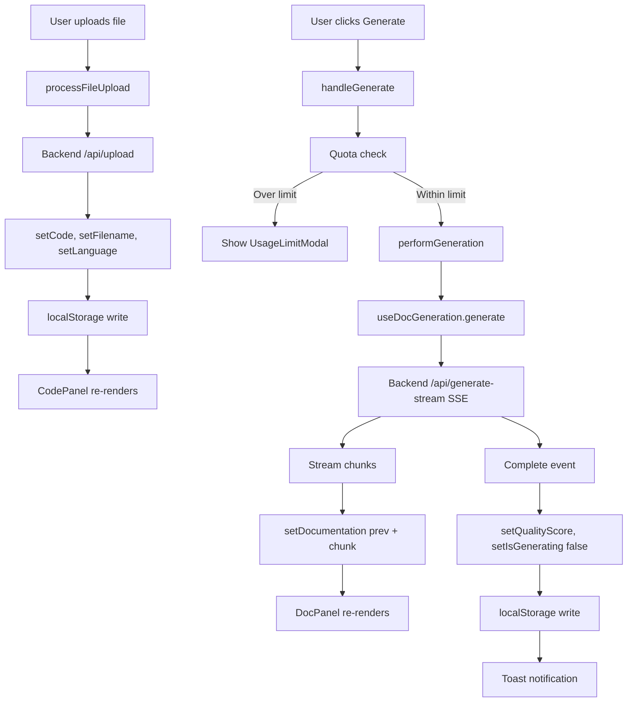
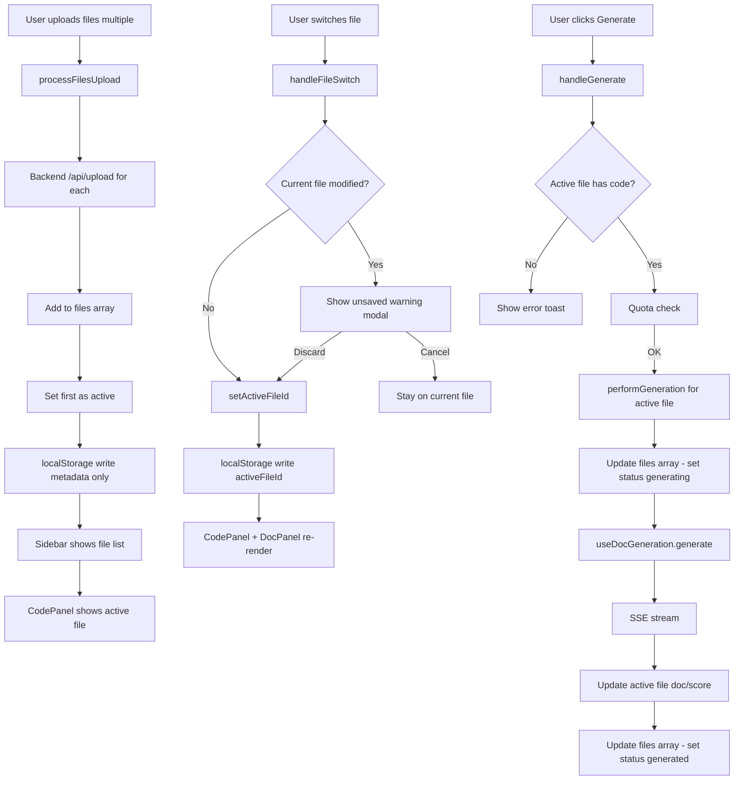

# Multi-File Sidebar - Existing Architecture Analysis

**Feature Branch:** `feature/multi-file-sidebar-v2.8.0`
**Created:** November 15, 2025
**Purpose:** Pre-implementation analysis for Phase 1 + Phase 4

---

## 📋 Table of Contents

1. [Current Architecture Overview](#current-architecture-overview)
2. [Component Analysis](#component-analysis)
3. [State Management Patterns](#state-management-patterns)
4. [Data Flow Analysis](#data-flow-analysis)
5. [Integration Points](#integration-points)
6. [Refactoring Opportunities](#refactoring-opportunities)
7. [Phase 1 Implementation Plan](#phase-1-implementation-plan)

---

## Current Architecture Overview

### Component Hierarchy (v2.7.11)

```
App.jsx (Root)
├── Header.jsx
├── UnverifiedEmailBanner.jsx
├── MobileMenu.jsx
├── ControlBar.jsx ← Controls generation/upload
│   ├── Button (Upload Files)
│   ├── Button (Import from GitHub)
│   ├── Select (Doc Type)
│   └── Button (Generate Docs)
├── Main Content Area
│   ├── ErrorBanner.jsx / UsageWarningBanner.jsx
│   ├── CodePanel.jsx ← Left panel (Monaco editor)
│   │   ├── Header (filename, actions)
│   │   ├── LazyMonacoEditor ← Lazy-loaded
│   │   ├── Footer (stats: lines, chars, size, language)
│   │   └── Drag-drop overlay
│   └── DocPanel.jsx ← Right panel (Markdown output)
│       ├── Header (quality score, actions)
│       ├── Markdown render OR Empty state
│       └── Footer (quality breakdown)
├── Modals (Lazy-loaded Suspense)
│   ├── QualityScoreModal
│   ├── SamplesModal
│   ├── HelpModal
│   ├── ConfirmationModal
│   ├── UsageLimitModal
│   ├── TermsAcceptanceModal
│   ├── ContactSupportModal
│   └── GitHubLoadModal
└── Footer.jsx
```

---

## Component Analysis

### 1. App.jsx - Root State Container

**Lines:** 1,108 lines
**Responsibility:** Main application state, orchestration, modals, persistence

#### State Variables (Single-File Mode)

```javascript
// Editor state (persisted to user-scoped localStorage)
const [code, setCode] = useState(() => getStorageItem(STORAGE_KEYS.EDITOR_CODE, DEFAULT_CODE));
const [docType, setDocType] = useState(() => getStorageItem(STORAGE_KEYS.EDITOR_DOC_TYPE, 'README'));
const [filename, setFilename] = useState(() => getStorageItem(STORAGE_KEYS.EDITOR_FILENAME, 'code.js'));
// Language is derived from filename, not stored separately
const language = detectLanguageFromFilename(filename);

// Documentation state (from useDocGeneration hook)
const {
  generate,
  reset,
  clearError,
  isGenerating,
  documentation,
  setDocumentation,
  qualityScore,
  setQualityScore,
  error,
  retryAfter
} = useDocGeneration(refetchUsage);

// Modal visibility state (16 modals)
const [showQualityModal, setShowQualityModal] = useState(false);
const [showSamplesModal, setShowSamplesModal] = useState(false);
const [showHelpModal, setShowHelpModal] = useState(false);
// ... +13 more modals

// Usage tracking state
const { usage, refetch: refetchUsage, checkThreshold, canGenerate, getUsageForPeriod } = useUsageTracking();

// Upload state
const [uploadError, setUploadError] = useState(null);
const [isUploading, setIsUploading] = useState(false);
```

#### Persistence Strategy (Lines 136-304)

```javascript
// Load from localStorage on mount
useEffect(() => {
  const savedDoc = getStorageItem(STORAGE_KEYS.EDITOR_DOCUMENTATION);
  const savedScore = getStorageItem(STORAGE_KEYS.EDITOR_QUALITY_SCORE);
  if (savedDoc) setDocumentation(savedDoc);
  if (savedScore) setQualityScore(JSON.parse(savedScore));
}, []);

// Save to user-scoped localStorage on every change
useEffect(() => {
  // Code, doc, and score are user-scoped (cs_ed_code_{userId})
  if (user && user.id) {
    const key = getEditorKey(user.id, 'code');
    if (key) setStorageItem(key, code);
  } else {
    setStorageItem(STORAGE_KEYS.EDITOR_CODE, code);
  }
}, [code, user]);

useEffect(() => { setStorageItem(STORAGE_KEYS.EDITOR_FILENAME, filename); }, [filename]);
useEffect(() => { setStorageItem(STORAGE_KEYS.EDITOR_DOC_TYPE, docType); }, [docType]);

// Documentation and quality score are also user-scoped
useEffect(() => {
  if (documentation) {
    if (user && user.id) {
      const key = getEditorKey(user.id, 'doc');
      if (key) setStorageItem(key, documentation);
    } else {
      setStorageItem(STORAGE_KEYS.EDITOR_DOCUMENTATION, documentation);
    }
  }
}, [documentation, user]);

useEffect(() => {
  if (qualityScore) {
    if (user && user.id) {
      const key = getEditorKey(user.id, 'score');
      if (key) setStorageItem(key, JSON.stringify(qualityScore));
    } else {
      setStorageItem(STORAGE_KEYS.EDITOR_QUALITY_SCORE, JSON.stringify(qualityScore));
    }
  }
}, [qualityScore, user]);
```

**⚠️ Key Insight:**
- User-scoped keys prevent privacy leaks on shared computers
- Language is derived from filename (not stored)
- With multi-file, we'll need to batch updates

#### File Upload Flow (Lines 367-647)

```javascript
// 1. User clicks Upload button
<Button onClick={handleUpload} />

// 2. Opens file input
const handleUpload = () => fileInputRef.current.click();

// 3. File selected
const handleFileChange = (event) => {
  const file = event.target.files?.[0];
  await processFileUpload(file);
};

// 4. Upload to backend
const processFileUpload = async (file) => {
  const formData = new FormData();
  formData.append('file', file);

  const response = await fetch(`${API_URL}/api/upload`, {
    method: 'POST',
    headers: { 'Authorization': `Bearer ${token}` },
    body: formData
  });

  const data = await response.json();

  // 5. Update state with file content
  setCode(data.file.content);
  setFilename(data.file.name);
  setLanguage(detectedLanguage);
};
```

**✅ Multi-file change:** Will need to handle `<input multiple>` and append to files array instead of replacing.

#### Doc Generation Flow (Lines 306-355)

```javascript
// 1. User clicks Generate
const handleGenerate = async () => {
  if (!canGenerate()) {
    setShowUsageLimitModal(true); // Quota check
    return;
  }

  // 2. Large file confirmation
  if (lines >= 1000 || sizeKB >= 50) {
    setShowConfirmationModal(true);
    return;
  }

  await performGeneration();
};

// 3. Actual generation
const performGeneration = async () => {
  const isDefaultCode = code === DEFAULT_CODE;
  const isExampleCode = EXAMPLE_CODES.has(code);
  const shouldCache = isDefaultCode || isExampleCode;

  await generate(code, docType, 'javascript', shouldCache);
  // Success toast shown after generation completes
};
```

**✅ Multi-file change:** `handleGenerate` will check active file, generate for that file only.

---

### 2. CodePanel.jsx - Monaco Editor Container

**Lines:** 359 lines
**Responsibility:** Code input, drag-drop, file actions

#### Props Interface

```javascript
CodePanel({
  code,           // string
  onChange,       // (newCode: string) => void
  filename,       // string (e.g., 'auth.js')
  language,       // string (e.g., 'javascript')
  readOnly,       // boolean
  onFileDrop,     // (file: File) => void - Drag-drop handler
  onClear,        // () => void - Clear editor
  onSamplesClick, // () => void - Open samples modal
  samplesButtonRef // Ref for focus management
})
```

#### Key Features

**1. Drag-and-Drop Support (Lines 61-97)**
```javascript
// Handles single file drop
const handleDrop = (e) => {
  const files = e.dataTransfer?.files;
  if (files && files.length > 0) {
    // TODO: Future enhancement - support multiple file uploads
    onFileDrop(files[0]); // Currently only first file
  }
};
```

**✅ Multi-file:** Already has TODO for multi-file drag-drop!

**2. Header Actions (Lines 109-286)**
- Desktop: Samples, Export, Copy, Clear buttons
- Mobile: Overflow menu (⋮) with same actions
- Filename display (truncated with `title` tooltip)

**✅ Multi-file:** Header remains the same, shows active file name.

**3. Footer Stats (Lines 323-337)**
```javascript
<div className="flex items-center gap-3 text-xs">
  <span>{lines} lines</span>
  <span>•</span>
  <span>{chars} chars</span>
  <span>•</span>
  <span>{formatBytes(bytes)}</span>
  <span>•</span>
  <span className="capitalize">{language}</span>
</div>
```

**✅ Multi-file:** Stats show active file only.

**4. Monaco Integration (Lines 288-320)**
- Lazy-loaded via Suspense
- Custom themes: `codescribe-light`, `codescribe-dark`
- Options: No minimap, JetBrains Mono font, auto-layout

**✅ Multi-file:** Monaco instance reused, value changes when active file changes.

---

### 3. DocPanel.jsx - Documentation Display

**Lines:** 795 lines
**Responsibility:** Markdown rendering, quality score display, empty state

#### Props Interface

```javascript
DocPanel({
  documentation,   // string (markdown)
  qualityScore,    // { score: number, grade: string, breakdown: {...}, summary: {...} }
  isGenerating,    // boolean
  onViewBreakdown, // () => void - Open quality modal
  onUpload,        // () => void - Upload files CTA
  onGithubImport,  // () => void - GitHub import CTA
  onGenerate,      // () => void - Generate docs CTA
  onReset          // () => void - Clear docs
})
```

#### Key Features

**1. Auto-Scroll During Generation (Lines 218-253)**
```javascript
useEffect(() => {
  if (!isGenerating || !contentRef.current) return;

  const checkAndScroll = () => {
    const isNearBottom = element.scrollHeight - element.scrollTop - element.clientHeight < 100;

    // Scroll if near bottom OR if content height changed (Mermaid diagrams)
    if (isNearBottom || currentScrollHeight !== lastScrollHeight) {
      element.scrollTop = element.scrollHeight;
    }

    frameId = requestAnimationFrame(checkAndScroll);
  };

  frameId = requestAnimationFrame(checkAndScroll);
}, [isGenerating]);
```

**✅ Multi-file:** Auto-scroll works per-file, no changes needed.

**2. Mermaid Diagram Handling (Lines 461-495)**
```javascript
if (!inline && language === 'mermaid') {
  // Detect incomplete diagrams during streaming
  const looksIncomplete = !codeContent.includes('-->') &&
                         !codeContent.includes('->') &&
                         codeContent.split('\n').length < 3;

  if (isGenerating || looksIncomplete) {
    return <LoadingPlaceholder />; // Show spinner
  }

  const diagramId = `diagram-${++mermaidCounterRef.current}`;
  return <MermaidDiagram chart={codeContent} id={diagramId} autoShow={!isGenerating} />;
}
```

**✅ Multi-file:** Counter resets per document (line 196-198), works correctly.

**3. Empty State with CTAs (Lines 538-627)**
- Shows Quick Start guide
- Clickable "Upload Files" and "Import from GitHub" buttons
- Three-step workflow instructions

**✅ Multi-file:** Empty state shows when no doc for active file.

**4. Quality Score Expansion (Lines 632-739)**
- Persisted state: `STORAGE_KEYS.REPORT_EXPANDED` (localStorage)
- Expandable footer with strengths/improvements

**✅ Multi-file:** Expansion state global (not per-file), which is fine.

---

### 4. ControlBar.jsx - Action Bar

**Lines:** 87 lines
**Responsibility:** Doc type selector, Upload/GitHub/Generate buttons

#### Props Interface

```javascript
ControlBar({
  docType,          // string ('README', 'JSDOC', 'API', 'ARCHITECTURE')
  onDocTypeChange,  // (newType: string) => void
  onGenerate,       // () => void
  onUpload,         // () => void
  onGithubImport,   // () => void
  isGenerating,     // boolean
  isUploading,      // boolean
  generateDisabled, // boolean
  disabled          // boolean (global disable)
})
```

#### Layout (Lines 27-85)

```
┌─────────────────────────────────────────────────────┐
│ [Upload Files] [Import from GitHub] │ Doc Type: [README ▼] │ [Generate Docs] │
└─────────────────────────────────────────────────────┘
```

**Mobile (< 640px):**
```
┌─────────────────────┐
│ [Upload Files]      │
│ [GitHub]            │
│ Doc Type: [README ▼] │
│ [Generate Docs]     │
└─────────────────────┘
```

**✅ Multi-file:** ControlBar stays the same. Actions apply to active file.

---

### 5. useDocGeneration Hook - Generation Logic

**Lines:** 289 lines
**Responsibility:** SSE streaming, error handling, analytics

#### Hook Interface

```javascript
const {
  generate,          // (code, docType, language, isDefaultCode) => Promise<void>
  cancel,            // () => void
  reset,             // () => void - Clear docs/score/error
  clearError,        // () => void - Clear error only
  isGenerating,      // boolean
  documentation,     // string
  setDocumentation,  // (doc: string) => void - For testing
  qualityScore,      // object
  setQualityScore,   // (score: object) => void - For testing
  error,             // string (JSON serialized)
  rateLimitInfo,     // { remaining, limit, reset }
  retryAfter         // number (seconds)
} = useDocGeneration(onUsageUpdate);
```

#### SSE Streaming Flow (Lines 16-136)

```javascript
const generate = async (code, docType, language, isDefaultCode) => {
  setIsGenerating(true);
  setDocumentation(''); // Clear previous doc

  const response = await fetch(`${API_URL}/api/generate-stream`, {
    method: 'POST',
    headers: { 'Content-Type': 'application/json', 'Authorization': `Bearer ${token}` },
    body: JSON.stringify({ code, docType, language, isDefaultCode })
  });

  const reader = response.body.getReader();
  const decoder = new TextDecoder();

  while (true) {
    const { done, value } = await reader.read();
    if (done) break;

    const chunk = decoder.decode(value);
    const lines = chunk.split('\n');

    for (const line of lines) {
      if (line.startsWith('data: ')) {
        const data = JSON.parse(line.slice(6));

        if (data.type === 'chunk') {
          setDocumentation(prev => prev + data.content); // Append chunk
        } else if (data.type === 'complete') {
          setQualityScore(data.qualityScore);
          setIsGenerating(false);
          onUsageUpdate(); // Refetch quota
        }
      }
    }
  }
};
```

**✅ Multi-file:** This hook is perfect for single-file. We'll reuse it as-is for active file generation.

---

## State Management Patterns

### Current Approach: Local State + localStorage

**Pattern:**
```javascript
// 1. Initialize from localStorage
const [code, setCode] = useState(() => getStorageItem(STORAGE_KEYS.EDITOR_CODE, DEFAULT_CODE));

// 2. Persist on change
useEffect(() => {
  setStorageItem(STORAGE_KEYS.EDITOR_CODE, code);
}, [code]);
```

**Pros:**
- ✅ Simple, no external library
- ✅ Automatic persistence
- ✅ Works for single file

**Cons:**
- ❌ Triggers write on every keystroke (with debouncing this is acceptable)
- ❌ Doesn't scale to multi-file (localStorage quota: ~5-10 MB)
- ❌ No batching or transactions

---

### Multi-File State Strategy

**New Pattern:**

```javascript
// App.jsx - Multi-file state
const [files, setFiles] = useState([
  {
    id: 'file-abc123',       // UUID
    name: 'auth.js',
    language: 'javascript',
    size: 2100,
    timestamp: Date.now(),
    status: 'generated',     // uploaded | generating | generated | error
    // EPHEMERAL (in state only):
    content: '...code...',
    documentation: '...docs...',
    qualityScore: { score: 92, grade: 'A', ... },
    error: null
  }
]);

const [activeFileId, setActiveFileId] = useState('file-abc123');
const [sidebarState, setSidebarState] = useState({
  isExpanded: true,
  isPinned: true,
  width: 280
});

// Derived values
const activeFile = files.find(f => f.id === activeFileId);
```

**Persistence:**

```javascript
// METADATA ONLY to localStorage (on file add/remove/switch)
useEffect(() => {
  const metadata = files.map(f => ({
    id: f.id,
    name: f.name,
    language: f.language,
    size: f.size,
    timestamp: f.timestamp,
    status: f.status
    // NO content, documentation, qualityScore
  }));

  setStorageItem('codescribe:project:files', JSON.stringify(metadata));
}, [files]);

// Active file ID
useEffect(() => {
  setStorageItem('codescribe:project:activeFileId', activeFileId);
}, [activeFileId]);

// Sidebar state
useEffect(() => {
  setStorageItem('codescribe:sidebar', JSON.stringify(sidebarState));
}, [sidebarState]);
```

**On mount:**

```javascript
useEffect(() => {
  const metadata = getStorageItem('codescribe:project:files');
  if (metadata) {
    const parsedMetadata = JSON.parse(metadata);
    // Create files array with metadata but NO content
    setFiles(parsedMetadata.map(meta => ({
      ...meta,
      content: '',         // Empty (user must re-upload)
      documentation: '',   // Empty
      qualityScore: null,  // Empty
      error: null
    })));
  }
}, []);
```

**Result:** Page refresh shows file list but code/docs are gone (ephemeral). User sees "Re-upload files to continue" message.

---

## Data Flow Analysis

### Current Single-File Flow



---

### Proposed Multi-File Flow (Phase 1)



---

## Integration Points

### 1. Sidebar Component (NEW)

**Location:** `client/src/components/Sidebar/`

**Structure:**
```
Sidebar/
├── Sidebar.jsx              # Main container
├── SidebarToggle.jsx        # Collapse/expand button
├── FileList.jsx             # File list container
├── FileItem.jsx             # Individual file entry
├── FileActions.jsx          # Per-file menu (⋮)
└── BulkActions.jsx          # Generate All, Clear All (P2)
```

**Props for Sidebar.jsx:**
```javascript
<Sidebar
  files={files}
  activeFileId={activeFileId}
  onFileSelect={(id) => setActiveFileId(id)}
  onFileRemove={(id) => handleRemoveFile(id)}
  onFileRename={(id, newName) => handleRenameFile(id, newName)}
  isExpanded={sidebarState.isExpanded}
  isPinned={sidebarState.isPinned}
  onToggle={() => setSidebarState(s => ({ ...s, isExpanded: !s.isExpanded }))}
  onPin={() => setSidebarState(s => ({ ...s, isPinned: !s.isPinned }))}
/>
```

**Layout Integration:**
```javascript
// App.jsx
<div className="flex h-screen">
  <Sidebar {...sidebarProps} />

  <main className="flex-1 flex flex-col">
    <Header />
    <ControlBar />
    <div className="flex-1 grid grid-cols-2 gap-4">
      <CodePanel code={activeFile?.content} ... />
      <DocPanel documentation={activeFile?.documentation} ... />
    </div>
  </main>
</div>
```

---

### 2. Multi-File Upload Handler

**Changes to App.jsx:**

```javascript
// OLD (single file)
<input type="file" onChange={handleFileChange} />

// NEW (multi-file)
<input type="file" multiple onChange={handleMultiFileChange} />

const handleMultiFileChange = async (event) => {
  const selectedFiles = Array.from(event.target.files || []);

  for (const file of selectedFiles) {
    await processFileUpload(file, { appendToList: true });
  }

  // Set first uploaded file as active
  if (files.length === 0 && selectedFiles.length > 0) {
    setActiveFileId(files[0].id);
  }
};

const processFileUpload = async (file, { appendToList = false }) => {
  // ... existing upload logic

  if (appendToList) {
    // Add to files array instead of replacing
    const newFile = {
      id: generateUUID(),
      name: data.file.name,
      content: data.file.content,
      language: detectedLanguage,
      size: file.size,
      timestamp: Date.now(),
      status: 'uploaded',
      documentation: '',
      qualityScore: null,
      error: null
    };

    setFiles(prev => [...prev, newFile]);
  } else {
    // Single-file mode (backward compatible)
    setCode(data.file.content);
    setFilename(data.file.name);
  }
};
```

---

### 3. Active File Switching

**Handler in App.jsx:**

```javascript
const handleFileSwitch = (newFileId) => {
  // Check if current file has unsaved changes
  const currentFile = files.find(f => f.id === activeFileId);
  const hasUnsavedChanges = currentFile?.content !== currentFile?.originalContent;

  if (hasUnsavedChanges) {
    // Show confirmation modal
    setShowUnsavedChangesModal(true);
    setPendingFileId(newFileId);
    return;
  }

  // Switch immediately
  setActiveFileId(newFileId);
};

const confirmFileSwitch = () => {
  setActiveFileId(pendingFileId);
  setShowUnsavedChangesModal(false);
  setPendingFileId(null);
};
```

**CodePanel/DocPanel Updates:**

```javascript
// Pass active file data as props
<CodePanel
  code={activeFile?.content || ''}
  filename={activeFile?.name || 'code.js'}
  language={activeFile?.language || 'javascript'}
  onChange={(newCode) => handleCodeChange(activeFileId, newCode)}
  ...
/>

<DocPanel
  documentation={activeFile?.documentation || ''}
  qualityScore={activeFile?.qualityScore}
  isGenerating={activeFile?.status === 'generating'}
  ...
/>

// Handler to update code for active file
const handleCodeChange = (fileId, newCode) => {
  setFiles(prev => prev.map(f =>
    f.id === fileId
      ? { ...f, content: newCode, status: 'modified' }
      : f
  ));
};
```

---

## Refactoring Opportunities

### 1. Extract File State Logic to Custom Hook

**Problem:** App.jsx will become unwieldy with file array management.

**Solution:** `useMultiFileState.js`

```javascript
// client/src/hooks/useMultiFileState.js
export function useMultiFileState() {
  const [files, setFiles] = useState([]);
  const [activeFileId, setActiveFileId] = useState(null);

  const addFile = useCallback((fileData) => {
    const newFile = {
      id: generateUUID(),
      ...fileData,
      timestamp: Date.now(),
      status: 'uploaded'
    };
    setFiles(prev => [...prev, newFile]);

    // Set as active if first file
    if (files.length === 0) {
      setActiveFileId(newFile.id);
    }

    return newFile.id;
  }, [files]);

  const removeFile = useCallback((fileId) => {
    setFiles(prev => prev.filter(f => f.id !== fileId));

    // If removing active file, switch to another
    if (fileId === activeFileId) {
      const remaining = files.filter(f => f.id !== fileId);
      setActiveFileId(remaining[0]?.id || null);
    }
  }, [files, activeFileId]);

  const updateFile = useCallback((fileId, updates) => {
    setFiles(prev => prev.map(f =>
      f.id === fileId ? { ...f, ...updates } : f
    ));
  }, []);

  const activeFile = files.find(f => f.id === activeFileId);

  return {
    files,
    activeFileId,
    activeFile,
    setActiveFileId,
    addFile,
    removeFile,
    updateFile
  };
}
```

---

### 2. Consolidate Persistence Logic

**Problem:** 6 separate `useEffect` calls for persistence.

**Solution:** `usePersistence.js`

```javascript
// client/src/hooks/usePersistence.js
export function usePersistence(key, value, { serialize = JSON.stringify, debounce = 500 } = {}) {
  const timeoutRef = useRef();

  useEffect(() => {
    // Clear previous timeout
    if (timeoutRef.current) {
      clearTimeout(timeoutRef.current);
    }

    // Debounce writes
    timeoutRef.current = setTimeout(() => {
      try {
        const serialized = serialize(value);
        setStorageItem(key, serialized);
      } catch (err) {
        console.warn(`Failed to persist ${key}:`, err);
      }
    }, debounce);

    return () => clearTimeout(timeoutRef.current);
  }, [key, value, serialize, debounce]);
}

// Usage in App.jsx
usePersistence('codescribe:sidebar', sidebarState);
usePersistence('codescribe:project:activeFileId', activeFileId, { debounce: 0 }); // No debounce
usePersistence('codescribe:project:files', filesMetadata); // Computed from files array
```

---

### 3. Unify Modal State Management

**Problem:** 16 separate `useState` calls for modals.

**Solution:** `useModals.js`

```javascript
// client/src/hooks/useModals.js
export function useModals(modalNames) {
  const [openModals, setOpenModals] = useState(new Set());

  const open = useCallback((name) => {
    setOpenModals(prev => new Set([...prev, name]));
  }, []);

  const close = useCallback((name) => {
    setOpenModals(prev => {
      const next = new Set(prev);
      next.delete(name);
      return next;
    });
  }, []);

  const toggle = useCallback((name) => {
    setOpenModals(prev => {
      const next = new Set(prev);
      if (next.has(name)) {
        next.delete(name);
      } else {
        next.add(name);
      }
      return next;
    });
  }, []);

  const isOpen = useCallback((name) => openModals.has(name), [openModals]);

  return { open, close, toggle, isOpen };
}

// Usage in App.jsx
const modals = useModals([
  'quality', 'samples', 'help', 'confirmation',
  'usageLimit', 'terms', 'support', 'github'
]);

// Replace 16 useState calls with:
<QualityScoreModal isOpen={modals.isOpen('quality')} onClose={() => modals.close('quality')} />
<SamplesModal isOpen={modals.isOpen('samples')} onClose={() => modals.close('samples')} />
```

---

## Phase 1 Implementation Plan

### ✅ Step-by-Step Checklist (Week 1)

#### Day 1: Foundation & Hooks

- [ ] **Create custom hooks:**
  - [ ] `client/src/hooks/useMultiFileState.js` - File array management
  - [ ] `client/src/hooks/usePersistence.js` - localStorage abstraction
  - [ ] `client/src/hooks/useModals.js` - Modal state management
  - [ ] Add unit tests for each hook

- [ ] **Update storage constants:**
  - [ ] Add new keys to `client/src/constants/storage.js`:
    ```javascript
    SIDEBAR_STATE: 'codescribe:local:sidebar:state',
    PROJECT_FILES_METADATA: 'codescribe:local:project:files-metadata',
    PROJECT_ACTIVE_FILE: 'codescribe:local:project:active-file-id',
    ```

#### Day 2: Sidebar Component Structure

- [ ] **Create component folder:**
  - [ ] `client/src/components/Sidebar/index.js` - Barrel export
  - [ ] `client/src/components/Sidebar/Sidebar.jsx` - Main container
  - [ ] `client/src/components/Sidebar/SidebarToggle.jsx` - Collapse button
  - [ ] `client/src/components/Sidebar/FileList.jsx` - List container
  - [ ] `client/src/components/Sidebar/FileItem.jsx` - Individual file
  - [ ] `client/src/components/Sidebar/FileActions.jsx` - Dropdown menu (⋮)

- [ ] **Sidebar.jsx features:**
  - [ ] Header with file count: "📁 Files (3)"
  - [ ] Collapse/expand animation (200ms ease-in-out)
  - [ ] Pinned/unpinned modes
  - [ ] Width: 280px expanded, 48px collapsed
  - [ ] Dark mode support

- [ ] **FileItem.jsx states:**
  - [ ] Default (uploaded, not generated)
  - [ ] Active (purple highlight)
  - [ ] Generating (spinner)
  - [ ] Generated (checkmark)
  - [ ] Error (alert icon)
  - [ ] Modified (dot indicator)

- [ ] **FileActions.jsx menu:**
  - [ ] Generate Docs (if not generated)
  - [ ] Regenerate (if modified)
  - [ ] Remove from List (with confirmation)
  - [ ] Rename

#### Day 3: App.jsx Refactoring

- [ ] **Integrate custom hooks:**
  - [ ] Replace single-file state with `useMultiFileState()`
  - [ ] Replace 6 persistence effects with `usePersistence()`
  - [ ] Replace 16 modal states with `useModals()`

- [ ] **Add multi-file upload:**
  - [ ] Update `<input type="file" multiple />` attribute
  - [ ] Implement `handleMultiFileChange()`
  - [ ] Update `processFileUpload()` to append instead of replace
  - [ ] Generate UUID for each file

- [ ] **Add file switching logic:**
  - [ ] Implement `handleFileSwitch()`
  - [ ] Add unsaved changes detection
  - [ ] Create `UnsavedChangesModal.jsx` component

- [ ] **Update active file handlers:**
  - [ ] `handleCodeChange(fileId, newCode)` - Update file in array
  - [ ] `handleGenerate()` - Generate for active file only
  - [ ] `handleReset()` - Clear active file docs

#### Day 4: Layout Integration

- [ ] **Update App.jsx layout:**
  - [ ] Add Sidebar to component tree
  - [ ] Implement three-panel layout: `Sidebar | CodePanel | DocPanel`
  - [ ] Handle collapsed/expanded transitions
  - [ ] Ensure responsive behavior (hide sidebar < 1024px)

- [ ] **Pass active file props:**
  - [ ] CodePanel: `code={activeFile?.content}`, `filename={activeFile?.name}`, etc.
  - [ ] DocPanel: `documentation={activeFile?.documentation}`, `qualityScore={activeFile?.qualityScore}`, etc.
  - [ ] ControlBar: Keep as-is (actions apply to active file)

- [ ] **Sidebar persistence:**
  - [ ] Load `sidebarState` from localStorage on mount
  - [ ] Persist `isExpanded`, `isPinned`, `width` on change
  - [ ] Load `files` metadata (not content) on mount
  - [ ] Show "Re-upload files" message if metadata exists but no content

#### Day 5: Testing & Polish

- [ ] **Component tests:**
  - [ ] `Sidebar.test.jsx` - Collapse/expand, file selection
  - [ ] `FileItem.test.jsx` - All 6 states render correctly
  - [ ] `FileActions.test.jsx` - Menu interactions
  - [ ] `useMultiFileState.test.js` - Add/remove/update operations

- [ ] **Integration tests:**
  - [ ] Upload multiple files → file list populates
  - [ ] Switch files → CodePanel/DocPanel update
  - [ ] Generate docs → active file status updates
  - [ ] Remove file → active file switches correctly
  - [ ] Sidebar collapse → layout adjusts

- [ ] **Accessibility:**
  - [ ] Keyboard navigation (↑↓ arrows in file list)
  - [ ] ARIA labels on all buttons
  - [ ] Focus management (sidebar toggle → sidebar)
  - [ ] Screen reader announcements ("3 files loaded")

- [ ] **Edge cases:**
  - [ ] What happens when last file is removed? (Show empty state)
  - [ ] What happens on page refresh? (Metadata persists, content gone)
  - [ ] What happens with 0 files? (Hide sidebar, show upload CTA)
  - [ ] Large file list (50+ files) - Add virtualization (react-window)

---

## Next Steps After Phase 1

### Phase 4: Split Panel (Week 2)

**Prerequisites:**
- Phase 1 complete and tested
- Multi-file infrastructure working
- File switching stable

**Goal:** Side-by-side resizable panels with live streaming

**Key Changes:**
1. Install `react-resizable-panels`
2. Wrap CodePanel + DocPanel in `<PanelGroup>`
3. Add resize handle component
4. Persist panel sizes per-project
5. Mobile: Stack vertically (no resizing)

**Deliverables:**
- `SplitPanel/SplitPanel.jsx` - Wrapper component
- `SplitPanel/ResizeHandle.jsx` - Custom handle
- Updated CodePanel/DocPanel integration
- Mobile responsive layout

---

## Summary

### Current Architecture Strengths

✅ **Clean separation of concerns** - CodePanel, DocPanel, ControlBar are well-isolated
✅ **Lazy loading** - Monaco, modals, and heavy components load on demand
✅ **Comprehensive error handling** - useDocGeneration handles all error cases
✅ **Accessibility** - WCAG 2.1 AA compliant, keyboard nav, screen reader support
✅ **Dark mode** - Consistent theming across components
✅ **SSE streaming** - Real-time documentation generation

### Challenges for Multi-File

⚠️ **State management** - 6 separate persistence effects, 16 modal states
⚠️ **localStorage overuse** - Storing full code/docs violates privacy principle
⚠️ **No batching** - Every state change triggers localStorage write
⚠️ **Monolithic App.jsx** - 1,108 lines, will grow with multi-file logic

### Recommended Refactoring

1. **Extract custom hooks** - `useMultiFileState`, `usePersistence`, `useModals`
2. **Privacy-first storage** - Metadata only, ephemeral content
3. **Sidebar component** - 6 sub-components, well-tested
4. **Active file pattern** - Derived value from files array + activeFileId
5. **Backward compatibility** - Single-file mode still works (no breaking changes)

---

**Ready to implement Phase 1!** 🚀

All analysis complete. Proceeding to detailed checklist next.
