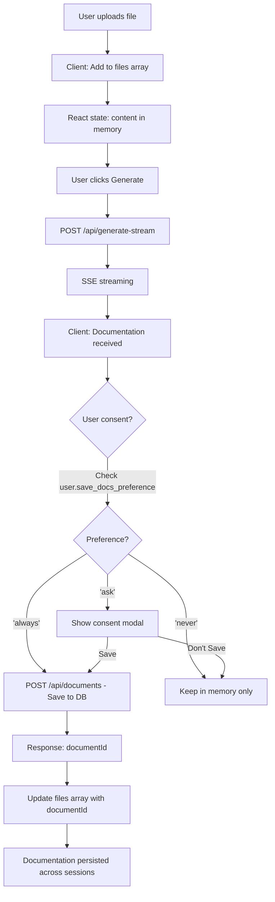
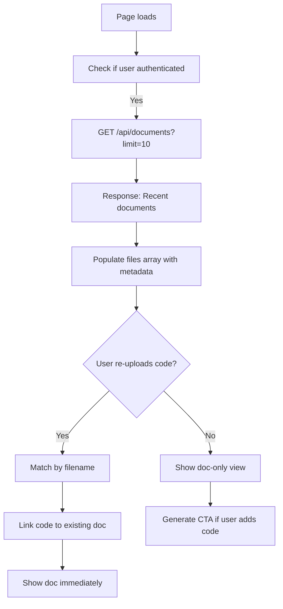
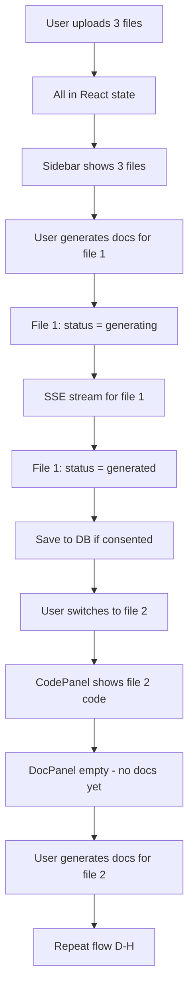

# Multi-File Sidebar Implementation Plan v2.0 (Database Storage)

**Feature Branch:** `feature/multi-file-sidebar-v2.8.0`
**Created:** November 15, 2025
**Strategy:** Database-backed persistence with three-tier storage
**Target:** v2.8.0 (P1 + P4 = 2-3 weeks)

---

## 🎯 Executive Summary

### What Changed from V1

**V1 (localStorage-only):**
- ❌ Code/docs in localStorage (privacy violation)
- ❌ 5-10 MB storage limit
- ❌ No cross-device sync
- ❌ No history/recovery

**V2 (Database-backed):**
- ✅ Code NEVER stored anywhere (in-memory only)
- ✅ Generated docs in PostgreSQL (our output, not user's input)
- ✅ Unlimited storage (within tier limits)
- ✅ Cross-device sync for authenticated users
- ✅ Documentation history with search/recovery
- ✅ User consent + opt-out mechanisms

### Three-Tier Storage Architecture

```
┌─────────────────────────────────────────────────────┐
│ Tier 1: PostgreSQL (Authenticated Users)           │
│ ✅ Generated documentation                          │
│ ✅ Quality scores                                   │
│ ✅ File metadata (name, language, size)            │
│ ✅ Provenance (GitHub repo, commit SHA)            │
│ ❌ NEVER user's code                                │
├─────────────────────────────────────────────────────┤
│ Tier 2: React State (In-Memory Session)            │
│ ✅ Code content (ephemeral)                         │
│ ✅ Documentation (cached from DB)                   │
│ ✅ Quality scores (cached from DB)                  │
│ ⏱️  Cleared on page refresh                         │
├─────────────────────────────────────────────────────┤
│ Tier 3: localStorage (UI Preferences)              │
│ ✅ Sidebar state (expanded/collapsed)               │
│ ✅ Split panel sizes                                │
│ ✅ Theme, settings                                  │
│ ❌ NO file content or docs                          │
└─────────────────────────────────────────────────────┘
```

---

## 📊 Database Schema

### New Table: `generated_documents`

```sql
CREATE TABLE generated_documents (
  -- Primary key
  id UUID PRIMARY KEY DEFAULT gen_random_uuid(),

  -- User relationship
  user_id UUID NOT NULL REFERENCES users(id) ON DELETE CASCADE,

  -- File metadata (NOT the code itself)
  filename VARCHAR(255) NOT NULL,
  language VARCHAR(50) NOT NULL,
  file_size_bytes INTEGER NOT NULL,

  -- Generated content (OUR output)
  documentation TEXT NOT NULL,
  quality_score JSONB NOT NULL,
  doc_type VARCHAR(50) NOT NULL CHECK (doc_type IN ('README', 'JSDOC', 'API', 'ARCHITECTURE')),

  -- Provenance & audit trail
  generated_at TIMESTAMP NOT NULL DEFAULT NOW(),
  origin VARCHAR(50) NOT NULL CHECK (origin IN ('upload', 'github', 'paste', 'sample')),
  github_repo VARCHAR(255),           -- e.g., 'acme-corp/project'
  github_path VARCHAR(500),           -- e.g., 'src/components/auth.js'
  github_sha VARCHAR(40),             -- Git commit SHA
  github_branch VARCHAR(255),         -- e.g., 'main', 'feature/auth'

  -- LLM metadata (for analytics, debugging, billing)
  provider VARCHAR(50) NOT NULL,      -- 'claude' | 'openai'
  model VARCHAR(100) NOT NULL,        -- 'claude-sonnet-4-5-20250929'
  input_tokens INTEGER,
  output_tokens INTEGER,
  was_cached BOOLEAN DEFAULT FALSE,
  latency_ms INTEGER,

  -- Session management
  is_ephemeral BOOLEAN DEFAULT FALSE, -- Delete on logout if true
  session_id VARCHAR(255),            -- For ephemeral docs (unauthenticated users)

  -- Soft delete (30-day recovery window)
  deleted_at TIMESTAMP,

  -- Timestamps
  created_at TIMESTAMP NOT NULL DEFAULT NOW(),
  updated_at TIMESTAMP NOT NULL DEFAULT NOW()
);

-- Indexes for performance
CREATE INDEX idx_user_generated_at ON generated_documents(user_id, generated_at DESC)
  WHERE deleted_at IS NULL;

CREATE INDEX idx_user_filename ON generated_documents(user_id, filename)
  WHERE deleted_at IS NULL;

CREATE INDEX idx_session_ephemeral ON generated_documents(session_id)
  WHERE is_ephemeral = TRUE AND deleted_at IS NULL;

CREATE INDEX idx_github_repo ON generated_documents(user_id, github_repo)
  WHERE github_repo IS NOT NULL AND deleted_at IS NULL;

-- Trigger for updated_at
CREATE TRIGGER update_generated_documents_updated_at
  BEFORE UPDATE ON generated_documents
  FOR EACH ROW
  EXECUTE FUNCTION update_updated_at_column();
```

### Update: `users` Table

```sql
-- Add user preference for saving docs
ALTER TABLE users
  ADD COLUMN save_docs_preference VARCHAR(20) DEFAULT 'ask'
  CHECK (save_docs_preference IN ('always', 'never', 'ask'));

-- Add column for first-time consent tracking
ALTER TABLE users
  ADD COLUMN docs_consent_shown_at TIMESTAMP;
```

---

## 🔄 Data Flow (Multi-File with Database)

### Flow 1: Upload & Generate (Authenticated User)



### Flow 2: Page Refresh (Authenticated User)



### Flow 3: Multi-File Session



---

## 🛠️ Implementation Plan (Revised)

### Phase 0: Database Setup (Week 0 - Pre-work) ⏱️ 1 day

**Backend changes:**

1. **Create migration:**
   ```bash
   cd server
   npm run migrate:create add-generated-documents-table
   ```

2. **Migration file: `server/migrations/XXX-add-generated-documents-table.js`**
   ```javascript
   exports.up = async (client) => {
     await client.query(`
       CREATE TABLE generated_documents (
         -- Full schema from above
       );
       -- All indexes from above
     `);

     await client.query(`
       ALTER TABLE users
         ADD COLUMN save_docs_preference VARCHAR(20) DEFAULT 'ask';
       ALTER TABLE users
         ADD COLUMN docs_consent_shown_at TIMESTAMP;
     `);
   };

   exports.down = async (client) => {
     await client.query(`DROP TABLE IF EXISTS generated_documents`);
     await client.query(`
       ALTER TABLE users DROP COLUMN IF EXISTS save_docs_preference;
       ALTER TABLE users DROP COLUMN IF EXISTS docs_consent_shown_at;
     `);
   };
   ```

3. **Run migration:**
   ```bash
   npm run migrate        # Dev (Neon)
   npm run test:db:setup  # Test (Docker sandbox)
   npm run test:db        # Verify migration
   ```

4. **Create database service:**
   ```bash
   touch server/services/documentService.js
   ```

   **Contents:**
   ```javascript
   // server/services/documentService.js
   const { query } = require('../config/database');

   async function saveDocument(userId, docData) {
     const result = await query(`
       INSERT INTO generated_documents (
         user_id, filename, language, file_size_bytes,
         documentation, quality_score, doc_type,
         origin, github_repo, github_path, github_sha,
         provider, model, input_tokens, output_tokens,
         was_cached, latency_ms, is_ephemeral
       ) VALUES ($1, $2, $3, $4, $5, $6, $7, $8, $9, $10, $11, $12, $13, $14, $15, $16, $17, $18)
       RETURNING id, generated_at
     `, [
       userId, docData.filename, docData.language, docData.fileSize,
       docData.documentation, JSON.stringify(docData.qualityScore), docData.docType,
       docData.origin, docData.githubRepo, docData.githubPath, docData.githubSha,
       docData.provider, docData.model, docData.inputTokens, docData.outputTokens,
       docData.wasCached, docData.latencyMs, docData.isEphemeral || false
     ]);

     return {
       documentId: result.rows[0].id,
       savedAt: result.rows[0].generated_at
     };
   }

   async function getUserDocuments(userId, { limit = 50, offset = 0, sort = 'generated_at:desc' }) {
     const [sortField, sortOrder] = sort.split(':');
     const result = await query(`
       SELECT id, filename, language, file_size_bytes, documentation,
              quality_score, doc_type, generated_at, origin,
              github_repo, github_path
       FROM generated_documents
       WHERE user_id = $1 AND deleted_at IS NULL
       ORDER BY ${sortField} ${sortOrder.toUpperCase()}
       LIMIT $2 OFFSET $3
     `, [userId, limit, offset]);

     const countResult = await query(`
       SELECT COUNT(*) as total
       FROM generated_documents
       WHERE user_id = $1 AND deleted_at IS NULL
     `, [userId]);

     return {
       documents: result.rows,
       total: parseInt(countResult.rows[0].total),
       hasMore: offset + limit < parseInt(countResult.rows[0].total)
     };
   }

   async function getDocument(userId, documentId) {
     const result = await query(`
       SELECT * FROM generated_documents
       WHERE id = $1 AND user_id = $2 AND deleted_at IS NULL
     `, [documentId, userId]);

     return result.rows[0] || null;
   }

   async function deleteDocument(userId, documentId) {
     const result = await query(`
       UPDATE generated_documents
       SET deleted_at = NOW()
       WHERE id = $1 AND user_id = $2 AND deleted_at IS NULL
       RETURNING deleted_at
     `, [documentId, userId]);

     return result.rows[0] || null;
   }

   async function bulkDeleteDocuments(userId, documentIds) {
     const result = await query(`
       UPDATE generated_documents
       SET deleted_at = NOW()
       WHERE user_id = $1 AND id = ANY($2) AND deleted_at IS NULL
       RETURNING id
     `, [userId, documentIds]);

     return result.rowCount;
   }

   module.exports = {
     saveDocument,
     getUserDocuments,
     getDocument,
     deleteDocument,
     bulkDeleteDocuments
   };
   ```

5. **Create API routes:**
   ```bash
   touch server/routes/documents.js
   ```

   **Contents:**
   ```javascript
   // server/routes/documents.js
   const express = require('express');
   const router = express.Router();
   const { requireAuth } = require('../middleware/auth');
   const documentService = require('../services/documentService');

   // POST /api/documents - Save generated document
   router.post('/', requireAuth, async (req, res, next) => {
     try {
       const userId = req.user.id;
       const docData = req.body;

       const result = await documentService.saveDocument(userId, docData);
       res.json({ success: true, ...result });
     } catch (error) {
       next(error);
     }
   });

   // GET /api/documents - Get user's documents
   router.get('/', requireAuth, async (req, res, next) => {
     try {
       const userId = req.user.id;
       const { limit, offset, sort } = req.query;

       const result = await documentService.getUserDocuments(userId, {
         limit: parseInt(limit) || 50,
         offset: parseInt(offset) || 0,
         sort: sort || 'generated_at:desc'
       });

       res.json(result);
     } catch (error) {
       next(error);
     }
   });

   // GET /api/documents/:id - Get single document
   router.get('/:id', requireAuth, async (req, res, next) => {
     try {
       const userId = req.user.id;
       const { id } = req.params;

       const doc = await documentService.getDocument(userId, id);
       if (!doc) {
         return res.status(404).json({ error: 'Document not found' });
       }

       res.json(doc);
     } catch (error) {
       next(error);
     }
   });

   // DELETE /api/documents/:id - Delete single document
   router.delete('/:id', requireAuth, async (req, res, next) => {
     try {
       const userId = req.user.id;
       const { id } = req.params;

       const result = await documentService.deleteDocument(userId, id);
       if (!result) {
         return res.status(404).json({ error: 'Document not found' });
       }

       res.json({ success: true, deletedAt: result.deleted_at });
     } catch (error) {
       next(error);
     }
   });

   // DELETE /api/documents - Bulk delete
   router.delete('/', requireAuth, async (req, res, next) => {
     try {
       const userId = req.user.id;
       const { documentIds } = req.body;

       if (!Array.isArray(documentIds) || documentIds.length === 0) {
         return res.status(400).json({ error: 'documentIds must be a non-empty array' });
       }

       const deletedCount = await documentService.bulkDeleteDocuments(userId, documentIds);
       res.json({ success: true, deletedCount });
     } catch (error) {
       next(error);
     }
   });

   module.exports = router;
   ```

6. **Register routes in `server/server.js`:**
   ```javascript
   const documentsRouter = require('./routes/documents');
   app.use('/api/documents', documentsRouter);
   ```

7. **Update user preferences route:**
   ```javascript
   // server/routes/user.js
   router.patch('/preferences', requireAuth, async (req, res, next) => {
     try {
       const userId = req.user.id;
       const { saveDocsPreference } = req.body;

       if (!['always', 'never', 'ask'].includes(saveDocsPreference)) {
         return res.status(400).json({ error: 'Invalid preference value' });
       }

       await query(`
         UPDATE users
         SET save_docs_preference = $1
         WHERE id = $2
       `, [saveDocsPreference, userId]);

       res.json({ success: true, preferences: { saveDocsPreference } });
     } catch (error) {
       next(error);
     }
   });
   ```

**Tests:**
```bash
cd server
npm test -- documentService.test.js  # Unit tests
npm test -- documents.routes.test.js # API tests
```

**Acceptance:** All tests passing, migration verified in Docker sandbox

---

### Phase 1: Multi-File Infrastructure (Week 1) ⏱️ 5 days

#### Day 1: Custom Hooks + Frontend Service

**1. Create `useMultiFileState` hook** (same as V1)
- File: `client/src/hooks/useMultiFileState.js`
- Manages files array, active file, add/remove/update operations
- Tests: `client/src/hooks/__tests__/useMultiFileState.test.js`

**2. Create `useDocumentPersistence` hook** (NEW - replaces `usePersistence`)
- File: `client/src/hooks/useDocumentPersistence.js`
- Handles saving docs to database
- Checks user consent before saving
- Manages sync between React state and DB

**Implementation:**
```javascript
// client/src/hooks/useDocumentPersistence.js
import { useCallback } from 'react';
import { useAuth } from '../contexts/AuthContext';

export function useDocumentPersistence() {
  const { user, getToken } = useAuth();

  const saveDocument = useCallback(async (docData) => {
    if (!user) return null; // Unauthenticated - don't save

    // Check user preference
    if (user.save_docs_preference === 'never') {
      return null; // User opted out
    }

    const token = getToken();
    const response = await fetch('/api/documents', {
      method: 'POST',
      headers: {
        'Content-Type': 'application/json',
        'Authorization': `Bearer ${token}`
      },
      body: JSON.stringify(docData)
    });

    if (!response.ok) throw new Error('Failed to save document');

    const result = await response.json();
    return result.documentId;
  }, [user, getToken]);

  const loadDocuments = useCallback(async ({ limit = 10, offset = 0 } = {}) => {
    if (!user) return [];

    const token = getToken();
    const response = await fetch(`/api/documents?limit=${limit}&offset=${offset}`, {
      headers: { 'Authorization': `Bearer ${token}` }
    });

    if (!response.ok) throw new Error('Failed to load documents');

    const result = await response.json();
    return result.documents;
  }, [user, getToken]);

  const deleteDocument = useCallback(async (documentId) => {
    if (!user) return false;

    const token = getToken();
    const response = await fetch(`/api/documents/${documentId}`, {
      method: 'DELETE',
      headers: { 'Authorization': `Bearer ${token}` }
    });

    return response.ok;
  }, [user, getToken]);

  return {
    saveDocument,
    loadDocuments,
    deleteDocument,
    canSave: !!user && user.save_docs_preference !== 'never'
  };
}
```

**3. Create `SaveDocsConsentModal` component** (NEW)
- File: `client/src/components/SaveDocsConsentModal.jsx`
- Shown on first generation if `user.save_docs_preference === 'ask'`
- Options: "Always Save", "Never Save", "Save This Time", "Don't Save This Time"

**Implementation:**
```javascript
// client/src/components/SaveDocsConsentModal.jsx
import { ConfirmationModal } from './ConfirmationModal';

export function SaveDocsConsentModal({ isOpen, onChoice }) {
  return (
    <ConfirmationModal
      isOpen={isOpen}
      onClose={() => onChoice('cancel')}
      title="Save Generated Documentation?"
      variant="info"
      message={
        <div className="space-y-4">
          <p className="text-sm text-slate-700 dark:text-slate-300">
            We can save your generated documentation to your account for easy access across devices and sessions.
          </p>

          <div className="bg-yellow-50 dark:bg-yellow-900/20 border border-yellow-200 dark:border-yellow-700 rounded-lg p-3">
            <p className="text-xs text-yellow-800 dark:text-yellow-200">
              <strong>⚠️ Privacy Note:</strong> We never store your code. Only the documentation we generate for you is saved.
              If your code contains sensitive information in comments, consider choosing "Never Save".
            </p>
          </div>

          <div className="text-xs text-slate-600 dark:text-slate-400">
            <strong>What we save:</strong>
            <ul className="list-disc ml-5 mt-1 space-y-1">
              <li>Generated documentation text</li>
              <li>Quality scores and feedback</li>
              <li>File metadata (name, language, size)</li>
            </ul>
          </div>

          <div className="text-xs text-slate-600 dark:text-slate-400">
            <strong>What we DON'T save:</strong>
            <ul className="list-disc ml-5 mt-1 space-y-1">
              <li>Your source code</li>
              <li>Sensitive information or secrets</li>
            </ul>
          </div>
        </div>
      }
      actions={[
        {
          label: 'Always Save',
          onClick: () => onChoice('always'),
          variant: 'primary'
        },
        {
          label: 'Save This Time',
          onClick: () => onChoice('once'),
          variant: 'secondary'
        },
        {
          label: 'Never Save',
          onClick: () => onChoice('never'),
          variant: 'secondary'
        },
        {
          label: 'Not Now',
          onClick: () => onChoice('cancel'),
          variant: 'ghost'
        }
      ]}
    />
  );
}
```

**Tests:**
- `useDocumentPersistence.test.js` - Mocked API calls
- `SaveDocsConsentModal.test.jsx` - All 4 choices trigger correct callbacks

#### Day 2: Sidebar Components (Same as V1)

- Create `Sidebar/` folder structure
- Implement `Sidebar.jsx`, `FileList.jsx`, `FileItem.jsx`, `FileActions.jsx`
- **NEW:** Add "View in History" action if file has `documentId`
- Tests for all components

#### Day 3: App.jsx Integration

**1. Integrate hooks:**
```javascript
// App.jsx
const {
  files,
  activeFileId,
  activeFile,
  setActiveFileId,
  addFile,
  removeFile,
  updateFile,
  clearAllFiles
} = useMultiFileState();

const {
  saveDocument,
  loadDocuments,
  deleteDocument,
  canSave
} = useDocumentPersistence();

const modals = useModals();
```

**2. Load documents on mount:**
```javascript
useEffect(() => {
  if (user) {
    loadDocuments({ limit: 10 }).then(docs => {
      // Populate sidebar with recent docs (no code, just metadata)
      docs.forEach(doc => {
        addFile({
          id: generateUUID(),
          name: doc.filename,
          language: doc.language,
          size: doc.file_size_bytes,
          content: '',  // Empty - user must re-upload
          documentation: doc.documentation,
          qualityScore: doc.quality_score,
          documentId: doc.id,
          status: 'loaded',  // NEW status
          timestamp: new Date(doc.generated_at).getTime()
        });
      });
    });
  }
}, [user]);
```

**3. Save after generation:**
```javascript
// After generation completes in useDocGeneration
useEffect(() => {
  if (activeFileId && documentation && qualityScore && !isGenerating) {
    // Update file in state
    updateFile(activeFileId, {
      documentation,
      qualityScore,
      status: 'generated'
    });

    // Save to DB if user consented
    if (user && user.save_docs_preference === 'ask' && !user.docs_consent_shown_at) {
      // Show consent modal
      modals.open('saveDocsConsent');
    } else if (canSave) {
      // Auto-save (user chose 'always')
      saveDocumentToDatabase(activeFile);
    }
  }
}, [activeFileId, documentation, qualityScore, isGenerating]);

const saveDocumentToDatabase = async (file) => {
  try {
    const documentId = await saveDocument({
      filename: file.name,
      language: file.language,
      fileSize: file.size,
      documentation: file.documentation,
      qualityScore: file.qualityScore,
      docType: docType,
      origin: file.origin || 'upload',
      githubRepo: file.githubRepo,
      githubPath: file.githubPath,
      githubSha: file.githubSha,
      provider: 'claude',
      model: 'claude-sonnet-4-5-20250929',
      inputTokens: file.inputTokens,
      outputTokens: file.outputTokens,
      wasCached: file.wasCached,
      latencyMs: file.latencyMs,
      isEphemeral: false
    });

    updateFile(activeFileId, { documentId });
    toastCompact('Documentation saved to your account', 'success');
  } catch (error) {
    console.error('Failed to save document:', error);
    toastCompact('Failed to save documentation', 'error');
  }
};
```

**4. Handle consent modal:**
```javascript
const handleSaveDocsConsent = async (choice) => {
  modals.close('saveDocsConsent');

  if (choice === 'always' || choice === 'never') {
    // Update user preference
    await fetch('/api/user/preferences', {
      method: 'PATCH',
      headers: {
        'Content-Type': 'application/json',
        'Authorization': `Bearer ${getToken()}`
      },
      body: JSON.stringify({ saveDocsPreference: choice })
    });

    // Update local user object
    setUser({ ...user, save_docs_preference: choice });
  }

  if (choice === 'always' || choice === 'once') {
    // Save current document
    await saveDocumentToDatabase(activeFile);
  }

  // Mark consent as shown
  await fetch('/api/user/preferences', {
    method: 'PATCH',
    headers: {
      'Content-Type': 'application/json',
      'Authorization': `Bearer ${getToken()}`
    },
    body: JSON.stringify({ docsConsentShownAt: new Date().toISOString() })
  });
};
```

#### Day 4: Layout Integration (Same as V1)

- Add Sidebar to App layout
- Pass active file props to CodePanel/DocPanel
- Keyboard shortcuts (Cmd+B)
- Responsive behavior

#### Day 5: Testing

- Integration tests: Upload → Generate → Save → Reload
- Test consent flow: "Always", "Never", "Once"
- Test unauthenticated flow (no save)
- Test document history loading
- Accessibility audit

---

### Phase 4: Split Panel (Week 2) ⏱️ 3-4 days

**Same as V1 plan:**
- Install `react-resizable-panels`
- Create `SplitPanel` wrapper
- Integrate CodePanel + DocPanel
- Persist panel sizes to localStorage
- Mobile: Stack vertically

**No database changes needed for Phase 4**

---

## 🎯 Benefits of Database Strategy

### For Users

✅ **Cross-device sync** - Access docs from phone, laptop, tablet
✅ **Never lose work** - Docs persist even if browser crashes
✅ **Documentation history** - Search/browse past generations
✅ **GitHub integration** - Re-import from same repo/branch
✅ **Quality trends** - See improvement over time

### For Us (Product)

✅ **Analytics** - Track popular doc types, languages, quality scores
✅ **Monetization** - Premium tier: 1000 saved docs, Free tier: 50 docs
✅ **Support** - Help users recover lost docs
✅ **Compliance** - Clear audit trail, GDPR-compliant deletion
✅ **Retention** - Users have reason to keep account (sticky feature)

### Privacy Benefits

✅ **Code NEVER stored** - Only our output (docs) saved
✅ **User consent** - Explicit opt-in required
✅ **Easy deletion** - Bulk delete, account deletion cascade
✅ **Soft delete** - 30-day recovery window
✅ **Clear policy** - Privacy policy updated, transparent

---

## 📅 Timeline Summary

| Week | Phase | Deliverables | Status |
|------|-------|--------------|--------|
| **Week 0** | Database Setup | Migration, API routes, tests | 🔲 Not started |
| **Week 1** | Phase 1 | Multi-file + DB persistence | 🔲 Not started |
| **Week 2** | Phase 4 | Split panel | 🔲 Not started |
| **Week 3-4** | Phase 2 | Bulk operations UI (optional) | 🔲 Not started |
| **Week 4-5** | Phase 3 | Backend optimization (optional) | 🔲 Not started |
| **Week 5-6** | Phase 5 | Polish & testing | 🔲 Not started |

**Fast Track for v2.8.0:** Week 0 + Week 1 + Week 2 = **3 weeks total**

---

## ✅ Final Checklist (v2.8.0 Release)

### Backend
- [ ] Database migration created and tested
- [ ] `generated_documents` table exists
- [ ] `users.save_docs_preference` column added
- [ ] Document service implemented (save/load/delete)
- [ ] API routes created (`/api/documents`)
- [ ] Auth middleware applied to all routes
- [ ] Unit tests: 100% coverage for document service
- [ ] API tests: All CRUD operations
- [ ] Migration tested in Docker sandbox

### Frontend
- [ ] `useMultiFileState` hook implemented
- [ ] `useDocumentPersistence` hook implemented
- [ ] `SaveDocsConsentModal` component created
- [ ] Sidebar components (5 files)
- [ ] App.jsx integrated with hooks
- [ ] Document loading on mount
- [ ] Document saving after generation
- [ ] Consent flow working
- [ ] Split panel integrated
- [ ] All tests passing (unit + integration)

### Privacy & Compliance
- [ ] Privacy policy updated
- [ ] User consent modal tested
- [ ] Opt-out mechanism tested
- [ ] Bulk delete tested
- [ ] Account deletion cascade tested
- [ ] GDPR compliance verified

### Performance
- [ ] Database indexes verified
- [ ] API response times < 200ms
- [ ] Sidebar renders in < 100ms
- [ ] No memory leaks (useEffect cleanup)

---

**Ready to start Phase 0!** 🚀

This is the complete multi-file plan with database persistence. Let me know when you're ready to begin implementation!
