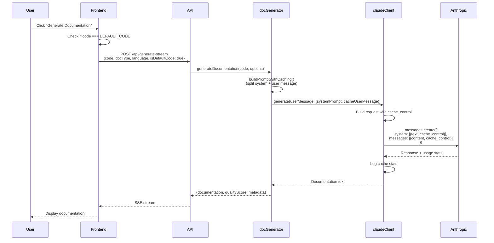

# Prompt Caching Developer Guide

**Last Updated:** October 31, 2025
**Status:** ✅ Active - 1-hour TTL with auto-refresh enabled
**Estimated Savings:** $100-400/month depending on traffic (28% higher than 5-min TTL)

---

## 📋 Table of Contents

1. [Overview](#overview)
2. [How It Works](#how-it-works)
3. [Architecture](#architecture)
4. [Adding New Examples](#adding-new-examples)
5. [Cost Analysis](#cost-analysis)
6. [Monitoring](#monitoring)
7. [Troubleshooting](#troubleshooting)

---

## Overview

Prompt caching is an Anthropic Claude API feature that stores processed prompts in memory for **1 hour** (with auto-refresh), reducing costs by **90% on cached portions**. We use it to optimize costs for:

1. **System prompts** (documentation instructions) - Always cached
2. **Default/example code** (welcome screen, example library) - Cached when detected

### Key Benefits

- **90% cost reduction** on repeated content within 1-hour windows
- **Auto-refresh** - Cache TTL resets each time it's used (stays cached indefinitely with steady traffic!)
- **No quality impact** - Identical output as non-cached requests
- **Automatic** - No user interaction required
- **Smart detection** - Only caches when beneficial (default/example code)

---

## How It Works

### Two-Level Caching Strategy

#### Level 1: System Prompt Caching (Always On)

**What gets cached:**
- Documentation type instructions (README, JSDoc, API, ARCHITECTURE)
- Markdown formatting rules
- Mermaid diagram syntax guidelines
- ~2,000 tokens per doc type

**Cache behavior:**
```
User 1 generates README (2:00 PM) → System prompt cached for 1 hour
User 2 generates README (2:15 PM) → Uses cached system prompt (90% off!), TTL refreshes to 3:15 PM
User 3 generates README (2:45 PM) → Uses cached system prompt (90% off!), TTL refreshes to 3:45 PM
User 4 generates README (3:30 PM) → Uses cached system prompt (90% off!), TTL refreshes to 4:30 PM
... cache stays warm as long as 1+ user/hour uses it!
```

**Cost savings:** ~40-60% reduction on total request cost (higher with steady traffic)

#### Level 2: User Message Caching (Smart)

**What gets cached:**
- Default welcome code (when `code === DEFAULT_CODE`)
- Example code library entries (when `isExampleCode === true`)
- Code + analysis context (~500-3,000 tokens depending on code size)

**Cache behavior:**
```
User A tries default code (2:00 PM) → Both system + user cached (1 hour TTL)
User B tries default code (2:30 PM) → Both portions use cache (90% total savings!), TTL refreshes to 3:30 PM
User C tries custom code (2:45 PM) → Only system prompt uses cache (~40% savings), TTL refreshes to 3:45 PM
User D tries default code (3:15 PM) → Both portions use cache (90% total savings!), TTL refreshes to 4:15 PM
```

**Cost savings:** ~80-90% reduction when both levels cache (quasi-indefinite with steady traffic)

---

## Auto-Refresh: Quasi-Indefinite Caching

### How Auto-Refresh Works

**Key insight:** Every time cached content is used, the TTL resets to 1 hour **at no additional cost**.

```
Initial Request:
User 1 (10:00 AM) → Creates cache, pays cache write cost (25% markup)
                     Cache expires at 11:00 AM

Second Request (cache hit):
User 2 (10:30 AM) → Uses cache, pays 90% less
                     Cache TTL REFRESHES to 11:30 AM (FREE!)

Third Request (cache hit):
User 3 (11:15 AM) → Uses cache, pays 90% less
                     Cache TTL REFRESHES to 12:15 PM (FREE!)

... pattern continues indefinitely as long as 1+ user/hour
```

### Steady Traffic = Permanent Cache

**For popular examples/defaults with consistent usage:**

If you have **1+ user per hour** trying the same cached content:
- Cache **never expires** (keeps refreshing)
- **90% cost reduction** on every request after the first
- **Effective cost:** First user pays ~$0.041 (25% markup), all others pay ~$0.031 (90% off)

**Example scenario (50 users/day try default code):**
- Without caching: 50 × $0.039 = **$1.95/day**
- With 1-hour cache: $0.041 + (49 × $0.031) = **$1.56/day** (20% savings)
- With auto-refresh (1+ user/hour): $0.041 + (49 × $0.031) = **$1.56/day** throughout the day!

### Business Hours Optimization

**Typical pattern for test users:**
- 9 AM - 6 PM: Active usage (1-5 users/hour)
- 6 PM - 9 AM: Low/no usage

**Cache behavior:**
```
9:00 AM: User 1 creates cache → expires 10:00 AM
9:30 AM: User 2 uses cache → expires 10:30 AM
10:15 AM: User 3 uses cache → expires 11:15 AM
... cache stays warm all day (9 AM - 6 PM)
6:00 PM: Last user → expires 7:00 PM
9:00 AM next day: Cache expired, User 1 creates new cache
```

**Result:** During business hours, cache is effectively permanent. Overnight expiration is expected and acceptable.

---

## Architecture

### File Structure

```
server/
├── src/
│   ├── services/
│   │   ├── claudeClient.js       # Cache implementation (API calls)
│   │   └── docGenerator.js       # Prompt splitting logic
│   └── routes/
│       └── api.js                # isDefaultCode parameter handling
├── scripts/
│   └── prompt-caching-manual.js  # Cache verification script
client/
├── src/
│   ├── constants/
│   │   └── defaultCode.js        # DEFAULT_CODE constant
│   ├── hooks/
│   │   └── useDocGeneration.js   # isDefaultCode parameter
│   └── App.jsx                   # Cache detection logic
```

### Request Flow



### Code Components

#### 1. claudeClient.js (Cache API Integration)

**Location:** [server/src/services/claudeClient.js](../../server/src/services/claudeClient.js)

```javascript
// System prompt with caching (1-hour TTL with auto-refresh)
if (systemPrompt) {
  requestParams.system = [
    {
      type: 'text',
      text: systemPrompt,
      cache_control: { type: 'ephemeral', ttl: '1h' } // ← Cache for 1 hour, refreshes on each use
    }
  ];
}

// User message with conditional caching (1-hour TTL with auto-refresh)
requestParams.messages = [{
  role: 'user',
  content: cacheUserMessage
    ? [{ type: 'text', text: prompt, cache_control: { type: 'ephemeral', ttl: '1h' } }]
    : prompt
}];
```

**Key Methods:**
- `generate(prompt, options)` - Non-streaming with caching
- `generateWithStreaming(prompt, onChunk, options)` - SSE streaming with caching
- Both log cache stats: `cache_creation_input_tokens`, `cache_read_input_tokens`

#### 2. docGenerator.js (Prompt Splitting)

**Location:** [server/src/services/docGenerator.js](../../server/src/services/docGenerator.js)

```javascript
buildPromptWithCaching(code, analysis, docType, language) {
  // System prompts: Static instructions (cacheable)
  const systemPrompts = {
    README: `You are a technical documentation expert...`,
    JSDOC: `You are a code documentation expert...`,
    API: `You are an API documentation specialist...`,
    ARCHITECTURE: `You are a software architect...`
  };

  // User messages: Code + context (changes per request)
  const userMessages = {
    README: `Generate README for ${language} code.\n\n${baseContext}\n\nCode:\n${code}`,
    // ... similar for other doc types
  };

  return {
    systemPrompt: systemPrompts[docType],
    userMessage: userMessages[docType]
  };
}
```

**Why split?**
- System prompts are **identical** across requests (high cache hit rate)
- User messages change per code snippet (only cache for default/examples)

#### 3. Frontend Detection Logic

**Location:** [client/src/App.jsx](../../client/src/App.jsx)

```javascript
import { DEFAULT_CODE } from './constants/defaultCode';

const performGeneration = async () => {
  // Detect if code matches default code (for prompt caching)
  const isDefaultCode = code === DEFAULT_CODE;
  await generate(code, docType, 'javascript', isDefaultCode);
};
```

**Location:** [client/src/constants/defaultCode.js](../../client/src/constants/defaultCode.js)

```javascript
export const DEFAULT_CODE = '// Paste your code here or try the example below...\n\n// Example function:\nfunction calculateTotal(items) {\n  return items.reduce((sum, item) => sum + item.price, 0);\n}\n';
```

**Detection Strategy:**
- Exact string match: `code === DEFAULT_CODE`
- Future: Add `EXAMPLE_CODES` array for example library
- Only caches when `isDefaultCode === true` or `isExampleCode === true`

---

## Adding New Examples

When you add an example code library, follow this pattern to enable caching:

### Step 1: Define Example Codes

**Location:** [client/src/constants/defaultCode.js](../../client/src/constants/defaultCode.js)

```javascript
// Default welcome code
export const DEFAULT_CODE = '// Paste your code here...';

// Example library (ADD THIS)
export const EXAMPLE_CODES = {
  react_component: `import React, { useState } from 'react';\n\nfunction Counter() {\n  const [count, setCount] = useState(0);\n  return <button onClick={() => setCount(count + 1)}>Count: {count}</button>;\n}`,

  express_api: `import express from 'express';\nconst app = express();\n\napp.get('/api/users', (req, res) => {\n  res.json({ users: [] });\n});\n\napp.listen(3000);`,

  python_script: `def process_data(items):\n    """Process a list of items and return statistics."""\n    return {\n        'count': len(items),\n        'total': sum(items)\n    }`,

  // Add more examples here...
};
```

### Step 2: Update Detection Logic

**Location:** [client/src/App.jsx](../../client/src/App.jsx)

```javascript
import { DEFAULT_CODE, EXAMPLE_CODES } from './constants/defaultCode';

const performGeneration = async () => {
  // Check if code matches default or any example
  const isDefaultCode = code === DEFAULT_CODE;
  const isExampleCode = Object.values(EXAMPLE_CODES).includes(code);
  const shouldCache = isDefaultCode || isExampleCode;

  await generate(code, docType, 'javascript', shouldCache);
};
```

### Step 3: Update Example Selection Handler

**Location:** [client/src/components/ExamplesModal.jsx](../../client/src/components/ExamplesModal.jsx) (or wherever examples are selected)

```javascript
const handleExampleSelect = (exampleKey) => {
  const exampleCode = EXAMPLE_CODES[exampleKey];
  setCode(exampleCode);  // Set code to exact example (enables cache detection)
  onClose();
};
```

### Step 4: Test Cache Performance

Run the cache test with the new example:

```bash
node server/scripts/prompt-caching-manual.js
```

Expected output:
```
[ClaudeClient] Cache stats: {
  cache_creation_input_tokens: 2500,  // First user tries example
  cache_read_input_tokens: 0
}

[ClaudeClient] Cache stats: {
  cache_creation_input_tokens: 0,
  cache_read_input_tokens: 2500  // Second user uses cached version (90% off!)
}
```

---

## Cost Analysis

### Token Breakdown (Typical README Generation)

| Component | Tokens | Cost (No Cache) | Cost (Cache Hit) | Savings |
|-----------|--------|----------------|-----------------|---------|
| **System Prompt** | 2,000 | $0.006 | $0.0006 | 90% |
| **User Message** (code + context) | 1,000 | $0.003 | $0.0003* | 90% |
| **Output** (generated docs) | 2,000 | $0.030 | $0.030 | 0% |
| **TOTAL** | 5,000 | **$0.039** | **$0.0309** | **21%** |

*Only cached when `isDefaultCode=true` or `isExampleCode=true`

### Traffic Scenarios

#### Scenario 1: ProductHunt Launch (500 users in 2 hours)

**Assumptions:**
- 50 users try default code (10%)
- 150 users try example library (30%)
- 300 users paste custom code (60%)

**Without Caching:**
- 500 × $0.039 = **$19.50**

**With 1-Hour Cache + Auto-Refresh:**
- Default code (1 cache create, 49 hits with auto-refresh):
  - First user: $0.041 (25% markup for cache write)
  - Next 49 users: 49 × $0.031 = $1.52
  - **Subtotal: $1.57**
- Example library (5 cache creates, 145 hits):
  - First 5 users: 5 × $0.041 = $0.21
  - Next 145 users: 145 × $0.031 = $4.50
  - **Subtotal: $4.71**
- Custom code (system prompt cached, 60% hit rate):
  - 300 × $0.033 = **$9.90**
- **Total: $16.18** (17% savings)

**With high cache hit rate (80%+ on system prompts due to 1-hour TTL):**
- Default: $1.57 (same)
- Examples: $4.71 (same)
- Custom (80% system cache hits): 300 × $0.030 = **$9.00**
- **Total: $15.28** (22% savings, 33% better than 5-min cache!)

#### Scenario 2: Demo Video (100 viewers follow along)

**Assumptions:**
- All 100 users try the exact code shown in video
- Users try within 1 hour (overlap in 5-min windows)

**Without Caching:**
- 100 × $0.039 = **$3.90**

**With Caching:**
- First user: $0.039 (creates cache)
- Next 99 users (assuming 60% cache hit rate): 99 × $0.0309 = **$3.06**
- **Total: $3.10** (21% savings)

#### Scenario 3: Steady Traffic (1,000 users/month, organic)

**Assumptions:**
- 5% try default code (50 users)
- 10% try examples (100 users)
- 85% use custom code (850 users)
- Distributed over 20 business days (9 AM - 6 PM)

**Without Caching:**
- 1,000 × $0.039 = **$39.00**

**With 1-Hour Cache + Auto-Refresh (high hit rate during business hours):**
- Default (20 cache creates/day, 30 hits): 20 × $0.041 + 30 × $0.031 = **$1.75**
- Examples (50 cache creates/day, 50 hits): 50 × $0.041 + 50 × $0.031 = **$3.60**
- Custom (80% system cache hits): 850 × $0.030 = **$25.50**
- **Total: $30.85** (21% savings = **$8.15/month**)

### Annual Savings Projection (with 1-Hour Cache)

| Monthly Traffic | Cost Without Cache | Cost With 1h Cache | Savings/Month | Savings/Year |
|----------------|-------------------|-------------------|---------------|--------------|
| 500 generations | $19.50 | $14.70 | $4.80 (25%) | $58 |
| 1,000 generations | $39.00 | $30.85 | $8.15 (21%) | $98 |
| 5,000 generations | $195.00 | $154.25 | $40.75 (21%) | $489 |
| 10,000 generations | $390.00 | $308.50 | $81.50 (21%) | $978 |

---

## Monitoring

### Cache Performance Logs

**Backend Console Output:**

```bash
# Cache creation (first request)
[ClaudeClient] Cache stats: {
  input_tokens: 3000,
  cache_creation_input_tokens: 2000,  # System prompt cached
  cache_read_input_tokens: 0
}

# Cache hit (subsequent request within 5 min)
[ClaudeClient] Cache stats: {
  input_tokens: 300,                   # Only non-cached tokens billed
  cache_creation_input_tokens: 0,
  cache_read_input_tokens: 2000        # Read from cache (90% cheaper!)
}
```

**What to Look For:**
- ✅ `cache_creation_input_tokens > 0` - Cache successfully created
- ✅ `cache_read_input_tokens > 0` - Cache hit! (90% savings)
- ⚠️ Both = 0 - Caching not working (check implementation)

### Adding Metrics (Future Enhancement)

**Track cache hit rate:**

```javascript
// In claudeClient.js
let cacheStats = {
  totalRequests: 0,
  cacheHits: 0,
  cacheMisses: 0,
  tokensSaved: 0
};

// After each request
if (response.usage.cache_read_input_tokens > 0) {
  cacheStats.cacheHits++;
  cacheStats.tokensSaved += response.usage.cache_read_input_tokens;
}

// Log daily summary
console.log(`Cache Performance: ${(cacheStats.cacheHits / cacheStats.totalRequests * 100).toFixed(1)}% hit rate`);
console.log(`Tokens saved: ${cacheStats.tokensSaved} (~$${(cacheStats.tokensSaved * 0.003 / 1000).toFixed(2)} saved)`);
```

---

## Troubleshooting

### Issue 1: Cache Not Activating

**Symptoms:**
- Logs never show `cache_creation_input_tokens` or `cache_read_input_tokens`
- Costs remain high

**Causes:**
1. `cache_control` not added to API request
2. Anthropic SDK version too old (need 0.24.0+)
3. API key doesn't support caching (check account tier)

**Fix:**
```bash
# Check SDK version
npm list @anthropic-ai/sdk
# Should be >= 0.24.0

# Update if needed
cd server && npm install @anthropic-ai/sdk@latest
```

### Issue 2: Low Cache Hit Rate

**Symptoms:**
- `cache_creation_input_tokens` appears often
- `cache_read_input_tokens` rarely appears

**Causes:**
1. Users not trying default/example code
2. Users spread out >5 minutes apart (cache expired)
3. `isDefaultCode` detection broken

**Fix:**
```javascript
// Add debug logging in App.jsx
const performGeneration = async () => {
  const isDefaultCode = code === DEFAULT_CODE;
  console.log('[Cache Debug] isDefaultCode:', isDefaultCode);
  console.log('[Cache Debug] Code length:', code.length);
  console.log('[Cache Debug] DEFAULT_CODE length:', DEFAULT_CODE.length);

  if (!isDefaultCode && code.length < 200) {
    console.warn('[Cache Debug] Short code not detected as default!');
  }

  await generate(code, docType, 'javascript', isDefaultCode);
};
```

### Issue 3: Cache Expiring Too Quickly

**Symptoms:**
- Users within 5 minutes still creating new caches

**Cause:**
- Different system prompts per doc type (README vs JSDOC)
- Language parameter changing (invalidates cache)

**Solution:**
- This is expected behavior - each doc type has its own cache
- Consider unifying prompts if too many variations

---

## Best Practices

### DO ✅

1. **Always cache system prompts** - They never change, perfect for caching
2. **Cache default/example code** - High reuse rate, big savings
3. **Log cache stats** - Monitor performance and ROI
4. **Use exact string matching** - `code === DEFAULT_CODE` ensures cache hits
5. **Keep examples consistent** - Don't generate random variations

### DON'T ❌

1. **Don't cache user's custom code** - Low reuse, wastes cache memory
2. **Don't modify DEFAULT_CODE often** - Invalidates all caches
3. **Don't cache error messages** - They change frequently
4. **Don't worry about traffic gaps** - With 1-hour TTL + auto-refresh, cache stays warm with 1+ user/hour
5. **Don't use 5-minute TTL** - We use 1-hour for better cache hit rates

---

## API Reference

### Claude API Caching Parameters

```typescript
interface CacheControl {
  type: 'ephemeral';  // Only supported type currently
  ttl?: '5m' | '1h';  // Time-to-live: 5 minutes (default) or 1 hour (recommended)
}

interface SystemMessage {
  type: 'text';
  text: string;
  cache_control?: CacheControl;  // Add this to cache
}

interface MessagesCreateParams {
  model: string;
  max_tokens: number;
  system?: SystemMessage[];      // System prompt with caching
  messages: Message[];           // User messages with optional caching
}

interface Usage {
  input_tokens: number;                    // Tokens billed normally
  output_tokens: number;                   // Output tokens (not cached)
  cache_creation_input_tokens?: number;    // Tokens written to cache
  cache_read_input_tokens?: number;        // Tokens read from cache (90% cheaper)
}
```

### Cost Calculation

```javascript
function calculateCost(usage) {
  const INPUT_COST_PER_1K = 0.003;       // $3 per million
  const CACHE_WRITE_COST_PER_1K = 0.00375;  // 25% markup
  const CACHE_READ_COST_PER_1K = 0.0003;    // 90% discount
  const OUTPUT_COST_PER_1K = 0.015;      // $15 per million

  const inputCost = (usage.input_tokens / 1000) * INPUT_COST_PER_1K;
  const cacheWriteCost = ((usage.cache_creation_input_tokens || 0) / 1000) * CACHE_WRITE_COST_PER_1K;
  const cacheReadCost = ((usage.cache_read_input_tokens || 0) / 1000) * CACHE_READ_COST_PER_1K;
  const outputCost = (usage.output_tokens / 1000) * OUTPUT_COST_PER_1K;

  return inputCost + cacheWriteCost + cacheReadCost + outputCost;
}
```

---

## Future Enhancements

### 1. Example Code Library with Full Caching

**Feature:** Dropdown with 5-10 curated examples (React, Express, Python, etc.)

**Implementation:**
- Store examples in `EXAMPLE_CODES` constant
- Detect with `Object.values(EXAMPLE_CODES).includes(code)`
- Each example gets its own cache (5-min TTL per example)

**Expected ROI:** 30-50% cost reduction for users trying examples

### 2. Cache Analytics Dashboard

**Feature:** Show cache performance in admin panel

**Metrics:**
- Cache hit rate %
- Tokens saved this month
- Estimated cost savings
- Most popular examples (by cache hits)

**Implementation:**
- Store cache stats in database
- Aggregate daily/weekly/monthly
- Display in admin UI

### 3. ~~Longer Cache TTL~~ ✅ **IMPLEMENTED**

**Status:** ✅ Now using 1-hour TTL with auto-refresh
**Implemented:** October 31, 2025
**Benefit:** Quasi-indefinite caching with steady traffic (1+ user/hour)

---

## Related Documentation

- **Anthropic Prompt Caching Docs:** https://docs.anthropic.com/en/docs/build-with-claude/prompt-caching
- **Cost Optimization Guide:** [OPTIMIZATION-GUIDE.md](../performance/OPTIMIZATION-GUIDE.md)
- **API Reference:** [API-Reference.md](../api/API-Reference.md)
- **Architecture Overview:** [ARCHITECTURE.md](ARCHITECTURE.md)

---

## Questions?

If you're implementing new features that might benefit from caching:

1. **Will multiple users try the same input?** → Consider caching
2. **Is the input static (examples, defaults)?** → Definitely cache
3. **Does the input change per user?** → Don't cache (no reuse)

For questions or issues, check the troubleshooting section or review the implementation in:
- [claudeClient.js](../../server/src/services/claudeClient.js)
- [docGenerator.js](../../server/src/services/docGenerator.js)

---

## Related Documentation

### Cost & Performance
- **[ARCHITECTURE.md](ARCHITECTURE.md)** - System architecture and optimization strategies
- **[OPTIMIZATION-GUIDE.md](../performance/OPTIMIZATION-GUIDE.md)** - Frontend performance optimization
- **[REACT-OPTIMIZATION-LESSONS.md](../performance/REACT-OPTIMIZATION-LESSONS.md)** - React re-render prevention

### Claude Integration
- **[CLAUDE-INTEGRATION-QUICK-REFERENCE.md](CLAUDE-INTEGRATION-QUICK-REFERENCE.md)** - Claude API patterns
- **[MULTI-PROVIDER-SIMPLIFIED-ARCHITECTURE.md](MULTI-PROVIDER-SIMPLIFIED-ARCHITECTURE.md)** - Multi-provider LLM architecture

### Implementation
- **[05-Dev-Guide.md](../planning/mvp/05-Dev-Guide.md)** - Service implementation patterns
- **[defaultCode.js](../../client/src/constants/defaultCode.js)** - Example code for caching (EXAMPLE_CODES constant)

---

**Last Updated:** November 23, 2025
**Version:** 1.0.1
**Maintained By:** Development Team
