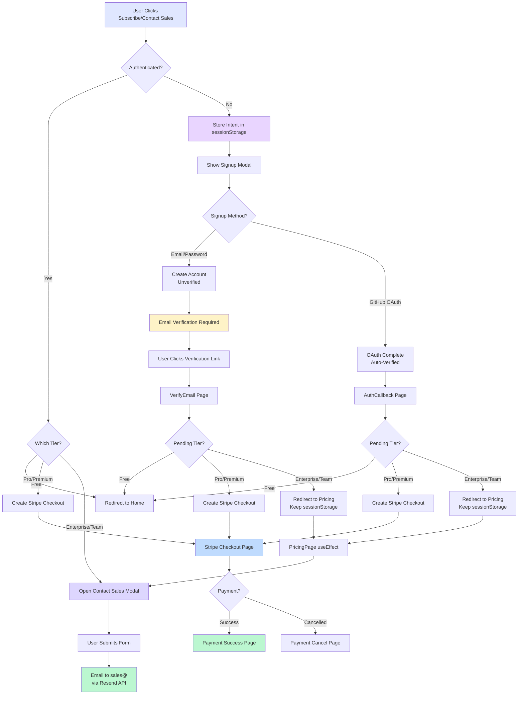
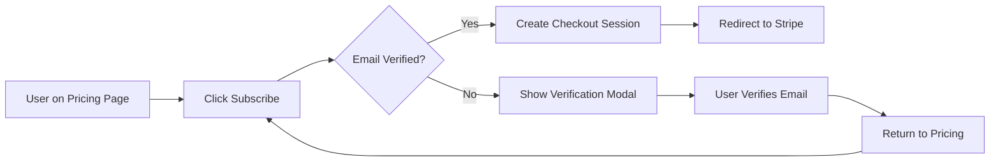
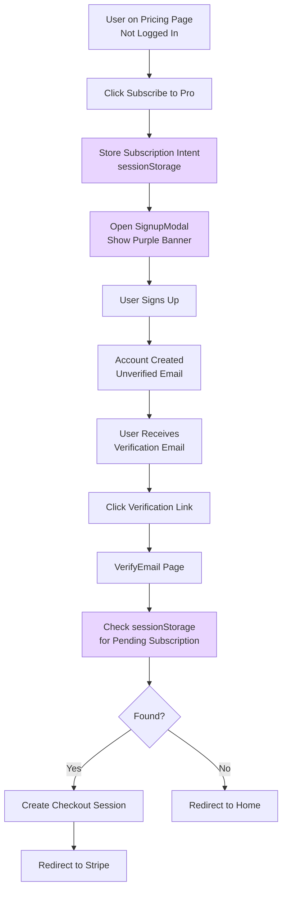
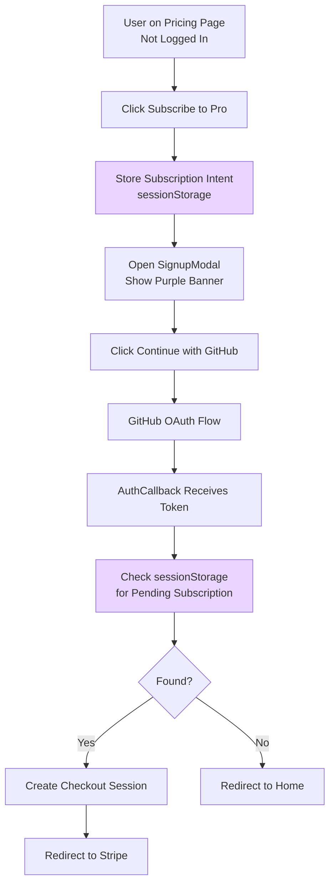
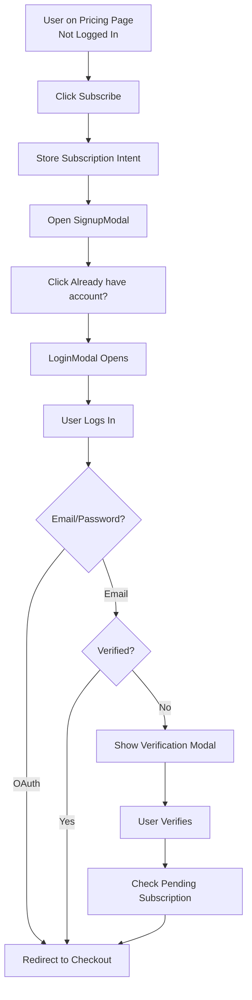
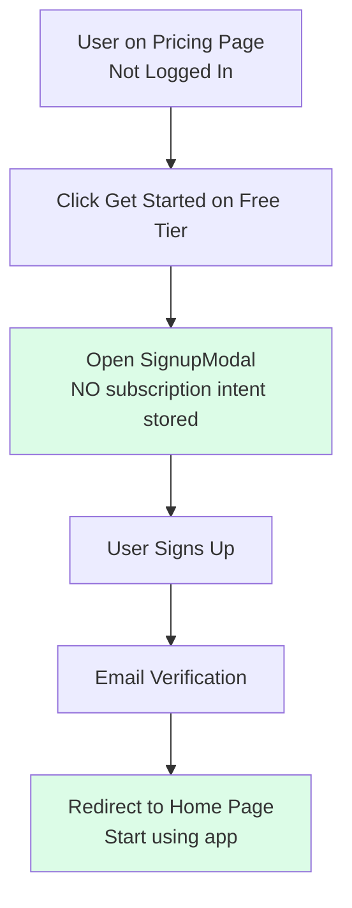
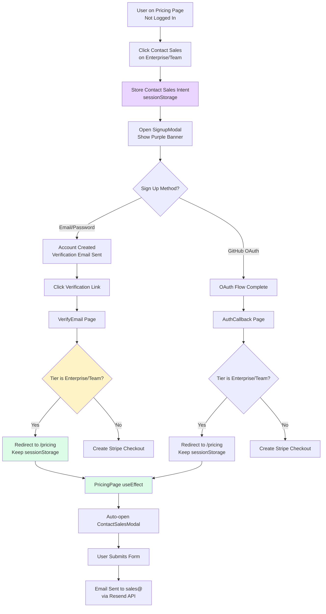

# Subscription Flows

**Purpose:** Document end-to-end subscription flows for authenticated and unauthenticated users
**Created:** October 31, 2025
**Last Updated:** October 31, 2025
**Status:** ✅ Active

---

## Overview

CodeScribe AI supports multiple subscription flows to handle both authenticated and unauthenticated users attempting to subscribe. For **paid tiers** (Pro, Premium), the system uses sessionStorage to preserve subscription intent across authentication and email verification steps. **Enterprise/Team tiers** use a Contact Sales flow, and **Free tier** has a simplified flow with no payment required.

### High-Level Flow Diagram



**Legend:**
- 🟣 **Purple** - SessionStorage operations
- 🟡 **Yellow** - Email verification steps
- 🔵 **Blue** - Stripe payment flow
- 🟢 **Green** - Success endpoints (payment/contact sales)
- 💜 **Dark Purple** - Contact Sales modal

### Key Principles

1. **Preserve User Intent** - Subscription details stored in sessionStorage across auth flows (paid tiers only)
2. **Seamless UX** - Minimal clicks from "Subscribe" to Stripe Checkout (paid) or home page (free)
3. **Clear Communication** - Users always know what they're subscribing to
4. **Flexible Authentication** - Supports email/password and OAuth (GitHub)
5. **Email Verification Required** - Non-OAuth users must verify email before checkout (paid) or app access (free)
6. **Tier-Aware Routing** - Enterprise/Team tiers route to Contact Sales instead of Stripe Checkout

---

## Flow Types

### 1. Authenticated User (Already Logged In & Verified)

**Simplest flow - direct to checkout**



**Implementation:**
- File: [PricingPage.jsx:39-86](../../client/src/components/PricingPage.jsx#L39-L86)
- Direct API call to `/api/payments/create-checkout-session`
- If 403 (unverified email), shows VerificationRequiredModal

---

### 2. Unauthenticated User → Email/Password Signup

**Multi-step flow with email verification**



**Step-by-Step Breakdown:**

#### Step 1: User Clicks Subscribe (Not Authenticated)
**File:** [PricingPage.jsx:40-56](../../client/src/components/PricingPage.jsx#L40-L56)

```javascript
if (!isAuthenticated) {
  const subscriptionIntent = {
    tier: tier.toLowerCase(),        // 'pro', 'starter', etc.
    billingPeriod,                    // 'monthly' or 'yearly'
    tierName: tiers.find(t => t.id === tier)?.name || tier,  // 'Pro', 'Starter', etc.
  };

  // Store in sessionStorage
  setSessionItem(STORAGE_KEYS.PENDING_SUBSCRIPTION, JSON.stringify(subscriptionIntent));

  // Show signup modal with context
  setPendingSubscription(subscriptionIntent);
  setShowSignupModal(true);
}
```

**Storage Key:** `codescribeai:session:subscription:pending-intent`

#### Step 2: SignupModal Shows Context
**File:** [SignupModal.jsx:308-319](../../client/src/components/SignupModal.jsx#L308-L319)

```jsx
{subscriptionContext && (
  <div className="p-4 bg-purple-50 border border-purple-200 rounded-lg">
    <p className="text-sm text-purple-900">
      <span className="font-semibold">Subscribing to {subscriptionContext.tierName}</span>
      <br />
      <span className="text-purple-700">
        Sign up and verify your email to complete your subscription
      </span>
    </p>
  </div>
)}
```

**User sees:** Purple banner at top of signup form

#### Step 3: User Signs Up
- User enters email/password
- Account created (email unverified)
- Verification email sent automatically
- Pending subscription remains in sessionStorage

#### Step 4: Email Verification
**File:** [VerifyEmail.jsx:46-97](../../client/src/components/VerifyEmail.jsx#L46-L97)

```javascript
if (response.ok) {
  setStatus('success');

  // Check for pending subscription
  const pendingSubscriptionStr = getSessionItem(STORAGE_KEYS.PENDING_SUBSCRIPTION);

  if (pendingSubscriptionStr) {
    const pendingSubscription = JSON.parse(pendingSubscriptionStr);
    setMessage(`Your email has been verified! Redirecting to complete your ${pendingSubscription.tierName} subscription...`);

    // Clear from storage
    removeSessionItem(STORAGE_KEYS.PENDING_SUBSCRIPTION);

    // Redirect to checkout after 2 seconds
    setTimeout(async () => {
      const checkoutResponse = await fetch(`${API_URL}/api/payments/create-checkout-session`, {
        method: 'POST',
        headers: {
          'Content-Type': 'application/json',
          'Authorization': `Bearer ${token}`,
        },
        body: JSON.stringify({
          tier: pendingSubscription.tier,
          billingPeriod: pendingSubscription.billingPeriod,
        }),
      });

      if (checkoutResponse.ok) {
        const { url } = await checkoutResponse.json();
        window.location.href = url; // Redirect to Stripe
      } else {
        navigate('/pricing'); // Fallback
      }
    }, 2000);
  }
}
```

**User sees:** "Your email has been verified! Redirecting to complete your Pro subscription..."

---

### 3. Unauthenticated User → OAuth Signup (GitHub)

**Faster flow - OAuth users are auto-verified**



**Key Difference:** No email verification step needed - OAuth providers verify emails

**Implementation:**
**File:** [AuthCallback.jsx:75-114](../../client/src/components/AuthCallback.jsx#L75-L114)

```javascript
// After successful OAuth token storage
const pendingSubscriptionStr = getSessionItem(STORAGE_KEYS.PENDING_SUBSCRIPTION);

if (pendingSubscriptionStr) {
  const pendingSubscription = JSON.parse(pendingSubscriptionStr);
  removeSessionItem(STORAGE_KEYS.PENDING_SUBSCRIPTION);

  // OAuth users are auto-verified, go directly to checkout
  const checkoutResponse = await fetch(`${API_URL}/api/payments/create-checkout-session`, {
    method: 'POST',
    headers: {
      'Content-Type': 'application/json',
      'Authorization': `Bearer ${token}`,
    },
    body: JSON.stringify({
      tier: pendingSubscription.tier,
      billingPeriod: pendingSubscription.billingPeriod,
    }),
  });

  if (checkoutResponse.ok) {
    const { url } = await checkoutResponse.json();
    window.location.href = url; // Redirect to Stripe
  }
}
```

---

### 4. Unauthenticated User → Login (Existing Account)

**User switches from signup to login in modal**



**Implementation Notes:**
- Subscription intent preserved when switching between modals
- If user logs in via email/password: Redirects to pricing page (can click subscribe again)
- If user logs in via OAuth: Same flow as OAuth signup (checks pending subscription)

---

## Billing Period Options

### Monthly vs Yearly Toggle

**File:** [PricingPage.jsx:202-226](../../client/src/components/PricingPage.jsx#L202-L226)

```jsx
<div className="inline-flex items-center gap-3 p-1 bg-slate-100 rounded-lg">
  <button onClick={() => setBillingPeriod('monthly')}>
    Monthly
  </button>
  <button onClick={() => setBillingPeriod('yearly')}>
    Yearly
    <span className="bg-green-100 text-green-700">Save 17%</span>
  </button>
</div>
```

**Pricing:**

| Tier | Monthly | Yearly (per month) | Yearly Total | Savings |
|------|---------|-------------------|--------------|---------|
| Free | $0 | $0 | $0 | N/A |
| Starter | $12 | $10 | $120/year | 17% |
| Pro | $29 | $24 | $288/year | 17% |
| Team | $99 | $82 | $984/year | 17% |

**State Management:**
```javascript
const [billingPeriod, setBillingPeriod] = useState('monthly'); // 'monthly' or 'yearly'

// Pass to handleSubscribe
handleSubscribe(tier.id, billingPeriod)
```

---

## Storage Structure

### Pending Subscription Data

**Key:** `codescribeai:session:subscription:pending-intent`

**Structure:**
```json
{
  "tier": "pro",                 // lowercase: 'free', 'starter', 'pro', 'team'
  "billingPeriod": "yearly",     // 'monthly' or 'yearly'
  "tierName": "Pro"              // display name
}
```

**Lifecycle:**
1. **Created:** When unauthenticated user clicks Subscribe
2. **Read:** After email verification OR OAuth callback
3. **Cleared:** After successful checkout redirect OR on error fallback
4. **Storage Type:** sessionStorage (cleared when tab closes)

---

## Error Handling

### Checkout Creation Fails After Verification

**Scenario:** Email verified, but Stripe checkout session creation fails

**File:** [VerifyEmail.jsx:78-84](../../client/src/components/VerifyEmail.jsx#L78-L84)

```javascript
if (checkoutResponse.ok) {
  const { url } = await checkoutResponse.json();
  window.location.href = url;
} else {
  // Fallback: redirect to pricing page
  navigate('/pricing');
}
```

**User Experience:** Redirected to pricing page where they can try again (already authenticated and verified)

### Unverified Email Attempts Checkout

**Scenario:** Authenticated user with unverified email clicks Subscribe

**File:** [PricingPage.jsx:73-77](../../client/src/components/PricingPage.jsx#L73-L77)

```javascript
if (response.status === 403 && errorData.emailVerified === false) {
  setLoading(null);
  setShowVerificationModal(true);
  return;
}
```

**User Experience:** VerificationRequiredModal appears with resend button

### Session Expired During Flow

**Scenario:** User starts signup but session expires before verification

**Behavior:**
- Pending subscription remains in sessionStorage
- After re-authentication, user can click Subscribe again
- Original intent preserved

---

## Special Cases

### Free Tier

**Free tier has a simplified flow with no payment or subscription intent storage required.**

#### Authenticated Users

**Implementation:** [PricingPage.jsx:42-47](../../client/src/components/PricingPage.jsx#L42-L47)

```javascript
// Free tier - just needs authentication, no payment
if (tier === 'free') {
  if (!isAuthenticated) {
    // Show signup modal without storing subscription intent
    setShowSignupModal(true);
    return;
  }
  // Already authenticated, just go to app
  navigate('/');
  return;
}
```

**Behavior:**
- **Authenticated:** Direct redirect to home page (no checkout, no storage)
- **Unauthenticated:** Show signup modal **without** storing subscription intent

#### Why No Subscription Intent Storage?

Free tier users don't need to go through Stripe checkout after email verification. Storing subscription intent would cause the post-verification logic to incorrectly attempt creating a checkout session.

**Flow for Unauthenticated Users:**



**Key Difference from Paid Tiers:**
- **Paid Tiers:** Store subscription intent → Email verification → Checkout → Stripe
- **Free Tier:** Show signup modal → Email verification → Home page (no checkout)

### Enterprise & Team Tiers (Contact Sales)

**Enterprise and Team tiers use a Contact Sales flow instead of Stripe Checkout.**

**Implementation:** [PricingPage.jsx:80-105](../../client/src/components/PricingPage.jsx#L80-L105)

```javascript
// Enterprise and Team tiers - contact sales
if (tier === 'enterprise' || tier === 'team') {
  if (!isAuthenticated) {
    // Must be authenticated to contact sales (so we know who to contact)
    // Store contact sales intent for post-auth flow
    const contactSalesIntent = {
      tier: tier.toLowerCase(),
      billingPeriod: 'monthly', // Not used for contact sales, but kept for consistency
      tierName: tiers.find(t => t.id === tier)?.name || tier,
    };

    // Store in sessionStorage for post-auth redirect
    setSessionItem(STORAGE_KEYS.PENDING_SUBSCRIPTION, JSON.stringify(contactSalesIntent));

    // Store in component state for modal context
    setPendingSubscription(contactSalesIntent);

    // Show signup modal
    setShowSignupModal(true);
    return;
  }
  // Show contact sales modal
  setContactSalesTier(tier);
  setShowContactSalesModal(true);
  return;
}
```

**Behavior:**
- **Authenticated users:** Opens ContactSalesModal directly
- **Unauthenticated users:** Shows signup modal → After auth → Opens ContactSalesModal automatically

---

#### Contact Sales Flow for Unauthenticated Users



**Key Differences from Paid Tiers:**
1. **No Stripe Checkout:** Enterprise/Team never create checkout sessions
2. **Email Verification Logic:** VerifyEmail.jsx checks tier type and routes accordingly
3. **sessionStorage Preserved:** Contact sales intent kept in storage for PricingPage to consume
4. **Server-Side Email:** ContactSalesModal submits to `/api/contact/sales` endpoint

---

#### Email Verification Redirect Logic

**File:** [VerifyEmail.jsx:56-103](../../client/src/components/VerifyEmail.jsx#L56-L103)

The email verification component now checks if the pending subscription is for enterprise/team and handles the redirect differently:

```javascript
// Check if this is a Contact Sales tier (enterprise/team)
const isContactSalesTier = pendingSubscription.tier === 'enterprise' || pendingSubscription.tier === 'team';

if (isContactSalesTier) {
  // Enterprise/Team tiers: Redirect to pricing (Contact Sales modal will auto-open)
  setMessage(`Your email has been verified! Redirecting to contact our sales team...`);

  // Keep pending subscription in storage (PricingPage will consume it)
  setTimeout(() => {
    navigate('/pricing');
  }, 2000);
} else {
  // Pro/Premium tiers: Create Stripe checkout session
  setMessage(`Your email has been verified! Redirecting to complete your ${pendingSubscription.tierName} subscription...`);

  // Clear pending subscription from storage
  removeSessionItem(STORAGE_KEYS.PENDING_SUBSCRIPTION);

  // Redirect to create checkout session
  setTimeout(async () => {
    // ... Stripe checkout logic
  }, 2000);
}
```

**User Messages:**
- **Enterprise/Team:** "Your email has been verified! Redirecting to contact our sales team..."
- **Pro/Premium:** "Your email has been verified! Redirecting to complete your Pro subscription..."

---

#### Contact Sales Modal

**File:** [ContactSalesModal.jsx](../../client/src/components/ContactSalesModal.jsx)

**Features:**
- Pre-filled user information (name, email from auth context)
- **Smart name collection:** Required name fields shown only if user doesn't have first_name/last_name
- Optional message field for additional details
- Server-side email submission (no client-side dependencies)
- Loading, success, and error states
- Success confirmation with explicit close button

**Name Collection Strategy:**

The modal uses conditional rendering to minimize friction while ensuring sales inquiries always include a name:

1. **User has name in database** (from Stripe checkout or OAuth):
   - Shows read-only display: "Name: John Doe"
   - No duplicate data entry required

2. **User missing name** (email/password signup, no prior Stripe checkout):
   - Shows required input fields: "First Name*" and "Last Name*"
   - User must provide name to submit inquiry
   - Name collected at natural point (when contacting sales)

**Implementation:**
```jsx
{user?.first_name && user?.last_name ? (
  // Show read-only display
  <div className="bg-slate-50 rounded-lg p-4">
    <p>Name: {user.first_name} {user.last_name}</p>
    <p>Email: {user.email}</p>
  </div>
) : (
  // Show name input fields (required)
  <>
    <input name="firstName" required placeholder="John" />
    <input name="lastName" required placeholder="Doe" />
  </>
)}
```

**API Endpoint:** `POST /api/contact/sales`

**Request Body:**
```json
{
  "tier": "enterprise",
  "message": "Looking for a custom plan for 50 users...",
  "firstName": "John",     // Optional: only if user doesn't have name
  "lastName": "Doe"        // Optional: only if user doesn't have name
}
```

**Backend Name Resolution** ([contact.js:40-51](../../server/src/routes/contact.js#L40-L51)):
```javascript
// Priority: Database name > Form name > Empty
if (user.first_name && user.last_name) {
  userName = `${user.first_name} ${user.last_name}`.trim();
} else if (firstName && lastName) {
  userName = `${firstName.trim()} ${lastName.trim()}`;
} else {
  userName = user.first_name || user.last_name || '';
}
```

**Email Delivery:**
- Sent via Resend API to `sales@codescribeai.com`
- Forwarded to personal Gmail via Namecheap email forwarding
- Reply-To header set to user's email for easy responses
- Branded HTML email template with user details (including collected name)

**Name Collection Benefits:**
- ✅ Zero friction signup (no name required initially)
- ✅ Always have name for sales inquiries (required fields when needed)
- ✅ No duplicate data entry (respects existing user data)
- ✅ Progressive disclosure (ask only when needed)
- ✅ Professional sales emails (always include proper contact name)

**See:** [EMAIL-FORWARDING-SETUP.md](../deployment/EMAIL-FORWARDING-SETUP.md) for email configuration details

### User Already on Selected Tier

**UI State:** Button disabled, shows "Current Plan"

**Implementation:** [PricingPage.jsx:275](../../client/src/components/PricingPage.jsx#L275)

```javascript
const isCurrentTier = user?.tier === tier.id;
```

---

## User Messages

### Signup Modal Context Banner

**When:** Unauthenticated user clicks Subscribe

**Message:**
```
Subscribing to Pro
Sign up and verify your email to complete your subscription
```

**Style:** Purple background (`bg-purple-50`), purple border

### Email Verification Success

**Standard (No Pending Subscription):**
```
Your email has been verified successfully!
```

**With Pending Subscription:**
```
Your email has been verified! Redirecting to complete your Pro subscription...
```

**Countdown:** 2 seconds before redirect

---

## Testing Checklist

### Free Tier Flow
- [ ] Not logged in → Click "Get Started" on Free tier
- [ ] Verify signup modal opens **without** purple subscription banner
- [ ] Verify sessionStorage does NOT contain `pending-intent`
- [ ] Sign up with new email address
- [ ] Verify email and click verification link
- [ ] Verify redirects to home page (NOT to Stripe)
- [ ] Verify can start using the app immediately

### Email/Password Flow - Monthly Billing
- [ ] Not logged in → Click "Subscribe to Starter" (monthly)
- [ ] Verify signup modal opens with purple banner
- [ ] Verify banner says "Subscribing to Starter"
- [ ] Sign up with new email address
- [ ] Check email inbox for verification link
- [ ] Click verification link
- [ ] Verify message: "Redirecting to complete your Starter subscription..."
- [ ] Verify redirects to Stripe Checkout
- [ ] Verify Stripe shows: Starter plan, $12/month

### Email/Password Flow - Yearly Billing
- [ ] Toggle to "Yearly" billing period
- [ ] Verify Pro shows $24/month (save 17%)
- [ ] Click "Subscribe to Pro" (not logged in)
- [ ] Complete signup and verification
- [ ] Verify Stripe shows: Pro plan, $24/month billed yearly ($288/year)

### OAuth Flow
- [ ] Not logged in → Click "Subscribe to Pro"
- [ ] Click "Continue with GitHub" in signup modal
- [ ] Complete GitHub OAuth
- [ ] Verify immediate redirect to Stripe (no verification step)

### Login Flow (Existing User)
- [ ] Not logged in → Click Subscribe
- [ ] Click "Already have an account?" in signup modal
- [ ] Log in with existing verified account
- [ ] Verify redirects to pricing page
- [ ] Click Subscribe again
- [ ] Verify goes directly to Stripe

### Error Cases
- [ ] Unverified email user clicks Subscribe → Verification modal appears
- [ ] Network error during checkout → Falls back to pricing page
- [ ] Session expires during flow → Can restart without losing intent

---

## File Reference

### Frontend Components
- [PricingPage.jsx](../../client/src/components/PricingPage.jsx) - Main pricing page with subscription logic
- [SignupModal.jsx](../../client/src/components/SignupModal.jsx) - Signup modal with context banner
- [LoginModal.jsx](../../client/src/components/LoginModal.jsx) - Login modal
- [VerifyEmail.jsx](../../client/src/components/VerifyEmail.jsx) - Email verification with checkout redirect
- [AuthCallback.jsx](../../client/src/components/AuthCallback.jsx) - OAuth callback with subscription check
- [VerificationRequiredModal.jsx](../../client/src/components/VerificationRequiredModal.jsx) - Unverified email warning

### Storage & Constants
- [storage.js](../../client/src/constants/storage.js) - Storage keys and helpers

### Backend Routes
- `/api/payments/create-checkout-session` - Creates Stripe Checkout session
- `/api/auth/signup` - User registration
- `/api/auth/verify-email` - Email verification
- `/api/auth/github` - OAuth initiation
- `/api/auth/github/callback` - OAuth callback

---

## Related Documentation

- [SUBSCRIPTION-MANAGEMENT.md](./SUBSCRIPTION-MANAGEMENT.md) - Subscription upgrades, downgrades, proration
- [ERROR-HANDLING-PATTERNS.md](./ERROR-HANDLING-PATTERNS.md) - Error handling conventions
- [EMAIL-VERIFICATION-SYSTEM.md](../authentication/EMAIL-VERIFICATION-SYSTEM.md) - Email verification details
- [STORAGE-CONVENTIONS.md](../conventions/STORAGE-CONVENTIONS.md) - Storage naming conventions

---

**Last Updated:** November 2, 2025
**Version:** 1.1.0 - Added Enterprise/Team Contact Sales flow with email verification redirect logic
