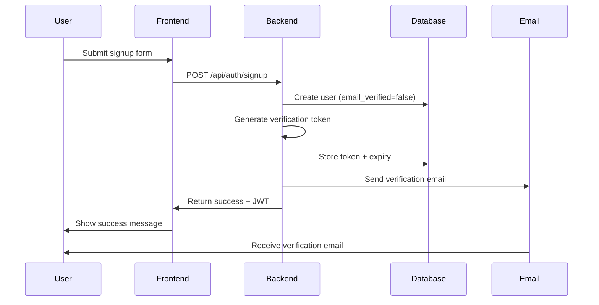
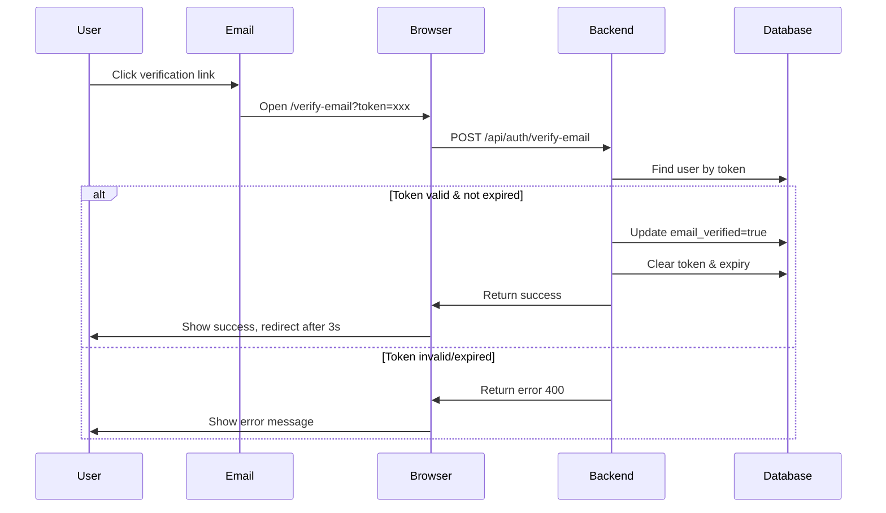
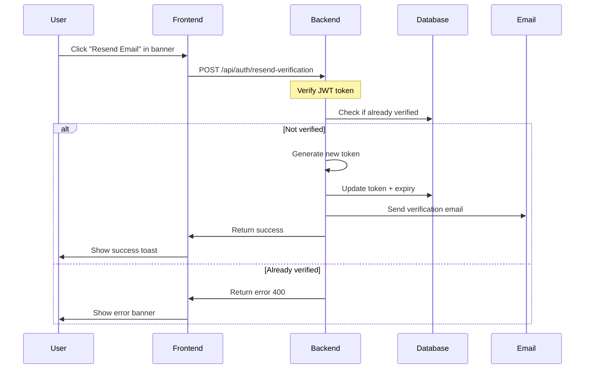

# Email Verification System

**Status:** ✅ Production Ready
**Last Updated:** October 30, 2025
**Related:** [PASSWORD-RESET-IMPLEMENTATION.md](PASSWORD-RESET-IMPLEMENTATION.md), [RESEND-SETUP.md](../deployment/RESEND-SETUP.md)

## Overview

The email verification system ensures users verify their email addresses before accessing premium features (subscriptions). It uses a token-based flow with 24-hour expiry and integrates with the Resend email service.

**Key Features:**
- ✅ Automatic verification email on signup
- ✅ Manual resend functionality
- ✅ 24-hour token expiry with automatic cleanup
- ✅ Selective enforcement (subscriptions only, core features unrestricted)
- ✅ User-friendly UI with banner notifications
- ✅ Comprehensive test coverage (158+ tests)

## Architecture

### Security Model

- **Token Generation:** 32-byte cryptographic random token (64-character hex)
- **Token Storage:** Plain text in database (single-use, short-lived)
- **Token Expiry:** 24 hours from creation
- **Verification URL:** `https://app.com/verify-email?token=<token>`

### Database Schema

```sql
-- users table columns
email_verified BOOLEAN DEFAULT FALSE,
verification_token VARCHAR(255),
verification_token_expires TIMESTAMP,

-- Indexes for performance
CREATE INDEX idx_users_verification_token ON users(verification_token);
```

**Migration:** [008-add-name-and-origin-tracking.sql](../../server/src/db/migrations/008-add-name-and-origin-tracking.sql)

## Implementation

### Backend Components

#### 1. User Model Methods

**Location:** [server/src/models/User.js](../../server/src/models/User.js:344-403)

```javascript
// Generate verification token (24-hour expiry)
static async createVerificationToken(id)

// Find user by valid, non-expired token
static async findByVerificationToken(token)

// Mark email as verified, clear token
static async markEmailAsVerified(id)
```

**Implementation Details:**
- Uses `crypto.randomBytes(32).toString('hex')` for secure token generation
- Database query filters expired tokens: `WHERE verification_token_expires > NOW()`
- Token and expiry cleared on successful verification

#### 2. Authentication Routes

**Location:** [server/src/routes/auth.js](../../server/src/routes/auth.js)

##### POST /api/auth/verify-email
Verifies email using token from email link.

**Request:**
```json
{
  "token": "64-character-hex-token"
}
```

**Response (Success - 200):**
```json
{
  "success": true,
  "message": "Email verified successfully",
  "user": {
    "id": 1,
    "email": "user@example.com",
    "first_name": "John",
    "last_name": "Doe",
    "email_verified": true
  }
}
```

**Response (Error - 400):**
```json
{
  "success": false,
  "error": "Invalid or expired verification token"
}
```

**Security:**
- No authentication required (token in URL is the security)
- Generic error messages (doesn't leak user existence)
- Sanitizes user data in response

##### POST /api/auth/resend-verification
Resends verification email to authenticated user.

**Headers:**
```
Authorization: Bearer <jwt-token>
```

**Response (Success - 200):**
```json
{
  "success": true,
  "message": "Verification email sent"
}
```

**Response (Error - 400):**
```json
{
  "success": false,
  "error": "Email already verified"
}
```

**Security:**
- Requires authentication (`requireAuth` middleware)
- Only works for unverified users
- Rate limited by email service

#### 3. Middleware

**Location:** [server/src/middleware/auth.js](../../server/src/middleware/auth.js:218-249)

```javascript
export const requireVerifiedEmail = async (req, res, next) => {
  // Check authentication
  // Load fresh user data
  // Verify email_verified === true
  // Return 403 if not verified
}
```

**Applied to:**
- `POST /api/payments/create-checkout-session` (subscription checkout)
- `POST /api/payments/create-portal-session` (customer portal)

#### 4. Email Service Integration

**Location:** [server/src/services/emailService.js](../../server/src/services/emailService.js)

```javascript
export async function sendVerificationEmail({ to, verificationToken }) {
  const verificationUrl = `${process.env.CLIENT_URL}/verify-email?token=${verificationToken}`;

  await resend.emails.send({
    from: 'CodeScribe AI <noreply@codescribeai.com>',
    to,
    subject: 'Verify Your Email - CodeScribe AI',
    html: emailTemplate // Custom HTML template
  });
}
```

**Called:**
- After user signup (automatic)
- When user clicks "Resend Email" (manual)

### Frontend Components

#### 1. VerifyEmail Page Component

**Location:** [client/src/components/VerifyEmail.jsx](../../client/src/components/VerifyEmail.jsx)

**Route:** `/verify-email?token=<token>`

**States:**
- **Verifying:** Shows loading spinner, calls API
- **Success:** Shows checkmark, auto-redirects to home after 3 seconds
- **Error:** Shows error message with "Return to Home" button

**Accessibility:**
- ✅ `role="status"` on loading spinner
- ✅ `aria-label` on all icons
- ✅ Semantic heading structure

**User Flow:**
1. User clicks link in email
2. Page shows loading spinner
3. API call to `/api/auth/verify-email`
4. Success → Auto-redirect after 3 seconds
5. Error → Show error with manual navigation option

#### 2. UnverifiedEmailBanner Component

**Location:** [client/src/components/UnverifiedEmailBanner.jsx](../../client/src/components/UnverifiedEmailBanner.jsx)

**Displays When:**
- User is authenticated
- `user.email_verified === false`
- User hasn't dismissed banner

**Features:**
- Yellow warning banner at top of page
- "Resend Email" button with loading state
- Dismiss button (X) to hide banner
- Toast notifications on success/error

**Accessibility:**
- ✅ `role="alert"` with `aria-live="polite"`
- ✅ `aria-label="Warning"` on icon
- ✅ `aria-label="Dismiss"` on close button

**Integration:**
- Placed in [App.jsx](../../client/src/App.jsx:495) after Header, before main content
- Uses `useAuth()` hook to get current user

#### 3. Custom Toast System

**Uses:** [client/src/utils/toast.jsx](../../client/src/utils/toast.jsx)

```javascript
import { toastSuccess, toastError } from '../utils/toast';

toastSuccess('Verification email sent! Please check your inbox.');
toastError('Failed to send verification email');
```

**Why Custom System:**
- Consistent styling across application
- WCAG 2.1 AA compliant
- Enterprise-grade accessibility features
- Automatic ARIA announcements

## User Flows

### 1. Signup Flow (Automatic)



### 2. Email Verification Flow



### 3. Manual Resend Flow



## Enforcement Strategy

### Generous Freemium Model

**✅ No Verification Required:**
- Code documentation generation
- File uploads
- Code analysis
- All free tier features

**❌ Verification Required:**
- Creating paid subscriptions (`/api/payments/create-checkout-session`)
- Managing subscriptions (`/api/payments/create-portal-session`)
- Future team/enterprise features (infrastructure ready)

**Philosophy:** Don't block core functionality, only premium features requiring payment processing.

## Testing

### Test Coverage: 158+ Tests

#### Backend Tests (92 tests)

**User Model:** [server/src/models/__tests__/User.test.js](../../server/src/models/__tests__/User.test.js:706-985)
- 18 email verification tests
- 100% pass rate
- Tests token generation, finding, verification, expiry

**Auth Routes:** [server/src/routes/__tests__/email-verification.test.js](../../server/src/routes/__tests__/email-verification.test.js)
- 30 route integration tests
- Tests both endpoints, security, edge cases

**Categories:**
- Token generation & validation
- Database operations
- Security (no user existence leaks)
- Error handling
- Edge cases (null values, special chars)

#### Frontend Tests (66 tests)

**VerifyEmail Component:** [client/src/components/__tests__/VerifyEmail.test.jsx](../../client/src/components/__tests__/VerifyEmail.test.jsx)
- 27 tests, 100% pass rate
- Tests all 3 states, API integration, accessibility, redirect

**UnverifiedEmailBanner Component:** [client/src/components/__tests__/UnverifiedEmailBanner.test.jsx](../../client/src/components/__tests__/UnverifiedEmailBanner.test.jsx)
- 39 tests, 100% pass rate
- Tests visibility, resend, dismiss, toast notifications, accessibility

**Run Tests:**
```bash
# Backend
cd server
npm test -- src/models/__tests__/User.test.js
npm test -- src/routes/__tests__/email-verification.test.js

# Frontend
cd client
npm test -- --run src/components/__tests__/VerifyEmail.test.jsx
npm test -- --run src/components/__tests__/UnverifiedEmailBanner.test.jsx
```

## Configuration

### Environment Variables

**Backend (.env):**
```bash
# Email service
RESEND_API_KEY=re_xxx

# Frontend URL for verification links
CLIENT_URL=https://codescribeai.com
```

**Frontend (.env):**
```bash
# API URL for verification endpoint
VITE_API_URL=https://api.codescribeai.com
```

### Email Template Customization

**Location:** [server/src/services/emailService.js](../../server/src/services/emailService.js)

**Customize:**
- Subject line
- HTML template
- Sender name/email
- Brand colors

## Security Considerations

### Token Security

✅ **Good Practices:**
- Cryptographically random (32 bytes)
- Short-lived (24 hours)
- Single-use (cleared on verification)
- No sensitive data in token itself

❌ **Why Not Hash Token:**
- Not needed (short-lived, single-use)
- Similar to password reset tokens
- Token in email = already compromised if email hacked

### Error Messages

✅ **Generic Messages:**
- "Invalid or expired verification token" (doesn't reveal if user exists)
- "Email already verified" (only shown to authenticated users)

❌ **Never Expose:**
- User existence from token lookup
- Email addresses in error messages
- Database errors to client

### Rate Limiting

- Email service naturally rate limits (Resend: 100/hour on free tier)
- Frontend prevents multiple simultaneous requests (button disabled state)
- Backend can add rate limiting middleware if needed

## Troubleshooting

### Token Expired

**Symptom:** User clicks link, sees "Invalid or expired verification token"

**Solution:**
1. User clicks "Resend Email" in banner
2. New token generated
3. Check inbox for new email

**Prevention:**
- Email reminds users to verify within 24 hours
- Banner appears immediately on login

### Email Not Received

**Checks:**
1. Spam folder
2. Email address correct in account
3. Resend email service status
4. Backend logs for email send errors

**Debug:**
```bash
# Check backend logs
grep "Verification email sent" server-logs.txt

# Check Resend dashboard
# https://resend.com/emails
```

### Banner Not Showing

**Checks:**
1. User is authenticated (`user` in AuthContext)
2. `user.email_verified === false`
3. Banner not dismissed in session
4. Component imported in App.jsx

**Debug:**
```javascript
// Add to App.jsx
console.log('User:', user);
console.log('Email verified:', user?.email_verified);
```

### Verification Succeeds But Still Shows Banner

**Cause:** Frontend user state not refreshed

**Solution:**
- User should log out and back in
- Or refresh token to get updated user data
- Consider adding auto-refresh on verification success

## Future Enhancements

### Planned Improvements

1. **Auto-refresh User State**
   - Refresh JWT on verification success
   - Update AuthContext without requiring logout

2. **Verification Reminders**
   - Send reminder email after 12 hours
   - Show in-app notification after X days

3. **Admin Dashboard**
   - View unverified users
   - Manually verify accounts
   - Resend bulk verification emails

4. **Extended Token Expiry**
   - Make expiry configurable
   - Option for 7-day tokens for low-risk features

5. **Magic Links**
   - Combine verification + auto-login
   - One-click email verification

## Related Documentation

- [Password Reset Implementation](PASSWORD-RESET-IMPLEMENTATION.md) - Similar token-based flow
- [Resend Email Setup](../deployment/RESEND-SETUP.md) - Email service configuration
- [Database Schema](../database/DB-NAMING-STANDARDS.md) - Database conventions
- [Authentication API Testing](../api/AUTH-API-TESTING.md) - API testing guide
- [Subscription Management](../architecture/SUBSCRIPTION-MANAGEMENT.md) - Where verification enforced

## Changelog

### v2.4.0 - October 30, 2025
- ✅ Complete email verification system implemented
- ✅ 158+ tests with 100% pass rate
- ✅ WCAG 2.1 AA accessibility compliance
- ✅ Custom toast system integration
- ✅ Comprehensive documentation

---

**Questions?** Check [AUTH-ANALYSIS.md](../planning/AUTH-ANALYSIS.md) or [PASSWORD-RESET-IMPLEMENTATION.md](PASSWORD-RESET-IMPLEMENTATION.md) for related authentication patterns.
