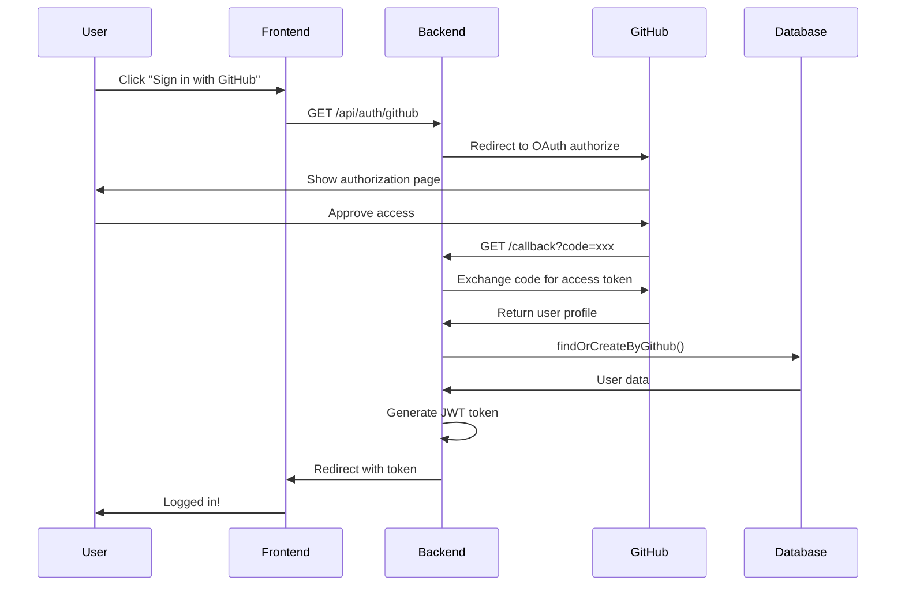

# GitHub OAuth Setup Guide

Complete guide for setting up GitHub OAuth authentication in CodeScribe AI.

## 📋 Overview

GitHub OAuth allows users to:
- Sign up using their GitHub account
- Link GitHub to existing email/password accounts
- Sign in with one click after linking
- Maintain both authentication methods

**Key Features:**
- ✅ Automatic account creation
- ✅ Account linking by email
- ✅ Secure token-based authentication
- ✅ Session management
- ✅ Error handling

---

## 🚀 Quick Setup (5 Steps)

### 1. Create GitHub OAuth App

1. Go to [GitHub Developer Settings](https://github.com/settings/developers)
2. Click **"New OAuth App"**
3. Fill in the details:

**For Development:**
```
Application name: CodeScribe AI (Dev)
Homepage URL: http://localhost:5173
Authorization callback URL: http://localhost:3000/api/auth/github/callback
```

**For Production:**
```
Application name: CodeScribe AI
Homepage URL: https://codescribeai.com
Authorization callback URL: https://api.codescribeai.com/api/auth/github/callback
```

4. Click **"Register application"**
5. Copy your **Client ID** and **Client Secret**

### 2. Configure Environment Variables

Add to [server/.env](../../server/.env):

```bash
# GitHub OAuth Configuration
GITHUB_CLIENT_ID=your_client_id_here
GITHUB_CLIENT_SECRET=your_client_secret_here
GITHUB_CALLBACK_URL=http://localhost:3000/api/auth/github/callback

# Client URL (for redirects after OAuth)
CLIENT_URL=http://localhost:5173
```

**⚠️ Security Notes:**
- Never commit `.env` to Git
- Use different apps for dev/staging/production
- Rotate secrets regularly
- Keep Client Secret confidential

### 3. Verify Passport Configuration

The GitHub strategy is already configured in [server/src/config/passport.js](../../server/src/config/passport.js):

```javascript
if (process.env.GITHUB_CLIENT_ID && process.env.GITHUB_CLIENT_SECRET) {
  passport.use(
    new GitHubStrategy(
      {
        clientID: process.env.GITHUB_CLIENT_ID,
        clientSecret: process.env.GITHUB_CLIENT_SECRET,
        callbackURL: process.env.GITHUB_CALLBACK_URL,
      },
      async (accessToken, refreshToken, profile, done) => {
        // Handles user creation/linking
      }
    )
  );
}
```

### 4. Start the Server

```bash
cd server
npm run dev
```

You should see:
```
✓ Database connection established
✓ Database tables initialized
Server running on http://localhost:3000
```

**If GitHub OAuth NOT configured, you'll see:**
```
⚠️  GitHub OAuth not configured (missing GITHUB_CLIENT_ID or GITHUB_CLIENT_SECRET)
```

### 5. Test OAuth Flow

**Option A: Browser Test**
1. Navigate to `http://localhost:3000/api/auth/github`
2. Authorize the app on GitHub
3. You'll be redirected to `http://localhost:5173/auth/callback?token=...`

**Option B: curl Test**
```bash
# Step 1: Initiate OAuth (will redirect to GitHub)
curl -I http://localhost:3000/api/auth/github

# Step 2: After authorizing on GitHub, you'll get redirected to callback
# The frontend should handle the token from the URL
```

---

## 🔄 OAuth Flow Diagram



---

## 💻 Implementation Details

### Routes

#### GET /api/auth/github
**Purpose:** Initiates OAuth flow

**Request:**
```bash
GET http://localhost:3000/api/auth/github
```

**Response:**
- **302 Redirect** to GitHub OAuth authorization page
- **500 Error** if GitHub OAuth not configured

**Frontend Usage:**
```javascript
// Redirect user to start OAuth
window.location.href = 'http://localhost:3000/api/auth/github';
```

---

#### GET /api/auth/github/callback
**Purpose:** Handles OAuth callback from GitHub

**Request:**
```
GET /api/auth/github/callback?code=GITHUB_AUTH_CODE
```

**Success Response:**
```
302 Redirect to: http://localhost:5173/auth/callback?token=JWT_TOKEN_HERE
```

**Error Responses:**
```
302 Redirect to: /login?error=github_auth_failed      (OAuth failed)
302 Redirect to: /login?error=no_user_data            (No user data)
302 Redirect to: /login?error=callback_failed         (Server error)
```

**Frontend Handler:**
```javascript
// In your /auth/callback route
const urlParams = new URLSearchParams(window.location.search);
const token = urlParams.get('token');

if (token) {
  // Store token
  localStorage.setItem('auth_token', token);

  // Redirect to dashboard
  window.location.href = '/dashboard';
} else {
  const error = urlParams.get('error');
  console.error('OAuth error:', error);
  window.location.href = '/login';
}
```

---

### User Model Integration

The [User.findOrCreateByGithub()](../../server/src/models/User.js) method handles:

#### Scenario 1: New GitHub User
```javascript
// User signs up with GitHub for first time
await User.findOrCreateByGithub({
  githubId: '12345',
  email: 'user@github.com'
});

// Creates new user:
// {
//   id: 1,
//   email: 'user@github.com',
//   github_id: '12345',
//   password_hash: null,
//   tier: 'free'
// }
```

#### Scenario 2: Existing Email/Password User
```javascript
// User already signed up with email/password
// Now links GitHub account
await User.findOrCreateByGithub({
  githubId: '67890',
  email: 'existing@example.com'
});

// Updates existing user:
// {
//   id: 2,
//   email: 'existing@example.com',
//   github_id: '67890',           // ← Added
//   password_hash: '$2b$10$...',  // ← Preserved
//   tier: 'pro'
// }
```

#### Scenario 3: Returning GitHub User
```javascript
// User logs in again with GitHub
await User.findOrCreateByGithub({
  githubId: '12345',
  email: 'user@github.com'
});

// Returns existing user by github_id
```

#### Scenario 4: No Email from GitHub
```javascript
// GitHub profile doesn't include email
await User.findOrCreateByGithub({
  githubId: '99999',
  email: 'username@github.user'  // ← Fallback format
});
```

---

## 🔒 Security Considerations

### 1. Environment Variables
```bash
# ✅ GOOD: Use strong, unique secrets
GITHUB_CLIENT_SECRET=ghp_1234567890abcdefGHIJKLMN

# ❌ BAD: Don't use weak or default values
GITHUB_CLIENT_SECRET=secret123
```

### 2. Callback URL Validation
- Callback URL in GitHub app settings **must match** `GITHUB_CALLBACK_URL`
- Use HTTPS in production
- Verify redirect URL is your domain

### 3. State Parameter (Future Enhancement)
Consider adding CSRF protection:
```javascript
// Generate random state
const state = crypto.randomBytes(16).toString('hex');
req.session.oauthState = state;

// Include in OAuth URL
const authUrl = `https://github.com/login/oauth/authorize?client_id=${clientId}&state=${state}`;

// Verify in callback
if (req.query.state !== req.session.oauthState) {
  return res.status(403).send('Invalid state parameter');
}
```

### 4. Token Security
- JWT tokens are valid for 7 days
- Store tokens securely (httpOnly cookies or secure storage)
- Never log tokens
- Implement token refresh if needed

### 5. Scope Permissions
Current scopes: `user:email`

**Minimal required permissions:**
- `user:email` - Read user email addresses

**Do NOT request unnecessary scopes like:**
- `repo` - Full repository access
- `write:org` - Write organization data
- `delete:repo` - Delete repositories

---

## 🧪 Testing

### Run GitHub OAuth Tests

```bash
cd server

# Run all 24 GitHub OAuth tests
npm test -- tests/integration/github-oauth.test.js

# Watch mode
npm test -- tests/integration/github-oauth.test.js --watch

# With coverage
npm test -- tests/integration/github-oauth.test.js --coverage
```

### Test Coverage
**24 Tests:**
- ✅ OAuth initiation (2 tests)
- ✅ OAuth callback success (4 tests)
- ✅ Account linking (3 tests)
- ✅ Security (4 tests)
- ✅ Configuration (4 tests)
- ✅ Error handling (7 tests)

### Manual Testing Checklist

- [ ] New user signs up with GitHub
- [ ] Existing email user links GitHub account
- [ ] User logs in with GitHub after linking
- [ ] User without email in GitHub profile
- [ ] OAuth error handling (deny access)
- [ ] Database connection error
- [ ] Invalid credentials
- [ ] Malicious redirect attempts

---

## 🐛 Troubleshooting

### Issue: "GitHub OAuth not configured" warning

**Solution:**
```bash
# Verify environment variables are set
echo $GITHUB_CLIENT_ID
echo $GITHUB_CLIENT_SECRET

# If empty, add to .env file
cat server/.env | grep GITHUB
```

---

### Issue: "Callback URL mismatch" error from GitHub

**Problem:** GitHub rejects OAuth callback

**Solution:**
1. Go to GitHub OAuth App settings
2. Verify **Authorization callback URL** matches exactly:
   ```
   http://localhost:3000/api/auth/github/callback
   ```
3. No trailing slash
4. Correct protocol (http vs https)
5. Correct port

---

### Issue: "403 Forbidden" on callback

**Problem:** CORS or session issue

**Solution:**
```javascript
// Verify CORS is configured for credentials
corsOptions: {
  origin: process.env.CLIENT_URL,
  credentials: true  // ← Required for sessions
}
```

---

### Issue: Redirect loops

**Problem:** Frontend keeps redirecting to OAuth

**Solution:**
```javascript
// Check if token is being stored correctly
const token = urlParams.get('token');
if (token) {
  localStorage.setItem('auth_token', token);

  // Clear URL parameters to prevent loop
  window.history.replaceState({}, document.title, "/dashboard");
}
```

---

### Issue: "No user data" error

**Problem:** User creation failed

**Solution:**
1. Check database connection
2. Verify `users` table exists
3. Check logs for database errors
4. Ensure PostgreSQL is running

```bash
# Test database connection
npm run dev  # Should show "✓ Database connection established"
```

---

### Issue: Works in development but fails in production

**Checklist:**
- [ ] Update GitHub OAuth app callback URL to production domain
- [ ] Set production environment variables
- [ ] Use HTTPS callback URL
- [ ] Update `CLIENT_URL` to production frontend URL
- [ ] Verify CORS allows production domain

---

## 📊 Monitoring & Analytics

### Track OAuth Events

```javascript
// In passport callback
async (accessToken, refreshToken, profile, done) => {
  try {
    const user = await User.findOrCreateByGithub({
      githubId: profile.id,
      email: profile.emails?.[0]?.value
    });

    // Log analytics event
    analytics.track('oauth_login', {
      provider: 'github',
      userId: user.id,
      isNewUser: user.created_at > Date.now() - 60000
    });

    return done(null, user);
  } catch (error) {
    // Log error
    logger.error('GitHub OAuth failed', {
      error: error.message,
      githubId: profile.id
    });
    return done(error);
  }
}
```

### Metrics to Track

- OAuth initiation rate
- OAuth success rate
- Account linking rate
- Average OAuth completion time
- Error types and frequency
- New vs returning users

---

## 🔄 Account Unlinking (Future Feature)

To allow users to unlink GitHub:

```javascript
// POST /api/auth/unlink/github
router.post('/unlink/github', requireAuth, async (req, res) => {
  try {
    const user = await User.findById(req.user.id);

    // Ensure user has password before unlinking
    if (!user.password_hash) {
      return res.status(400).json({
        success: false,
        error: 'Cannot unlink GitHub. Please set a password first.'
      });
    }

    // Remove GitHub ID
    await sql`
      UPDATE users
      SET github_id = NULL, updated_at = NOW()
      WHERE id = ${user.id}
    `;

    res.json({
      success: true,
      message: 'GitHub account unlinked successfully'
    });
  } catch (error) {
    res.status(500).json({
      success: false,
      error: 'Failed to unlink GitHub account'
    });
  }
});
```

---

## 📚 Additional Resources

- [GitHub OAuth Documentation](https://docs.github.com/en/developers/apps/building-oauth-apps/authorizing-oauth-apps)
- [Passport.js GitHub Strategy](http://www.passportjs.org/packages/passport-github2/)
- [OAuth 2.0 Security Best Practices](https://tools.ietf.org/html/draft-ietf-oauth-security-topics)

---

## ✅ Production Checklist

Before deploying to production:

### GitHub OAuth App
- [ ] Create separate production OAuth app
- [ ] Use production callback URL with HTTPS
- [ ] Set production homepage URL
- [ ] Verify app permissions (minimal scopes)

### Environment Variables
- [ ] `GITHUB_CLIENT_ID` (production app)
- [ ] `GITHUB_CLIENT_SECRET` (production app)
- [ ] `GITHUB_CALLBACK_URL` (HTTPS, production domain)
- [ ] `CLIENT_URL` (production frontend URL)
- [ ] `JWT_SECRET` (strong, unique secret)
- [ ] `SESSION_SECRET` (strong, unique secret)

### Security
- [ ] HTTPS enabled
- [ ] CORS configured for production domain
- [ ] Secure cookies enabled (`secure: true`)
- [ ] Rate limiting on auth endpoints
- [ ] Token expiration set appropriately
- [ ] Secrets stored in secure vault (not plain text)

### Testing
- [ ] All 24 GitHub OAuth tests passing
- [ ] Manual testing completed
- [ ] Error handling verified
- [ ] Account linking tested
- [ ] Session management tested

### Monitoring
- [ ] OAuth success/failure tracking
- [ ] Error logging configured
- [ ] Analytics events set up
- [ ] Alert for high failure rates

---

**Last Updated:** October 23, 2025
**Status:** ✅ Fully Implemented & Tested
**Tests:** 24 passing
**Related Files:**
- Implementation: [server/src/routes/auth.js](../../server/src/routes/auth.js)
- Strategy: [server/src/config/passport.js](../../server/src/config/passport.js)
- User Model: [server/src/models/User.js](../../server/src/models/User.js)
- Tests: [server/tests/integration/github-oauth.test.js](../../server/tests/integration/github-oauth.test.js)
