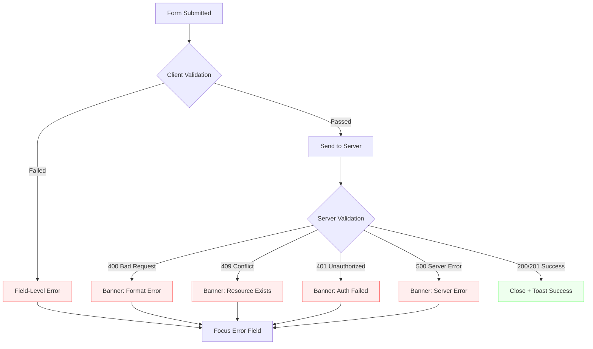
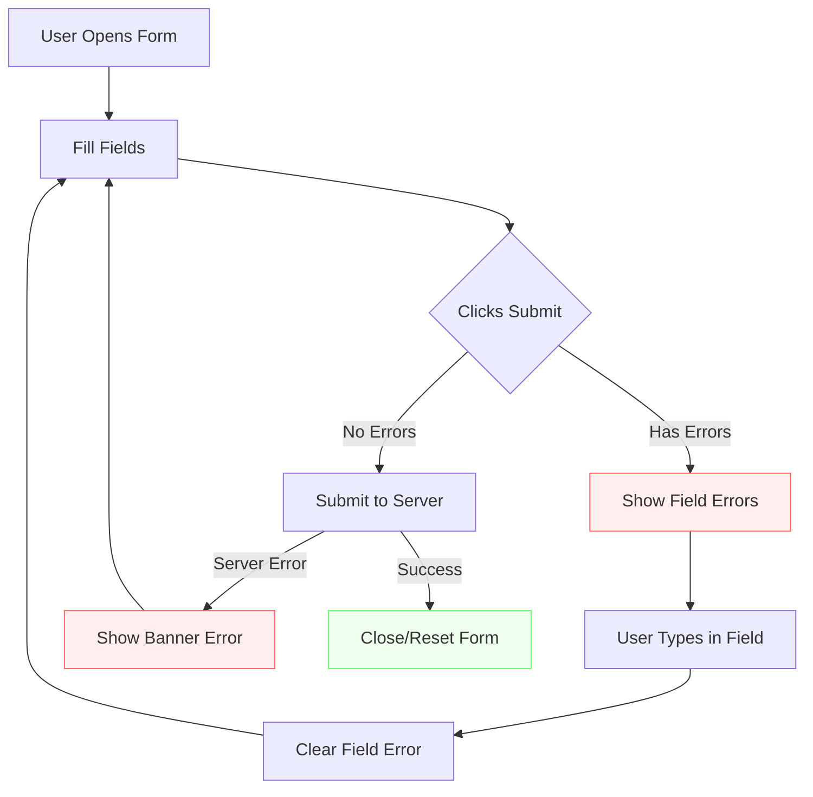

# Form Validation Guide

**Project:** CodeScribe AI
**Purpose:** Standardized form validation patterns for consistent UX across the application
**Status:** Active - Follow for all new forms
**Last Updated:** October 25, 2025

---

## 🎯 What's New in v1.3

**Complete Client & Server Validation Implementation:**
- ✅ **Server-Side Validation** - Comprehensive middleware integration with HTTP status code handling
- ✅ **Focus Management** - Reliable `flushSync` implementation for both client and server errors
- ✅ **Error Flow Diagrams** - Visual sequence and decision tree diagrams for validation flows
- ✅ **Real Implementation Examples** - All 3 authentication forms fully documented (Login, Signup, Reset Password)
- ✅ **Enhanced Checklist** - Organized by client-side, focus management, server integration, and testing

**Key Implementation Highlights:**
- Progressive validation (validate on submit, clear on input)
- Automatic focus management using `flushSync` from `react-dom`
- Consistent server error handling (400, 401, 409, 500 status codes)
- WCAG 2.1 AA compliant with full screen reader support
- Field-level errors for client validation, banner errors for server responses

---

## 📋 Table of Contents

1. [Validation Principles](#validation-principles)
2. [When to Validate](#when-to-validate)
3. [Error Display Patterns](#error-display-patterns)
4. [Implementation Examples](#implementation-examples)
5. [Accessibility Requirements](#accessibility-requirements)
6. [Best Practices](#best-practices)
7. [Anti-Patterns to Avoid](#anti-patterns-to-avoid)
8. [Server-Side Validation](#server-side-validation)
9. [Related Documentation](#related-documentation)
10. [Validation Flow Diagram](#validation-flow-diagram)
11. [Quick Reference Checklist](#quick-reference-checklist)

---

## 🎯 Validation Principles

### Core Philosophy: **Progressive Validation**

Our validation approach prioritizes user experience by:
- **Validating on submit** - Users aren't interrupted while typing
- **Clearing on input** - Immediate feedback when fixing errors
- **Field-level errors** - Precise, actionable feedback
- **Persistent banners** - Server/auth errors require manual dismissal

### Industry Alignment

This approach follows patterns used by:
- Google (validate on submit, clear on input)
- GitHub (field-level errors, banner for auth failures)
- Stripe (progressive validation, inline help text)
- Linear (minimal interruption, clear recovery)

---

## ⏰ When to Validate

### ✅ DO Validate

| Trigger | Use Case | Example |
|---------|----------|---------|
| **On Submit** | All form validations | User clicks "Sign In" button |
| **On Input (Clearing Only)** | Remove errors as user types | Email error clears when user starts typing |
| **On Server Response** | Backend validation failures | "Email already exists" |

### ❌ DON'T Validate

| Anti-Pattern | Why It's Bad | Better Alternative |
|-------------|--------------|-------------------|
| On blur (leaving field) | Interrupts user flow, feels aggressive | Wait for submit |
| Every keystroke | Overwhelming, poor UX | Validate on submit only |
| After successful submit | Unnecessary interruption | Clear form or close modal |

---

## 🎨 Error Display Patterns

### 1. Field-Level Errors (Client-Side Validation)

**When to Use:**
- Required field validation
- Format validation (email, password length)
- Input constraints (min/max values)

**Visual Design:**
```jsx
{/* Error state with visual indicators */}
<input
  className={`... ${
    emailError ? 'border-red-300 bg-red-50' : 'border-slate-300'
  }`}
  aria-invalid={!!emailError}
  aria-describedby={emailError ? 'email-error' : undefined}
/>

{/* Error message below field */}
{emailError && (
  <p id="email-error" className="mt-1.5 text-sm text-red-600" role="alert">
    {emailError}
  </p>
)}
```

**Styling:**
- Border: `border-red-300` (lighter red, not harsh)
- Background: `bg-red-50` (subtle highlight)
- Text: `text-red-600` (readable, WCAG AA compliant)
- Spacing: `mt-1.5` (8px gap for readability)

### 2. Form-Level Banners (Server/Auth Errors)

**When to Use:**
- Authentication failures ("Invalid credentials")
- Network errors ("Unable to connect")
- Rate limiting errors
- Server validation errors

**Visual Design:**
```jsx
{errorMessage && (
  <div
    className="flex items-start gap-3 p-4 bg-red-50 border border-red-200 rounded-lg"
    role="alert"
  >
    <AlertCircle className="w-5 h-5 text-red-600 flex-shrink-0 mt-0.5" aria-hidden="true" />
    <p className="text-sm text-red-800">{errorMessage}</p>
  </div>
)}
```

**Placement:**
- Above form inputs
- Below modal/page header
- Full-width for visibility

---

## 💻 Implementation Examples

### Complete Form with Progressive Validation

```jsx
export function LoginModal({ isOpen, onClose }) {
  // State management
  const [email, setEmail] = useState('');
  const [password, setPassword] = useState('');
  const [emailError, setEmailError] = useState('');
  const [passwordError, setPasswordError] = useState('');
  const [serverError, setServerError] = useState('');
  const [isLoading, setIsLoading] = useState(false);

  // Clear all errors when modal closes
  useEffect(() => {
    if (!isOpen) {
      setEmail('');
      setPassword('');
      setEmailError('');
      setPasswordError('');
      setServerError('');
    }
  }, [isOpen]);

  const handleSubmit = async (e) => {
    e.preventDefault();

    // 1. Clear previous errors
    setEmailError('');
    setPasswordError('');
    setServerError('');

    let hasErrors = false;

    // 2. Validate all fields
    if (!email.trim()) {
      setEmailError('Email is required');
      hasErrors = true;
    } else if (!/^[^\s@]+@[^\s@]+\.[^\s@]+$/.test(email)) {
      setEmailError('Please enter a valid email address');
      hasErrors = true;
    }

    if (!password) {
      setPasswordError('Password is required');
      hasErrors = true;
    }

    // 3. Stop if validation errors
    if (hasErrors) return;

    // 4. Submit to server
    try {
      setIsLoading(true);
      const result = await loginUser(email, password);

      if (result.success) {
        onClose();
      } else {
        // Server errors go in banner
        setServerError(result.error);
      }
    } catch (err) {
      setServerError('An unexpected error occurred');
    } finally {
      setIsLoading(false);
    }
  };

  return (
    <form onSubmit={handleSubmit} noValidate>
      {/* Server Error Banner */}
      {serverError && (
        <div className="mb-4 flex items-start gap-3 p-4 bg-red-50 border border-red-200 rounded-lg" role="alert">
          <AlertCircle className="w-5 h-5 text-red-600 flex-shrink-0 mt-0.5" />
          <p className="text-sm text-red-800">{serverError}</p>
        </div>
      )}

      {/* Email Field */}
      <div>
        <label htmlFor="email" className="block text-sm font-medium text-slate-700 mb-2">
          Email Address
        </label>
        <input
          id="email"
          type="email"
          value={email}
          onChange={(e) => {
            setEmail(e.target.value);
            // Clear error on input (progressive validation)
            if (emailError) setEmailError('');
          }}
          className={`block w-full px-3 py-2.5 border rounded-lg ${
            emailError ? 'border-red-300 bg-red-50' : 'border-slate-300'
          }`}
          disabled={isLoading}
          aria-invalid={!!emailError}
          aria-describedby={emailError ? 'email-error' : undefined}
        />
        {emailError && (
          <p id="email-error" className="mt-1.5 text-sm text-red-600" role="alert">
            {emailError}
          </p>
        )}
      </div>

      {/* Password Field */}
      <div>
        <label htmlFor="password" className="block text-sm font-medium text-slate-700 mb-2">
          Password
        </label>
        <input
          id="password"
          type="password"
          value={password}
          onChange={(e) => {
            setPassword(e.target.value);
            // Clear error on input (progressive validation)
            if (passwordError) setPasswordError('');
          }}
          className={`block w-full px-3 py-2.5 border rounded-lg ${
            passwordError ? 'border-red-300 bg-red-50' : 'border-slate-300'
          }`}
          disabled={isLoading}
          aria-invalid={!!passwordError}
          aria-describedby={passwordError ? 'password-error' : undefined}
        />
        {passwordError && (
          <p id="password-error" className="mt-1.5 text-sm text-red-600" role="alert">
            {passwordError}
          </p>
        )}
      </div>

      {/* Submit Button */}
      <button type="submit" disabled={isLoading}>
        {isLoading ? 'Signing in...' : 'Sign In'}
      </button>
    </form>
  );
}
```

---

## ♿ Accessibility Requirements

### ARIA Attributes

All form validation **must** include proper ARIA attributes:

```jsx
<input
  aria-invalid={!!fieldError}              // Screen readers announce invalid state
  aria-describedby={fieldError ? 'field-error' : undefined}  // Links to error message
/>

<p id="field-error" role="alert">         // role="alert" for live announcements
  {fieldError}
</p>
```

### Focus Management

**Automatic focus on first error field:**

When validation errors occur, focus should automatically move to the first field with an error. This improves both keyboard navigation and screen reader accessibility.

**⚠️ IMPORTANT: Use `flushSync` for synchronous DOM updates**

React batches state updates for performance, which can cause focus timing issues. Use `flushSync` from `react-dom` to ensure the DOM is updated before the focus effect runs.

```jsx
import { flushSync } from 'react-dom';

// State and refs setup
const [emailError, setEmailError] = useState('');
const [passwordError, setPasswordError] = useState('');
const [localError, setLocalError] = useState(''); // Server errors
const [focusTrigger, setFocusTrigger] = useState(0); // Increment to trigger focus
const lastProcessedTrigger = useRef(0); // Track last trigger we processed

const emailInputRef = useRef(null);
const passwordInputRef = useRef(null);

// Submit handler with flushSync
const handleSubmit = async (e) => {
  e.preventDefault();

  // Clear previous errors
  setLocalError('');
  setEmailError('');
  setPasswordError('');

  // Perform validation
  let hasErrors = false;
  let emailValidationError = '';
  let passwordValidationError = '';

  if (!email.trim()) emailValidationError = 'Email is required';
  if (!password) passwordValidationError = 'Password is required';

  // Use flushSync to apply errors synchronously AND increment trigger
  if (hasErrors) {
    flushSync(() => {
      if (emailValidationError) setEmailError(emailValidationError);
      if (passwordValidationError) setPasswordError(passwordValidationError);
      setFocusTrigger(prev => prev + 1); // ⚠️ CRITICAL: Always increment!
    });
    return;
  }

  // For server errors, also use flushSync with trigger increment
  try {
    const result = await submitForm();
    if (!result.success) {
      flushSync(() => {
        setLocalError(result.error);
        setFocusTrigger(prev => prev + 1); // ⚠️ CRITICAL: Increment on server errors too!
      });
    }
  } catch (err) {
    flushSync(() => {
      setLocalError('An unexpected error occurred');
      setFocusTrigger(prev => prev + 1);
    });
  }
};

// Focus management effect - runs after flushSync ensures DOM is updated
useEffect(() => {
  // Only run if focusTrigger has CHANGED (new submission)
  // This prevents running when errors change due to typing
  if (focusTrigger === 0 || focusTrigger === lastProcessedTrigger.current) {
    return;
  }

  // Mark this trigger as processed
  lastProcessedTrigger.current = focusTrigger;

  // Skip if there are no errors
  const hasAnyError = emailError || passwordError || localError;
  if (!hasAnyError) return;

  // Move focus to first field with error
  if (emailError && emailInputRef.current) {
    emailInputRef.current.focus();
  } else if (passwordError && passwordInputRef.current) {
    passwordInputRef.current.focus();
  } else if (localError && emailInputRef.current) {
    // Server errors - focus email field
    emailInputRef.current.focus();
  }
}, [emailError, passwordError, localError, focusTrigger]);

// Add refs to inputs
<input ref={emailInputRef} ... />
<input ref={passwordInputRef} ... />
```

**Why `flushSync`?**

From the official React documentation ([react.dev/reference/react-dom/flushSync](https://react.dev/reference/react-dom/flushSync)):

> "flushSync lets you force React to flush any updates inside the provided callback synchronously."

**Without `flushSync`:**
- React schedules state updates but doesn't apply them until after your handler finishes
- The useEffect runs before the DOM has the error state
- Focus doesn't move to the error field reliably

**With `flushSync`:**
- State updates are applied immediately and synchronously
- The DOM is guaranteed to be updated before the focus effect runs
- Focus management works reliably every time

**References:**
- [React flushSync Documentation](https://react.dev/reference/react-dom/flushSync)
- [Mastering Focus Management with flushSync (Epic React)](https://www.epicreact.dev/mastering-focus-management-in-react-with-flush-sync-f5b38)
- [Manipulating the DOM with Refs](https://react.dev/learn/manipulating-the-dom-with-refs)

**Why this matters:**
- ✅ **Keyboard users** don't have to tab through the form to find errors
- ✅ **Screen reader users** are immediately directed to the problem
- ✅ **WCAG 2.1 AA** compliant (Success Criteria 3.3.1, 3.3.3)
- ✅ **Seamless UX** - focus moves exactly where user needs to go
- ✅ **Works for both client and server errors** - consistent behavior

**Priority order:**
1. **Field-level errors** (client-side validation) - Focus specific field
2. **Server errors** (authentication/network) - Focus first field (usually email)
3. If no errors, don't change focus
4. Works with progressive validation (error clears, focus stays)

**Server error examples:**
- "Invalid email or password" → Focus email field
- "Email already exists" → Focus email field
- "Unable to connect to server" → Focus email field (user can retry)
- Network errors → Focus email field

### Keyboard Navigation

- ✅ Error messages don't trap focus
- ✅ Form remains keyboard-navigable with errors
- ✅ Error state visible with focus rings
- ✅ **Focus automatically moves to first error field on validation failure**

### Screen Reader Testing

Test with:
- **VoiceOver** (macOS): Should announce "invalid" and read error message
- **NVDA** (Windows): Should announce error when field focused
- **JAWS** (Windows): Should link error message via aria-describedby

See [SCREEN-READER-TESTING-GUIDE.md](../testing/SCREEN-READER-TESTING-GUIDE.md) for procedures.

---

## ✅ Best Practices

### State Management

```jsx
// ✅ DO: Separate concerns
const [email, setEmail] = useState('');           // Field value
const [emailError, setEmailError] = useState(''); // Field error
const [serverError, setServerError] = useState(''); // Banner error

// ❌ DON'T: Mix concerns
const [error, setError] = useState(''); // Unclear where error displays
```

### Error Messages

```jsx
// ✅ DO: Specific, actionable
'Please enter a valid email address'
'Password must be at least 8 characters'

// ❌ DON'T: Vague or technical
'Invalid input'
'Validation failed: ERR_EMAIL_FORMAT'
```

### Clearing Behavior

```jsx
// ✅ DO: Clear on input
onChange={(e) => {
  setEmail(e.target.value);
  if (emailError) setEmailError('');
}}

// ❌ DON'T: Require resubmit to clear
onChange={(e) => setEmail(e.target.value)}
// Error persists until form resubmitted
```

### Form Reset

```jsx
// ✅ DO: Clear everything on close/success
useEffect(() => {
  if (!isOpen) {
    setEmail('');
    setPassword('');
    setEmailError('');
    setPasswordError('');
    setServerError('');
  }
}, [isOpen]);

// ❌ DON'T: Leave stale errors
// Errors persist when reopening modal
```

---

## 🚫 Anti-Patterns to Avoid

### 1. Validate on Blur

```jsx
// ❌ BAD: Interrupts user flow
<input onBlur={() => validateEmail(email)} />

// ✅ GOOD: Wait for submit
<form onSubmit={handleSubmit}>
```

### 2. Real-Time Keystroke Validation

```jsx
// ❌ BAD: Shows errors while typing
onChange={(e) => {
  setEmail(e.target.value);
  validateEmail(e.target.value); // Shows "Invalid email" on "j", "jo", etc.
}}

// ✅ GOOD: Only clear errors on typing
onChange={(e) => {
  setEmail(e.target.value);
  if (emailError) setEmailError(''); // Only removes errors
}}
```

### 3. Generic Error Messages

```jsx
// ❌ BAD: Not actionable
setError('Something went wrong')

// ✅ GOOD: Specific, helpful
setEmailError('Please enter a valid email address')
setServerError('Unable to connect to the server. Please check your internet connection.')
```

### 4. Dismissible Field Errors

```jsx
// ❌ BAD: Extra click required
{emailError && (
  <div>
    {emailError}
    <button onClick={() => setEmailError('')}>×</button>
  </div>
)}

// ✅ GOOD: Auto-clear on typing
{emailError && <p>{emailError}</p>}
// Clears when user types in field
```

### 5. Missing noValidate

```jsx
// ❌ BAD: Browser shows unstyled tooltips
<form onSubmit={handleSubmit}>

// ✅ GOOD: Disable browser validation
<form onSubmit={handleSubmit} noValidate>
```

---

---

## 🔄 Server-Side Validation

### Validation Middleware

Our backend uses a dedicated validation middleware ([auth.js:validateBody](../../server/src/middleware/auth.js)) that runs before route handlers:

```javascript
// Server-side validation configuration
validateBody({
  email: { required: true, type: 'email' },
  password: { required: true, type: 'password', minLength: 8 }
})
```

**Validation Features:**
- ✅ **Type validation** - Email format, password complexity
- ✅ **Required field checks** - Missing field detection
- ✅ **Length constraints** - Minimum/maximum length enforcement
- ✅ **Standardized errors** - Consistent error message format
- ✅ **HTTP status codes** - 400 for validation errors, 409 for conflicts

### Server Response Handling

**Success Response (200/201):**
```json
{
  "success": true,
  "message": "Login successful",
  "user": { "id": 123, "email": "user@example.com" },
  "token": "jwt_token_here"
}
```

**Validation Error (400):**
```json
{
  "success": false,
  "error": "Please enter a valid email address"
}
```

**Conflict Error (409):**
```json
{
  "success": false,
  "error": "User with this email already exists"
}
```

**Authentication Error (401):**
```json
{
  "success": false,
  "error": "Invalid email or password"
}
```

### Client-Server Validation Flow

```mermaid
sequenceDiagram
    participant U as User
    participant C as Client (React)
    participant S as Server (Express)
    participant DB as Database

    U->>C: Submits form
    C->>C: Client-side validation<br/>(required, format, length)

    alt Has client errors
        C->>C: flushSync() error state
        C->>C: Focus first error field
        C->>U: Show field-level errors
    else No client errors
        C->>S: POST /api/auth/login
        S->>S: Middleware validation<br/>(validateBody)

        alt Has validation errors
            S->>C: 400 + error message
            C->>C: flushSync() banner error
            C->>C: Focus first field
            C->>U: Show banner error
        else Valid input
            S->>DB: Check credentials

            alt Invalid credentials
                DB->>S: Not found/mismatch
                S->>C: 401 + error message
                C->>C: flushSync() banner error
                C->>C: Focus first field
                C->>U: Show banner error
            else Valid credentials
                DB->>S: User data
                S->>C: 200 + user + token
                C->>C: Clear form
                C->>U: Close modal + success toast
            end
        end
    end

    style C fill:#e0e7ff,stroke:#6366f1
    style S fill:#dbeafe,stroke:#3b82f6
```

### Error Type Decision Tree



### Implementation Pattern

```jsx
const handleSubmit = async (e) => {
  e.preventDefault();

  // 1. Clear all errors
  setLocalError('');
  setEmailError('');
  setPasswordError('');
  clearError();

  // 2. Client-side validation
  let hasErrors = false;
  let emailValidationError = '';
  let passwordValidationError = '';

  if (!email.trim()) {
    emailValidationError = 'Email is required';
    hasErrors = true;
  } else if (!/^[^\s@]+@[^\s@]+\.[^\s@]+$/.test(email)) {
    emailValidationError = 'Please enter a valid email address';
    hasErrors = true;
  }

  if (!password) {
    passwordValidationError = 'Password is required';
    hasErrors = true;
  }

  // 3. If client errors, update state and focus
  if (hasErrors) {
    flushSync(() => {
      if (emailValidationError) setEmailError(emailValidationError);
      if (passwordValidationError) setPasswordError(passwordValidationError);
      setFocusTrigger(prev => prev + 1);
    });
    return; // Don't submit to server
  }

  // 4. Submit to server
  try {
    setIsLoading(true);
    const result = await login(email.trim(), password);

    if (result.success) {
      toastCompact('Welcome back!', 'success');
      onClose();
    } else {
      // Server errors (400, 401, 409, etc.)
      flushSync(() => {
        setLocalError(result.error || 'Login failed');
        setFocusTrigger(prev => prev + 1);
      });
    }
  } catch (err) {
    // Network/unexpected errors
    flushSync(() => {
      setLocalError('An unexpected error occurred');
      setFocusTrigger(prev => prev + 1);
    });
  } finally {
    setIsLoading(false);
  }
};
```

### Server-Side Validation Examples

**Email/Password Registration ([auth.js:25-72](../../server/src/routes/auth.js)):**
```javascript
router.post(
  '/signup',
  validateBody({
    email: { required: true, type: 'email' },
    password: { required: true, type: 'password', minLength: 8 }
  }),
  async (req, res) => {
    // Check for existing user (409 Conflict)
    const existingUser = await User.findByEmail(email);
    if (existingUser) {
      return res.status(409).json({
        success: false,
        error: 'User with this email already exists'
      });
    }

    // Create user and return success
    const user = await User.create({ email, password });
    const token = generateToken(user);

    res.status(201).json({
      success: true,
      user: sanitizeUser(user),
      token
    });
  }
);
```

**Password Reset ([auth.js:186-231](../../server/src/routes/auth.js)):**
```javascript
router.post(
  '/reset-password',
  validateBody({
    token: { required: true },
    password: { required: true, type: 'password', minLength: 8 }
  }),
  async (req, res) => {
    // Validate token exists and is not expired
    const user = await User.findByResetToken(token);

    if (!user || user.reset_token_expires < new Date()) {
      return res.status(400).json({
        success: false,
        error: 'Invalid or expired reset token'
      });
    }

    // Update password and clear reset token
    await user.resetPassword(newPassword);

    res.json({
      success: true,
      message: 'Password reset successfully'
    });
  }
);
```

---

## 🔗 Related Documentation

- [LoginModal.jsx](../../client/src/components/LoginModal.jsx) - Reference implementation (2 fields)
- [SignupModal.jsx](../../client/src/components/SignupModal.jsx) - Reference implementation (3 fields + password strength)
- [ResetPassword.jsx](../../client/src/components/ResetPassword.jsx) - Reference implementation (page layout)
- [auth.js](../../server/src/routes/auth.js) - Server-side validation and routes
- [auth.js (middleware)](../../server/src/middleware/auth.js) - Validation middleware implementation
- [TOAST-SYSTEM.md](./TOAST-SYSTEM.md) - Success/error toast patterns
- [ERROR-HANDLING-UX.md](./ERROR-HANDLING-UX.md) - Banner vs modal error patterns
- [ACCESSIBILITY-AUDIT.md](../testing/ACCESSIBILITY-AUDIT.MD) - WCAG 2.1 AA compliance
- [SCREEN-READER-TESTING-GUIDE.md](../testing/SCREEN-READER-TESTING-GUIDE.md) - Screen reader testing procedures

---

## 📊 Validation Flow Diagram



---

## 🎓 Quick Reference Checklist

When implementing a new form, ensure:

### Client-Side Implementation
- [ ] `noValidate` attribute on `<form>` element
- [ ] Field-level error state for each input (`emailError`, `passwordError`, etc.)
- [ ] Server/banner error state for auth/network errors (`localError`)
- [ ] Clear field errors `onChange` when user types
- [ ] Validate all fields `onSubmit` before server call
- [ ] `aria-invalid` on inputs with errors
- [ ] `aria-describedby` linking to error messages
- [ ] `role="alert"` on error message elements
- [ ] Error messages are specific and actionable
- [ ] Visual error states (red border, light red background)
- [ ] Clear all errors when form closes/resets

### Focus Management
- [ ] Import `flushSync` from `react-dom`
- [ ] Refs on all input fields for focus management
- [ ] `focusTrigger` state (increment to trigger focus)
- [ ] `lastProcessedTrigger` ref (track processed triggers)
- [ ] `useEffect` to focus first field with error
- [ ] Wrap error state updates in `flushSync()` calls
- [ ] Increment `focusTrigger` in `flushSync()` for both client AND server errors

### Server Integration
- [ ] Server-side validation middleware configured
- [ ] HTTP status codes properly handled (400, 401, 409, 500)
- [ ] Server errors displayed in banner (not field-level)
- [ ] Network errors caught and displayed
- [ ] Success state triggers toast notification
- [ ] Loading states disable inputs during submission

### Accessibility & Testing
- [ ] Test with keyboard navigation
- [ ] Test with screen readers (VoiceOver, NVDA)
- [ ] Verify focus moves to first error field on validation failure
- [ ] Verify focus management works for both client and server errors

---

**Version:** 1.3
**Implementation Status:** ✅ Complete - All authentication forms fully implemented with client/server validation and focus management
**Reference Implementations:**
- [LoginModal.jsx](../../client/src/components/LoginModal.jsx) - Email/password login (2 fields)
- [SignupModal.jsx](../../client/src/components/SignupModal.jsx) - Registration with password strength (3 fields)
- [ResetPassword.jsx](../../client/src/components/ResetPassword.jsx) - Password reset confirmation (2 fields, page layout)
