# Mermaid Diagram Developer Guide

**Version:** 1.0
**Last Updated:** October 15, 2025
**Project:** CodeScribe AI

---

## Table of Contents

1. [Overview](#overview)
2. [Quick Start](#quick-start)
3. [CodeScribe AI Patterns](#codescribe-ai-patterns)
4. [React Implementation](#react-implementation)
5. [Best Practices](#best-practices)
6. [Configuration Reference](#configuration-reference)
7. [Examples](#examples)
8. [Testing & Debugging](#testing--debugging)
9. [Troubleshooting](#troubleshooting)
10. [Future Enhancements](#future-enhancements)

---

## Overview

### What is Mermaid?

Mermaid is a JavaScript-based diagramming and charting tool that uses markdown-inspired text definitions to create and modify diagrams dynamically. It allows you to create diagrams and visualizations using a simple, declarative syntax.

**Key Benefits:**
- **Version Control Friendly**: Diagrams are text-based, making them easy to track in git
- **Dynamic Rendering**: Diagrams update automatically when code changes
- **Markdown Integration**: Works seamlessly with markdown documentation
- **No External Tools**: No need for separate diagram editors
- **Consistency**: Enforces consistent styling through configuration

### Why We Use Mermaid in CodeScribe AI

1. **System Architecture Visualization**: We use Mermaid to create our main system architecture diagram in [ARCHITECTURE-OVERVIEW.md](../architecture/ARCHITECTURE-OVERVIEW.md)
2. **AI-Generated Diagrams**: The AI can generate Mermaid diagrams as part of documentation
3. **Interactive Documentation**: Users can see live-rendered diagrams in the DocPanel
4. **Brand Consistency**: Custom theming ensures diagrams match our brand colors

### Current Usage in Codebase

| Location | Purpose | Type |
|----------|---------|------|
| [ARCHITECTURE-OVERVIEW.md](../architecture/ARCHITECTURE-OVERVIEW.md) | System architecture overview | Flowchart (graph TB) |
| [MermaidDiagram.jsx](../../client/src/components/MermaidDiagram.jsx) | React rendering component | Component |
| [DocPanel.jsx](../../client/src/components/DocPanel.jsx) | Markdown integration | Integration |
| [mermaid-preview.html](../architecture/mermaid-preview.html) | Standalone preview tool | Preview |

---

## Quick Start

### Installation

Mermaid is already installed in this project:

```bash
# Frontend (already installed)
cd client
npm install mermaid
```

**Package versions:**
- `mermaid`: ^11.4.1 (check [package.json](../../client/package.json) for current version)

### Basic Usage

#### 1. In Markdown Files (GitHub, Documentation)

```markdown


#### 2. In React Components

```jsx
import { MermaidDiagram } from './MermaidDiagram';

function MyComponent() {
  const diagramCode = `
    graph LR
      A[Start] --> B[Process]
      B --> C[End]
  `;

  return <MermaidDiagram chart={diagramCode} id="my-diagram" />;
}
```

#### 3. In HTML Files

```html
<script type="module">
  import mermaid from 'https://cdn.jsdelivr.net/npm/mermaid@10/dist/mermaid.esm.min.mjs';
  mermaid.initialize({ startOnLoad: true });
</script>

<div class="mermaid">
  graph LR
    A[Start] --> B[Process]
    B --> C[End]
</div>
```

### Simple Example

Here's a basic flowchart:


**Result:**
```
User → API → Service → Response
```

---

## CodeScribe AI Patterns

### Brand Color System for Diagrams

We use a consistent color system that aligns with our brand palette ([brand-color-palette.html](../design/theming/brand-color-palette.html)):

| Color Family | Usage | Example Nodes | Hex Codes |
|--------------|-------|---------------|-----------|
| 🟣 **Purple** | Client & Frontend | Browser, React components | `#9333ea`, `#c084fc`, `#e9d5ff` |
| 🔵 **Indigo** | Service Layer | Business logic, services | `#4338ca`, `#4f46e5`, `#c7d2fe` |
| ⚪ **Slate** | API Layer | Express routes, middleware | `#475569`, `#64748b`, `#cbd5e1` |
| 🟡 **Yellow** | External Services | Third-party APIs | `#ca8a04`, `#fbbf24` |
| 🟢 **Green** | Infrastructure | Hosting, deployment | `#16a34a`, `#86efac` |

**Color Hierarchy Principle:**
- Purple (actions) > Indigo (primary info) > Slate (secondary/chrome)

### Legend Placement Strategy

**Key Discovery:** Mermaid's auto-layout places standalone subgraphs in the **top-left** area, making it perfect for legends!

**Pattern:**
1. **Place legend last** in the Mermaid code (after all subgraphs, before node connections)
2. **Renders top-left** automatically (perfect for F-pattern reading)
3. **Use compact format** with `<br/>` tags for vertical stacking

**Example:**

```mermaid
graph TB
    %% ... all your subgraphs and nodes first ...

    %% Legend placed LAST in code (renders top-left)
    subgraph legend ["🗺️ LEGEND"]
        L["🟣 Purple - Client/Frontend<br/>⚪ Slate - API Layer<br/>🔵 Indigo - Services<br/>🟡 Yellow - External<br/>🟢 Green - Infrastructure<br/>--- Dashed - Future"]
    end

    %% ... then all your connections ...
```


**Styling:**
```mermaid
style L fill:#ffffff,stroke:none,text-align:left
style legend fill:#ffffff,stroke:#e2e8f0,stroke-width:2px
```

### Theme Configuration Standard

Our standard theme configuration for CodeScribe AI diagrams:

```javascript
%%{init: {
  'theme':'base',
  'themeVariables': {
    'primaryColor':'#faf5ff',
    'primaryTextColor':'#1f2937',
    'primaryBorderColor':'#9333ea',
    'lineColor':'#64748b',
    'secondaryColor':'#ecfeff',
    'tertiaryColor':'#fff7ed',
    'clusterBkg':'#fafafa',
    'clusterBorder':'#9333ea'
  },
  'flowchart': {
    'padding': 15,
    'nodeSpacing': 50,
    'rankSpacing': 80,
    'subGraphTitleMargin': {'top': 5, 'bottom': 5}
  }
}}%%
```

**Rationale:**
- `padding: 15` - Comfortable whitespace around diagram
- `nodeSpacing: 50` - Clear separation between nodes
- `rankSpacing: 80` - Visual hierarchy between layers
- `subGraphTitleMargin` - Compact subgraph headers

### Node Styling Patterns

#### Primary Nodes (Main Components)
```mermaid
style NodeName fill:#c084fc,stroke:#9333ea,stroke-width:2px
```

#### Secondary Nodes (Supporting Components)
```mermaid
style NodeName fill:#e9d5ff,stroke:#9333ea
```

#### Future Phase Nodes (Dashed Border)
```mermaid
classDef phase2 stroke-dasharray: 5 5
class NodeName phase2
```

### Complete Pattern Example

See [ARCHITECTURE-OVERVIEW.md](../architecture/ARCHITECTURE-OVERVIEW.md) for a full implementation of all these patterns.

---

## React Implementation

### MermaidDiagram Component

**File:** [MermaidDiagram.jsx](../../client/src/components/MermaidDiagram.jsx)

#### Component Overview

```jsx
import { MermaidDiagram } from './MermaidDiagram';

<MermaidDiagram
  chart="graph LR\n  A --> B"
  id="unique-diagram-id"
/>
```

**Props:**
- `chart` (string, required): Mermaid diagram syntax
- `id` (string, required): Unique identifier for this diagram instance

#### Key Features

**1. Error Suppression**

The component intelligently removes Mermaid syntax error messages from the rendered SVG:

```javascript
// Find and remove error messages
allTexts.forEach(textEl => {
  const content = textEl.textContent.trim();
  if (content.includes('Syntax error') ||
      content.includes('mermaid version') ||
      content.includes('error in text')) {
    errorsFound.push(content);
    // Remove the entire parent group (including icon)
    const parent = textEl.closest('g');
    if (parent) parent.remove();
  }
});
```

**Why?** Mermaid sometimes adds error overlays even when diagrams render successfully. We log these to console for debugging but remove them from the visual output for a clean user experience.

**2. Loading States**

```jsx
{!svg && (
  <div className="my-6 p-4 bg-slate-50 border border-slate-200 rounded-lg min-h-[300px] flex items-center justify-center">
    <div className="text-center">
      <div className="animate-spin rounded-full h-8 w-8 border-b-2 border-purple-600 mx-auto mb-2"></div>
      <p className="text-sm text-slate-600">Rendering diagram...</p>
    </div>
  </div>
)}
```

**3. Error Handling**

```jsx
{error && (
  <div className="my-6 p-4 bg-red-50 border border-red-200 rounded-lg min-h-[300px] flex items-center justify-center">
    <p className="text-sm text-red-800">
      <strong>Error rendering diagram:</strong> {error}
    </p>
  </div>
)}
```

#### Initialization Configuration

```javascript
mermaid.initialize({
  startOnLoad: false,
  theme: 'default',
  securityLevel: 'loose',
  fontFamily: 'Inter, system-ui, sans-serif',
  themeVariables: {
    primaryColor: '#9333ea',
    primaryTextColor: '#1e293b',
    primaryBorderColor: '#c084fc',
    lineColor: '#64748b',
    secondaryColor: '#e0e7ff',
    tertiaryColor: '#f1f5f9',
    background: '#ffffff',
    mainBkg: '#ffffff',
    secondBkg: '#f8fafc',
    borderColor: '#cbd5e1',
    arrowheadColor: '#64748b',
    fontFamily: 'Inter, system-ui, sans-serif',
    fontSize: '14px'
  }
});
```

**Important Notes:**
- `startOnLoad: false` - We control rendering manually
- `securityLevel: 'loose'` - Required for some diagram features
- Font family matches our design system (Inter)

### DocPanel Integration

**File:** [DocPanel.jsx](../../client/src/components/DocPanel.jsx)

The DocPanel integrates Mermaid diagrams into ReactMarkdown:

```jsx
<ReactMarkdown
  remarkPlugins={[remarkGfm]}
  components={{
    code({ node, inline, className, children, ...props }) {
      const match = /language-(\w+)/.exec(className || '');
      const language = match ? match[1] : '';
      const codeContent = String(children).replace(/\n$/, '');

      // Handle mermaid diagrams
      if (!inline && language === 'mermaid') {
        // Detect incomplete/partial diagrams (common during streaming)
        const looksIncomplete = !codeContent.includes('-->') &&
                               !codeContent.includes('->') &&
                               !codeContent.includes('---') &&
                               codeContent.split('\n').length < 3;

        // Show placeholder if still generating OR diagram looks incomplete
        if (isGenerating || looksIncomplete) {
          return (
            <div className="my-6 p-4 bg-slate-50 border border-slate-200 rounded-lg min-h-[300px] flex items-center justify-center">
              <div className="text-center">
                <div className="animate-spin rounded-full h-8 w-8 border-b-2 border-purple-600 mx-auto mb-2"></div>
                <p className="text-sm text-slate-600">
                  {isGenerating
                    ? 'Diagram will render when generation completes...'
                    : 'Completing diagram...'}
                </p>
              </div>
            </div>
          );
        }

        // Render complete diagram only when ready
        return (
          <MermaidDiagram
            chart={codeContent}
            id={`mermaid-${Math.random().toString(36).substring(2, 11)}`}
          />
        );
      }

      // ... handle other code blocks ...
    }
  }}
>
  {documentation}
</ReactMarkdown>
```

**Key Patterns:**
1. **Incomplete diagram detection**: Checks for connection operators (`-->`, `->`, `---`) and minimum line count to determine if diagram is complete
2. **Conditional rendering**: Shows placeholder during generation OR when diagram appears incomplete
3. **Progressive messaging**: Different messages for active generation vs. completion phase
4. **Prevents partial renders**: Waits for valid diagram structure before attempting to render

---

## Best Practices

### 1. Legend Placement

✅ **DO:** Place legend last in code (renders top-left)

```mermaid
graph TB
    %% All nodes and subgraphs first
    A --> B

    %% Legend LAST
    subgraph legend ["🗺️ LEGEND"]
        L["Info here"]
    end
```


❌ **DON'T:** Place legend first in code (renders in unpredictable location)

### 2. Color Consistency

✅ **DO:** Use brand colors consistently
```mermaid
style Frontend fill:#c084fc,stroke:#9333ea,stroke-width:2px
style Service fill:#c7d2fe,stroke:#4338ca,stroke-width:2px
```

❌ **DON'T:** Use random colors
```mermaid
style Node fill:#ff00ff,stroke:#00ff00  %% Non-brand colors!
```

### 3. Accessibility

✅ **DO:** Provide text alternatives and clear labels


✅ **DO:** Use loading states and error messages
```jsx
{isLoading && <LoadingSpinner />}
{error && <ErrorMessage />}
```

❌ **DON'T:** Use ambiguous labels
```mermaid
graph LR
    A[Thing] --> B[Stuff]  %% Unclear!
```

### 4. Performance & Streaming

✅ **DO:** Use unique IDs for each diagram
```jsx
<MermaidDiagram
  chart={code}
  id={`diagram-${Date.now()}-${Math.random()}`}
/>
```

✅ **DO:** Avoid re-rendering unnecessarily with `useEffect` dependencies
```jsx
useEffect(() => {
  renderDiagram();
}, [chart, id]);  // Only re-render when these change
```

✅ **DO:** Detect incomplete diagrams during streaming
```jsx
const looksIncomplete = !codeContent.includes('-->') &&
                       !codeContent.includes('->') &&
                       !codeContent.includes('---') &&
                       codeContent.split('\n').length < 3;

if (isGenerating || looksIncomplete) {
  return <LoadingPlaceholder />;
}
```

❌ **DON'T:** Use static IDs when rendering multiple diagrams
```jsx
<MermaidDiagram id="diagram" />  %% Will conflict!
```

❌ **DON'T:** Attempt to render partial diagrams
```jsx
// This will cause errors during streaming
<MermaidDiagram chart={partialMermaidCode} />
```

### 5. Diagram Structure

✅ **DO:** Use subgraphs for logical grouping


✅ **DO:** Keep diagrams focused and simple
- Maximum 15-20 nodes per diagram
- 3-5 subgraphs maximum
- Clear directional flow

❌ **DON'T:** Create overly complex diagrams
- Too many nodes = cognitive overload
- Too many connections = visual clutter

### 6. Future Phase Indicators

✅ **DO:** Use dashed borders for future features
```mermaid
classDef phase2 stroke-dasharray: 5 5
class CLI,VSCode phase2
```

### 7. Text Formatting

✅ **DO:** Use `<br/>` for multi-line node labels
```mermaid
Node[Primary Label<br/>Secondary Info]
```

✅ **DO:** Keep labels concise (2-4 words ideal)

❌ **DON'T:** Use long text blocks in nodes

---

## Configuration Reference

### Theme Variables (Complete Reference)

```javascript
{
  // Base colors
  'primaryColor': '#faf5ff',           // Node background (light purple)
  'primaryTextColor': '#1f2937',       // Node text (dark gray)
  'primaryBorderColor': '#9333ea',     // Node border (purple)
  'lineColor': '#64748b',              // Connection lines (slate)
  'secondaryColor': '#ecfeff',         // Secondary nodes (cyan)
  'tertiaryColor': '#fff7ed',          // Tertiary nodes (orange)

  // Cluster/Subgraph styling
  'clusterBkg': '#fafafa',             // Subgraph background
  'clusterBorder': '#9333ea',          // Subgraph border

  // Typography
  'fontFamily': 'Inter, system-ui, sans-serif',
  'fontSize': '14px',

  // Backgrounds
  'background': '#ffffff',
  'mainBkg': '#ffffff',
  'secondBkg': '#f8fafc',

  // Borders
  'borderColor': '#cbd5e1',
  'arrowheadColor': '#64748b'
}
```

### Flowchart Configuration

```javascript
{
  'flowchart': {
    'padding': 15,                    // Diagram padding (px)
    'nodeSpacing': 50,                // Horizontal space between nodes (px)
    'rankSpacing': 80,                // Vertical space between ranks (px)
    'curve': 'basis',                 // Line curve style
    'useMaxWidth': true,              // Responsive width
    'htmlLabels': true,               // Enable HTML in labels
    'subGraphTitleMargin': {          // Subgraph title spacing
      'top': 5,
      'bottom': 5
    }
  }
}
```

### Security Levels

```javascript
{
  'securityLevel': 'loose'  // Options: 'strict', 'loose', 'antiscript', 'sandbox'
}
```

**Recommendation:** Use `'loose'` for internal documentation, `'strict'` for user-generated content.

### Diagram Types

| Type | Syntax | Use Case |
|------|--------|----------|
| Flowchart | `graph TB` / `graph LR` | System architecture, processes |
| Sequence | `sequenceDiagram` | API flows, interactions |
| Class | `classDiagram` | Object models, data structures |
| State | `stateDiagram-v2` | State machines, workflows |
| ER | `erDiagram` | Database schemas |
| Gantt | `gantt` | Project timelines |
| Pie | `pie` | Data visualization |

---

## Examples

### Example 1: Simple Service Architecture


### Example 2: Sequence Diagram


### Example 3: State Machine


### Example 4: Full System Architecture

See [ARCHITECTURE-OVERVIEW.md](../architecture/ARCHITECTURE-OVERVIEW.md) for our complete system architecture diagram implementation.

---

## Testing & Debugging

### Preview Tools

#### 1. Standalone HTML Preview

Use [mermaid-preview.html](../architecture/mermaid-preview.html):

```bash
open docs/architecture/mermaid-preview.html
```

Edit the diagram code directly in the HTML file and refresh to see changes.

#### 2. Online Mermaid Live Editor

Visit: https://mermaid.live

- Paste your diagram code
- See real-time rendering
- Export as SVG or PNG
- Share via URL

#### 3. GitHub Preview

Commit markdown files with Mermaid diagrams to GitHub - they render automatically!

### Debugging Strategies

#### Console Debugging

Our `MermaidDiagram` component logs syntax issues:

```javascript
console.group('🔍 Mermaid Syntax Issues (diagram still rendered):');
errorsFound.forEach((error, index) => {
  console.log(`Error ${index + 1}:`, error);
});
console.log('Chart source:', cleanChart);
console.groupEnd();
```

**To debug:**
1. Open browser DevTools Console
2. Generate a diagram
3. Look for "🔍 Mermaid Syntax Issues" groups
4. Review error messages and chart source

#### Common Syntax Errors

| Error | Cause | Solution |
|-------|-------|----------|
| `Parse error on line X` | Invalid syntax | Check Mermaid docs for correct syntax |
| `Lexical error on line X` | Invalid characters | Remove special characters from labels |
| `Syntax error in graph` | Missing connection operator | Use `-->`, `->`, or `---` correctly |
| `Unknown diagram type` | Typo in diagram type | Check `graph`, `sequenceDiagram`, etc. |

#### Validation Checklist

- [ ] All node IDs are unique
- [ ] All connections use valid operators (`-->`, `->`, `---`)
- [ ] Subgraph syntax is correct: `subgraph name ["Label"]`
- [ ] Style statements reference existing node IDs
- [ ] ClassDef names don't conflict with node IDs
- [ ] All quotes are properly closed
- [ ] No special characters in node IDs (use `[Label]` for complex text)

### Cross-Browser Testing

Test rendering in:
- ✅ Chrome (primary)
- ✅ Firefox
- ✅ Safari
- ✅ Edge

**Known Issues:**
- Safari may have slight font rendering differences
- Mobile browsers may need extra padding for readability

---

## Troubleshooting

### Problem: Diagram not rendering

**Possible causes:**
1. **Syntax error** - Check console for error messages
2. **Missing initialization** - Ensure `mermaid.initialize()` is called
3. **Invalid ID** - Use unique IDs for each diagram
4. **Loading timing** - Diagram code may not be ready yet
5. **Incomplete diagram** - Diagram is still being streamed/generated

**Solutions:**
```jsx
// 1. Check if chart prop has content
if (!chart) return null;

// 2. Clean the chart text
const cleanChart = chart.trim();

// 3. Use unique ID
const uniqueId = `mermaid-${id}-${Date.now()}`;

// 4. Handle loading states
if (isGenerating) return <LoadingPlaceholder />;

// 5. Detect incomplete diagrams during streaming
const looksIncomplete = !codeContent.includes('-->') &&
                       !codeContent.includes('->') &&
                       !codeContent.includes('---') &&
                       codeContent.split('\n').length < 3;

if (isGenerating || looksIncomplete) {
  return <LoadingPlaceholder />;
}
```

### Problem: Diagram renders with error overlay

**Cause:** Mermaid adds error text/icons even when diagram renders successfully.

**Solution:** Our `MermaidDiagram` component automatically removes these (see [React Implementation](#react-implementation)).

### Problem: Partial/incomplete diagrams during streaming

**Symptoms:**
- Mermaid errors appear during AI generation
- Diagram flashes error states before completing
- Console shows "Syntax error" messages during streaming

**Cause:** AI streams documentation incrementally, creating temporary invalid Mermaid syntax until complete.

**Example of incomplete diagram:**
```mermaid
graph TB
    A[User
```

**Solution:** Implement incomplete diagram detection in DocPanel:

```jsx
// Detect incomplete/partial diagrams
const looksIncomplete = !codeContent.includes('-->') &&
                       !codeContent.includes('->') &&
                       !codeContent.includes('---') &&
                       codeContent.split('\n').length < 3;

// Wait for completion
if (isGenerating || looksIncomplete) {
  return <LoadingPlaceholder />;
}
```

**Why this works:**
- Valid Mermaid diagrams MUST have connection operators (`-->`, `->`, `---`)
- Valid diagrams typically have at least 3 lines (header + nodes + connections)
- Prevents rendering attempts until diagram has valid structure

### Problem: Styles not applying

**Possible causes:**
1. **Typo in node ID** - Style references non-existent node
2. **Order of operations** - Styles must come after node definitions
3. **Theme override** - Global theme may override custom styles

**Solutions:**
```mermaid
graph LR
    A[Node]  %% Define node first
    A --> B  %% Define connections

    style A fill:#f00  %% Apply styles last
```

### Problem: Legend in wrong position

**Solution:** Place legend subgraph **last** in the code (before connections):

```mermaid
graph TB
    %% All nodes and subgraphs
    A --> B

    %% Legend LAST (renders top-left)
    subgraph legend ["🗺️ LEGEND"]
        L["Info"]
    end

    %% Then connections
    A --> C
```

### Problem: Text overflow in nodes

**Solutions:**
```mermaid
%% Use line breaks
Node["Line 1<br/>Line 2"]

%% Keep labels short
Node[Short Label]

%% Use abbreviations
API["API<br/>(Application Programming Interface)"]
```

### Problem: Performance issues with large diagrams

**Solutions:**
1. **Break into multiple diagrams** - One diagram per concern
2. **Simplify** - Remove unnecessary nodes/connections
3. **Use subgraphs** - Group related nodes for better layout
4. **Lazy load** - Don't render until needed

```jsx
{showDiagram && <MermaidDiagram chart={code} id="large-diagram" />}
```

### Problem: Layout shake/reflow when diagrams render

**Symptoms:**
- Entire page "shakes" or jumps when diagram appears
- Shake is worse with multiple diagrams
- Shake happens on footer expand/collapse with diagrams present

**Root Cause:**
SVG content with unknown height being injected into DOM causes browser to recalculate layout for entire page.

**What DIDN'T Work:**
- CSS `contain` property
- `will-change` hints
- Delays/timeouts (created delayed shakes)
- Fade-in animations (masked but didn't eliminate)
- Fixed height placeholders (wastes space)
- `content-visibility` (made it worse)
- `React.memo()` (prevented re-renders but not initial shift)

**Solution: On-Demand Rendering** ⭐

Render diagrams only when user clicks a button:

```jsx
export const MermaidDiagram = memo(function MermaidDiagram({ chart, id }) {
  const [showDiagram, setShowDiagram] = useState(false);

  if (!showDiagram) {
    return (
      <button onClick={() => setShowDiagram(true)}>
        Show Diagram
      </button>
    );
  }

  // ... render diagram
});
```

**Why this works:**
- No diagrams in DOM = no layout shifts
- User controls when shift happens (intentional, not jarring)
- Better performance (diagrams only render when needed)
- Eliminates shake on expand/collapse interactions

**Key Insight:** Sometimes the best technical solution is changing the UX flow rather than fighting browser behavior.

### Problem: Grey background wrapper around diagrams

**Cause:**
ReactMarkdown wraps code blocks in `<pre>` tags, which prose class styles with grey backgrounds.

**Solution:** Custom `pre` component handler

```jsx
<ReactMarkdown
  components={{
    pre({ node, children, ...props }) {
      const codeChild = children?.[0];
      const codeClassName = codeChild?.props?.className || '';

      // Skip pre wrapper for mermaid blocks
      if (codeClassName.includes('language-mermaid')) {
        return <div className="not-prose">{children}</div>;
      }

      return <pre {...props}>{children}</pre>;
    },
    code({ /* handle mermaid code blocks */ }) {
      // Your mermaid rendering logic
    }
  }}
/>
```

**Important:** Also add `not-prose` class to the MermaidDiagram component itself to fully opt out of prose styling.

---

## Technical Learnings

### ReactMarkdown Gotchas

1. **Default wrappers**: ReactMarkdown wraps code blocks in `<pre>` tags
2. **Prose styling**: The prose class automatically styles `<pre>` elements
3. **Solution**: Custom component handlers to control rendering
4. **Escape hatch**: Use `not-prose` class to opt out of typography styles

### Mermaid Initialization Best Practices

1. **Manual rendering**: Always use `startOnLoad: false`
2. **Unique IDs**: Each diagram MUST have unique ID or rendering fails
3. **Counter pattern**: `useRef` with incrementing counter is more stable than random IDs
4. **Cleanup**: Cancel renders on unmount to prevent memory leaks

```javascript
useEffect(() => {
  let cancelled = false;

  const renderDiagram = async () => {
    const { svg } = await mermaid.render(uniqueId, chart);
    if (cancelled) return;
    setSvg(svg);
  };

  renderDiagram();

  return () => {
    cancelled = true; // Prevent state updates after unmount
  };
}, [chart, id]);
```

### Streaming Detection Pattern

For AI-generated content that streams incrementally:

```javascript
// Detect incomplete diagrams
const looksIncomplete =
  !codeContent.includes('-->') &&
  !codeContent.includes('->') &&
  !codeContent.includes('---') &&
  codeContent.split('\n').length < 3;

// Wait for valid structure
if (isGenerating || looksIncomplete) {
  return <LoadingPlaceholder />;
}
```

**Why this works:**
- All Mermaid diagrams need connection operators
- Minimum 3 lines for valid diagram structure
- Prevents parsing errors from partial content

### Debugging Strategy That Works

1. **Isolate**: Remove suspected component entirely to confirm it's the cause
2. **Add incrementally**: Reintroduce features one at a time
3. **Test hypothesis**: If rendering causes issue, delay or prevent rendering
4. **Solution emerges**: Understanding root cause leads to elegant solution

### Performance Considerations

- **Single diagram**: Minimal impact on page performance
- **Multiple diagrams**: Can cause noticeable layout shifts
- **On-demand rendering**: Best solution for multiple diagrams
- **Future option**: Intersection Observer for lazy loading when scrolled into view

---

## Future Enhancements

### Phase 4: Optional Improvements

These enhancements may be considered for Phase 4 (optional):

#### 1. Interactive Diagrams

**Feature:** Click nodes to see details, zoom, pan

**Implementation:**
```javascript
mermaid.initialize({
  // ... existing config ...
  securityLevel: 'loose',
  flowchart: {
    useMaxWidth: false,  // Enable zooming
  }
});

// Add zoom library
import panzoom from 'panzoom';
```

#### 2. Diagram Export

**Feature:** Export diagrams as SVG/PNG

**Implementation:**
```jsx
const exportDiagram = () => {
  const svgElement = document.querySelector('#mermaid-diagram svg');
  const svgData = new XMLSerializer().serializeToString(svgElement);
  const blob = new Blob([svgData], { type: 'image/svg+xml' });
  // ... download logic
};
```

#### 3. Diagram Templates

**Feature:** Pre-built templates for common patterns

**Templates:**
- System architecture (3-tier, microservices)
- API flow (REST, GraphQL)
- State machines (user flows, processes)
- Data models (ER diagrams, class diagrams)

#### 4. Real-Time Collaboration

**Feature:** Multiple users editing same diagram

**Considerations:**
- WebSocket sync
- Conflict resolution
- Cursor positioning

#### 5. Accessibility Enhancements

**Feature:** Screen reader descriptions, keyboard navigation

**Implementation:**
```jsx
<div role="img" aria-label="System architecture diagram showing...">
  <MermaidDiagram ... />
</div>
```

#### 6. Diagram Validation

**Feature:** Syntax checking before rendering

**Implementation:**
```javascript
const validateMermaidSyntax = (code) => {
  try {
    mermaid.parse(code);
    return { valid: true };
  } catch (error) {
    return { valid: false, error: error.message };
  }
};
```

---

## Additional Resources

### Official Documentation
- **Mermaid Docs**: https://mermaid.js.org/
- **Live Editor**: https://mermaid.live
- **GitHub Syntax**: https://docs.github.com/en/get-started/writing-on-github/working-with-advanced-formatting/creating-diagrams

### CodeScribe AI Resources
- [System Architecture](../architecture/ARCHITECTURE-OVERVIEW.md) - Full diagram implementation
- [Architecture Deep Dive](../architecture/ARCHITECTURE.md) - Technical details
- [Brand Colors](../design/theming/brand-color-palette.html) - Interactive color palette
- [Figma Guide](../planning/07-Figma-Guide.md) - Design system

### Community
- [Mermaid GitHub](https://github.com/mermaid-js/mermaid)
- [Stack Overflow](https://stackoverflow.com/questions/tagged/mermaid)

---

## Version History

- **v1.2** (October 15, 2025) - Added comprehensive troubleshooting for layout shake/reflow issues, documented on-demand rendering solution, added "Technical Learnings" section with ReactMarkdown gotchas, streaming detection patterns, and debugging strategies
- **v1.1** (October 15, 2025) - Added incomplete diagram detection pattern for streaming scenarios, updated DocPanel integration section, added troubleshooting for partial diagrams during AI generation
- **v1.0** (October 15, 2025) - Initial comprehensive guide created with all patterns, examples, and troubleshooting

---

**Questions or suggestions?** Check the [CLAUDE.md](../../CLAUDE.md) documentation map or open an issue in the repository.
