# Multi-File Sidebar UX Design

**Project:** CodeScribe AI
**Feature:** Multi-File Documentation with Collapsible Sidebar
**Version:** v2.7.11 (Design Phase)
**Status:** 📋 Design Document
**Last Updated:** November 15, 2025 (Revised v2 - Database Storage)
**Revision Notes:**
- **NEW:** Database storage for generated docs (privacy-compliant, user consent)
- Changed from localStorage to three-tier storage (DB → React State → localStorage)
- Clarified streaming behavior for single-file vs. bulk operations
- Reordered phases: P1 → P4 → P2 → P3 → P5 (split panel earlier for demo value)
- Compressed timeline to 2-3 weeks for v2.8.0 (P1 + P4)
- Added database schema, API endpoints, consent flows

---

## 📋 Table of Contents

1. [Overview](#overview)
2. [Design Goals](#design-goals)
3. [Layout Architecture](#layout-architecture)
4. [Sidebar Behavior](#sidebar-behavior)
5. [File Management](#file-management)
6. [Bulk Operations](#bulk-operations)
7. [Split Panel Integration](#split-panel-integration)
8. [Responsive Design](#responsive-design)
9. [Accessibility](#accessibility)
10. [Technical Implementation](#technical-implementation)
11. [User Flows](#user-flows)
12. [Visual Specifications](#visual-specifications)

---

## Overview

### Problem Statement

Current CodeScribe AI supports single-file documentation. For larger projects with multiple files, users must:
- Generate documentation one file at a time
- Manually copy/paste code between files
- Lose context when switching files
- Cannot see project structure

### Current Persistence Behavior (Single-File)

**Where is code/docs stored currently?**

In `App.jsx` (lines 61-64, 136-150, 276-304), we use **localStorage for everything**:

```javascript
// CURRENT STATE (v2.7.11)
const [code, setCode] = useState(() =>
  getStorageItem(STORAGE_KEYS.EDITOR_CODE, DEFAULT_CODE)
);
const [documentation, setDocumentation] = useState(() =>
  getStorageItem(STORAGE_KEYS.EDITOR_DOCUMENTATION)
);

// Persisted on every change
useEffect(() => {
  setStorageItem(STORAGE_KEYS.EDITOR_CODE, code);
}, [code]);
```

**Storage keys** (from `client/src/constants/storage.js`):
- `cs_ed_code_{userId}` - Full code content (user-scoped, persists across refreshes) ✅
- `cs_ed_doc_{userId}` - Full generated docs (user-scoped, persists) ✅
- `cs_ed_score_{userId}` - Quality score object (user-scoped, persists) ✅
- `cs_ed_file`, `cs_ed_doctype` - Metadata (global, persists) ✅
- **Language** - Derived from filename, not stored ✨

**This violates our "Code in memory only" principle** but was accepted for MVP UX convenience.

---

### Solution (Multi-File Strategy)

**For v2.8.0, we will maintain current behavior for single-file mode:**
- ✅ Keep localStorage persistence for single-file (backward compatible)
- ❌ Do NOT persist code/docs for multi-file mode (privacy-first)

**Why the hybrid approach?**
1. **Single-file users (90% of traffic)** expect persistence - breaking this would be bad UX regression
2. **Multi-file users** are power users who understand ephemeral state (like VS Code unsaved tabs)
3. **Privacy concern is lower** for single-file (user intentionally pasted code, one file at a time)
4. **Privacy concern is higher** for multi-file (batch uploads, possibly entire repos)

**Multi-file workspace with collapsible sidebar** that provides:
- File tree/list navigation
- Batch upload and generation
- Per-file status tracking (metadata only in localStorage)
- Project-level organization
- Persistent sidebar state
- Split panel view for active file
- **Ephemeral code/docs** (refresh clears content, not metadata)

---

## Design Goals

### Primary Goals

1. **Scale to Projects** - Handle 1-50 files efficiently
2. **Maintain Simplicity** - Don't overwhelm single-file users
3. **Progressive Disclosure** - Show complexity only when needed
4. **Preserve Screen Space** - Sidebar collapses when not needed
5. **Fast Navigation** - Quick switching between files
6. **Clear Status** - Visual feedback for generation state

### User Experience Principles

- **Familiar Patterns** - Behaves like VS Code, GitHub, JetBrains
- **Keyboard First** - All actions keyboard accessible
- **Mobile Friendly** - Adapts to small screens
- **Performance** - Handles large file lists smoothly
- **Recoverable** - Unsaved work warnings, undo actions

---

## Layout Architecture

### Three-Panel Layout

```
┌─────────────────────────────────────────────────────────────┐
│ Header (Logo, Actions, User Menu)                          │
├────┬────────────────────────────────────────────────────────┤
│    │ ControlBar (Doc Type, Generate, Upload, GitHub)       │
│ S  ├────────────────────────────────────────────────────────┤
│ i  │                                                        │
│ d  │  Main Content Area                                    │
│ e  │  ┌──────────────────┬──────────────────────────┐     │
│ b  │  │ Code Panel       │ Documentation Panel      │     │
│ a  │  │ (Monaco Editor)  │ (Markdown Render)        │     │
│ r  │  │                  │                          │     │
│    │  │                  │  - Empty state           │     │
│ 📁 │  │                  │  - Generated docs        │     │
│ F  │  │                  │  - Quality score         │     │
│ i  │  │                  │                          │     │
│ l  │  │                  │                          │     │
│ e  │  └──────────────────┴──────────────────────────┘     │
│ s  │                                                        │
│    │                                                        │
├────┴────────────────────────────────────────────────────────┤
│ Footer (Links, Version)                                    │
└─────────────────────────────────────────────────────────────┘
```

### Collapsed Sidebar

```
┌──────────────────────────────────────────────────────────────┐
│ Header (Logo, Actions, User Menu)                           │
├─┬────────────────────────────────────────────────────────────┤
│ │ ControlBar (Doc Type, Generate, Upload, GitHub)           │
│█├────────────────────────────────────────────────────────────┤
│█│                                                            │
│█│  Full-Width Content Area                                  │
│█│  ┌─────────────────────┬──────────────────────────────┐  │
│█│  │ Code Panel          │ Documentation Panel          │  │
│█│  │ (Monaco Editor)     │ (Markdown Render)            │  │
│█│  │                     │                              │  │
│ │  │                     │                              │  │
│📁│  │                     │                              │  │
│ │  │                     │                              │  │
│ │  │                     │                              │  │
│ │  │                     │                              │  │
│ │  └─────────────────────┴──────────────────────────────┘  │
│ │                                                            │
├─┴────────────────────────────────────────────────────────────┤
│ Footer (Links, Version)                                     │
└──────────────────────────────────────────────────────────────┘
```

---

## Sidebar Behavior

### Interaction Modes

#### **Mode 1: Expanded (Pinned)**
- **Trigger**: Click pin icon or toggle button
- **Width**: 280px (desktop), 240px (tablet)
- **Behavior**: Stays open, pushes content right
- **Persistence**: Saved to localStorage `sidebar:expanded`
- **Use Case**: Working with multiple files, project navigation

#### **Mode 2: Collapsed (Unpinned)**
- **Trigger**: Click collapse icon or Cmd+B
- **Width**: 48px (icon bar only)
- **Behavior**: Shows icon strip, hover to expand
- **Persistence**: Saved to localStorage
- **Use Case**: Focus mode, single file, small screens

#### **Mode 3: Hover Overlay (Temporary)**
- **Trigger**: Hover over collapsed sidebar for 300ms
- **Width**: 280px (overlay, doesn't push content)
- **Behavior**: Appears as overlay, auto-hides on mouse leave (500ms delay)
- **Persistence**: Not saved (temporary)
- **Use Case**: Quick file switching without changing layout

#### **Mode 4: Hidden (Mobile)**
- **Trigger**: Auto on screens < 1024px
- **Width**: 0px (completely hidden)
- **Behavior**: Accessible via hamburger menu / bottom sheet
- **Persistence**: Not applicable
- **Use Case**: Mobile devices, limited screen space

### Transition Animations

Following [ERROR-HANDLING-UX.md](ERROR-HANDLING-UX.md#animation-specifications) guidelines:

```css
/* Expand/Collapse */
.sidebar {
  transition: width 200ms ease-in-out;
}

/* Hover Overlay */
.sidebar-overlay {
  animation: slideInFade 250ms cubic-bezier(0.4, 0, 0.2, 1) forwards;
}

@keyframes slideInFade {
  from {
    opacity: 0;
    transform: translateX(-8px);
  }
  to {
    opacity: 1;
    transform: translateX(0);
  }
}
```

---

## File Management

### File List Structure

#### Compact View (Default)
```
┌──────────────────────────┐
│ 📁 Files (3)         [+] │
├──────────────────────────┤
│ ✓ auth.js            ⋮  │
│ ✓ utils.ts           ⋮  │
│ ⏳ api.py             ⋮  │
├──────────────────────────┤
│ [Generate All] [Clear]   │
└──────────────────────────┘
```

#### Expanded View (with details)
```
┌────────────────────────────────┐
│ 📁 Files (3/3 generated)  [+]  │
├────────────────────────────────┤
│ ✓ auth.js                  ⋮  │
│   2.1 KB | JavaScript | A 92   │
│                                │
│ ✓ utils.ts                 ⋮  │
│   1.8 KB | TypeScript | B 85   │
│                                │
│ ⏳ api.py (Generating...)   ⋮  │
│   3.4 KB | Python | --         │
├────────────────────────────────┤
│ [Generate All] [Clear All]     │
└────────────────────────────────┘
```

### File States

| Icon | State | Description | Action |
|------|-------|-------------|--------|
| 📄 | **Uploaded** | File uploaded, not generated | Click to generate |
| ⏳ | **Generating** | AI is generating docs | Animated spinner |
| ✓ | **Generated** | Documentation complete | Click to view |
| ❌ | **Error** | Generation failed | Click to retry |
| 📝 | **Modified** | Code changed after generation | Re-generate needed |
| ⭐ | **Active** | Currently viewing this file | Purple highlight |

### File Actions

#### Per-File Actions (⋮ menu)
- **Generate Docs** - Generate documentation for this file
- **Regenerate** - Re-generate if modified
- **Download Docs** - Download .md file
- **Remove from List** - Remove file (with confirmation if unsaved)
- **Rename** - Change display name
- **Duplicate** - Create copy with new name

#### Bulk Actions (Bottom of sidebar)
- **Generate All** - Generate docs for all files without docs
- **Download All** - Download all as ZIP
- **Clear All** - Remove all files (with confirmation)
- **Upload More** - Add more files to project

### File Limits

| Tier | Max Files | Max File Size | Total Project Size |
|------|-----------|---------------|-------------------|
| **Free** | 5 files | 500 KB each | 2 MB total |
| **Pro** | 25 files | 2 MB each | 20 MB total |
| **Team** | 100 files | 5 MB each | 100 MB total |
| **Enterprise** | Unlimited | 10 MB each | 1 GB total |

---

## Bulk Operations

### Generate All Flow

```mermaid
graph TD
    A[Click Generate All] --> B{All files valid?}
    B -->|Yes| C[Show progress modal]
    B -->|No| D[Show validation errors]
    C --> E[Generate files sequentially]
    E --> F{Current file}
    F -->|Success| G[Update UI with ✓]
    F -->|Error| H[Log error, continue]
    G --> I{More files?}
    H --> I
    I -->|Yes| F
    I -->|No| J[Show completion summary]
    J --> K[Close progress modal]
```



### Progress Modal

```
┌────────────────────────────────────────┐
│ Generating Documentation              │
├────────────────────────────────────────┤
│                                        │
│  Progress: 3 of 5 files completed     │
│  ████████████░░░░░░░░  60%            │
│                                        │
│  ✓ auth.js         (2.1s)             │
│  ✓ utils.ts        (1.8s)             │
│  ⏳ api.py          (in progress...)   │
│  ⏺ database.py     (pending)          │
│  ⏺ config.py       (pending)          │
│                                        │
│  Estimated time remaining: 8s          │
│                                        │
├────────────────────────────────────────┤
│         [Cancel]        [Background]   │
└────────────────────────────────────────┘
```

**Features:**
- Real-time progress bar
- Per-file status with timing
- Estimated time remaining
- Cancel to stop (preserves completed files)
- Background to minimize (continues in background)

### Download All (ZIP)

**Filename Pattern:** `codescribe-docs-{timestamp}.zip`

**Contents:**
```
codescribe-docs-2025-11-15/
├── auth.js.md
├── utils.ts.md
├── api.py.md
├── database.py.md
├── config.py.md
└── README.md (project summary)
```

**README.md includes:**
- Project name (from folder/repo)
- Generation date/time
- File count and languages
- Overall quality score (average)
- Links to individual docs

---

## Split Panel Integration

### Within-File Split Panel

Once a file is active, split panel shows:

```
┌─────────────────────┬──────────────────────────┐
│ Code Panel          │ Documentation Panel      │
│ ┌─────────────────┐ │ ┌──────────────────────┐ │
│ │ File: auth.js   │ │ │ Quality Score: A 92  │ │
│ │                 │ │ │                      │ │
│ │ Monaco Editor   │ │ │ Markdown Rendered    │ │
│ │ (editable)      │ │ │ (read-only)          │ │
│ │                 │ │ │                      │ │
│ │                 │ │ │ [Copy] [Download]    │ │
│ └─────────────────┘ │ └──────────────────────┘ │
└─────────────────────┴──────────────────────────┘
        ↕ Resizable handle
```

### Resize Persistence

**localStorage keys:**
- `split-panel:default` - Single file mode (global)
- `split-panel:project-{projectId}` - Multi-file mode (per project)
- Defaults to 50/50 split

**Constraints:**
- Min: 30% each panel
- Max: 70% each panel
- Mobile: No resizing, stacked vertically

---

## Responsive Design

### Desktop (≥1280px)
- Sidebar: 280px expanded, 48px collapsed
- Split panel: Horizontal, resizable
- All features visible

### Tablet (768px - 1279px)
- Sidebar: 240px expanded, 40px collapsed (narrower)
- Split panel: Horizontal, resizable (tighter constraints: 35-65%)
- Hover mode works

### Mobile (< 768px)
- Sidebar: Hidden by default, accessible via bottom sheet
- Split panel: Stacked vertically, no resizing
- File list in modal overlay
- One file at a time focus

### Bottom Sheet (Mobile)

```
┌──────────────────────────────────┐
│ Main Content (dimmed)            │
│                                  │
│ (Tap outside to close)           │
│                                  │
├──────────────────────────────────┤
│ ━━━━━━━━━━━━━━━━━━━━━━━━━━━━━━ │ ← Drag handle
│                                  │
│ 📁 Files (3)             [✕]    │
│                                  │
│ ✓ auth.js                    ⋮  │
│ ✓ utils.ts                   ⋮  │
│ ⏳ api.py                     ⋮  │
│                                  │
│ [Generate All] [Clear All]       │
│                                  │
└──────────────────────────────────┘
```

---

## Accessibility

### Keyboard Navigation

| Shortcut | Action |
|----------|--------|
| `Cmd/Ctrl + B` | Toggle sidebar collapse |
| `Cmd/Ctrl + \` | Toggle sidebar pin |
| `Cmd/Ctrl + Shift + E` | Focus file list |
| `↑ / ↓` | Navigate file list |
| `Enter` | Open selected file |
| `Space` | Toggle file selection |
| `Cmd/Ctrl + N` | Add new file |
| `Delete` | Remove selected file |
| `Cmd/Ctrl + Shift + G` | Generate all |

### Screen Reader Support

**ARIA Labels:**
```jsx
<aside
  aria-label="File navigation sidebar"
  aria-expanded={isExpanded}
  role="complementary"
>
  <nav aria-label="Project files">
    <ul role="list">
      <li role="listitem">
        <button
          aria-label="auth.js - Generated (Quality Score A 92)"
          aria-current={isActive ? "page" : undefined}
        >
          auth.js
        </button>
      </li>
    </ul>
  </nav>
</aside>
```

**Live Regions:**
```jsx
<div role="status" aria-live="polite" aria-atomic="true">
  {statusMessage} {/* "Generating documentation for api.py" */}
</div>
```

### Focus Management

- Sidebar toggle maintains focus on toggle button
- Opening file moves focus to code editor
- Closing file returns focus to file list
- Modal dialogs trap focus
- Skip links available

---

## Technical Implementation

### Component Structure

```
App.jsx
├── Header.jsx
├── Sidebar/ (NEW)
│   ├── Sidebar.jsx              # Main container
│   ├── SidebarToggle.jsx        # Collapse/expand button
│   ├── FileList.jsx             # File list container
│   ├── FileItem.jsx             # Individual file entry
│   ├── FileActions.jsx          # Per-file menu (⋮)
│   ├── BulkActions.jsx          # Generate All, Clear All
│   ├── FileUploadZone.jsx       # Drag-drop zone
│   └── ProgressModal.jsx        # Bulk generation progress
├── ControlBar.jsx
├── SplitPanel/ (NEW)
│   ├── SplitPanel.jsx           # Wrapper with react-resizable-panels
│   ├── CodePanel.jsx            # Left panel (existing)
│   └── DocPanel.jsx             # Right panel (existing)
└── Footer.jsx
```

### State Management

```javascript
// App.jsx - Multi-file state
const [files, setFiles] = useState([
  {
    id: 'file-1',
    name: 'auth.js',
    language: 'javascript',
    content: '...',
    documentation: '',
    qualityScore: null,
    status: 'uploaded', // uploaded | generating | generated | error | modified
    size: 2100,
    timestamp: Date.now(),
    error: null
  }
]);

const [activeFileId, setActiveFileId] = useState('file-1');
const [sidebarState, setSidebarState] = useState({
  isExpanded: true,
  isPinned: true,
  width: 280
});

// Derived values
const activeFile = files.find(f => f.id === activeFileId);
const generatedCount = files.filter(f => f.status === 'generated').length;
const totalCount = files.length;
```

### Storage Strategy (Privacy-First with Database Persistence)

**⚠️ IMPORTANT: Code privacy compliance**

Following our core principle "Code in memory only" (CLAUDE.md), we use a **three-tier storage approach**:

#### Tier 1: Database (Generated Content Only - Authenticated Users)

**What we store:**
- ✅ **Generated documentation** (our output, not user's code)
- ✅ **Quality scores** (our analysis)
- ✅ **File metadata** (filename, language, size, timestamps)
- ✅ **Provenance** (GitHub repo, commit SHA, origin)
- ✅ **LLM metadata** (provider, model, tokens, caching)
- ❌ **NEVER user's code** (ephemeral, in-memory only)

**Database schema:**
```sql
CREATE TABLE generated_documents (
  id UUID PRIMARY KEY,
  user_id UUID REFERENCES users(id) ON DELETE CASCADE,

  -- File metadata
  filename VARCHAR(255) NOT NULL,
  language VARCHAR(50) NOT NULL,
  file_size_bytes INTEGER NOT NULL,

  -- Generated content (OUR output)
  documentation TEXT NOT NULL,
  quality_score JSONB NOT NULL,
  doc_type VARCHAR(50) NOT NULL,

  -- Provenance
  generated_at TIMESTAMP DEFAULT NOW(),
  origin VARCHAR(50) NOT NULL,  -- 'upload' | 'github' | 'paste'
  github_repo VARCHAR(255),
  github_path VARCHAR(500),
  github_sha VARCHAR(40),

  -- LLM metadata
  provider VARCHAR(50),
  model VARCHAR(100),
  input_tokens INTEGER,
  output_tokens INTEGER,
  was_cached BOOLEAN,

  -- Session management
  is_ephemeral BOOLEAN DEFAULT FALSE,  -- Delete on logout

  -- Soft delete
  deleted_at TIMESTAMP
);
```

**User consent:**
- First generation shows opt-in modal: "Save documentation to your account?"
- Preference stored in `users.save_docs_preference` ('always', 'never', 'ask')
- Per-document override: `is_ephemeral` flag for one-time generations

#### Tier 2: React State (In-Memory Session)

```javascript
// Session-only state (cleared on refresh)
const [files, setFiles] = useState([
  {
    id: 'file-1',
    name: 'auth.js',
    language: 'javascript',
    content: '...code here...',           // ← EPHEMERAL (never persisted)
    documentation: '...generated docs...', // ← Saved to DB if user opted in
    qualityScore: { score: 92, grade: 'A' }, // ← Saved to DB if user opted in
    documentId: 'doc-uuid-123',           // ← Link to DB record
    status: 'generated',
    size: 2100,
    error: null
  }
]);
```

#### Tier 3: localStorage (UI Preferences Only)

```javascript
// ✅ Sidebar state
localStorage.setItem('codescribe:sidebar', JSON.stringify({
  isExpanded: true,
  isPinned: true,
  width: 280
}));

// ✅ Split panel sizes
localStorage.setItem('codescribe:split-panel', JSON.stringify({
  leftPanelSize: 45,
  rightPanelSize: 55
}));

// ❌ NO file content
// ❌ NO documentation
// ❌ NO code
```

**Result:**
- **Authenticated users:** Documentation persists across sessions (from DB), code does not
- **Unauthenticated users:** Everything ephemeral (in-memory only)
- **Page refresh:** Code clears, docs reload from DB for authenticated users

### API Endpoints

#### New Database Endpoints

**1. Save Generated Document**
```
POST /api/documents
Authorization: Bearer <token>

Request:
{
  "filename": "auth.js",
  "language": "javascript",
  "fileSize": 2100,
  "documentation": "# Auth Module\n...",
  "qualityScore": { "score": 92, "grade": "A", ... },
  "docType": "README",
  "origin": "upload",
  "githubRepo": "acme/project",  // Optional
  "githubPath": "src/auth.js",   // Optional
  "githubSha": "abc123",         // Optional
  "provider": "claude",
  "model": "claude-sonnet-4-5-20250929",
  "inputTokens": 500,
  "outputTokens": 1000,
  "wasCached": true,
  "latencyMs": 1250,
  "isEphemeral": false
}

Response:
{
  "success": true,
  "documentId": "doc-uuid-123",
  "savedAt": "2025-11-15T10:30:00Z"
}
```

**2. Get User's Documents (History)**
```
GET /api/documents?limit=50&offset=0&sort=generated_at:desc
Authorization: Bearer <token>

Response:
{
  "documents": [
    {
      "id": "doc-uuid-123",
      "filename": "auth.js",
      "language": "javascript",
      "documentation": "# Auth Module\n...",
      "qualityScore": { "score": 92, "grade": "A" },
      "docType": "README",
      "generatedAt": "2025-11-15T10:30:00Z",
      "origin": "upload"
    },
    ...
  ],
  "total": 120,
  "hasMore": true
}
```

**3. Get Single Document**
```
GET /api/documents/:documentId
Authorization: Bearer <token>

Response:
{
  "id": "doc-uuid-123",
  "filename": "auth.js",
  "language": "javascript",
  "fileSize": 2100,
  "documentation": "# Auth Module\n...",
  "qualityScore": { "score": 92, "grade": "A", ... },
  "docType": "README",
  "generatedAt": "2025-11-15T10:30:00Z",
  "origin": "upload",
  "githubRepo": "acme/project",
  "provider": "claude",
  "model": "claude-sonnet-4-5-20250929",
  "inputTokens": 500,
  "outputTokens": 1000
}
```

**4. Delete Document**
```
DELETE /api/documents/:documentId
Authorization: Bearer <token>

Response:
{
  "success": true,
  "deletedAt": "2025-11-15T10:35:00Z"
}
```

**5. Bulk Delete**
```
DELETE /api/documents
Authorization: Bearer <token>

Request:
{
  "documentIds": ["doc-uuid-1", "doc-uuid-2", ...]
}

Response:
{
  "success": true,
  "deletedCount": 15
}
```

**6. Update User Preferences**
```
PATCH /api/user/preferences
Authorization: Bearer <token>

Request:
{
  "saveDocsPreference": "always"  // 'always' | 'never' | 'ask'
}

Response:
{
  "success": true,
  "preferences": {
    "saveDocsPreference": "always"
  }
}
```

---

### Streaming & Generation Behavior

#### Single-File Analysis (Current + P1/P4)
**Uses existing `/api/generate-stream` endpoint**

```
POST /api/generate-stream
Content-Type: application/json

Request:
{
  "code": "...",
  "docType": "README",
  "language": "javascript",
  "useCache": true
}

Response (SSE Stream):
data: {"chunk":"# Auth Module\n"}
data: {"chunk":"This module handles..."}
data: {"complete":true,"qualityScore":{...}}
```

**User Experience:**
- ✅ **Live streaming** - User sees documentation being written in real-time
- ✅ **Same as current behavior** - No changes to existing UX
- ✅ **Works in split panel** - Left: code, Right: streaming docs

---

#### Bulk Generation (P2/P3)
**New endpoint: `/api/generate-bulk`**

```
POST /api/generate-bulk
Content-Type: application/json

Request:
{
  "files": [
    {
      "id": "file-1",
      "filename": "auth.js",
      "content": "...",
      "language": "javascript"
    },
    {
      "id": "file-2",
      "filename": "utils.ts",
      "content": "...",
      "language": "typescript"
    }
  ],
  "docType": "README"
}

Response (SSE Stream for Summary README Only):
data: {"type":"progress","fileId":"file-1","status":"generating"}
data: {"type":"complete","fileId":"file-1","documentation":"...","qualityScore":{...}}
data: {"type":"progress","fileId":"file-2","status":"generating"}
data: {"type":"complete","fileId":"file-2","documentation":"...","qualityScore":{...}}
data: {"type":"summary_streaming","chunk":"# Project Overview\n"}
data: {"type":"summary_streaming","chunk":"This project contains..."}
data: {"type":"done","summary":{"total":2,"successful":2,"failed":0,"summaryDoc":"..."}}
```

**User Experience:**
- ❌ **No streaming for individual files** - Would be overwhelming UX
- ✅ **Progress indicators only** - "Generating file 3 of 10..."
- ✅ **Streaming for summary README** - Live-generated project overview
- ✅ **Batch completion toast** - "10 files documented successfully"

**Summary README Content (Streamed):**
- Project name and file count
- Language breakdown (e.g., "5 JavaScript, 3 Python, 2 TypeScript")
- Average quality score across all files
- File-by-file quality breakdown
- Links to individual documentation files
- Generation timestamp and metadata

---

## User Flows

### Flow 1: Upload Multiple Files


### Flow 2: Generate All Documentation

```mermaid
graph TD
    A[Click Generate All] --> B{Check quota}
    B -->|Over limit| C[Show usage limit modal]
    B -->|Within limit| D[Show progress modal]
    C --> E[User upgrades or cancels]
    D --> F[Generate files sequentially]
    F --> G{All complete?}
    G -->|Yes| H[Show success summary]
    G -->|Some failed| I[Show partial success summary]
    H --> J[Update file list with ✓]
    I --> J
    J --> K[User reviews results]
```



### Flow 3: Switch Between Files


### Flow 4: Sidebar Collapse/Expand

```mermaid
graph TD
    A{Sidebar state}
    A -->|Expanded| B[User clicks collapse]
    A -->|Collapsed| C[User clicks expand]
    B --> D[Animate width: 280px → 48px]
    C --> E[Animate width: 48px → 280px]
    D --> F[Save state to localStorage]
    E --> F
    F --> G[Adjust split panel layout]
```



---

## Visual Specifications

### Sidebar Styling

#### Expanded State
```jsx
<aside className="
  w-[280px]
  bg-white dark:bg-slate-900
  border-r border-slate-200 dark:border-slate-700
  transition-all duration-200 ease-in-out
  flex flex-col
">
  {/* Header */}
  <div className="
    px-4 py-3
    border-b border-slate-200 dark:border-slate-700
    flex items-center justify-between
  ">
    <h2 className="text-sm font-semibold text-slate-900 dark:text-slate-100">
      📁 Files ({totalCount})
    </h2>
    <div className="flex items-center gap-1">
      <button aria-label="Add files" className="icon-btn">
        <Plus className="w-4 h-4" />
      </button>
      <button aria-label="Collapse sidebar" className="icon-btn">
        <PanelLeftClose className="w-4 h-4" />
      </button>
    </div>
  </div>

  {/* File List */}
  <nav className="flex-1 overflow-y-auto p-2">
    {/* FileItem components */}
  </nav>

  {/* Bulk Actions */}
  <div className="
    p-3
    border-t border-slate-200 dark:border-slate-700
    flex flex-col gap-2
  ">
    <button className="btn-primary w-full text-sm">
      Generate All
    </button>
    <button className="btn-secondary w-full text-sm">
      Clear All
    </button>
  </div>
</aside>
```

#### Collapsed State
```jsx
<aside className="
  w-[48px]
  bg-white dark:bg-slate-900
  border-r border-slate-200 dark:border-slate-700
  transition-all duration-200 ease-in-out
  flex flex-col items-center
  py-3
">
  {/* Icon strip */}
  <button
    aria-label="Expand sidebar"
    className="
      p-2 rounded-lg
      hover:bg-slate-100 dark:hover:bg-slate-800
      transition-colors duration-200
    "
  >
    <PanelLeftOpen className="w-5 h-5 text-slate-600 dark:text-slate-400" />
  </button>

  <div className="flex-1 mt-4 space-y-2">
    {/* File count badge */}
    <div className="
      w-8 h-8 rounded-full
      bg-purple-100 dark:bg-purple-900/30
      flex items-center justify-center
      text-xs font-bold
      text-purple-700 dark:text-purple-400
    ">
      {totalCount}
    </div>
  </div>
</aside>
```

### File Item States

#### Active File
```jsx
<button className="
  w-full px-3 py-2 rounded-lg
  bg-purple-50 dark:bg-purple-900/20
  border-l-2 border-purple-600 dark:border-purple-400
  text-left
  transition-all duration-200
">
  <div className="flex items-center gap-2">
    <Check className="w-4 h-4 text-green-600 dark:text-green-400" />
    <span className="text-sm font-medium text-purple-900 dark:text-purple-100">
      auth.js
    </span>
  </div>
  <div className="text-xs text-slate-600 dark:text-slate-400 mt-1">
    2.1 KB | JavaScript | A 92
  </div>
</button>
```

#### Generating File
```jsx
<button className="
  w-full px-3 py-2 rounded-lg
  bg-slate-50 dark:bg-slate-800/50
  border-l-2 border-blue-500 dark:border-blue-400
  text-left
  transition-all duration-200
">
  <div className="flex items-center gap-2">
    <Loader2 className="w-4 h-4 text-blue-600 dark:text-blue-400 animate-spin" />
    <span className="text-sm font-medium text-slate-900 dark:text-slate-100">
      api.py
    </span>
  </div>
  <div className="text-xs text-blue-600 dark:text-blue-400 mt-1">
    Generating...
  </div>
</button>
```

#### Error File
```jsx
<button className="
  w-full px-3 py-2 rounded-lg
  bg-red-50 dark:bg-red-900/20
  border-l-2 border-red-500 dark:border-red-400
  text-left
  transition-all duration-200
">
  <div className="flex items-center gap-2">
    <AlertCircle className="w-4 h-4 text-red-600 dark:text-red-400" />
    <span className="text-sm font-medium text-slate-900 dark:text-slate-100">
      database.py
    </span>
  </div>
  <div className="text-xs text-red-600 dark:text-red-400 mt-1">
    Generation failed
  </div>
</button>
```

### Color Palette

Following [COLOR-REFERENCE.md](../design/theming/COLOR-REFERENCE.md):

| Element | Light Mode | Dark Mode |
|---------|-----------|-----------|
| **Sidebar Background** | `bg-white` | `bg-slate-900` |
| **Sidebar Border** | `border-slate-200` | `border-slate-700` |
| **Active File BG** | `bg-purple-50` | `bg-purple-900/20` |
| **Active Border** | `border-purple-600` | `border-purple-400` |
| **Hover BG** | `hover:bg-slate-50` | `hover:bg-slate-800` |
| **Icon Color** | `text-slate-600` | `text-slate-400` |
| **Text Primary** | `text-slate-900` | `text-slate-100` |
| **Text Secondary** | `text-slate-600` | `text-slate-400` |

---

## Implementation Phases (Revised Order)

**⚡ Goal:** Get to impressive split panel demo ASAP, then add bulk features

**Target:** v2.8.0 ships with P1 + P4 (multi-file infrastructure + split panel)

---

### Phase 1: Multi-File Infrastructure (Week 1) 🎯
**Goal:** Users can upload multiple files and switch between them

- [ ] Multi-file state management (React state for content, localStorage for metadata)
- [ ] File upload (multiple selection via `<input multiple>`)
- [ ] Sidebar component structure (collapsible, pinned state)
- [ ] Basic file list rendering with status icons
- [ ] File selection/switching (updates active file)
- [ ] Active file highlighting (purple accent)
- [ ] Per-file actions menu (⋮ dropdown)
- [ ] Remove file with confirmation
- [ ] Privacy-first storage (metadata-only in localStorage)

**Demo Value:** ✅ Users can upload 3-5 files, switch between them, see file list

**Deliverables:**
- `Sidebar/` component folder
- File state management in App.jsx
- Storage utilities (metadata persistence)
- Basic file list UI

---

### Phase 4: Split Panel View (Week 2) 🎯🎯🎯
**Goal:** Premium side-by-side UX with live streaming

- [ ] Integrate `react-resizable-panels`
- [ ] Horizontal split: Code (left) | Docs (right)
- [ ] Resizable handle with styling (50/50 default, 30-70% constraints)
- [ ] Per-project size persistence (`localStorage`)
- [ ] Live SSE streaming in right panel (existing `/api/generate-stream`)
- [ ] Keyboard shortcuts (Cmd+B toggle sidebar, drag to resize)
- [ ] Mobile responsive stacking (vertical on < 768px)
- [ ] Empty state in doc panel (with Generate CTA)

**Demo Value:** ✅✅✅ **PORTFOLIO HIGHLIGHT** - Visual transformation, professional UX

**Deliverables:**
- `SplitPanel/` wrapper component
- Resize handle component
- Updated `CodePanel` and `DocPanel` integration
- Mobile responsive layout

**Why This Is Early:**
- Split panel is the **"wow factor"** for demos/interviews
- Shows off single-file experience (still the primary use case)
- Infrastructure from P1 makes this straightforward
- Bulk operations (P2-P3) are secondary convenience features

---

### Phase 2: Bulk Actions UI (Week 3-4)
**Goal:** Convenience features for power users

- [ ] "Generate All" button in sidebar footer
- [ ] Progress modal with real-time updates
- [ ] Per-file progress indicators (⏳ generating, ✓ done, ❌ error)
- [ ] Cancel/Background buttons in progress modal
- [ ] Batch completion summary
- [ ] "Clear All" with confirmation modal
- [ ] "Download All" as ZIP (client-side JSZip)

**Demo Value:** ✅ Productivity feature for multi-file workflows

**Deliverables:**
- `ProgressModal.jsx` component
- `BulkActions.jsx` component
- Client-side ZIP generation

---

### Phase 3: Parallel Processing Backend (Week 4-5)
**Goal:** Performance optimization for bulk generation

- [ ] New endpoint: `POST /api/generate-bulk`
- [ ] Sequential file generation (reuse existing `/api/generate` internally)
- [ ] SSE stream for progress updates (per-file status)
- [ ] Summary README generation (project-level overview)
- [ ] SSE stream for summary README (live streaming)
- [ ] Error handling per file (don't fail entire batch)
- [ ] Usage quota checks (prevent over-limit bulk requests)

**Demo Value:** ✅ Scalability for larger projects

**Deliverables:**
- `bulkGenerator.js` service (backend)
- `/api/generate-bulk` route
- Summary README prompt template
- Bulk quota enforcement

---

### Phase 5: Polish & Testing (Week 5-6)
**Goal:** Production-ready, accessible, tested

- [ ] Keyboard navigation (arrow keys, shortcuts)
- [ ] Screen reader testing (NVDA, VoiceOver)
- [ ] Mobile bottom sheet (file list modal)
- [ ] Hover overlay mode (collapsed sidebar → hover → overlay)
- [ ] Performance optimization (React.memo, virtualized list for 50+ files)
- [ ] E2E tests (Playwright: upload, switch, generate, bulk)
- [ ] Component tests (Vitest: sidebar, file list, split panel)
- [ ] Documentation (this file + API docs)

**Demo Value:** ✅ Enterprise-grade polish

**Deliverables:**
- Full test coverage
- Accessibility audit
- Performance benchmarks
- User documentation

---

### Revised Timeline Summary

| Phase | Duration | Target Version | Demo Impact |
|-------|----------|----------------|-------------|
| **P1: Infrastructure** | Week 1 | v2.8.0-alpha | ✅ Multi-file basics |
| **P4: Split Panel** | Week 2 | **v2.8.0** | ✅✅✅ Portfolio highlight |
| **P2: Bulk UI** | Week 3-4 | v2.9.0-alpha | ✅ Power user features |
| **P3: Backend** | Week 4-5 | v2.9.0 | ✅ Scalability |
| **P5: Polish** | Week 5-6 | v2.9.0 | ✅ Production ready |

**Fast Track for v2.8.0:** P1 + P4 = 2 weeks to shippable split panel experience

---

## Success Metrics

### User Experience
- [ ] Users can upload 10 files in < 5 seconds
- [ ] Sidebar toggle feels instant (< 200ms)
- [ ] File switching feels instant (< 100ms)
- [ ] Generate All completes 10 files in < 60 seconds
- [ ] Zero data loss on page refresh

### Accessibility
- [ ] 100% keyboard navigable
- [ ] WCAG 2.1 AA compliant
- [ ] Screen reader friendly
- [ ] Respects prefers-reduced-motion

### Performance
- [ ] Handles 50 files without lag
- [ ] Smooth scrolling in file list
- [ ] < 100ms state updates
- [ ] Efficient re-renders (React.memo)

---

## Future Enhancements

### v2.8.0+
- **Folder Organization** - Group files in folders
- **Search/Filter** - Find files by name/language
- **Sort Options** - By name, date, status, quality score
- **Drag-to-Reorder** - Custom file ordering
- **Git Integration** - See git status in file list
- **Compare View** - Diff before/after regeneration
- **Templates** - Save project structures
- **Workspace Tabs** - Multiple projects open

### v3.0.0+
- **Real-time Collaboration** - Multiple users editing
- **Cloud Sync** - Save projects to cloud
- **Version History** - Time-travel through changes
- **AI Chat** - Ask questions about project
- **Code Insights** - Project-level analysis

---

## References

### Design Systems
- **VS Code** - Sidebar patterns, file explorer
- **GitHub** - File tree navigation, status icons
- **JetBrains** - Tool windows, drag-to-dock
- **Figma** - Layers panel, collapse behavior

### CodeScribe AI Docs
- [ERROR-HANDLING-UX.md](ERROR-HANDLING-UX.md) - Animation specs
- [COLOR-REFERENCE.md](../design/theming/COLOR-REFERENCE.md) - Color palette
- [ACCESSIBILITY-AUDIT.MD](../testing/ACCESSIBILITY-AUDIT.MD) - A11y standards
- [OPTIMIZATION-GUIDE.md](../performance/OPTIMIZATION-GUIDE.md) - Performance

### Technical References
- [react-resizable-panels](https://github.com/bvaughn/react-resizable-panels)
- [Tailwind CSS](https://tailwindcss.com/docs)
- [WCAG 2.1](https://www.w3.org/WAI/WCAG21/quickref/)
- [Lucide Icons](https://lucide.dev/)

---

**Document Status:** ✅ Design Complete (Revised), Ready for Implementation
**Next Steps:** Begin Phase 1 implementation (Multi-file infrastructure)
**Timeline:**
- **v2.8.0** (2 weeks): P1 + P4 (Infrastructure + Split Panel) 🎯
- **v2.9.0** (4-6 weeks): P2 + P3 + P5 (Bulk operations + Polish)
**Priority:** Split panel demo value over bulk features

---

## Summary of Key Decisions

### 1. **Privacy-First Storage** ✅
- **Single-file mode**: Keep localStorage persistence (backward compatible)
- **Multi-file mode**: Metadata-only in localStorage, content in React state (ephemeral)
- **Rationale**: Hybrid approach balances UX convenience with privacy principles

### 2. **Streaming Behavior** ✅
- **Single-file**: Live SSE streaming (same as current)
- **Bulk generation**: Progress indicators only, streaming for summary README
- **Rationale**: Streaming 10+ files simultaneously = overwhelming UX

### 3. **Phase Reordering** ✅
- **New order**: P1 → P4 → P2 → P3 → P5 (was P1 → P2 → P3 → P4 → P5)
- **Rationale**: Split panel is portfolio highlight, should ship in v2.8.0
- **Benefit**: 2-week path to impressive demo vs. 5-week wait

### 4. **Current Code Persistence** ✅
- **Where it lives**: `localStorage` via `STORAGE_KEYS.EDITOR_CODE` (App.jsx:61-150)
- **This violates**: "Code in memory only" principle
- **Why it exists**: MVP UX convenience (users expect refreshed page to keep work)
- **Multi-file change**: Only metadata persists, code is ephemeral
