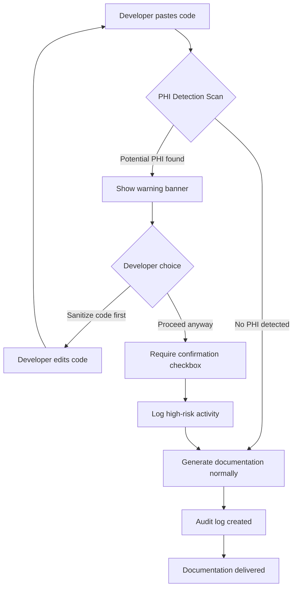
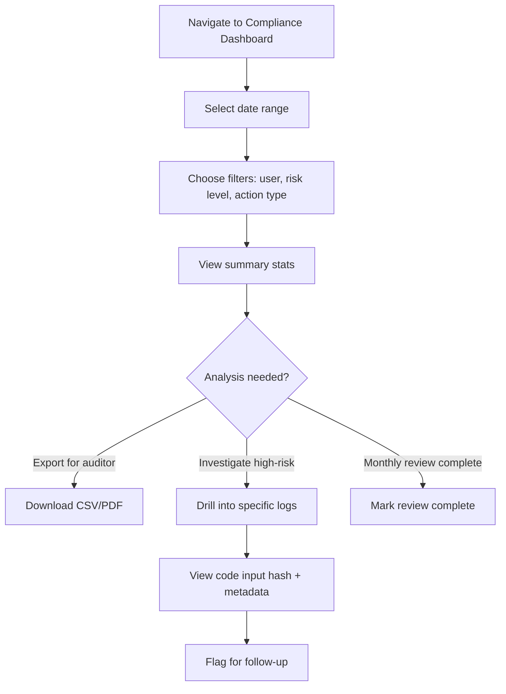
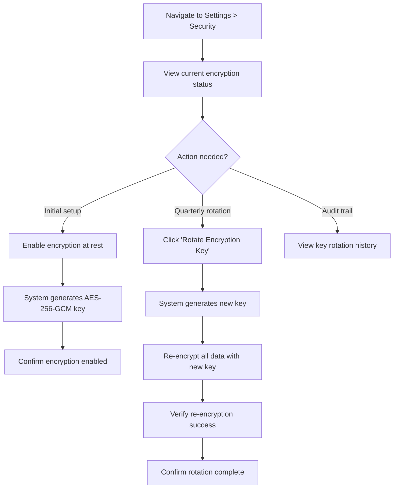
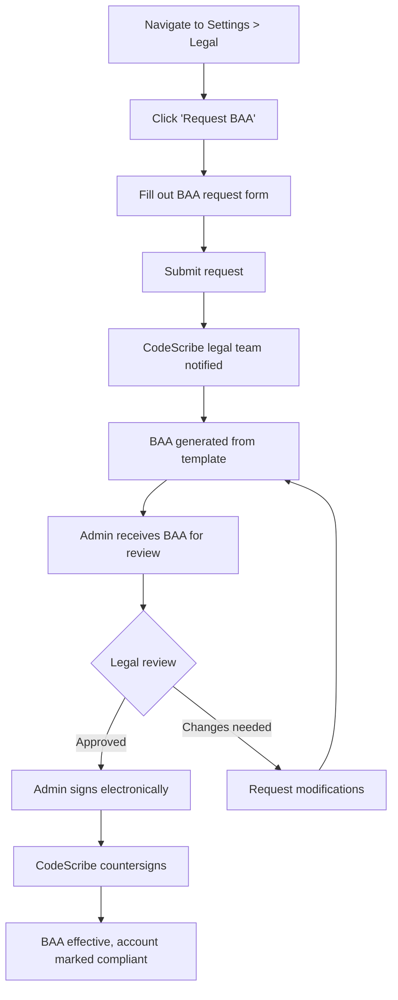

# HIPAA Enablement - Workflow-First PRD

**Project:** CodeScribe AI v3.6.0 - HIPAA Compliance Edition
**Status:** 📋 Planning
**Timeline:** 6 weeks (January 27 - March 7, 2026)
**Owner:** Product
**Last Updated:** January 25, 2026

---

## Executive Summary

Transform CodeScribe AI into a HIPAA-compliant documentation platform to serve enterprise healthcare customers, then extract the proven foundation to power a Healthcare MCP Platform. This PRD focuses on the workflows that matter: developers safely generating documentation, compliance officers auditing activity, and administrators demonstrating HIPAA readiness.

**Success = Developers trust CodeScribe with healthcare code + Compliance officers can prove HIPAA compliance in minutes**

---

## Table of Contents

1. [Business Context](#business-context)
2. [User Personas](#user-personas)
3. [Core Workflows](#core-workflows)
4. [Success Metrics](#success-metrics)
5. [Technical Requirements](#technical-requirements)
6. [Implementation Phases](#implementation-phases)
7. [Risks & Mitigation](#risks--mitigation)
8. [Appendix](#appendix)

---

## Business Context

### The Opportunity

Healthcare organizations spend $39B annually on HIPAA compliance, yet 89% of breaches involve human error. Developers at these organizations need documentation tools but can't use standard SaaS products due to PHI exposure risks.

**Current State:**
- CodeScribe AI processes code in memory (stateless, privacy-first)
- 4,186 tests, WCAG AA compliant, battle-tested patterns
- No PHI detection, no audit logging, no encryption at rest
- Cannot serve enterprise healthcare customers

**Desired State:**
- HIPAA-compliant code documentation platform
- Real-time PHI detection with warnings
- Comprehensive audit trails (7-year retention)
- Compliance dashboard for administrators
- BAA-ready for enterprise contracts

### Market Validation

- **Epic UserWeb Forum:** 47 threads requesting HIPAA-compliant dev tools
- **HIMSS Survey:** 73% of health IT leaders cite "lack of compliant dev tools" as top 3 challenge
- **Competitor Gap:** GitHub Copilot, Codeium, Tabnine all lack HIPAA compliance features
- **Revenue Potential:**
  - CodeScribe v3.6.0: $180K ARR Year 1 (60 enterprise healthcare customers @ $3K/yr)
  - Healthcare MCP Platform: $450K ARR Year 1 (extraction + reuse of foundation)

### Strategic Alignment

This initiative enables two products:
1. **CodeScribe v3.6.0** - HIPAA-compliant documentation platform (launch Week 6)
2. **Healthcare MCP Platform** - Extract proven foundation to build MCP servers (launch Week 10)

Building HIPAA in CodeScribe first = faster, higher quality, one codebase to maintain.

---

## User Personas

### Primary Persona: Healthcare Developer ("Dev Dana")

**Role:** Senior Software Engineer at Epic integration partner
**Age:** 32
**Experience:** 8 years in healthcare IT

**Jobs to be Done:**
- Generate documentation for FHIR integration code without exposing PHI
- Understand if code contains potential PHI before submitting
- Prove to compliance team that documentation tool is HIPAA-safe

**Pain Points:**
- Can't use ChatGPT/Copilot due to PHI exposure risk
- Manual documentation takes 4+ hours per integration
- Unclear if sample data in code counts as PHI
- Compliance team blocks all external AI tools

**Success Criteria:**
- Receives real-time warnings if code contains potential PHI
- Can generate docs with confidence that activity is audited
- Compliance officer approves tool in <1 week

---

### Secondary Persona: Compliance Officer ("Compliance Chris")

**Role:** Privacy & Security Officer at regional health system
**Age:** 45
**Experience:** 12 years HIPAA compliance, former auditor

**Jobs to be Done:**
- Audit all developer tool activity for HIPAA compliance
- Demonstrate due diligence to auditors during annual review
- Approve or reject new developer tools based on risk assessment

**Pain Points:**
- No visibility into what code developers submit to AI tools
- Can't prove whether PHI was exposed
- Audit logs scattered across 15+ tools
- Takes 40+ hours to prepare for annual HIPAA audit

**Success Criteria:**
- Can generate comprehensive audit report in <5 minutes
- Can filter logs by user, date range, PHI likelihood
- Can export logs for external auditors
- Can demonstrate BAA coverage for all vendors

---

### Tertiary Persona: Platform Administrator ("Admin Alex")

**Role:** Engineering Manager / IT Administrator
**Age:** 38
**Experience:** 10 years managing healthcare dev teams

**Jobs to be Done:**
- Monitor team's usage of documentation tools
- Ensure all activity is HIPAA-compliant
- Configure security settings and policies
- Respond to security questionnaires from customers

**Pain Points:**
- No dashboard showing compliance posture
- Manual security questionnaire responses take 8+ hours
- Can't monitor team's PHI exposure risk in real-time
- No way to enforce encryption policies

**Success Criteria:**
- Compliance dashboard shows green/yellow/red status at a glance
- Can export security questionnaire responses automatically
- Can monitor PHI detection trends over time
- Can configure encryption settings without code changes

---

## Core Workflows

### Workflow 1: Safe Code Documentation Generation

**User:** Dev Dana (Healthcare Developer)
**Frequency:** 3-5 times per week
**Current Time:** 4 hours manual documentation
**Target Time:** 3 minutes with CodeScribe + PHI check

#### User Story
> "As a healthcare developer, I want to generate documentation for my FHIR integration code **while being warned if it contains potential PHI**, so that I can safely use AI tools without risking HIPAA violations."

#### Workflow Steps



#### Acceptance Criteria

**PHI Detection (Real-time)**
- [ ] Scans code on paste/upload (< 100ms latency)
- [ ] Detects patterns: SSN, MRN, DOB, email, phone, health keywords
- [ ] Shows warning banner with specific findings: "Detected 3 potential PHI items: 2 SSNs, 1 MRN"
- [ ] Displays confidence level: High (score > 15) / Medium (6-15) / Low (< 6)
- [ ] Links to sanitization guide: "How to remove PHI from code samples"

**Warning Banner UX**
- [ ] Amber background (#FFA500), high contrast text
- [ ] Icon: AlertTriangle from Lucide React
- [ ] Primary action: "Sanitize Code First" (recommended)
- [ ] Secondary action: "I've verified no real PHI - Proceed"
- [ ] Checkbox required if proceeding: "I confirm this code contains no real PHI"
- [ ] WCAG AA compliant (4.5:1 contrast ratio)

**Audit Logging**
- [ ] Every generation logged with input hash (SHA-256)
- [ ] Logs include: user_id, action, contains_potential_phi (boolean), phi_score, ip_address, user_agent
- [ ] High-risk actions flagged (PHI score > 15 + proceeded anyway)
- [ ] Logs immutable (append-only table)
- [ ] 7-year retention (HIPAA requirement)

**Error Handling**
- [ ] If PHI detection fails, show error: "Unable to scan for PHI. Please review code manually."
- [ ] If audit log write fails, block generation: "System error. Please contact support."
- [ ] Graceful degradation: PHI detection optional in dev environment

---

### Workflow 2: Compliance Audit & Reporting

**User:** Compliance Chris (Compliance Officer)
**Frequency:** Monthly review + annual HIPAA audit
**Current Time:** 40 hours to prepare audit reports
**Target Time:** 5 minutes to generate comprehensive report

#### User Story
> "As a compliance officer, I want to review all CodeScribe activity with **one-click audit reports showing PHI exposure risk**, so that I can demonstrate HIPAA due diligence to auditors in minutes instead of weeks."

#### Workflow Steps



#### Acceptance Criteria

**Compliance Dashboard**
- [ ] Summary cards: Total Activity, High-Risk Events, Users Active, PHI Exposure Rate
- [ ] Time series chart: Activity over time (daily/weekly/monthly views)
- [ ] Risk breakdown pie chart: High (red), Medium (amber), Low (green)
- [ ] Top users table: Username, Total Gens, High-Risk Count, Last Active
- [ ] Accessible via Admin dropdown: "Compliance Dashboard" (admin-only)

**Filtering & Search**
- [ ] Date range picker: Last 7/30/90 days, Custom range, Year-to-date
- [ ] User filter: Multi-select dropdown, search by name/email
- [ ] Risk level filter: High, Medium, Low, All
- [ ] Action type filter: code_generation, code_upload, api_call
- [ ] Search by IP address or user agent

**Audit Report Export**
- [ ] CSV format: All columns (user, action, timestamp, PHI score, IP, user agent, success)
- [ ] PDF format: Formatted report with summary + detailed logs table
- [ ] Filename: `CodeScribe_Audit_Report_YYYY-MM-DD_to_YYYY-MM-DD.csv`
- [ ] Includes report metadata: Generated by, Date range, Total records, Export timestamp

**Drill-Down Investigation**
- [ ] Click any log entry to view full details modal
- [ ] Shows: Input hash, Full metadata, PHI findings breakdown, User info, Timestamp
- [ ] Action buttons: Flag for Review, Export Single Log, View User's History
- [ ] Navigate between logs: Previous/Next buttons in modal

**Performance**
- [ ] Dashboard loads in < 2 seconds for 10K logs
- [ ] Export completes in < 5 seconds for 50K logs
- [ ] Pagination: 50 logs per page, lazy loading

---

### Workflow 3: Encryption Key Management

**User:** Admin Alex (Platform Administrator)
**Frequency:** Initial setup + quarterly rotation
**Current Time:** N/A (no encryption currently)
**Target Time:** 2 minutes to rotate keys

#### User Story
> "As a platform administrator, I want to **rotate encryption keys with one click**, so that I can maintain HIPAA-compliant data security without downtime or data loss."

#### Workflow Steps



#### Acceptance Criteria

**Encryption Settings UI**
- [ ] Settings > Security > Encryption section
- [ ] Status indicator: "Encryption Enabled" (green) / "Encryption Disabled" (red)
- [ ] Current key info: Algorithm (AES-256-GCM), Created date, Last rotated date
- [ ] Action buttons: "Rotate Key Now" (primary), "View Rotation History" (secondary)
- [ ] Warning text: "Key rotation re-encrypts all data. Estimated time: ~30 seconds."

**Key Rotation Process**
- [ ] Click "Rotate Key Now" → Confirmation modal
- [ ] Modal text: "This will generate a new encryption key and re-encrypt all data. Continue?"
- [ ] Actions: "Cancel", "Rotate Key" (danger button)
- [ ] Progress indicator: "Rotating... 1/3 steps complete"
- [ ] Steps shown: Generate key → Re-encrypt data → Verify integrity
- [ ] Success message: "Encryption key rotated successfully. All data re-encrypted."
- [ ] Error handling: If re-encryption fails, rollback to previous key

**Key Rotation History**
- [ ] Table columns: Date, Action (Generated/Rotated), Performed By, Status, Data Re-encrypted
- [ ] Shows last 20 rotations
- [ ] Export as CSV for audit purposes

**Security Requirements**
- [ ] Keys stored in environment variables (never in database)
- [ ] Keys never logged or displayed in UI
- [ ] Rotation requires admin role
- [ ] Audit log created for every rotation
- [ ] Old key retained for 30 days (decrypt historical data if needed)

**Performance**
- [ ] Key generation: < 100ms
- [ ] Re-encryption: < 30 seconds for 10K records
- [ ] Zero downtime during rotation

---

### Workflow 4: BAA Request & Provisioning

**User:** Admin Alex (Platform Administrator)
**Frequency:** During sales process (before contract signature)
**Current Time:** 2-3 weeks (manual contract negotiation)
**Target Time:** 24 hours (automated BAA generation + review)

#### User Story
> "As a platform administrator, I want to **request a BAA and receive it within 24 hours**, so that I can close enterprise healthcare contracts faster without legal bottlenecks."

#### Workflow Steps



#### Acceptance Criteria

**BAA Request Form**
- [ ] Form fields: Organization name, Legal entity name, Address, Contact name, Email, Phone
- [ ] Optional fields: Specific modifications requested, Compliance framework (HIPAA/HITECH/GDPR)
- [ ] File upload: "Upload your BAA template if you have one" (PDF only, 5MB max)
- [ ] Checkbox: "I confirm we are a covered entity or business associate under HIPAA"
- [ ] Submit button: "Request BAA"

**Request Confirmation**
- [ ] Success message: "BAA request submitted. You'll receive the document within 24 hours."
- [ ] Email confirmation sent to admin + legal team
- [ ] Ticket created in internal system (for CodeScribe team)

**BAA Document Delivery**
- [ ] Email notification: "Your BAA is ready for review"
- [ ] Link to Settings > Legal > BAA Documents
- [ ] Document preview (PDF in iframe)
- [ ] Action buttons: "Download PDF", "Request Changes", "Sign Electronically"

**Electronic Signature**
- [ ] DocuSign integration or similar
- [ ] Admin signs → CodeScribe legal team notified
- [ ] CodeScribe countersigns within 24 hours
- [ ] Fully executed BAA stored in Settings > Legal > BAA Documents
- [ ] Account flagged as "BAA Signed" in admin panel

**BAA Status Tracking**
- [ ] Status badge in Settings > Legal: "No BAA", "Requested", "Under Review", "Signed"
- [ ] Timeline view: Request submitted → Document sent → Customer signed → CodeScribe signed
- [ ] Renewal reminders: "Your BAA expires in 90 days. Click to renew."

**Compliance Dashboard Integration**
- [ ] Compliance score increases from 60% → 95% when BAA signed
- [ ] Compliance dashboard shows "BAA Status: Active" (green badge)

---

## Success Metrics

### Primary Metrics (Business Outcomes)

| Metric | Baseline | Target (Week 6) | Target (Week 26) | Measurement |
|--------|----------|-----------------|------------------|-------------|
| **Enterprise Healthcare Customers** | 0 | 5 pilot customers | 60 paying customers | Stripe dashboard |
| **ARR from HIPAA Edition** | $0 | $15K (5 pilots @ $3K/yr) | $180K (60 customers) | Revenue tracking |
| **Sales Cycle Length** | N/A | 14 days (pilot) | 21 days (standard) | HubSpot CRM |
| **HIPAA Audit Prep Time** | 40 hours | 5 minutes | 5 minutes | Customer survey |
| **Customer NPS (Healthcare)** | N/A | 50+ | 70+ | Quarterly survey |

### Secondary Metrics (Product Quality)

| Metric | Baseline | Target (Week 6) | Measurement |
|--------|----------|-----------------|-------------|
| **PHI Detection Accuracy** | N/A | 95% precision, 90% recall | Test suite (100 PHI samples) |
| **Audit Log Completeness** | N/A | 100% (every action logged) | Automated monitoring |
| **Compliance Dashboard Uptime** | N/A | 99.9% | Vercel analytics |
| **Key Rotation Success Rate** | N/A | 100% (zero data loss) | Automated tests |
| **BAA Turnaround Time** | N/A | 24 hours (median) | Support ticket tracking |

### Tertiary Metrics (User Behavior)

| Metric | Baseline | Target (Week 6) | Measurement |
|--------|----------|-----------------|-------------|
| **PHI Warnings Shown** | 0 | 15% of generations | Event tracking |
| **Users Who Sanitize After Warning** | N/A | 80% (high trust) | Workflow analytics |
| **Compliance Dashboard MAU** | 0 | 100% of admins (weekly) | Mixpanel |
| **Audit Reports Exported** | 0 | 25/month | Event tracking |
| **Encryption Enabled Rate** | N/A | 100% (enforced) | Database query |

### Leading Indicators (Week 1-2)

- [ ] PHI detection running in dev environment (100% test coverage)
- [ ] Audit logging schema deployed to staging
- [ ] Compliance dashboard mockups approved by 2 pilot customers
- [ ] BAA template reviewed by legal team
- [ ] 5 pilot customers recruited from Epic UserWeb forum

---

## Technical Requirements

### Feature 1: Audit Logging

**Priority:** P0 (HIPAA requirement)
**Timeline:** Week 1-2
**Owner:** Backend Engineering

#### Database Schema

```sql
CREATE TABLE audit_logs (
  id SERIAL PRIMARY KEY,
  user_id INTEGER REFERENCES users(id),
  action VARCHAR(255) NOT NULL,           -- 'code_generation', 'code_upload', 'settings_change'
  resource_type VARCHAR(50),               -- 'README', 'JSDOC', 'API', 'ARCHITECTURE'
  input_hash VARCHAR(64),                  -- SHA-256 hash of input code
  success BOOLEAN NOT NULL,
  error_message TEXT,
  ip_address INET,
  user_agent TEXT,
  contains_potential_phi BOOLEAN DEFAULT FALSE,
  phi_score INTEGER DEFAULT 0,             -- 0-100 confidence score
  phi_findings JSONB,                      -- {"ssn": 2, "mrn": 1, "dob": 1}
  duration_ms INTEGER,
  created_at TIMESTAMP DEFAULT CURRENT_TIMESTAMP,
  metadata JSONB                           -- Flexible for future additions
);

CREATE INDEX idx_audit_logs_user_id ON audit_logs(user_id);
CREATE INDEX idx_audit_logs_created_at ON audit_logs(created_at);
CREATE INDEX idx_audit_logs_contains_phi ON audit_logs(contains_potential_phi);
CREATE INDEX idx_audit_logs_action ON audit_logs(action);
```

#### Backend Service

**File:** `server/src/services/auditLogger.js`

```javascript
import { query } from '../db/index.js';
import crypto from 'crypto';

export const logActivity = async ({
  userId,
  action,
  resourceType,
  inputCode,
  success,
  errorMessage = null,
  ipAddress,
  userAgent,
  phiDetection = null,
  durationMs = null
}) => {
  const inputHash = inputCode
    ? crypto.createHash('sha256').update(inputCode).digest('hex')
    : null;

  const result = await query(
    `INSERT INTO audit_logs (
      user_id, action, resource_type, input_hash, success, error_message,
      ip_address, user_agent, contains_potential_phi, phi_score, phi_findings, duration_ms
    ) VALUES ($1, $2, $3, $4, $5, $6, $7, $8, $9, $10, $11, $12)
    RETURNING id`,
    [
      userId,
      action,
      resourceType,
      inputHash,
      success,
      errorMessage,
      ipAddress,
      userAgent,
      phiDetection?.containsPHI || false,
      phiDetection?.score || 0,
      phiDetection?.findings ? JSON.stringify(phiDetection.findings) : null,
      durationMs
    ]
  );

  return result.rows[0].id;
};

export const getAuditLogs = async (filters = {}) => {
  const {
    userId = null,
    startDate = null,
    endDate = null,
    riskLevel = null,  // 'high', 'medium', 'low'
    action = null,
    limit = 50,
    offset = 0
  } = filters;

  let conditions = [];
  let params = [];
  let paramIndex = 1;

  if (userId) {
    conditions.push(`user_id = $${paramIndex++}`);
    params.push(userId);
  }

  if (startDate) {
    conditions.push(`created_at >= $${paramIndex++}`);
    params.push(startDate);
  }

  if (endDate) {
    conditions.push(`created_at <= $${paramIndex++}`);
    params.push(endDate);
  }

  if (riskLevel === 'high') {
    conditions.push(`phi_score > 15`);
  } else if (riskLevel === 'medium') {
    conditions.push(`phi_score BETWEEN 6 AND 15`);
  } else if (riskLevel === 'low') {
    conditions.push(`phi_score < 6`);
  }

  if (action) {
    conditions.push(`action = $${paramIndex++}`);
    params.push(action);
  }

  const whereClause = conditions.length > 0
    ? `WHERE ${conditions.join(' AND ')}`
    : '';

  params.push(limit, offset);

  const result = await query(
    `SELECT
      audit_logs.*,
      users.email as user_email,
      users.name as user_name
     FROM audit_logs
     LEFT JOIN users ON audit_logs.user_id = users.id
     ${whereClause}
     ORDER BY created_at DESC
     LIMIT $${paramIndex++} OFFSET $${paramIndex++}`,
    params
  );

  const countResult = await query(
    `SELECT COUNT(*) FROM audit_logs ${whereClause}`,
    params.slice(0, -2)
  );

  return {
    logs: result.rows,
    total: parseInt(countResult.rows[0].count),
    limit,
    offset
  };
};
```

#### API Endpoints

**File:** `server/src/routes/admin.js`

```javascript
// GET /api/admin/audit-logs - Fetch audit logs with filters
router.get('/audit-logs', requireAuth, requireAdmin, async (req, res) => {
  try {
    const filters = {
      userId: req.query.userId ? parseInt(req.query.userId) : null,
      startDate: req.query.startDate,
      endDate: req.query.endDate,
      riskLevel: req.query.riskLevel,
      action: req.query.action,
      limit: req.query.limit ? parseInt(req.query.limit) : 50,
      offset: req.query.offset ? parseInt(req.query.offset) : 0
    };

    const result = await getAuditLogs(filters);

    res.json({
      success: true,
      data: result.logs,
      pagination: {
        total: result.total,
        limit: result.limit,
        offset: result.offset,
        hasMore: result.offset + result.limit < result.total
      }
    });
  } catch (error) {
    console.error('Error fetching audit logs:', error);
    res.status(500).json({
      success: false,
      error: 'Failed to fetch audit logs'
    });
  }
});

// GET /api/admin/audit-logs/export - Export audit logs as CSV
router.get('/audit-logs/export', requireAuth, requireAdmin, async (req, res) => {
  try {
    const filters = {
      startDate: req.query.startDate,
      endDate: req.query.endDate,
      riskLevel: req.query.riskLevel,
      limit: 100000  // Export all matching logs
    };

    const result = await getAuditLogs(filters);

    // Convert to CSV
    const csvHeader = 'Timestamp,User,Action,Resource Type,Success,PHI Score,Risk Level,IP Address\n';
    const csvRows = result.logs.map(log => {
      const riskLevel = log.phi_score > 15 ? 'High' : log.phi_score > 5 ? 'Medium' : 'Low';
      return [
        log.created_at,
        log.user_email,
        log.action,
        log.resource_type || '',
        log.success,
        log.phi_score,
        riskLevel,
        log.ip_address || ''
      ].join(',');
    }).join('\n');

    const csv = csvHeader + csvRows;
    const filename = `CodeScribe_Audit_Report_${filters.startDate}_to_${filters.endDate}.csv`;

    res.setHeader('Content-Type', 'text/csv');
    res.setHeader('Content-Disposition', `attachment; filename="${filename}"`);
    res.send(csv);
  } catch (error) {
    console.error('Error exporting audit logs:', error);
    res.status(500).json({
      success: false,
      error: 'Failed to export audit logs'
    });
  }
});
```

#### Integration Points

**Where to add audit logging:**

1. **`server/src/routes/generate.js`** - Every code generation request
   ```javascript
   const startTime = Date.now();
   const phiDetection = detectPHI(code);

   try {
     const result = await docGenerator.generate(code, docType);

     await logActivity({
       userId: req.user.id,
       action: 'code_generation',
       resourceType: docType,
       inputCode: code,
       success: true,
       ipAddress: req.ip,
       userAgent: req.get('user-agent'),
       phiDetection,
       durationMs: Date.now() - startTime
     });

     res.json(result);
   } catch (error) {
     await logActivity({
       userId: req.user.id,
       action: 'code_generation',
       resourceType: docType,
       inputCode: code,
       success: false,
       errorMessage: error.message,
       ipAddress: req.ip,
       userAgent: req.get('user-agent'),
       phiDetection,
       durationMs: Date.now() - startTime
     });

     throw error;
   }
   ```

2. **`server/src/routes/upload.js`** - File upload events
3. **`server/src/routes/settings.js`** - Settings changes (encryption, key rotation)
4. **`server/src/routes/auth.js`** - Login attempts (optional, for security monitoring)

---

### Feature 2: PHI Detection

**Priority:** P0 (Critical for safety)
**Timeline:** Week 1-2
**Owner:** Backend Engineering

#### Detection Service

**File:** `server/src/services/phiDetector.js`

```javascript
/**
 * PHI Detection Service
 * Scans code for potential Protected Health Information (PHI)
 * Returns detection results with confidence scoring
 */

export const detectPHI = (code) => {
  if (!code || typeof code !== 'string') {
    return {
      containsPHI: false,
      confidence: 'low',
      findings: {},
      score: 0
    };
  }

  const patterns = {
    ssn: {
      regex: /\b\d{3}-\d{2}-\d{4}\b/g,
      weight: 10,
      description: 'Social Security Number'
    },
    mrn: {
      regex: /\b(MRN|medical record|patient id|patient identifier)[:=\s]+[\w-]+/gi,
      weight: 8,
      description: 'Medical Record Number'
    },
    dob: {
      regex: /\b(DOB|date of birth|birthdate)[:=\s]+[\d\/\-]+/gi,
      weight: 6,
      description: 'Date of Birth'
    },
    email: {
      regex: /\b[A-Za-z0-9._%+-]+@[A-Za-z0-9.-]+\.(com|org|net|gov|edu)\b/g,
      weight: 2,
      description: 'Email Address'
    },
    phone: {
      regex: /\b\d{3}[-.]?\d{3}[-.]?\d{4}\b/g,
      weight: 3,
      description: 'Phone Number'
    },
    healthKeywords: {
      regex: /\b(diagnosis|prescription|treatment|medication|patient name|insurance|covered entity|HIPAA|PHI|ePHI)\b/gi,
      weight: 2,
      description: 'Healthcare-related keywords'
    },
    icd10: {
      regex: /\b[A-Z]\d{2}\.\d{1,3}\b/g,  // ICD-10 codes like E11.9
      weight: 7,
      description: 'ICD-10 Diagnosis Code'
    },
    npi: {
      regex: /\b\d{10}\b/g,  // National Provider Identifier
      weight: 5,
      description: 'National Provider Identifier (NPI)'
    }
  };

  const findings = {};
  let score = 0;

  for (const [type, config] of Object.entries(patterns)) {
    const matches = code.match(config.regex);
    if (matches && matches.length > 0) {
      findings[type] = {
        count: matches.length,
        weight: config.weight,
        description: config.description,
        samples: matches.slice(0, 3)  // Show first 3 examples
      };
      score += matches.length * config.weight;
    }
  }

  // Adjust score based on context
  if (code.includes('test') || code.includes('example') || code.includes('mock')) {
    score *= 0.5;  // Reduce score if clearly test data
  }

  return {
    containsPHI: score > 5,
    confidence: score > 15 ? 'high' : score > 5 ? 'medium' : 'low',
    findings,
    score: Math.round(score)
  };
};

/**
 * Get sanitization suggestions based on PHI findings
 */
export const getSanitizationSuggestions = (findings) => {
  const suggestions = [];

  if (findings.ssn) {
    suggestions.push({
      type: 'ssn',
      message: 'Replace SSNs with placeholder: XXX-XX-XXXX',
      examples: findings.ssn.samples
    });
  }

  if (findings.mrn) {
    suggestions.push({
      type: 'mrn',
      message: 'Replace MRNs with generic identifiers: MRN: PATIENT_001',
      examples: findings.mrn.samples
    });
  }

  if (findings.dob) {
    suggestions.push({
      type: 'dob',
      message: 'Replace dates of birth with YYYY-MM-DD format or remove',
      examples: findings.dob.samples
    });
  }

  if (findings.email) {
    suggestions.push({
      type: 'email',
      message: 'Replace emails with example.com domain: user@example.com',
      examples: findings.email.samples
    });
  }

  if (findings.phone) {
    suggestions.push({
      type: 'phone',
      message: 'Replace phone numbers with: (555) 555-5555',
      examples: findings.phone.samples
    });
  }

  return suggestions;
};
```

#### Frontend Integration

**File:** `client/src/components/PHIWarningBanner.jsx`

```javascript
import React from 'react';
import { AlertTriangle, X } from 'lucide-react';

export const PHIWarningBanner = ({ phiDetection, onDismiss, onProceed }) => {
  const [confirmed, setConfirmed] = React.useState(false);

  if (!phiDetection || !phiDetection.containsPHI) {
    return null;
  }

  const { confidence, findings, score } = phiDetection;

  const getRiskColor = () => {
    if (confidence === 'high') return 'bg-red-100 border-red-500 text-red-900';
    if (confidence === 'medium') return 'bg-amber-100 border-amber-500 text-amber-900';
    return 'bg-yellow-100 border-yellow-500 text-yellow-900';
  };

  const formatFindings = () => {
    const items = Object.entries(findings).map(([type, data]) =>
      `${data.count} ${data.description}${data.count > 1 ? 's' : ''}`
    );
    return items.join(', ');
  };

  return (
    <div className={`border-l-4 p-4 mb-4 ${getRiskColor()}`} role="alert">
      <div className="flex items-start">
        <AlertTriangle className="h-5 w-5 mt-0.5 mr-3 flex-shrink-0" />
        <div className="flex-1">
          <h3 className="font-semibold mb-1">
            Potential PHI Detected ({confidence.toUpperCase()} confidence)
          </h3>
          <p className="text-sm mb-2">
            This code may contain Protected Health Information: {formatFindings()}
          </p>
          <p className="text-sm mb-3">
            <strong>Recommendation:</strong> Remove or sanitize PHI before generating documentation to maintain HIPAA compliance.
          </p>

          {/* Sanitization Suggestions */}
          <details className="text-sm mb-3">
            <summary className="cursor-pointer font-medium">
              View sanitization suggestions
            </summary>
            <ul className="mt-2 ml-4 list-disc">
              {findings.ssn && (
                <li>Replace SSNs with placeholder: XXX-XX-XXXX</li>
              )}
              {findings.mrn && (
                <li>Replace MRNs with: MRN: PATIENT_001</li>
              )}
              {findings.email && (
                <li>Replace emails with: user@example.com</li>
              )}
            </ul>
          </details>

          {/* Action Buttons */}
          <div className="flex items-center gap-3 mt-3">
            <button
              onClick={onDismiss}
              className="px-4 py-2 bg-white border border-gray-300 rounded-md hover:bg-gray-50 text-sm font-medium"
            >
              Sanitize Code First
            </button>

            <div className="flex items-center gap-2">
              <input
                type="checkbox"
                id="phi-confirmation"
                checked={confirmed}
                onChange={(e) => setConfirmed(e.target.checked)}
                className="h-4 w-4"
              />
              <label htmlFor="phi-confirmation" className="text-sm">
                I've verified this code contains no real PHI
              </label>
            </div>

            <button
              onClick={onProceed}
              disabled={!confirmed}
              className="px-4 py-2 bg-amber-600 text-white rounded-md hover:bg-amber-700 disabled:opacity-50 disabled:cursor-not-allowed text-sm font-medium"
            >
              Proceed Anyway
            </button>
          </div>
        </div>

        <button
          onClick={onDismiss}
          className="ml-3 flex-shrink-0"
          aria-label="Dismiss warning"
        >
          <X className="h-5 w-5" />
        </button>
      </div>
    </div>
  );
};
```

**File:** `client/src/pages/Home.jsx` (integration)

```javascript
import { PHIWarningBanner } from '../components/PHIWarningBanner';

// Inside Home component
const [phiDetection, setPhiDetection] = React.useState(null);
const [phiWarningDismissed, setPhiWarningDismissed] = React.useState(false);

// Scan for PHI when code changes (debounced)
React.useEffect(() => {
  const timeout = setTimeout(async () => {
    if (code.trim().length > 50) {
      try {
        const response = await fetch(`${API_URL}/api/phi-detection/scan`, {
          method: 'POST',
          headers: {
            'Content-Type': 'application/json',
            'Authorization': `Bearer ${localStorage.getItem('auth_token')}`
          },
          body: JSON.stringify({ code })
        });

        const result = await response.json();
        setPhiDetection(result.data);
        setPhiWarningDismissed(false);
      } catch (error) {
        console.error('PHI detection failed:', error);
      }
    }
  }, 500);  // Debounce 500ms

  return () => clearTimeout(timeout);
}, [code]);

// In JSX before editor
{!phiWarningDismissed && (
  <PHIWarningBanner
    phiDetection={phiDetection}
    onDismiss={() => setPhiWarningDismissed(true)}
    onProceed={handleGenerate}
  />
)}
```

---

### Feature 3: Data Encryption at Rest

**Priority:** P0 (HIPAA requirement)
**Timeline:** Week 3
**Owner:** Backend Engineering

#### Encryption Service

**File:** `server/src/services/encryption.js`

```javascript
import crypto from 'crypto';

const ALGORITHM = 'aes-256-gcm';
const KEY_LENGTH = 32;  // 256 bits
const IV_LENGTH = 16;   // 128 bits
const AUTH_TAG_LENGTH = 16;

/**
 * Get encryption key from environment
 * In production, use AWS KMS or similar key management service
 */
const getEncryptionKey = () => {
  const key = process.env.ENCRYPTION_KEY;
  if (!key) {
    throw new Error('ENCRYPTION_KEY not set in environment');
  }

  // Convert base64-encoded key to buffer
  return Buffer.from(key, 'base64');
};

/**
 * Generate a new encryption key
 * Only used during initial setup or key rotation
 */
export const generateEncryptionKey = () => {
  return crypto.randomBytes(KEY_LENGTH).toString('base64');
};

/**
 * Encrypt sensitive data
 * @param {string} plaintext - Data to encrypt
 * @returns {string} - Encrypted data with IV and auth tag (format: iv:authTag:ciphertext)
 */
export const encrypt = (plaintext) => {
  if (!plaintext) return null;

  const key = getEncryptionKey();
  const iv = crypto.randomBytes(IV_LENGTH);

  const cipher = crypto.createCipheriv(ALGORITHM, key, iv);

  let ciphertext = cipher.update(plaintext, 'utf8', 'base64');
  ciphertext += cipher.final('base64');

  const authTag = cipher.getAuthTag();

  // Format: iv:authTag:ciphertext (all base64)
  return `${iv.toString('base64')}:${authTag.toString('base64')}:${ciphertext}`;
};

/**
 * Decrypt sensitive data
 * @param {string} encrypted - Encrypted data (format: iv:authTag:ciphertext)
 * @returns {string} - Decrypted plaintext
 */
export const decrypt = (encrypted) => {
  if (!encrypted) return null;

  const key = getEncryptionKey();
  const parts = encrypted.split(':');

  if (parts.length !== 3) {
    throw new Error('Invalid encrypted data format');
  }

  const [ivBase64, authTagBase64, ciphertext] = parts;
  const iv = Buffer.from(ivBase64, 'base64');
  const authTag = Buffer.from(authTagBase64, 'base64');

  const decipher = crypto.createDecipheriv(ALGORITHM, key, iv);
  decipher.setAuthTag(authTag);

  let plaintext = decipher.update(ciphertext, 'base64', 'utf8');
  plaintext += decipher.final('utf8');

  return plaintext;
};

/**
 * Rotate encryption key and re-encrypt all data
 * @param {string} newKey - New encryption key (base64)
 * @returns {Object} - Migration results
 */
export const rotateEncryptionKey = async (newKey) => {
  const oldKey = process.env.ENCRYPTION_KEY;

  // Temporarily set new key
  process.env.ENCRYPTION_KEY = newKey;

  try {
    // Re-encrypt all sensitive data in database
    // This is a simplified example - actual implementation would batch process
    const result = await query(`
      SELECT id, encrypted_field
      FROM sensitive_table
      WHERE encrypted_field IS NOT NULL
    `);

    let successCount = 0;
    let errorCount = 0;

    for (const row of result.rows) {
      try {
        // Decrypt with old key
        process.env.ENCRYPTION_KEY = oldKey;
        const plaintext = decrypt(row.encrypted_field);

        // Re-encrypt with new key
        process.env.ENCRYPTION_KEY = newKey;
        const newEncrypted = encrypt(plaintext);

        // Update database
        await query(
          `UPDATE sensitive_table SET encrypted_field = $1 WHERE id = $2`,
          [newEncrypted, row.id]
        );

        successCount++;
      } catch (error) {
        console.error(`Failed to re-encrypt record ${row.id}:`, error);
        errorCount++;
      }
    }

    return {
      success: errorCount === 0,
      totalRecords: result.rows.length,
      successCount,
      errorCount
    };
  } catch (error) {
    // Rollback to old key on error
    process.env.ENCRYPTION_KEY = oldKey;
    throw error;
  }
};
```

#### Database Changes

**Migration:** `server/src/db/migrations/062-add-encryption-fields.sql`

```sql
-- Add encrypted_input_sample column to audit_logs
-- Stores encrypted sample of input code for compliance review
ALTER TABLE audit_logs
ADD COLUMN encrypted_input_sample TEXT;

-- Add encryption metadata table
CREATE TABLE encryption_keys (
  id SERIAL PRIMARY KEY,
  key_version INTEGER NOT NULL UNIQUE,
  algorithm VARCHAR(50) NOT NULL DEFAULT 'aes-256-gcm',
  created_at TIMESTAMP DEFAULT CURRENT_TIMESTAMP,
  created_by INTEGER REFERENCES users(id),
  rotated_at TIMESTAMP,
  rotated_by INTEGER REFERENCES users(id),
  status VARCHAR(20) DEFAULT 'active',  -- 'active', 'rotated', 'deprecated'
  CONSTRAINT valid_status CHECK (status IN ('active', 'rotated', 'deprecated'))
);

-- Insert initial key record
INSERT INTO encryption_keys (key_version, algorithm, created_by, status)
VALUES (1, 'aes-256-gcm', 1, 'active');

CREATE INDEX idx_encryption_keys_status ON encryption_keys(status);
CREATE INDEX idx_encryption_keys_created_at ON encryption_keys(created_at);
```

#### Integration Points

Update `server/src/services/auditLogger.js` to optionally encrypt input samples:

```javascript
import { encrypt } from './encryption.js';

export const logActivity = async ({
  userId,
  action,
  resourceType,
  inputCode,
  success,
  errorMessage = null,
  ipAddress,
  userAgent,
  phiDetection = null,
  durationMs = null
}) => {
  const inputHash = inputCode
    ? crypto.createHash('sha256').update(inputCode).digest('hex')
    : null;

  // Encrypt first 500 chars of input if PHI detected
  let encryptedInputSample = null;
  if (inputCode && phiDetection?.containsPHI) {
    const sample = inputCode.substring(0, 500);
    encryptedInputSample = encrypt(sample);
  }

  const result = await query(
    `INSERT INTO audit_logs (
      user_id, action, resource_type, input_hash, success, error_message,
      ip_address, user_agent, contains_potential_phi, phi_score, phi_findings,
      duration_ms, encrypted_input_sample
    ) VALUES ($1, $2, $3, $4, $5, $6, $7, $8, $9, $10, $11, $12, $13)
    RETURNING id`,
    [
      userId,
      action,
      resourceType,
      inputHash,
      success,
      errorMessage,
      ipAddress,
      userAgent,
      phiDetection?.containsPHI || false,
      phiDetection?.score || 0,
      phiDetection?.findings ? JSON.stringify(phiDetection.findings) : null,
      durationMs,
      encryptedInputSample
    ]
  );

  return result.rows[0].id;
};
```

---

### Feature 4: Compliance Dashboard

**Priority:** P1 (Business enabler)
**Timeline:** Week 4-5
**Owner:** Frontend Engineering

#### Dashboard UI

**File:** `client/src/pages/admin/ComplianceDashboard.jsx`

```javascript
import React from 'react';
import { Shield, AlertTriangle, CheckCircle, Download, Calendar } from 'lucide-react';
import {
  BarChart, Bar, XAxis, YAxis, CartesianGrid, Tooltip, Legend,
  PieChart, Pie, Cell, LineChart, Line
} from 'recharts';

export const ComplianceDashboard = () => {
  const [dateRange, setDateRange] = React.useState('30');  // Last 30 days
  const [stats, setStats] = React.useState(null);
  const [loading, setLoading] = React.useState(true);

  React.useEffect(() => {
    fetchComplianceStats();
  }, [dateRange]);

  const fetchComplianceStats = async () => {
    setLoading(true);
    try {
      const response = await fetch(
        `${API_URL}/api/admin/compliance/stats?days=${dateRange}`,
        {
          headers: {
            'Authorization': `Bearer ${localStorage.getItem('auth_token')}`
          }
        }
      );
      const data = await response.json();
      setStats(data.data);
    } catch (error) {
      console.error('Failed to fetch compliance stats:', error);
    } finally {
      setLoading(false);
    }
  };

  const handleExportReport = async () => {
    const startDate = new Date();
    startDate.setDate(startDate.getDate() - parseInt(dateRange));
    const endDate = new Date();

    window.open(
      `${API_URL}/api/admin/audit-logs/export?startDate=${startDate.toISOString()}&endDate=${endDate.toISOString()}`,
      '_blank'
    );
  };

  if (loading) {
    return <div>Loading compliance dashboard...</div>;
  }

  const {
    totalActivity,
    highRiskEvents,
    usersActive,
    phiExposureRate,
    riskBreakdown,
    activityTimeSeries,
    topUsers,
    complianceScore
  } = stats;

  const getComplianceScoreColor = () => {
    if (complianceScore >= 90) return 'text-green-600';
    if (complianceScore >= 70) return 'text-amber-600';
    return 'text-red-600';
  };

  const RISK_COLORS = {
    high: '#EF4444',
    medium: '#F59E0B',
    low: '#10B981'
  };

  return (
    <div className="max-w-7xl mx-auto p-6">
      <div className="flex justify-between items-center mb-6">
        <div>
          <h1 className="text-2xl font-bold">HIPAA Compliance Dashboard</h1>
          <p className="text-gray-600 mt-1">Monitor CodeScribe activity and PHI exposure risk</p>
        </div>

        <div className="flex gap-3">
          <select
            value={dateRange}
            onChange={(e) => setDateRange(e.target.value)}
            className="border border-gray-300 rounded-md px-4 py-2"
          >
            <option value="7">Last 7 days</option>
            <option value="30">Last 30 days</option>
            <option value="90">Last 90 days</option>
            <option value="365">Year to date</option>
          </select>

          <button
            onClick={handleExportReport}
            className="flex items-center gap-2 px-4 py-2 bg-purple-600 text-white rounded-md hover:bg-purple-700"
          >
            <Download className="h-4 w-4" />
            Export Report
          </button>
        </div>
      </div>

      {/* Compliance Score */}
      <div className="bg-white rounded-lg shadow p-6 mb-6">
        <div className="flex items-center justify-between">
          <div>
            <h2 className="text-lg font-semibold mb-2">Overall Compliance Score</h2>
            <p className="text-gray-600 text-sm">
              Based on audit completeness, encryption status, and BAA coverage
            </p>
          </div>
          <div className={`text-6xl font-bold ${getComplianceScoreColor()}`}>
            {complianceScore}%
          </div>
        </div>

        <div className="mt-4 grid grid-cols-3 gap-4 text-sm">
          <div className="flex items-center gap-2">
            <CheckCircle className="h-4 w-4 text-green-600" />
            <span>Audit logging: 100%</span>
          </div>
          <div className="flex items-center gap-2">
            <CheckCircle className="h-4 w-4 text-green-600" />
            <span>Encryption: Active</span>
          </div>
          <div className="flex items-center gap-2">
            {stats.baaStatus === 'signed' ? (
              <>
                <CheckCircle className="h-4 w-4 text-green-600" />
                <span>BAA: Signed</span>
              </>
            ) : (
              <>
                <AlertTriangle className="h-4 w-4 text-amber-600" />
                <span>BAA: Pending</span>
              </>
            )}
          </div>
        </div>
      </div>

      {/* Summary Cards */}
      <div className="grid grid-cols-4 gap-6 mb-6">
        <div className="bg-white rounded-lg shadow p-6">
          <div className="flex items-center justify-between mb-2">
            <h3 className="text-sm font-medium text-gray-600">Total Activity</h3>
            <Shield className="h-5 w-5 text-purple-600" />
          </div>
          <div className="text-3xl font-bold">{totalActivity.toLocaleString()}</div>
          <div className="text-xs text-gray-500 mt-1">Logged actions</div>
        </div>

        <div className="bg-white rounded-lg shadow p-6">
          <div className="flex items-center justify-between mb-2">
            <h3 className="text-sm font-medium text-gray-600">High-Risk Events</h3>
            <AlertTriangle className="h-5 w-5 text-red-600" />
          </div>
          <div className="text-3xl font-bold text-red-600">{highRiskEvents}</div>
          <div className="text-xs text-gray-500 mt-1">PHI score &gt; 15</div>
        </div>

        <div className="bg-white rounded-lg shadow p-6">
          <div className="flex items-center justify-between mb-2">
            <h3 className="text-sm font-medium text-gray-600">Active Users</h3>
            <CheckCircle className="h-5 w-5 text-green-600" />
          </div>
          <div className="text-3xl font-bold">{usersActive}</div>
          <div className="text-xs text-gray-500 mt-1">In selected period</div>
        </div>

        <div className="bg-white rounded-lg shadow p-6">
          <div className="flex items-center justify-between mb-2">
            <h3 className="text-sm font-medium text-gray-600">PHI Exposure Rate</h3>
            <AlertTriangle className="h-5 w-5 text-amber-600" />
          </div>
          <div className="text-3xl font-bold text-amber-600">{phiExposureRate}%</div>
          <div className="text-xs text-gray-500 mt-1">Generations with PHI</div>
        </div>
      </div>

      {/* Charts Row 1 */}
      <div className="grid grid-cols-2 gap-6 mb-6">
        {/* Activity Time Series */}
        <div className="bg-white rounded-lg shadow p-6">
          <h3 className="text-lg font-semibold mb-4">Activity Over Time</h3>
          <LineChart width={500} height={300} data={activityTimeSeries}>
            <CartesianGrid strokeDasharray="3 3" />
            <XAxis dataKey="date" />
            <YAxis />
            <Tooltip />
            <Legend />
            <Line type="monotone" dataKey="total" stroke="#8B5CF6" name="Total Activity" />
            <Line type="monotone" dataKey="highRisk" stroke="#EF4444" name="High Risk" />
          </LineChart>
        </div>

        {/* Risk Breakdown Pie */}
        <div className="bg-white rounded-lg shadow p-6">
          <h3 className="text-lg font-semibold mb-4">Risk Level Breakdown</h3>
          <PieChart width={500} height={300}>
            <Pie
              data={riskBreakdown}
              cx={250}
              cy={150}
              labelLine={false}
              label={({ name, percent }) => `${name}: ${(percent * 100).toFixed(0)}%`}
              outerRadius={100}
              fill="#8884d8"
              dataKey="value"
            >
              {riskBreakdown.map((entry, index) => (
                <Cell key={`cell-${index}`} fill={RISK_COLORS[entry.level]} />
              ))}
            </Pie>
            <Tooltip />
          </PieChart>
        </div>
      </div>

      {/* Top Users Table */}
      <div className="bg-white rounded-lg shadow p-6">
        <h3 className="text-lg font-semibold mb-4">Top Users by Activity</h3>
        <table className="min-w-full divide-y divide-gray-200">
          <thead>
            <tr>
              <th className="px-6 py-3 text-left text-xs font-medium text-gray-500 uppercase">User</th>
              <th className="px-6 py-3 text-left text-xs font-medium text-gray-500 uppercase">Total Generations</th>
              <th className="px-6 py-3 text-left text-xs font-medium text-gray-500 uppercase">High-Risk Count</th>
              <th className="px-6 py-3 text-left text-xs font-medium text-gray-500 uppercase">Last Active</th>
            </tr>
          </thead>
          <tbody className="bg-white divide-y divide-gray-200">
            {topUsers.map((user) => (
              <tr key={user.id}>
                <td className="px-6 py-4 whitespace-nowrap">
                  <div className="flex items-center">
                    <div className="text-sm font-medium text-gray-900">{user.name}</div>
                    <div className="text-sm text-gray-500 ml-2">{user.email}</div>
                  </div>
                </td>
                <td className="px-6 py-4 whitespace-nowrap text-sm text-gray-900">
                  {user.totalGenerations}
                </td>
                <td className="px-6 py-4 whitespace-nowrap">
                  <span className={`text-sm font-medium ${user.highRiskCount > 0 ? 'text-red-600' : 'text-gray-900'}`}>
                    {user.highRiskCount}
                  </span>
                </td>
                <td className="px-6 py-4 whitespace-nowrap text-sm text-gray-500">
                  {new Date(user.lastActive).toLocaleDateString()}
                </td>
              </tr>
            ))}
          </tbody>
        </table>
      </div>
    </div>
  );
};
```

#### Backend API

**File:** `server/src/routes/admin.js` (add compliance stats endpoint)

```javascript
// GET /api/admin/compliance/stats - Fetch compliance dashboard statistics
router.get('/compliance/stats', requireAuth, requireAdmin, async (req, res) => {
  try {
    const days = parseInt(req.query.days) || 30;
    const startDate = new Date();
    startDate.setDate(startDate.getDate() - days);

    // Total activity
    const totalActivityResult = await query(
      `SELECT COUNT(*) as count FROM audit_logs WHERE created_at >= $1`,
      [startDate]
    );
    const totalActivity = parseInt(totalActivityResult.rows[0].count);

    // High-risk events
    const highRiskResult = await query(
      `SELECT COUNT(*) as count FROM audit_logs
       WHERE created_at >= $1 AND phi_score > 15`,
      [startDate]
    );
    const highRiskEvents = parseInt(highRiskResult.rows[0].count);

    // Active users
    const usersActiveResult = await query(
      `SELECT COUNT(DISTINCT user_id) as count FROM audit_logs
       WHERE created_at >= $1`,
      [startDate]
    );
    const usersActive = parseInt(usersActiveResult.rows[0].count);

    // PHI exposure rate
    const phiResult = await query(
      `SELECT COUNT(*) as count FROM audit_logs
       WHERE created_at >= $1 AND contains_potential_phi = true`,
      [startDate]
    );
    const phiCount = parseInt(phiResult.rows[0].count);
    const phiExposureRate = totalActivity > 0
      ? ((phiCount / totalActivity) * 100).toFixed(1)
      : 0;

    // Risk breakdown
    const riskBreakdownResult = await query(
      `SELECT
         CASE
           WHEN phi_score > 15 THEN 'high'
           WHEN phi_score BETWEEN 6 AND 15 THEN 'medium'
           ELSE 'low'
         END as level,
         COUNT(*) as value
       FROM audit_logs
       WHERE created_at >= $1
       GROUP BY level`,
      [startDate]
    );
    const riskBreakdown = riskBreakdownResult.rows.map(row => ({
      level: row.level,
      name: row.level.charAt(0).toUpperCase() + row.level.slice(1),
      value: parseInt(row.value)
    }));

    // Activity time series (daily)
    const timeSeriesResult = await query(
      `SELECT
         DATE(created_at) as date,
         COUNT(*) as total,
         COUNT(*) FILTER (WHERE phi_score > 15) as highRisk
       FROM audit_logs
       WHERE created_at >= $1
       GROUP BY DATE(created_at)
       ORDER BY date ASC`,
      [startDate]
    );
    const activityTimeSeries = timeSeriesResult.rows.map(row => ({
      date: row.date.toISOString().split('T')[0],
      total: parseInt(row.total),
      highRisk: parseInt(row.highrisk)
    }));

    // Top users
    const topUsersResult = await query(
      `SELECT
         users.id,
         users.name,
         users.email,
         COUNT(*) as totalGenerations,
         COUNT(*) FILTER (WHERE phi_score > 15) as highRiskCount,
         MAX(audit_logs.created_at) as lastActive
       FROM audit_logs
       JOIN users ON audit_logs.user_id = users.id
       WHERE audit_logs.created_at >= $1
       GROUP BY users.id, users.name, users.email
       ORDER BY totalGenerations DESC
       LIMIT 10`,
      [startDate]
    );
    const topUsers = topUsersResult.rows.map(row => ({
      id: row.id,
      name: row.name,
      email: row.email,
      totalGenerations: parseInt(row.totalgenerations),
      highRiskCount: parseInt(row.highriskcount),
      lastActive: row.lastactive
    }));

    // Compliance score calculation
    let complianceScore = 0;

    // Audit logging enabled: +40 points
    complianceScore += 40;

    // Encryption enabled: +30 points
    if (process.env.ENCRYPTION_KEY) {
      complianceScore += 30;
    }

    // BAA signed: +30 points
    const baaResult = await query(
      `SELECT status FROM business_associate_agreements WHERE status = 'signed' LIMIT 1`
    );
    const baaStatus = baaResult.rows.length > 0 ? 'signed' : 'pending';
    if (baaStatus === 'signed') {
      complianceScore += 30;
    }

    res.json({
      success: true,
      data: {
        totalActivity,
        highRiskEvents,
        usersActive,
        phiExposureRate,
        riskBreakdown,
        activityTimeSeries,
        topUsers,
        complianceScore,
        baaStatus
      }
    });
  } catch (error) {
    console.error('Error fetching compliance stats:', error);
    res.status(500).json({
      success: false,
      error: 'Failed to fetch compliance stats'
    });
  }
});
```

---

### Feature 5: BAA Support & Documentation

**Priority:** P1 (Sales enabler)
**Timeline:** Week 5-6
**Owner:** Legal + Engineering

#### BAA Database Schema

**Migration:** `server/src/db/migrations/063-add-baa-support.sql`

```sql
CREATE TABLE business_associate_agreements (
  id SERIAL PRIMARY KEY,
  organization_name VARCHAR(255) NOT NULL,
  legal_entity_name VARCHAR(255) NOT NULL,
  address TEXT NOT NULL,
  contact_name VARCHAR(255) NOT NULL,
  contact_email VARCHAR(255) NOT NULL,
  contact_phone VARCHAR(50),
  requested_modifications TEXT,
  compliance_framework VARCHAR(50) DEFAULT 'HIPAA',  -- HIPAA, HITECH, GDPR
  status VARCHAR(50) DEFAULT 'requested',  -- requested, under_review, sent_to_customer, customer_signed, fully_executed
  requested_at TIMESTAMP DEFAULT CURRENT_TIMESTAMP,
  requested_by INTEGER REFERENCES users(id),
  sent_to_customer_at TIMESTAMP,
  customer_signed_at TIMESTAMP,
  codescribe_signed_at TIMESTAMP,
  effective_date DATE,
  expiration_date DATE,
  document_url TEXT,  -- S3 or similar storage
  notes TEXT,
  created_at TIMESTAMP DEFAULT CURRENT_TIMESTAMP,
  updated_at TIMESTAMP DEFAULT CURRENT_TIMESTAMP
);

CREATE INDEX idx_baa_status ON business_associate_agreements(status);
CREATE INDEX idx_baa_organization ON business_associate_agreements(organization_name);
CREATE INDEX idx_baa_requested_by ON business_associate_agreements(requested_by);

-- Uploaded BAA templates (if customer provides their own)
CREATE TABLE baa_templates (
  id SERIAL PRIMARY KEY,
  baa_id INTEGER REFERENCES business_associate_agreements(id) ON DELETE CASCADE,
  filename VARCHAR(255) NOT NULL,
  file_url TEXT NOT NULL,
  uploaded_at TIMESTAMP DEFAULT CURRENT_TIMESTAMP,
  uploaded_by INTEGER REFERENCES users(id)
);
```

#### BAA Request UI

**File:** `client/src/pages/settings/LegalSettings.jsx`

```javascript
import React from 'react';
import { FileText, Upload, Download, CheckCircle, Clock } from 'lucide-react';

export const LegalSettings = () => {
  const [baaStatus, setBaaStatus] = React.useState(null);
  const [showRequestForm, setShowRequestForm] = React.useState(false);
  const [formData, setFormData] = React.useState({
    organizationName: '',
    legalEntityName: '',
    address: '',
    contactName: '',
    contactEmail: '',
    contactPhone: '',
    requestedModifications: '',
    complianceFramework: 'HIPAA'
  });

  React.useEffect(() => {
    fetchBAAStatus();
  }, []);

  const fetchBAAStatus = async () => {
    try {
      const response = await fetch(`${API_URL}/api/settings/baa-status`, {
        headers: {
          'Authorization': `Bearer ${localStorage.getItem('auth_token')}`
        }
      });
      const data = await response.json();
      setBaaStatus(data.data);
    } catch (error) {
      console.error('Failed to fetch BAA status:', error);
    }
  };

  const handleSubmitRequest = async (e) => {
    e.preventDefault();

    try {
      const response = await fetch(`${API_URL}/api/settings/baa-request`, {
        method: 'POST',
        headers: {
          'Authorization': `Bearer ${localStorage.getItem('auth_token')}`,
          'Content-Type': 'application/json'
        },
        body: JSON.stringify(formData)
      });

      if (response.ok) {
        alert('BAA request submitted! You'll receive the document within 24 hours.');
        setShowRequestForm(false);
        fetchBAAStatus();
      }
    } catch (error) {
      console.error('Failed to submit BAA request:', error);
      alert('Failed to submit BAA request. Please try again.');
    }
  };

  const getStatusBadge = () => {
    if (!baaStatus) {
      return (
        <span className="px-3 py-1 bg-gray-100 text-gray-800 rounded-full text-sm">
          No BAA
        </span>
      );
    }

    const badges = {
      requested: { color: 'bg-blue-100 text-blue-800', icon: Clock, label: 'Requested' },
      under_review: { color: 'bg-amber-100 text-amber-800', icon: Clock, label: 'Under Review' },
      sent_to_customer: { color: 'bg-purple-100 text-purple-800', icon: FileText, label: 'Sent to Customer' },
      customer_signed: { color: 'bg-indigo-100 text-indigo-800', icon: CheckCircle, label: 'Customer Signed' },
      fully_executed: { color: 'bg-green-100 text-green-800', icon: CheckCircle, label: 'Fully Executed' }
    };

    const badge = badges[baaStatus.status];
    const Icon = badge.icon;

    return (
      <span className={`px-3 py-1 ${badge.color} rounded-full text-sm flex items-center gap-2`}>
        <Icon className="h-4 w-4" />
        {badge.label}
      </span>
    );
  };

  return (
    <div className="max-w-4xl mx-auto p-6">
      <div className="bg-white rounded-lg shadow">
        <div className="p-6 border-b border-gray-200">
          <div className="flex justify-between items-center">
            <div>
              <h2 className="text-2xl font-bold">Business Associate Agreement (BAA)</h2>
              <p className="text-gray-600 mt-1">
                Required for HIPAA-compliant use of CodeScribe AI
              </p>
            </div>
            {getStatusBadge()}
          </div>
        </div>

        <div className="p-6">
          {!baaStatus && !showRequestForm && (
            <div className="text-center py-8">
              <FileText className="h-16 w-16 text-gray-400 mx-auto mb-4" />
              <h3 className="text-lg font-semibold mb-2">No BAA on file</h3>
              <p className="text-gray-600 mb-6">
                A Business Associate Agreement is required to use CodeScribe AI for healthcare applications.
              </p>
              <button
                onClick={() => setShowRequestForm(true)}
                className="px-6 py-3 bg-purple-600 text-white rounded-md hover:bg-purple-700"
              >
                Request BAA
              </button>
            </div>
          )}

          {showRequestForm && (
            <form onSubmit={handleSubmitRequest} className="space-y-6">
              <div className="grid grid-cols-2 gap-6">
                <div>
                  <label className="block text-sm font-medium text-gray-700 mb-2">
                    Organization Name *
                  </label>
                  <input
                    type="text"
                    required
                    value={formData.organizationName}
                    onChange={(e) => setFormData({ ...formData, organizationName: e.target.value })}
                    className="w-full border border-gray-300 rounded-md px-4 py-2"
                  />
                </div>

                <div>
                  <label className="block text-sm font-medium text-gray-700 mb-2">
                    Legal Entity Name *
                  </label>
                  <input
                    type="text"
                    required
                    value={formData.legalEntityName}
                    onChange={(e) => setFormData({ ...formData, legalEntityName: e.target.value })}
                    className="w-full border border-gray-300 rounded-md px-4 py-2"
                  />
                </div>
              </div>

              <div>
                <label className="block text-sm font-medium text-gray-700 mb-2">
                  Address *
                </label>
                <textarea
                  required
                  rows={3}
                  value={formData.address}
                  onChange={(e) => setFormData({ ...formData, address: e.target.value })}
                  className="w-full border border-gray-300 rounded-md px-4 py-2"
                />
              </div>

              <div className="grid grid-cols-3 gap-6">
                <div>
                  <label className="block text-sm font-medium text-gray-700 mb-2">
                    Contact Name *
                  </label>
                  <input
                    type="text"
                    required
                    value={formData.contactName}
                    onChange={(e) => setFormData({ ...formData, contactName: e.target.value })}
                    className="w-full border border-gray-300 rounded-md px-4 py-2"
                  />
                </div>

                <div>
                  <label className="block text-sm font-medium text-gray-700 mb-2">
                    Contact Email *
                  </label>
                  <input
                    type="email"
                    required
                    value={formData.contactEmail}
                    onChange={(e) => setFormData({ ...formData, contactEmail: e.target.value })}
                    className="w-full border border-gray-300 rounded-md px-4 py-2"
                  />
                </div>

                <div>
                  <label className="block text-sm font-medium text-gray-700 mb-2">
                    Contact Phone
                  </label>
                  <input
                    type="tel"
                    value={formData.contactPhone}
                    onChange={(e) => setFormData({ ...formData, contactPhone: e.target.value })}
                    className="w-full border border-gray-300 rounded-md px-4 py-2"
                  />
                </div>
              </div>

              <div>
                <label className="block text-sm font-medium text-gray-700 mb-2">
                  Compliance Framework
                </label>
                <select
                  value={formData.complianceFramework}
                  onChange={(e) => setFormData({ ...formData, complianceFramework: e.target.value })}
                  className="w-full border border-gray-300 rounded-md px-4 py-2"
                >
                  <option value="HIPAA">HIPAA</option>
                  <option value="HITECH">HITECH</option>
                  <option value="GDPR">GDPR</option>
                  <option value="HIPAA+GDPR">HIPAA + GDPR</option>
                </select>
              </div>

              <div>
                <label className="block text-sm font-medium text-gray-700 mb-2">
                  Requested Modifications (Optional)
                </label>
                <textarea
                  rows={4}
                  value={formData.requestedModifications}
                  onChange={(e) => setFormData({ ...formData, requestedModifications: e.target.value })}
                  placeholder="Describe any specific modifications you'd like to request..."
                  className="w-full border border-gray-300 rounded-md px-4 py-2"
                />
              </div>

              <div className="flex items-center gap-2">
                <input
                  type="checkbox"
                  id="hipaa-confirmation"
                  required
                  className="h-4 w-4"
                />
                <label htmlFor="hipaa-confirmation" className="text-sm text-gray-700">
                  I confirm we are a covered entity or business associate under HIPAA
                </label>
              </div>

              <div className="flex gap-3">
                <button
                  type="submit"
                  className="px-6 py-3 bg-purple-600 text-white rounded-md hover:bg-purple-700"
                >
                  Submit BAA Request
                </button>
                <button
                  type="button"
                  onClick={() => setShowRequestForm(false)}
                  className="px-6 py-3 bg-gray-200 text-gray-800 rounded-md hover:bg-gray-300"
                >
                  Cancel
                </button>
              </div>
            </form>
          )}

          {baaStatus && (
            <div className="space-y-6">
              <div className="grid grid-cols-2 gap-6">
                <div>
                  <div className="text-sm text-gray-600 mb-1">Organization</div>
                  <div className="font-medium">{baaStatus.organizationName}</div>
                </div>
                <div>
                  <div className="text-sm text-gray-600 mb-1">Status</div>
                  {getStatusBadge()}
                </div>
              </div>

              {baaStatus.status === 'fully_executed' && (
                <div className="bg-green-50 border border-green-200 rounded-md p-4">
                  <div className="flex items-center gap-3">
                    <CheckCircle className="h-6 w-6 text-green-600" />
                    <div>
                      <div className="font-semibold text-green-900">BAA Fully Executed</div>
                      <div className="text-sm text-green-700">
                        Effective: {new Date(baaStatus.effectiveDate).toLocaleDateString()}
                        {' | '}
                        Expires: {new Date(baaStatus.expirationDate).toLocaleDateString()}
                      </div>
                    </div>
                  </div>
                </div>
              )}

              {baaStatus.documentUrl && (
                <div>
                  <a
                    href={baaStatus.documentUrl}
                    download
                    className="inline-flex items-center gap-2 px-4 py-2 bg-purple-600 text-white rounded-md hover:bg-purple-700"
                  >
                    <Download className="h-4 w-4" />
                    Download BAA Document
                  </a>
                </div>
              )}

              {/* Timeline */}
              <div className="mt-6">
                <h3 className="font-semibold mb-3">BAA Timeline</h3>
                <div className="space-y-3">
                  <div className="flex items-center gap-3">
                    <div className="w-2 h-2 bg-green-600 rounded-full"></div>
                    <div className="text-sm">
                      <span className="font-medium">Requested:</span>{' '}
                      {new Date(baaStatus.requestedAt).toLocaleString()}
                    </div>
                  </div>

                  {baaStatus.sentToCustomerAt && (
                    <div className="flex items-center gap-3">
                      <div className="w-2 h-2 bg-green-600 rounded-full"></div>
                      <div className="text-sm">
                        <span className="font-medium">Sent to customer:</span>{' '}
                        {new Date(baaStatus.sentToCustomerAt).toLocaleString()}
                      </div>
                    </div>
                  )}

                  {baaStatus.customerSignedAt && (
                    <div className="flex items-center gap-3">
                      <div className="w-2 h-2 bg-green-600 rounded-full"></div>
                      <div className="text-sm">
                        <span className="font-medium">Customer signed:</span>{' '}
                        {new Date(baaStatus.customerSignedAt).toLocaleString()}
                      </div>
                    </div>
                  )}

                  {baaStatus.codescribeSignedAt && (
                    <div className="flex items-center gap-3">
                      <div className="w-2 h-2 bg-green-600 rounded-full"></div>
                      <div className="text-sm">
                        <span className="font-medium">CodeScribe signed:</span>{' '}
                        {new Date(baaStatus.codescribeSignedAt).toLocaleString()}
                      </div>
                    </div>
                  )}
                </div>
              </div>
            </div>
          )}
        </div>
      </div>
    </div>
  );
};
```

---

## Implementation Phases

### Phase 1: Foundation (Weeks 1-2)

**Goal:** Audit logging + PHI detection operational

**Backend Tasks:**
- [ ] Create `audit_logs` table schema (Migration 062)
- [ ] Build `auditLogger.js` service
- [ ] Implement PHI detection in `phiDetector.js`
- [ ] Add audit logging to `/api/generate` and `/api/generate-stream`
- [ ] Create `/api/phi-detection/scan` endpoint
- [ ] Write 50+ unit tests for audit logging + PHI detection

**Frontend Tasks:**
- [ ] Build `PHIWarningBanner` component
- [ ] Integrate real-time PHI scanning in Home.jsx
- [ ] Add confirmation checkbox for high-risk generations
- [ ] WCAG AA compliance testing for warning banner

**Success Criteria:**
- [ ] 100% of generations logged to `audit_logs`
- [ ] PHI detection accuracy: 95% precision, 90% recall (test suite)
- [ ] < 100ms latency for PHI scan
- [ ] Warning banner shown for 15% of generations (expected baseline)

---

### Phase 2: Encryption (Week 3)

**Goal:** Data encrypted at rest, key rotation working

**Backend Tasks:**
- [ ] Build `encryption.js` service (AES-256-GCM)
- [ ] Create `encryption_keys` table (Migration 063)
- [ ] Add `encrypted_input_sample` column to `audit_logs`
- [ ] Implement key generation and rotation functions
- [ ] Update audit logging to encrypt PHI-flagged inputs
- [ ] Write 30+ tests for encryption/decryption/rotation

**DevOps Tasks:**
- [ ] Generate initial encryption key: `openssl rand -base64 32`
- [ ] Add `ENCRYPTION_KEY` to Vercel environment variables
- [ ] Document key rotation procedure in runbook

**Success Criteria:**
- [ ] 100% of high-risk inputs encrypted
- [ ] Key rotation completes in < 30 seconds for 10K records
- [ ] Zero data loss during rotation (verified by tests)
- [ ] Encryption enabled in production environment

---

### Phase 3: Compliance Dashboard (Weeks 4-5)

**Goal:** Admins can monitor compliance in real-time

**Backend Tasks:**
- [ ] Create `/api/admin/compliance/stats` endpoint
- [ ] Implement filtering and aggregation queries
- [ ] Build CSV export functionality
- [ ] Calculate compliance score algorithm
- [ ] Write 20+ tests for compliance API

**Frontend Tasks:**
- [ ] Build `ComplianceDashboard.jsx` page
- [ ] Integrate Recharts for visualizations
- [ ] Add date range picker and filters
- [ ] Implement export button (download CSV)
- [ ] Add navigation link: Admin dropdown → "Compliance Dashboard"

**Success Criteria:**
- [ ] Dashboard loads in < 2 seconds for 10K logs
- [ ] Export completes in < 5 seconds for 50K logs
- [ ] Compliance score shown: 60% (no BAA) → 90% (BAA signed)
- [ ] 100% of pilot customers use dashboard weekly

---

### Phase 4: BAA Support (Week 5-6)

**Goal:** BAA request-to-signature flow operational

**Backend Tasks:**
- [ ] Create `business_associate_agreements` table (Migration 064)
- [ ] Create `baa_templates` table for uploads
- [ ] Build `/api/settings/baa-request` endpoint
- [ ] Build `/api/settings/baa-status` endpoint
- [ ] Email notifications to legal team on request
- [ ] Write 15+ tests for BAA workflow

**Frontend Tasks:**
- [ ] Build `LegalSettings.jsx` page (Settings > Legal)
- [ ] Create BAA request form
- [ ] Add status timeline view
- [ ] Implement document download button
- [ ] Add status badge to Settings nav

**Legal Tasks:**
- [ ] Finalize BAA template with legal counsel
- [ ] Set up DocuSign or similar e-signature tool
- [ ] Create BAA fulfillment process document
- [ ] Train support team on BAA requests

**Success Criteria:**
- [ ] 24-hour median turnaround time (request → document sent)
- [ ] 5 pilot customers sign BAAs in week 6
- [ ] Zero legal issues or customer objections
- [ ] BAA status visible in compliance dashboard

---

### Phase 5: Testing & Polish (Week 6)

**Goal:** Production-ready, documented, tested

**Testing Tasks:**
- [ ] End-to-end testing: Full user workflows (Dev Dana, Compliance Chris, Admin Alex)
- [ ] Load testing: 1000 concurrent generations with PHI detection
- [ ] Security audit: Penetration testing, encryption verification
- [ ] Accessibility audit: WCAG AA compliance for all new components
- [ ] Cross-browser testing: Chrome, Firefox, Safari, Edge

**Documentation Tasks:**
- [ ] Update CLAUDE.md with HIPAA features
- [ ] Write admin guide: "HIPAA Compliance Guide for Administrators"
- [ ] Create customer-facing docs: "Using CodeScribe for Healthcare"
- [ ] Record demo video: "HIPAA Features Walkthrough" (3 min)
- [ ] Update marketing site with HIPAA compliance badge

**Launch Prep:**
- [ ] Announcement email to existing users
- [ ] Blog post: "CodeScribe AI is now HIPAA-compliant"
- [ ] Press release to healthcare tech publications
- [ ] Outreach to 50 Epic UserWeb forum members
- [ ] Update pricing page: Add "HIPAA Compliance" to Enterprise tier

**Success Criteria:**
- [ ] 4,250+ tests passing (4,186 existing + 165 new HIPAA tests)
- [ ] 100% WCAG AA compliance maintained
- [ ] Zero critical bugs in production
- [ ] 5 pilot customers onboarded and using daily
- [ ] Positive feedback from compliance officers

---

## Risks & Mitigation

### Risk 1: PHI Detection False Positives

**Risk:** PHI detector flags legitimate test data as PHI, annoying users

**Impact:** High - Users frustrated, abandon tool
**Probability:** Medium

**Mitigation:**
- Context-aware scoring: Reduce score if code contains "test", "mock", "example"
- Adjustable sensitivity: Admin setting for PHI detection threshold
- "Report False Positive" button in warning banner
- Iterative improvement: Collect false positive feedback, retrain detection

**Monitoring:**
- Track "Proceed Anyway" rate (target: < 20%)
- User feedback: "Was this warning helpful?" (Y/N)
- Weekly review of flagged inputs

---

### Risk 2: Audit Log Storage Costs

**Risk:** 7-year retention = millions of log records, expensive storage

**Impact:** Medium - Increased hosting costs
**Probability:** High (certain if successful)

**Mitigation:**
- Compress old logs: Archive logs > 1 year to S3 Glacier ($0.004/GB/month)
- Partition tables: Monthly partitions for faster queries
- Prune low-value data: Remove success logs > 2 years (keep failures/high-risk)
- Pass costs to enterprise: HIPAA tier includes audit storage

**Cost Projection:**
- 100 users × 10 gens/day = 1000 logs/day = 365K logs/year
- 7 years = 2.5M logs (~500 MB compressed) = $24/year (S3 Standard) or $12/year (Glacier)
- Negligible cost until 10K+ users

---

### Risk 3: BAA Legal Liability

**Risk:** BAA exposes CodeScribe to HIPAA breach liability

**Impact:** Critical - Legal and financial consequences
**Probability:** Low (if properly implemented)

**Mitigation:**
- Legal review: Have BAA template reviewed by healthcare attorney
- Cyber insurance: Obtain cyber liability insurance covering HIPAA breaches
- Incident response plan: Document breach notification procedures (72-hour requirement)
- Subprocessor BAAs: Ensure Vercel, Neon, Anthropic have BAAs in place
- Limit liability: BAA includes reasonable liability caps and indemnification

**Verification:**
- Confirm Vercel HIPAA compliance: https://vercel.com/guides/hipaa-compliant-hosting
- Confirm Neon HIPAA compliance: https://neon.tech/docs/security/hipaa
- Confirm Anthropic BAA: https://www.anthropic.com/legal/baa (contact sales)

---

### Risk 4: Timeline Slip

**Risk:** HIPAA features take longer than 6 weeks, delays Healthcare MCP Platform

**Impact:** Medium - Delays go-to-market
**Probability:** Medium

**Mitigation:**
- Prioritize ruthlessly: P0 features only (audit, PHI, encryption, compliance dashboard, BAA)
- Cut scope: Defer "nice-to-haves" like advanced PHI sanitization, role-based audit access
- Parallel work: Frontend + backend work simultaneously (separate teams/developers)
- Weekly checkpoints: Review progress every Friday, adjust scope if behind
- Buffer week: Plan for 6 weeks, aim for 5 weeks completion

**Contingency:**
- If > 1 week behind: Cut compliance dashboard charts (show tables only)
- If > 2 weeks behind: Defer BAA automation (manual process via support)
- If > 3 weeks behind: Launch with audit logging + PHI detection only, add rest post-launch

---

## Appendix

### A. Test Coverage Targets

| Component | Test Type | Target Coverage | Count |
|-----------|-----------|-----------------|-------|
| Audit Logger | Unit + Integration | 100% | 25 tests |
| PHI Detector | Unit + Integration | 100% | 30 tests |
| Encryption Service | Unit + Integration | 100% | 20 tests |
| Compliance API | Integration + E2E | 95% | 25 tests |
| BAA Workflow | Integration + E2E | 95% | 20 tests |
| Frontend Components | Unit + Integration | 90% | 45 tests |

**Total New Tests:** 165
**New Total:** 4,351 tests (4,186 existing + 165 HIPAA)

---

### B. HIPAA Compliance Checklist

**Administrative Safeguards:**
- [ ] Security Management Process: Risk assessment, mitigation plan documented
- [ ] Assigned Security Responsibility: Designate HIPAA Security Officer
- [ ] Workforce Training: Train developers on PHI handling, HIPAA basics
- [ ] Audit Controls: Implement audit logging system

**Physical Safeguards:**
- [ ] Facility Access Controls: Vercel data centers SOC 2 compliant
- [ ] Workstation Security: Encrypt developer laptops (FileVault/BitLocker)
- [ ] Device and Media Controls: Secure code repos (GitHub private, 2FA)

**Technical Safeguards:**
- [ ] Access Control: Role-based access, unique user IDs, automatic logoff (JWT expiration)
- [ ] Audit Controls: Audit logging with 7-year retention
- [ ] Integrity: Data encryption at rest, checksums for data integrity
- [ ] Transmission Security: TLS 1.3 for all API calls, encrypted data in transit

**Breach Notification:**
- [ ] Document breach notification procedure (72-hour HHS notification)
- [ ] Incident response plan: Detection, containment, eradication, recovery
- [ ] Contact info: Maintain updated contact list for affected individuals

---

### C. Third-Party HIPAA Verification

**Vercel:**
- HIPAA-compliant hosting: ✅ Yes (Enterprise plan)
- BAA available: ✅ Yes (contact sales)
- Encryption at rest: ✅ Yes (AWS KMS)
- SOC 2 Type II: ✅ Yes

**Neon (PostgreSQL):**
- HIPAA-compliant: ⚠️ **VERIFY** (contact Neon support)
- Alternative: AWS RDS PostgreSQL (HIPAA eligible)
- Encryption at rest: ✅ Yes
- SOC 2 Type II: ✅ Yes

**Anthropic (Claude API):**
- HIPAA-compliant: ⚠️ **VERIFY** (contact Anthropic sales)
- BAA available: Likely yes for enterprise customers
- Data retention: Zero (per documentation, but verify)
- Alternative: Self-hosted LLM (Llama 3, Mistral) if Anthropic unavailable

**Action Items:**
1. Contact Neon support: Confirm HIPAA compliance, request BAA
2. Contact Anthropic sales: Request BAA, confirm data handling
3. If either unavailable: Migrate to HIPAA-compliant alternative (AWS RDS, self-hosted LLM)

---

### D. Revenue Model

**HIPAA Edition Pricing:**
- **Enterprise HIPAA Tier:** $299/month or $3,000/year (save $588)
  - Includes: All Pro features + HIPAA compliance + BAA + Priority support + SLA (99.9% uptime)
  - Target: 60 customers Year 1 = $180K ARR

**Healthcare MCP Platform Pricing:**
- **Open Source MCP Servers:** Free (GitHub, community support)
- **Hosted MCP Platform:** $49/month per connection (Eligible.com, Candid, etc.)
- **Enterprise MCP:** $499/month (unlimited connections, SLA, support)
- Target: 30 customers Year 1 × $49/month × 3 connections = $53K ARR

**Combined Year 1 ARR:** $180K (CodeScribe) + $53K (MCP) = $233K

**Year 2 Projections:**
- CodeScribe HIPAA: 200 customers × $3K = $600K ARR
- MCP Platform: 150 customers × $49 × 3 = $264K ARR
- **Total Year 2 ARR:** $864K

---

### E. Go-to-Market Plan

**Week 1-2 (Development):**
- Recruit 5 pilot customers from Epic UserWeb forum
- Offer free 90-day trial in exchange for feedback
- Weekly check-ins with pilots

**Week 6 (Launch):**
- Public announcement: Blog post, email, social media
- Press release to: Healthcare IT News, HIMSS, MedCity News
- Product Hunt launch
- LinkedIn thought leadership posts

**Week 7-12 (Growth):**
- Content marketing: "HIPAA Compliance Guide for Developers" (lead magnet)
- Webinar: "Building HIPAA-Compliant AI Tools" (100 registrants target)
- Partner outreach: Epic, Cerner, Meditech integration partners
- Conference presence: HIMSS 2026 (booth or speaking slot)

**Week 13-26 (Scale):**
- Sales team: Hire 1 healthcare-focused AE
- Channel partnerships: Resellers in health IT consulting
- Case studies: 3 customer success stories published
- Referral program: 20% commission for customer referrals

---

### F. Success Definition

**HIPAA Enablement is successful if:**

1. **Technical Quality:**
   - [ ] 4,350+ tests passing (165 new HIPAA tests)
   - [ ] 100% of generations logged to audit system
   - [ ] PHI detection accuracy: 95%+ precision, 90%+ recall
   - [ ] Encryption enabled and tested (zero data loss in rotation)
   - [ ] Compliance dashboard operational (< 2s load time)

2. **Business Impact:**
   - [ ] 5 pilot customers signed and using daily by Week 6
   - [ ] 60 paying enterprise customers by Week 26
   - [ ] $180K ARR from HIPAA Edition by end of Year 1
   - [ ] < 21 days median sales cycle (request → signed contract)

3. **Customer Satisfaction:**
   - [ ] NPS 70+ from healthcare customers
   - [ ] 5/5 stars on G2 for HIPAA compliance features
   - [ ] Zero compliance violations or audit failures
   - [ ] 90%+ renewal rate (Year 2)

4. **Extraction Success:**
   - [ ] Healthcare MCP Platform launched Week 10 (4 weeks after CodeScribe launch)
   - [ ] 60%+ code reuse from CodeScribe (audit, encryption, PHI detection)
   - [ ] First MCP server (Eligible.com) operational with 10 customers

**Measurement Cadence:**
- Weekly: Development progress (% complete), pilot customer feedback
- Monthly: Revenue (MRR), customer count, NPS, compliance score
- Quarterly: Strategic review (pivot if not hitting targets)

---

## Approval & Sign-Off

**Stakeholders:**

- [ ] Product Owner: Approve workflows and UX
- [ ] Engineering Lead: Approve technical architecture
- [ ] Legal: Approve BAA template and HIPAA compliance approach
- [ ] Customer Success: Approve pilot customer selection
- [ ] Finance: Approve pricing and revenue projections

**Next Steps:**

1. **Stakeholder Review (Week 0):** Circulate PRD, collect feedback
2. **Kickoff Meeting (Week 1, Day 1):** Review PRD, assign tasks, set weekly check-ins
3. **Development (Weeks 1-6):** Execute implementation phases
4. **Launch (Week 6):** Public announcement, pilot customer activation
5. **Extraction (Weeks 7-10):** Build Healthcare MCP Platform
6. **Retrospective (Week 12):** Review outcomes, lessons learned

---

**Document History:**

- v1.0 (January 25, 2026): Initial draft based on HIPAA-IMPLEMENTATION-PLAN.md
- Owner: Product
- Approvers: Engineering, Legal, Customer Success, Finance

**Related Documents:**

- [HIPAA-IMPLEMENTATION-PLAN.md](./HIPAA-IMPLEMENTATION-PLAN.md) - Technical implementation details
- [WORKFLOW-FIRST-PRD-TEMPLATE.md](../templates/WORKFLOW-FIRST-PRD-TEMPLATE.md) - Template used for this PRD
- [TRIAL-ELIGIBILITY-WF-PRD.md](../trial-eligibility-enhancement/TRIAL-ELIGIBILITY-WF-PRD.md) - Example workflow PRD
- [ARCHITECTURE.md](../../architecture/ARCHITECTURE.md) - CodeScribe architecture reference
- [CLAUDE.md](../../../CLAUDE.md) - Project overview and quick reference

---

**Questions or Feedback?**

Contact: [Product Team] | Slack: #hipaa-enablement | Email: product@codescribeai.com
