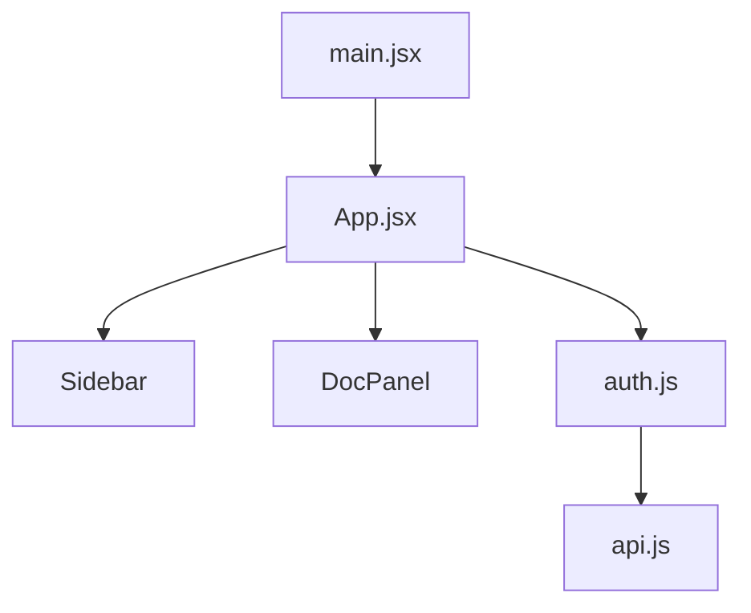

# Project Architecture Document - Feature Specification

## Overview

Generate a comprehensive **project-level architecture document** using the graph analysis data. Unlike per-file documentation, this creates a single document describing the entire project structure, module organization, and dependency flow.

## Problem Statement

The current graph analysis captures file relationships (imports, exports, dependencies) but doesn't leverage this data meaningfully. Individual file docs don't benefit significantly from knowing "this file is imported by X, Y, Z" without actual context.

**Solution:** Use the graph metadata to generate a holistic architecture document that provides real value from the cross-file analysis.

## User Value

- **Project onboarding** - New developers can understand project structure quickly
- **Documentation completeness** - Projects get architecture docs without manual writing
- **Leverages existing work** - Makes the graph engine investment worthwhile

---

## Feature Design

### 1. Trigger Points

**Option A: Automatic (Recommended)**
- Generate architecture doc automatically after graph analysis completes
- Included as first item in batch generation flow

**Option B: Manual**
- Button on Project Details page: "Generate Architecture Doc"
- Regenerate when user requests

### 2. Output Locations

#### 2.1 Batch Summary
- Architecture doc appears as **first entry** in batch summary table
- Special row styling to distinguish from individual files
- Links to view the full document

```markdown
## Batch Summary

| File | Doc Type | Quality | Grade |
|------|----------|---------|-------|
| **Project Architecture** | ARCHITECTURE | 92 | A |
| src/auth.js | README | 85 | B |
| src/utils.js | JSDOC | 78 | C |
```

#### 2.2 Workspace Sidebar
- Listed under the Project section (ProjectGraphInfo component)
- Clickable to view in DocPanel
- Visual indicator (e.g., different icon) to distinguish from regular files

```
▼ My Project                    [Active]
  📐 Project Architecture        <- New
  12 files • Analyzed 2h ago
```

#### 2.3 Project Details Page
- Display in the Graph Analysis section
- "View Architecture Doc" button
- Shows generation date and quality score

### 3. Data Model

#### 3.1 Storage Option A: Separate Table
```sql
CREATE TABLE project_architecture_docs (
  id SERIAL PRIMARY KEY,
  project_id INTEGER REFERENCES projects(id) ON DELETE CASCADE,
  graph_id VARCHAR(32) REFERENCES project_graphs(graph_id),
  documentation TEXT NOT NULL,
  quality_score INTEGER,
  generated_at TIMESTAMP DEFAULT NOW(),
  UNIQUE(project_id)
);
```

#### 3.2 Storage Option B: Column on project_graphs
```sql
ALTER TABLE project_graphs
ADD COLUMN architecture_doc TEXT,
ADD COLUMN architecture_quality_score INTEGER,
ADD COLUMN architecture_generated_at TIMESTAMP;
```

**Recommendation:** Option B (simpler, architecture doc is tied to specific graph version)

### 4. LLM Input

Send graph metadata (NOT code) to minimize tokens:

```json
{
  "projectName": "my-project",
  "fileCount": 47,
  "totalFunctions": 156,
  "totalClasses": 23,
  "totalExports": 89,
  "nodes": [
    {
      "path": "src/services/auth.js",
      "exports": ["login", "logout", "validateToken"],
      "functions": ["login", "logout", "validateToken", "hashPassword"],
      "classes": [],
      "dependentCount": 5,
      "dependencyCount": 2
    }
  ],
  "edges": [
    { "from": "src/app.js", "to": "src/services/auth.js", "specifiers": ["login"] }
  ],
  "entryPoints": ["src/index.js", "src/main.jsx"]
}
```

### 5. Expected Output

```markdown
# Project Architecture: my-project

## Overview
A React + Express full-stack application with 47 files organized into 6 main modules.
The project follows a service-oriented architecture with clear separation between
UI components and business logic.

## Project Structure

### Entry Points
- `src/main.jsx` - React application entry point
- `server/src/index.js` - Express server entry point

### Module Organization

#### `/src/services` (8 files)
Core business logic services:
- **auth.js** - Authentication (login, logout, validateToken) - imported by 5 files
- **docGenerator.js** - Documentation generation - imported by 3 files
- **api.js** - External API communication

#### `/src/components` (15 files)
React UI components:
- **App.jsx** - Main application container
- **Sidebar/** - Navigation and file management
- **DocPanel/** - Documentation display

#### `/server/src/routes` (6 files)
API endpoints:
- **api.js** - Core generation endpoints
- **auth.js** - Authentication routes

## Dependency Flow



## Key Patterns

1. **Service Layer** - Business logic isolated in /services
2. **Component Composition** - UI built from reusable components
3. **Route Handlers** - Express routes delegate to services

## Statistics
- **Files:** 47
- **Functions:** 156
- **Classes:** 23
- **Internal Dependencies:** 89
```

### 6. Quality Scoring

Use ARCHITECTURE doc type scoring criteria:
- System overview clarity (20 points)
- Component documentation (25 points)
- Dependency documentation (20 points)
- Diagram quality (20 points)
- Pattern identification (15 points)

---

## Implementation Phases

### Phase 1: Core Generation
- [ ] Create architecture prompt template
- [ ] Add `generateArchitectureDoc(graphId)` to docGenerator
- [ ] Store result on project_graphs table
- [ ] API endpoint: `POST /api/graph/:id/architecture`

### Phase 2: Batch Integration
- [ ] Generate architecture doc during batch generation (after graph analysis)
- [ ] Include in batch summary as first entry
- [ ] Link architecture doc to batch record

### Phase 3: UI Integration
- [ ] Add to ProjectGraphInfo sidebar component
- [ ] Display on Project Details page
- [ ] View in DocPanel when clicked

### Phase 4: Regeneration & Updates
- [ ] "Regenerate" button on Project Details
- [ ] Auto-regenerate when graph is re-analyzed
- [ ] Track version history (optional)

---

## Open Questions

1. Should architecture doc count against usage quota? (Recommendation: Yes, counts as 1 generation)
2. Should it be generated for small projects (< 5 files)? (Recommendation: Optional, user can skip)
3. Include in export/download? (Recommendation: Yes, as PROJECT_ARCHITECTURE.md)

---

## Dependencies

- Requires: Graph Engine (Epic 5.4) ✅ Complete
- Requires: Project entity ✅ Complete
- Requires: Batch summary system ✅ Complete

## Estimated Effort

- Backend: 1-2 days
- Frontend: 1-2 days
- Testing: 0.5 days
- **Total: 3-4 days**
