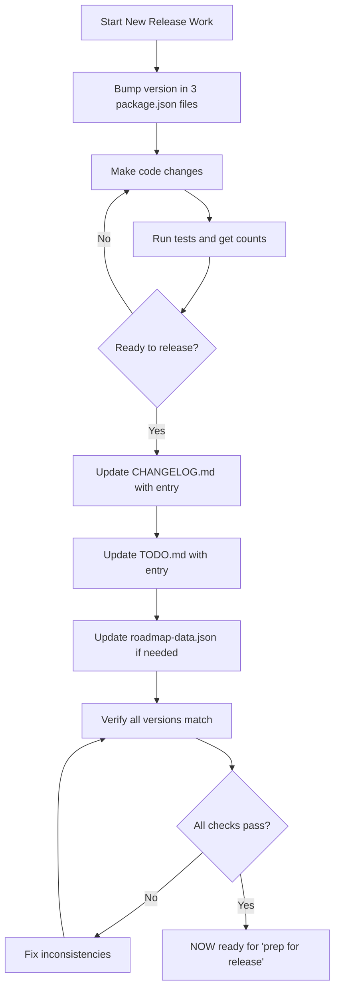

# Release Checklist

**Purpose:** Automated checklist that runs when you say "prep for release"

**Last Updated:** November 2, 2025

---

## 🎯 Complete Release Workflow

### Recommended: Bump Version AFTER Each Release

This keeps version numbers clean and git history clear:

```bash
# 1. Complete your work on v2.4.4
# 2. Say "prep for release"
# 3. Claude updates CHANGELOG.md, TODO.md, test counts, etc.
# 4. Review changes and commit
git add -A
git commit -m "chore: v2.4.4 - Contact Sales feature with complete test coverage"
git push origin main

# 5. IMMEDIATELY bump to next version
# Edit package.json files: 2.4.4 → 2.4.5
git add package.json client/package.json server/package.json
git commit -m "chore: bump version to v2.4.5"
git push

# 6. Now work on v2.4.5 features
```

**Why this works:**
- ✅ Clear separation between releases in git history
- ✅ Version in package.json always shows "what's coming next"
- ✅ No confusion about what version you're working on
- ✅ Can do emergency hotfixes without version conflicts

### Alternative: Bump Version BEFORE Starting Work

```bash
# 1. Decide to start new work
# 2. Bump version first (e.g., 2.4.4 → 2.4.5)
git add package.json client/package.json server/package.json
git commit -m "chore: bump version to v2.4.5"

# 3. Work on features
# 4. Say "prep for release" when done
# 5. Commit and push
```

---

## 🎯 Quick Release Process

**You do:** Bump version in package.json files (root, client, server)
**You say:** "prep for release"
**Claude does:** Everything below automatically

---

## ✅ Automated "Prep for Release" Process

When you say "prep for release", Claude will automatically:

### 1. Get Current Test Counts

Runs:
```bash
cd client && npm test -- --run 2>&1 | grep "Tests:"
cd server && npm test 2>&1 | grep "Tests:"
```

### 2. Verify Version Consistency

Checks that all 3 package.json files have the same version:
```bash
grep '"version"' package.json client/package.json server/package.json
```

### 3. Check for Missing Versions

Verifies no version gaps exist (e.g., if v2.4.2 and v2.4.3 exist in git, they're documented):
```bash
git log --oneline --grep="version" | head -20
grep "## \[2\.4\." CHANGELOG.md
grep "### v2\.4\." docs/planning/TODO.md
```

### 4. Update CHANGELOG.md

Adds new version entry at top of `/CHANGELOG.md` using this format:
```markdown
## [X.Y.Z] - YYYY-MM-DD

**Status:** ✅ [Brief Status Description]

### Added
- **Feature Name**
  - Feature detail 1
  - Feature detail 2

### Fixed
- **Bug Name**
  - Fix detail 1
  - Fix detail 2

### Changed
- **Change Description**
  - Change detail 1

### Documentation
- Document 1 created/updated
- Document 2 created/updated

### Test Coverage
- Frontend: X passed | Y skipped (Z total)
- Backend: X passed | Y skipped (Z total)
- **Total: X passed | Y skipped (Z total) - XX.X% pass rate**

---
```

**What gets included:**
- Date in YYYY-MM-DD format
- All features/fixes/changes made in this release
- Test counts and pass rate from step 1
- Links to new/updated documentation
- Verification that no versions were skipped

---

### 5. Update TODO.md

Adds new version section in `/docs/planning/TODO.md` using this format:
```markdown
### vX.Y.Z - Release Title

**Completed:** Month Day, Year
**Status:** ✅ **[COMPLETE/DEPLOYED]** - Brief description
**Goal:** One-sentence goal

#### Completed Items (All ✅)

**Category Name:**
- [x] Item 1
- [x] Item 2
- [x] Item 3

**Test Coverage (if applicable):**
- [x] Test file 1 - X tests (description)
- [x] Test file 2 - Y tests (description)

**Documentation:**
- [x] Document 1 - Purpose
- [x] Document 2 - Purpose

**Final Metrics:**
- X,XXX tests (X,XXX passing, XX skipped) - XX.X% pass rate
- Frontend: X passing | Y skipped (Z total)
- Backend: X passing | Y skipped (Z total)

**Release:** vX.Y.Z (Month Day, Year)

**Reference Documentation:**
- [Document 1](../../path/to/doc.md) - Description
- [Document 2](../../path/to/doc.md) - Description

---
```

**What gets included:**
- Completed items with checkboxes
- Test counts and metrics
- Links to new/updated documentation
- Updates "Last Updated" date in header
- Maintains chronological order

---

### 6. Update roadmap-data.json (if needed)

**Location:** `/docs/planning/roadmap/roadmap-data.json`

**When to update:**
- New features that are part of an epic
- Significant bug fixes worth highlighting
- Test coverage updates for major releases

**Checklist:**
- [ ] Find the relevant version entry in the "Done" phase
- [ ] Update test counts if changed
- [ ] Add new feature bullets if applicable
- [ ] Keep features concise (1 line each)

**Format:**
```json
{
  "version": "vX.Y.Z",
  "title": "Release Title",
  "features": [
    "Feature description",
    "Test counts: X,XXX tests (X,XXX passing, XX skipped) - XX.X% pass rate"
  ]
}
```

---

### 5. CLAUDE.md Version History (OPTIONAL - Only for notable releases)

**Location:** `/claude.md`

**When to update:**
- Major releases (v2.0, v2.4, etc.)
- Significant feature additions
- Critical bug fixes

**Checklist:**
- [ ] Update `**Current: vX.Y.Z**` section
- [ ] Add brief entry to `<details>` collapsed section if notable
- [ ] Keep entries concise (2-3 lines max)

---

## Verification Before "Prep for Release"

Run these checks to verify everything is consistent:

```bash
# 1. Check all versions match
grep '"version"' package.json client/package.json server/package.json

# 2. Verify CHANGELOG has this version
grep "## \[$(node -p "require('./package.json').version")\]" CHANGELOG.md

# 3. Verify TODO.md has this version
grep "### v$(node -p "require('./package.json').version")" docs/planning/TODO.md

# 4. Check git status
git status --short

# 5. Verify test counts are current
cd client && npm test -- --run 2>&1 | grep "Tests:" && cd ..
cd server && npm test 2>&1 | grep "Tests:" && cd ..
```

**All checks must pass before proceeding!**

---

## Common Mistakes to Avoid

### ❌ Don't Do This:
1. **Skipping version numbers** - If v2.4.2 and v2.4.3 were deployed, they MUST be documented
2. **Inconsistent test counts** - Always run tests before documenting counts
3. **Missing CHANGELOG entries** - Every version bump needs a CHANGELOG entry
4. **Outdated TODO.md** - Last Updated date must match current release
5. **Version mismatches** - All 3 package.json files must have same version

### ✅ Do This Instead:
1. **Document every version** - Even minor hotfixes get an entry
2. **Run tests first** - Get accurate counts before documenting
3. **Update both files** - CHANGELOG.md AND TODO.md for every release
4. **Keep versions in sync** - Use grep commands to verify
5. **Check git history** - Use `git log --grep="version"` to find all versions

---

## Quick Commands

**When starting a new release:**
```bash
# 1. Get current version
node -p "require('./package.json').version"

# 2. Get test counts
cd client && npm test -- --run 2>&1 | grep "Tests:"
cd server && npm test 2>&1 | grep "Tests:"

# 3. Check what versions are documented
grep "## \[2\." CHANGELOG.md
grep "### v2\." docs/planning/TODO.md
```

**When finishing a release:**
```bash
# Verify everything is consistent
./scripts/verify-release.sh  # TODO: Create this script
```

---

## Process Flow



---

## Automation Ideas (Future)

Consider creating scripts to automate verification:

1. **verify-release.sh** - Check all files are updated consistently
2. **generate-changelog.sh** - Generate CHANGELOG template from git commits
3. **update-docs.sh** - Update version numbers across all files
4. **pre-commit hook** - Verify version consistency before commits

---

## When You Forget

**If you realize you skipped documenting v2.4.2 and v2.4.3:**

1. Check git history:
   ```bash
   git log --oneline --grep="2.4.2"
   git log --oneline --grep="2.4.3"
   ```

2. Get commit details:
   ```bash
   git show <commit-hash> --stat
   git show <commit-hash>:CHANGELOG.md  # If it existed
   ```

3. Add missing entries to CHANGELOG.md and TODO.md in chronological order

4. Update current release checklist to include the missing versions

---

## Summary

**Your complete workflow:**

1. **Work on features** (version already bumped to next number)
2. **Say "prep for release"** when done
3. **Review and commit** the changes Claude made
4. **Push to GitHub** (triggers CI/CD → deploys to production)
5. **Immediately bump version** to next number
6. **Commit and push** version bump
7. **Repeat** for next release

**What Claude does automatically when you say "prep for release":**
- ✅ Runs tests and gets counts
- ✅ Verifies version consistency
- ✅ Checks for missing versions in git history
- ✅ Updates CHANGELOG.md with formatted entry
- ✅ Updates TODO.md with completed items
- ✅ Updates roadmap-data.json (if needed)
- ✅ Provides release summary

**No manual checklist to remember!** Just follow the workflow at the top of this document.

---

**Pro Tip:** After each release, immediately bump the version. This keeps your git history clean and makes it clear what version you're working toward.
