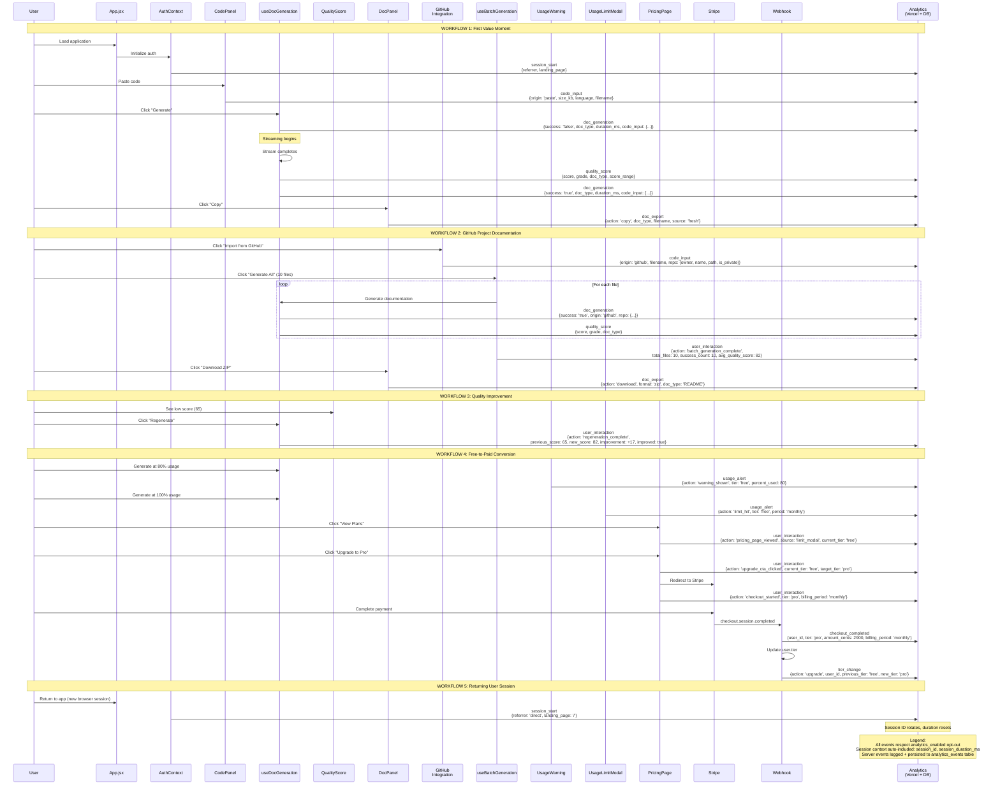
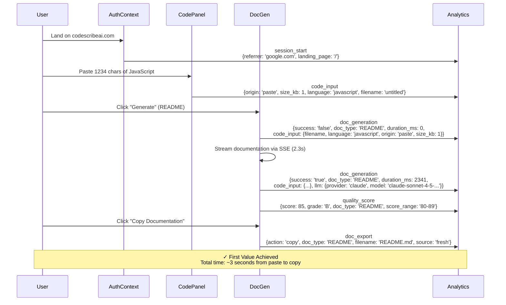
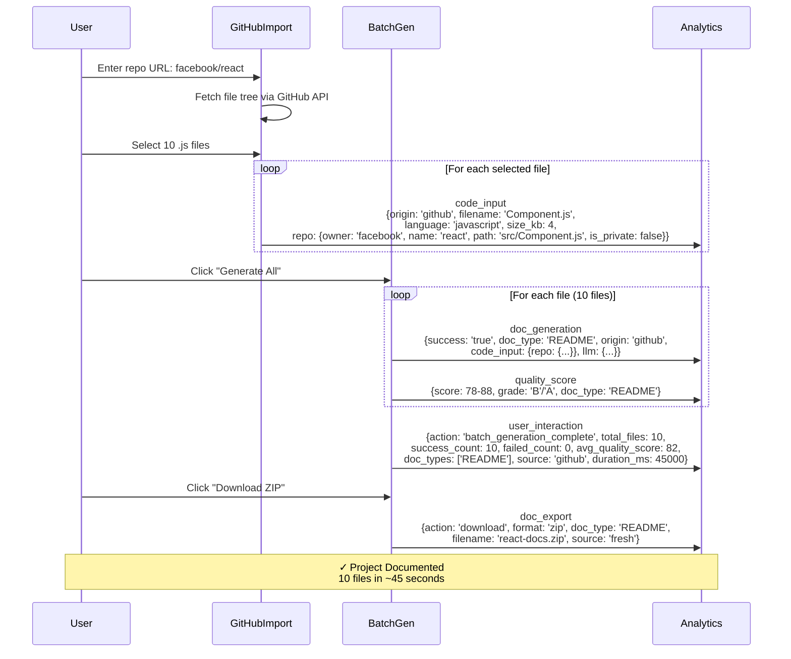
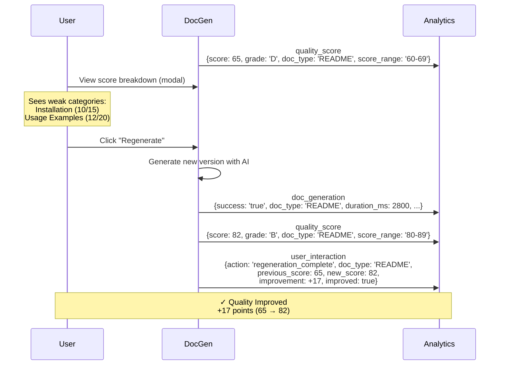
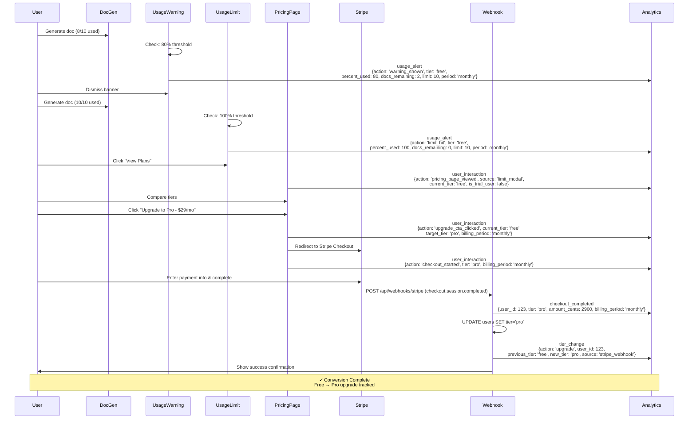
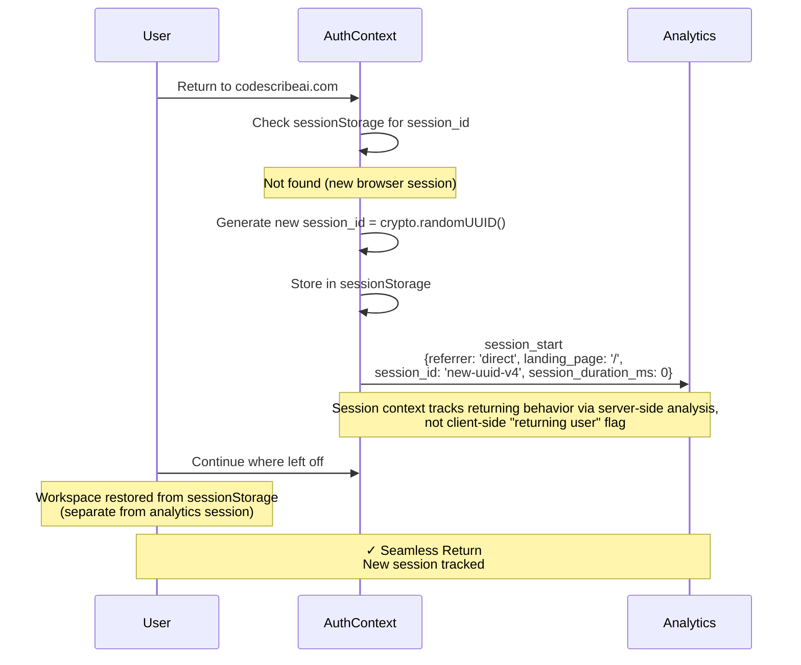

# Workflow Eventing Flow - Actual Implementation

> **Purpose:** Visual representation of analytics event tracking for CodeScribe AI's 5 core workflows
>
> **Status:** ✅ **IMPLEMENTED** in v3.3.4 (January 6, 2026)
> **Reference:** [WORKFLOW-OUTCOME-METRICS-PLAN.md](./WORKFLOW-OUTCOME-METRICS-PLAN.md) | [analytics.js](../../client/src/utils/analytics.js)

---

## Complete Eventing Flow - All Workflows

This diagram shows how all 5 core workflows integrate together with their actual implemented event tracking:



---

## Workflow 1: First Value Moment (Critical Path)

**Business Outcome:** Eliminate Documentation Time Tax (< 3 min from paste to copy)

**Implemented Events:** `session_start` → `code_input` → `doc_generation` (×2) → `quality_score` → `doc_export`



**Key Funnel Stages:**
1. **Entry:** `session_start` (100%)
2. **Engage:** `code_input` (~70% of sessions)
3. **Commit:** `doc_generation` with success: 'false' (~66%)
4. **Value Delivered:** `doc_generation` with success: 'true' + `quality_score` (~62%)
5. **Value Captured:** `doc_export` action: 'copy' or 'download' (~57%)

**Session Context (Auto-Added to All Events):**
```javascript
{
  session_id: "550e8400-e29b-41d4-a716-446655440000",
  session_duration_ms: 45230
  // is_internal flag added server-side via user lookup
}
```

---

## Workflow 2: GitHub Project Documentation

**Business Outcome:** Documentation Coverage (80%+ of codebase documented)

**Implemented Events:** `code_input` (origin: 'github') → `doc_generation` (×N) → `user_interaction` (batch_generation_complete) → `doc_export` (download)



**Key Metrics from Events:**
- Files per batch: `user_interaction.total_files`
- Batch success rate: `success_count / total_files`
- Average quality: `avg_quality_score`
- Source distribution: `code_input.origin` (github vs upload vs paste)

---

## Workflow 3: Documentation Quality Improvement

**Business Outcome:** Consistent Documentation Quality (> 85% score 80+)

**Implemented Events:** `quality_score` (low score) → `user_interaction` (regeneration_complete)



**Regeneration Success Metrics:**
```sql
-- Query from analytics_events
SELECT
  COUNT(*) FILTER (WHERE (event_data->>'improved')::boolean = true) * 100.0 / COUNT(*) as success_rate,
  AVG((event_data->>'improvement')::numeric) as avg_improvement
FROM analytics_events
WHERE event_name = 'user_interaction'
  AND event_data->>'action' = 'regeneration_complete'
  AND created_at >= NOW() - INTERVAL '7 days'
```

**Target:** > 80% of regenerations show `improved: true`

---

## Workflow 4: Free-to-Paid Conversion

**Business Outcome:** Sustainable Business Model (> 5% conversion in 30 days)

**Implemented Events:** Full conversion funnel with 7 touch points



**Conversion Funnel Stages:**

| Stage | Event | Typical Drop-off |
|-------|-------|------------------|
| 1. Usage Warning | `usage_alert` (warning_shown) | Baseline |
| 2. Usage Limit | `usage_alert` (limit_hit) | ~60% see limit |
| 3. View Pricing | `user_interaction` (pricing_page_viewed) | ~40% view pricing |
| 4. Click Upgrade | `user_interaction` (upgrade_cta_clicked) | ~25% click CTA |
| 5. Start Checkout | `user_interaction` (checkout_started) | ~20% start checkout |
| 6. Complete Payment | `checkout_completed` | ~15% complete |
| 7. Tier Upgraded | `tier_change` (action: 'upgrade') | ~15% fully upgraded |

**Conversion Rate Calculation:**
```sql
WITH limits AS (
  SELECT DISTINCT user_id
  FROM analytics_events
  WHERE event_name = 'usage_alert'
    AND event_data->>'action' = 'limit_hit'
    AND created_at >= NOW() - INTERVAL '30 days'
),
upgrades AS (
  SELECT DISTINCT user_id
  FROM analytics_events
  WHERE event_name = 'tier_change'
    AND event_data->>'action' = 'upgrade'
    AND created_at >= NOW() - INTERVAL '30 days'
)
SELECT
  COUNT(DISTINCT l.user_id) as hit_limit,
  COUNT(DISTINCT u.user_id) as upgraded,
  ROUND(COUNT(DISTINCT u.user_id) * 100.0 / NULLIF(COUNT(DISTINCT l.user_id), 0), 2) as conversion_rate_percent
FROM limits l
LEFT JOIN upgrades u ON l.user_id = u.user_id
```

**Target:** > 5% conversion (limit_hit → tier_change upgrade)

---

## Workflow 5: Returning User Session

**Business Outcome:** Repeat Value Delivery (retention)

**Implemented Events:** `session_start` (new session ID each time)



**Session Behavior:**
- **session_id:** Generated via `crypto.randomUUID()`, stored in `sessionStorage`
- **Lifetime:** Persists across page refreshes, cleared on tab close
- **Returning Users:** Identified server-side by joining `session_id` to `user_id` across multiple `session_start` events over time

**Retention Analysis (Server-Side):**
```sql
WITH user_sessions AS (
  SELECT
    user_id,
    COUNT(DISTINCT session_id) as session_count,
    MIN(created_at) as first_session,
    MAX(created_at) as last_session
  FROM analytics_events
  WHERE event_name = 'session_start'
    AND user_id IS NOT NULL
  GROUP BY user_id
)
SELECT
  AVG(session_count) as avg_sessions_per_user,
  COUNT(*) FILTER (WHERE session_count > 1) * 100.0 / COUNT(*) as returning_user_rate
FROM user_sessions
```

---

## Event Metadata Schema

### Client-Side Events (Vercel Analytics + Backend)

All events automatically include session context via `withSessionContext()`:

```javascript
{
  // Event-specific data
  action: "pricing_page_viewed",
  source: "limit_modal",
  current_tier: "free",

  // Session context (auto-added by withSessionContext)
  session_id: "550e8400-e29b-41d4-a716-446655440000",
  session_duration_ms: 45230,

  // Timestamp (auto-added by analytics platform)
  timestamp: "2026-01-09T10:23:45.123Z"

  // Server adds after user lookup (when persisting to DB):
  // is_internal: false (based on user.role or subscriptions.tier_override)
}
```

### Server-Side Events (Database Only)

Webhook events tracked via `serverAnalytics.js`:

```javascript
{
  // Event-specific data
  user_id: 123,
  tier: "pro",
  amount_cents: 2900,
  billing_period: "monthly",

  // Server context (added by serverAnalytics)
  timestamp: "2026-01-09T10:23:45.123Z",
  type: "analytics_event",
  event: "checkout_completed"

  // Persisted to analytics_events table:
  // event_name: 'checkout_completed'
  // event_data: {user_id, tier, amount_cents, billing_period}
  // user_id: 123
  // is_internal: false (checked during recordEvent)
}
```

---

## Analytics Opt-Out Support

**CRITICAL:** All events respect user's `analytics_enabled` preference (GDPR/CCPA compliance).

### How It Works

1. **User Setting:** Privacy page toggle sets `users.analytics_enabled = false`
2. **Sync to Client:** `AuthContext` calls `setAnalyticsOptOut(user.analytics_enabled === false)`
3. **Track Gating:** `isAnalyticsEnabled()` checks:
   ```javascript
   const isAnalyticsEnabled = () => {
     if (!isProduction) return false;  // Never track in dev
     if (analyticsOptedOut) return false;  // Respect user opt-out
     return true;
   };
   ```
4. **Event Behavior:**
   - **Opted In (default):** Events sent to Vercel Analytics + Backend API
   - **Opted Out:** Events silently skipped (no tracking, no logging)
   - **Development:** Events logged to console only

### Scope of Opt-Out

| Data | Opted Out | Opted In |
|------|-----------|----------|
| Vercel Analytics (client events) | ❌ Not tracked | ✅ Tracked |
| Backend API (analytics_events table) | ❌ Not persisted | ✅ Persisted |
| Console logs (development) | ✅ Still logged | ✅ Logged |
| Operational data (generations, quality_scores in generations table) | ✅ Still stored* | ✅ Stored |

*Operational data (e.g., `generations` table with quality_scores, `usage_quotas` table) is required to provide the service and is NOT covered by analytics opt-out. Only the `analytics_events` table respects opt-out.

---

## Implementation Status

| Workflow | Events Implemented | Dashboard Visualization | Status |
|----------|-------------------|------------------------|--------|
| 1. First Value Moment | 5 events (session_start, code_input, doc_generation ×2, quality_score, doc_export) | Conversion funnel chart | ✅ Live |
| 2. GitHub Import | 4 events (code_input, doc_generation ×N, user_interaction batch_complete, doc_export) | Code input breakdown, batch stats | ✅ Live |
| 3. Quality Improvement | 3 events (quality_score, doc_generation, user_interaction regeneration_complete) | Quality score distribution | ✅ Live |
| 4. Free-to-Paid | 7 events (usage_alert ×2, user_interaction ×3, checkout_completed, tier_change) | Business metrics tab | ✅ Live |
| 5. Returning User | 1 event (session_start) | Sessions over time trend | ✅ Live |

**Total Events Implemented:** 13 unique event types, 20+ action variants

**Shipped:** v3.3.4 (January 6, 2026)

---

## Testing Checklist

### Manual Testing (✅ Completed)

- [x] **Workflow 1:** Load app → paste code → generate → copy (verified 5 events fire)
- [x] **Workflow 2:** Import GitHub repo → batch generate → download (verified 4+ events)
- [x] **Workflow 3:** Generate → regenerate (verified score comparison event)
- [x] **Workflow 4:** Hit limit → view pricing → upgrade (verified 7-event funnel)
- [x] **Workflow 5:** Return to app (verified new session_start)

### Opt-Out Testing (✅ Completed)

- [x] Anonymous user: Events fire normally to Vercel + Backend
- [x] Authenticated user with `analytics_enabled: true`: Events fire
- [x] Authenticated user with `analytics_enabled: false`: Events silently skipped
- [x] Toggle analytics in settings: Opt-out state syncs immediately via AuthContext

### Integration Tests (✅ Completed)

**Test Coverage:**
- `client/src/utils/__tests__/analytics.test.js` - 12 tests (session, opt-out, context)
- `server/src/services/__tests__/analyticsService.test.js` - 64 tests (queries, internal detection, tier changes)
- `server/src/routes/__tests__/admin-analytics.test.js` - 5 API endpoint tests

**Example Test:**
```javascript
describe('Event Tracking Integration', () => {
  it('tracks complete first value funnel', async () => {
    // Session start
    render(<App />);
    expect(track).toHaveBeenCalledWith('session_start', expect.objectContaining({
      referrer: expect.any(String),
      landing_page: '/',
    }));

    // Code input
    const codeEditor = screen.getByRole('textbox');
    await user.type(codeEditor, 'function test() { return 42; }');
    expect(track).toHaveBeenCalledWith('code_input', expect.objectContaining({
      origin: 'paste',
      language: 'javascript',
    }));

    // Generation
    const generateBtn = screen.getByRole('button', { name: /generate/i });
    await user.click(generateBtn);
    expect(track).toHaveBeenCalledWith('doc_generation', expect.objectContaining({
      success: 'true',
      doc_type: 'README',
    }));

    // Copy
    const copyBtn = await screen.findByRole('button', { name: /copy/i });
    await user.click(copyBtn);
    expect(track).toHaveBeenCalledWith('doc_export', expect.objectContaining({
      action: 'copy',
      source: 'fresh',
    }));
  });
});
```

---

## See Also

### Documentation
- [WORKFLOW-FIRST-PRD-EXAMPLE-CODESCRIBE.md](../templates/WORKFLOW-FIRST-PRD-EXAMPLE-CODESCRIBE.md) - Original workflow definitions with journey maps
- [WORKFLOW-OUTCOME-METRICS-PLAN.md](./WORKFLOW-OUTCOME-METRICS-PLAN.md) - Complete implementation guide (this doc references)

### Implementation
- [client/src/utils/analytics.js](../../client/src/utils/analytics.js) - 13 tracking functions, session management, opt-out support (~660 lines)
- [server/src/utils/serverAnalytics.js](../../server/src/utils/serverAnalytics.js) - Server-side webhook tracking (~125 lines)
- [server/src/services/analyticsService.js](../../server/src/services/analyticsService.js) - 7 query methods for dashboard (~800 lines)
- [client/src/pages/admin/Analytics.jsx](../../client/src/pages/admin/Analytics.jsx) - Dashboard with 3 tabs, Recharts visualizations (~900 lines)

### Database
- [Migration 046](../../server/src/db/migrations/046-create-analytics-events-table.sql) - analytics_events table schema
- [Migration 050](../../server/src/db/migrations/050-update-analytics-event-categories.sql) - Event category reclassification (funnel → workflow)

### Related Guides
- [Vercel Analytics Docs](https://vercel.com/docs/analytics) - Platform documentation
- [CHANGELOG.md](../../CHANGELOG.md) - See v3.3.4, v3.3.5, v3.3.7, v3.3.8 release notes for analytics updates

---

**Document Status:** ✅ Complete - Reflects v3.3.4+ actual implementation
**Last Updated:** January 9, 2026
**Maintainer:** CodeScribe AI Team
