```mermaid
flowchart TD
    A[Support Receives Ticket] --> B[Navigate to User Profile]
    B --> C[View Trial History]
    C --> D{Has Previous Trials?}
    D -->|No| E[✓ Grant Trial Normally]
    D -->|Yes| F[Click Grant Trial]
    F --> G[Fill Form: Tier + Duration + Reason]
    G --> H[Submit]
    H --> I{Eligibility Check}
    I -->|Eligible| E
    I -->|Ineligible| J[⚠️ Show Warning + Trial History]
    J --> K{Admin Decision}
    K -->|Cancel| L[Close Modal, Contact User]
    K -->|Force Grant| M[Check Force Checkbox]
    M --> N[Enter Detailed Justification]
    N --> O{Reason Length OK?}
    O -->|<20 chars| P[❌ Validation Error]
    O -->|≥20 chars| Q[✓ Force Grant Trial]
    Q --> R[Log to Audit: forced=true]
    R --> S[Send Success Email to User]
    S --> T[✓ Ticket Resolved]

    style E fill:#10b981,color:#fff
    style Q fill:#f59e0b,color:#fff
    style T fill:#10b981,color:#fff
    style P fill:#ef4444,color:#fff
```

# Trial Eligibility Enhancement PRD

**Project Name:** Flexible Trial Eligibility System
**Status:** 📋 Planning
**Timeline:** 3-phase rollout (sequenced by business priority)
**Timezone:** EST/EDT
**Version:** 1.0
**Last Updated:** January 14, 2026

**Related Documents:**
- [TECHNICAL-SPEC.md](./TECHNICAL-SPEC.md) - Technical implementation details and database schema
- [ANALYTICS-OPTIMIZATION.md](./ANALYTICS-OPTIMIZATION.md) - Event tracking optimization (15 → 3 events)

---

## 🎯 Business Context

### Problem Statement

**Current State:** Users can only redeem one trial per lifetime. If a user tried CodeScribe 6 months ago with a 14-day Pro trial and it expired, they CANNOT redeem a new campaign code (e.g., "COMEBACK30" for 30-day Team trial). Their only option is to contact support and request admin intervention.

**Who's Affected:**
- **Growth team** cannot run re-engagement campaigns for lapsed users
- **Support team** handles increasing volume of "can't redeem trial" tickets
- **Lapsed users** cannot self-serve re-engage with new features/tiers
- **Admins** lack visibility into why users are ineligible and how to override safely

**Cost of Inaction:**
- Lost re-activation opportunities: ~30% of trial users churn without trying new features
- Support burden: 15-20% of trial-related tickets are eligibility issues
- Inconsistent rules: Campaign trials are strict (one per lifetime), but admin-granted trials are lenient (only block active trials)
- Growth strategy limited: Cannot run seasonal promotions, tier-upgrade campaigns, or win-back initiatives

### Target Outcome

Enable growth team to re-engage lapsed users with flexible trial campaigns while preventing abuse, reducing support burden by 50%, and maintaining trial conversion quality.

### Value Proposition

**For Growth Teams:** Run targeted re-engagement campaigns with customizable eligibility rules (new users only, lapsed users after cooldown, tier-specific trials)

**For Support Teams:** Transparent trial history and force-grant capability with audit trail reduces manual intervention time

**For Users:** Clear feedback on trial eligibility with predictable rules and self-serve re-engagement path

---

## 📊 Business Outcomes

### Outcome 1: Enable Re-Engagement Growth
- **Current State:** Cannot offer trials to users who previously expired (100% blocked after first trial)
- **Desired State:** Growth team can run campaigns allowing previous trial users to re-engage after cooldown
- **Success Metric:** Re-engagement campaign adoption rate
- **Baseline → Target:** 0 re-engagement campaigns → 2-4 campaigns per quarter with 15%+ redemption rate

### Outcome 2: Reduce Support Burden
- **Current State:** 15-20% of trial tickets are "can't redeem code" eligibility issues requiring manual admin grants
- **Desired State:** Users see clear eligibility feedback and admins have self-serve override tools with audit trail
- **Success Metric:** Support ticket volume reduction
- **Baseline → Target:** ~50 eligibility tickets/month → <25 tickets/month (-50%)

### Outcome 3: Maintain Trial Quality
- **Current State:** Inconsistent rules (campaign=strict, admin=lenient) create abuse potential
- **Desired State:** Consistent, configurable rules prevent abuse while allowing legitimate use cases
- **Success Metric:** Trial-to-paid conversion rate
- **Baseline → Target:** Maintain or improve current 18% conversion rate despite increased trial volume

### Outcome 4: Increase Trial Attribution Accuracy
- **Current State:** Cannot distinguish first-time trials from re-engagement trials in analytics
- **Desired State:** Clear trial source tracking (new user, returning user, forced admin grant) for ROI analysis
- **Success Metric:** Attribution accuracy
- **Baseline → Target:** 0% source attribution → 100% trials tagged with source and eligibility context

---

## 👤 User Personas & Jobs-to-Be-Done

### Persona 1: Growth Lead (Campaign Manager)

**Context:** Responsible for user acquisition and re-engagement campaigns. Needs to hit quarterly MAU and conversion targets. Currently limited to "new users only" campaigns, missing re-activation opportunities.

**Core Job:** When planning quarterly campaigns, I want to target lapsed users with trial offers, so I can re-activate churned users and improve LTV.

**Job Map:**
1. **Define:** Identify target segment (new users, lapsed 90+ days, never tried Team tier)
2. **Locate:** Find campaign templates or settings to configure eligibility
3. **Prepare:** Create campaign code with specific rules (tier, duration, eligibility)
4. **Confirm:** Preview who will be eligible before launching
5. **Execute:** Launch campaign, monitor redemption rates
6. **Monitor:** Track conversion funnel from redemption → activation → subscription
7. **Resolve:** Adjust eligibility or messaging if redemption/conversion is low
8. **Conclude:** Measure campaign ROI and document learnings

**Pain Points in Current Workflow:**
- Cannot create "lapsed user" campaigns - blocked by one-trial-per-lifetime rule
- No visibility into how many users are eligible vs. blocked
- Cannot A/B test different eligibility rules (90 days vs. 180 days cooldown)
- Manual workaround: Admin force-grants trials individually (doesn't scale)

**Success Criteria:**
- "I know this works when I can launch a COMEBACK30 campaign and see lapsed users successfully redeem codes after 90-day cooldown."

---

### Persona 2: Lapsed User (Re-engagement Target)

**Context:** Tried CodeScribe Pro 6 months ago during onboarding, used basic features but didn't convert. Saw email about new Team collaboration features and wants to try them before committing.

**Core Job:** When I see a re-engagement campaign, I want to easily redeem the trial code, so I can test new features before deciding to subscribe.

**Job Map:**
1. **Define:** Receive email/ad with campaign code for new features
2. **Locate:** Navigate to trial redemption page
3. **Prepare:** Log into account (or sign up if new)
4. **Confirm:** Enter campaign code
5. **Execute:** Redeem code
6. **Monitor:** See trial status (tier, days remaining)
7. **Resolve:** Handle errors if code doesn't work
8. **Conclude:** Either convert to paid or trial expires

**Pain Points in Current Workflow:**
- Enters valid campaign code → ❌ Error: "You have already used a trial"
- No clear feedback on WHY ineligible (expired 6 months ago)
- No alternative path (e.g., "Trial available again in X days")
- Forced to contact support → high friction → abandons

**Success Criteria:**
- "I know this works when I can redeem COMEBACK30 code 90 days after my Pro trial expired and immediately access Team features."

---

### Persona 3: Admin/Support Agent

**Context:** Handles escalations where users report "can't redeem trial code" errors. Currently must manually check trial history, verify reason is legitimate, then force-grant trial with no audit trail.

**Core Job:** When a user contacts support about trial eligibility, I want to quickly see their history and safely override restrictions, so I can resolve tickets efficiently with accountability.

**Job Map:**
1. **Define:** User reports "code doesn't work" - need to investigate eligibility
2. **Locate:** Navigate to user's profile in admin dashboard
3. **Prepare:** Review trial history (when, what tier, what source)
4. **Confirm:** Verify issue is legitimate (not abuse attempt)
5. **Execute:** Force-grant trial with documented reason
6. **Monitor:** Confirm trial appears in user's account
7. **Resolve:** If user has multiple trials, investigate abuse pattern
8. **Conclude:** Log reason in audit trail, close ticket

**Pain Points in Current Workflow:**
- No trial history visibility - must query database manually
- Force-grant option missing - must use "Grant Trial" which doesn't show eligibility conflict
- No audit trail for forced grants - can't track why override was needed
- Inconsistent with campaign rules - creates confusion

**Success Criteria:**
- "I know this works when I see the user's trial history (Pro trial 6 months ago), understand why they're blocked, and can force-grant with a documented reason that appears in audit log."

---

## 🔄 Core Workflows

### Workflow 1: Admin Creates Re-Engagement Campaign

**Phase:** 2 (Future)
**Business Outcome Served:** Outcome 1 (Enable Re-Engagement Growth)
**Trigger:** Growth lead plans quarterly campaign targeting lapsed users
**Actor:** Growth Lead (Admin persona)
**End State:** Campaign created with flexible eligibility rules, ready for launch

**Journey Map:**
```
┌──────────────────┐    ┌──────────────────┐    ┌──────────────────┐    ┌──────────────────┐
│  PLAN CAMPAIGN   │───▶│  CONFIGURE       │───▶│  PREVIEW         │───▶│  LAUNCH          │
│                  │    │  ELIGIBILITY     │    │  ELIGIBLE USERS  │    │                  │
│ Define target    │    │ Set rules:       │    │ Estimate reach   │    │ Generate codes   │
│ segment & goals  │    │ - New vs lapsed  │    │ Validate config  │    │ Monitor metrics  │
│                  │    │ - Cooldown       │    │                  │    │                  │
└──────────────────┘    └──────────────────┘    └──────────────────┘    └──────────────────┘
         │                       │                      │                      │
         ▼                       ▼                      ▼                      ▼
    Time to plan           Configuration          Confidence in          Redemption
    documented             clarity                reach estimate         starts
```

**Step-by-Step Workflow:**

| Step | User Intent | System Response | Success Signal | Failure Recovery |
|------|-------------|-----------------|----------------|------------------|
| 1 | "I want to create a lapsed user campaign" | Navigate to Campaigns → Create Campaign | Campaign form opens | Redirect from /admin if lost |
| 2 | "Allow users who tried 90+ days ago" | Toggle "Allow previous trial users" + Set cooldown=90 | Eligibility preview shows rules | Validation error if cooldown invalid |
| 3 | "Preview who's eligible" | Click "Preview Eligibility" | Shows estimate: ~500 users eligible | Error if database query fails |
| 4 | "Set trial tier and duration" | Select Team tier, 30 days | Preview updates with tier info | Validation: duration 1-90 days |
| 5 | "Generate campaign codes" | Click "Create Campaign" | Campaign created, codes generated | Show validation errors inline |
| 6 | "Monitor redemptions" | View campaign dashboard | Real-time redemption count | Refresh button if stale |

**Workflow Diagram:**


**Capabilities Required:**
- Campaign creation UI with eligibility settings section
- Real-time eligibility preview query (estimate eligible users)
- Eligibility rule validation (cooldown 0-365 days, max trials 1-10)
- Campaign templates (New User, Re-Engagement, Seasonal)
- Database: Add columns `allow_previous_trial_users`, `cooldown_days`, `max_trials_per_user` to campaigns table

**Acceptance Criteria:**
- [ ] Growth lead completes campaign creation in < 5 minutes
- [ ] Eligibility preview shows estimate within 10% of actual redemptions
- [ ] 90%+ of campaigns use one of three templates (New User, 90-Day Lapsed, 180-Day Lapsed)
- [ ] Campaign launches without errors for valid configurations

**Analytics Events:**
- `campaign` (action: created, source: web, eligibility_type, target_tier, duration_days, allow_previous_trial_users, cooldown_days)
- `campaign` (action: preview_viewed, campaign_id, estimated_reach)
- `campaign` (action: launched, campaign_id, eligibility_type, target_tier, duration_days)

---

### Workflow 2: Lapsed User Redeems Campaign Code

**Phase:** 2 (Future)
**Business Outcome Served:** Outcome 1 (Re-Engagement Growth), Outcome 2 (Reduce Support Burden)
**Trigger:** User receives campaign email/ad with trial code
**Actor:** Lapsed User persona
**End State:** Trial successfully activated OR clear feedback on why ineligible with next steps

**Journey Map:**
```
┌──────────────────┐    ┌──────────────────┐    ┌──────────────────┐    ┌──────────────────┐
│  RECEIVE CODE    │───▶│  ENTER CODE      │───▶│  VALIDATE        │───▶│  ACTIVATE        │
│                  │    │                  │    │  ELIGIBILITY     │    │  TRIAL           │
│ Email/ad click   │    │ Login/signup     │    │ Check rules      │    │ Access features  │
│ Navigate to page │    │ Paste code       │    │                  │    │                  │
│                  │    │                  │    │                  │    │                  │
└──────────────────┘    └──────────────────┘    └──────────────────┘    └──────────────────┘
         │                       │                      │                      │
         ▼                       ▼                      ▼                      ▼
    Awareness              Intent to try         Eligibility           Trial active
    generated              confirmed             determined            (conversion path)
```

**Step-by-Step Workflow:**

| Step | User Intent | System Response | Success Signal | Failure Recovery |
|------|-------------|-----------------|----------------|------------------|
| 1 | "I received code COMEBACK30" | Click email link → /trial page | Redemption form visible | Redirect from home if direct URL |
| 2 | "Enter my code" | Type/paste COMEBACK30 | Code validated format | "Invalid code format" error |
| 3 | "Redeem trial" | Click "Redeem Code" | Check eligibility rules | Show specific error with reason |
| 4a | **Eligible**: No previous trials | Create trial, activate immediately | "Trial activated!" success + redirect to features | Retry on network error |
| 4b | **Eligible**: Previous trial 100+ days ago, campaign allows lapsed | Create trial, activate immediately | "Welcome back! Trial activated" | Retry on network error |
| 4c | **Ineligible**: Active trial exists | Show error: "You already have an active trial" | User sees trial status + expiry date | Link to /usage page |
| 4d | **Ineligible**: Previous trial <90 days ago, campaign requires 90-day cooldown | Show error: "Trial available in X days" | User sees countdown + pricing link | Link to /pricing for immediate access |
| 4e | **Ineligible**: Campaign is new-users-only, user has expired trial | Show error: "This campaign is for new users only" | User sees support contact link | Link to /contact for exceptions |

**Workflow Diagram:**


**Capabilities Required:**
- Enhanced eligibility validation in `trialService.redeemInviteCode()`
- Campaign-specific eligibility checks (`Trial.checkEligibilityForCampaign()`)
- Detailed error messages with error codes (NEW_USERS_ONLY, COOLDOWN_PERIOD, etc.)
- Error UI components with clear next steps
- Trial history query for context

**Acceptance Criteria:**
- [ ] Eligible user redeems code and sees "Trial activated" in < 10 seconds
- [ ] Ineligible user sees specific reason (not generic "can't redeem")
- [ ] Error messages include actionable next steps (wait X days, contact support, view pricing)
- [ ] 80%+ of eligibility errors self-resolve (no support ticket)
- [ ] Analytics tracks error code distribution (COOLDOWN_PERIOD most common)

**Analytics Events:**
- `trial` (action: redemption_attempted, campaign_id, invite_code, eligibility_status, has_previous_trial)
- `trial` (action: redemption_succeeded, source: campaign, tier, duration_days, campaign_id, invite_code)
- `trial` (action: redemption_failed, error_code, has_previous_trial, days_since_last_trial, campaign_id, invite_code)
- `eligibility_error` (error_code, campaign_id, invite_code, has_previous_trial, days_since_last_trial, days_until_eligible, clicked_next_step)

---

### Workflow 3: Admin Force-Grants Trial Override

**Phase:** 1 (Next Release) ✅
**Business Outcome Served:** Outcome 2 (Reduce Support Burden), Outcome 3 (Maintain Quality)
**Trigger:** Support ticket where user legitimately needs trial despite ineligibility
**Actor:** Admin/Support Agent persona
**End State:** Trial granted with documented reason in audit trail

**Journey Map:**
```
┌──────────────────┐    ┌──────────────────┐    ┌──────────────────┐    ┌──────────────────┐
│  RECEIVE TICKET  │───▶│  INVESTIGATE     │───▶│  JUSTIFY         │───▶│  GRANT TRIAL     │
│                  │    │  ELIGIBILITY     │    │  OVERRIDE        │    │  WITH AUDIT      │
│ User reports     │    │ View trial       │    │ Document reason  │    │ Confirm success  │
│ "can't redeem"   │    │ history          │    │                  │    │                  │
│                  │    │                  │    │                  │    │                  │
└──────────────────┘    └──────────────────┘    └──────────────────┘    └──────────────────┘
         │                       │                      │                      │
         ▼                       ▼                      ▼                      ▼
    Ticket volume          Investigation          Accountability         Resolution time
    (baseline)             time tracked           enforced               (target: <10 min)
```

**Step-by-Step Workflow:**

| Step | User Intent | System Response | Success Signal | Failure Recovery |
|------|-------------|-----------------|----------------|------------------|
| 1 | "User reports can't redeem code" | Navigate to /admin/users, search user email | User profile loads | Use user ID if email search fails |
| 2 | "Check trial history" | View Trial History section | Shows all previous trials (tier, source, dates) | "No trial history" if new user |
| 3 | "Grant new trial" | Click "Grant Trial" action | Modal opens with form | Refresh page if modal fails to open |
| 4 | "Submit grant" | Select tier, duration, enter reason → Click "Grant Trial" | Eligibility check runs | Show eligibility warning if conflict |
| 5a | **Eligible**: No conflicts | Trial granted immediately | Success toast + trial appears in history | Retry on network error |
| 5b | **Ineligible**: Has expired trial | Show warning + trial history + Force option | Force checkbox appears | Admin reviews history before forcing |
| 6 | "Force grant with justification" | Check "Force grant" → Enter detailed reason (min 20 chars) → Submit | Trial granted with `source: admin_grant_forced` | Validation: reason too short |
| 7 | "Verify success" | View audit log | Audit entry shows: field=trial, forced=true, override_reason | Check audit log if trial doesn't appear |

**Workflow Diagram:**


**Capabilities Required:**
- Trial history endpoint: `GET /api/admin/users/:userId/trial-history`
- Trial history UI component in Users.jsx
- Force flag parameter in grant-trial endpoint: `{ force: true }`
- Enhanced Grant Trial modal with:
  - Eligibility warning banner
  - Trial history display
  - Force checkbox (appears only when ineligible)
  - Reason validation (min 20 characters for forced grants)
- Audit log enhancement: `metadata.forced = true`, `metadata.override_reason`
- Source tagging: `admin_grant` vs `admin_grant_forced`

**Acceptance Criteria:**
- [ ] Admin sees full trial history in < 2 seconds
- [ ] Force-grant workflow completes in < 2 minutes
- [ ] 100% of forced grants have audit log entry with reason
- [ ] Support ticket resolution time reduces from 30 min → 10 min
- [ ] <5% of total trials are force-granted (abuse prevention)
- [ ] Monthly audit review identifies zero cases of force-grant abuse

**Analytics Events:**
- `admin_action` (action: view_trial_history, target_user_id, trial_count)
- `trial` (action: admin_grant_attempted, has_previous_trial, previous_trial_count)
- `trial` (action: admin_grant_succeeded, forced: boolean, source: admin_grant|admin_grant_forced, tier, duration_days, override_reason, previous_trial_count, has_previous_trial)

---

### Workflow 4: Support Investigates Trial Eligibility

**Phase:** 1 (Next Release) ✅
**Business Outcome Served:** Outcome 2 (Reduce Support Burden), Outcome 4 (Attribution Accuracy)
**Trigger:** User contacts support: "Why can't I redeem this code?"
**Actor:** Admin/Support Agent persona
**End State:** Clear answer provided to user with documented investigation

**Journey Map:**
```
┌──────────────────┐    ┌──────────────────┐    ┌──────────────────┐    ┌──────────────────┐
│  RECEIVE QUERY   │───▶│  LOOKUP USER     │───▶│  DIAGNOSE        │───▶│  RESPOND         │
│                  │    │  HISTORY         │    │  ISSUE           │    │  WITH ACTION     │
│ User asks "why   │    │ View all trials  │    │ Determine reason │    │ Grant/explain    │
│ won't code work?"│    │                  │    │                  │    │                  │
│                  │    │                  │    │                  │    │                  │
└──────────────────┘    └──────────────────┘    └──────────────────┘    └──────────────────┘
         │                       │                      │                      │
         ▼                       ▼                      ▼                      ▼
    Investigation          Context gathered       Root cause           First-contact
    starts                                        identified           resolution rate
```

**Step-by-Step Workflow:**

| Step | User Intent | System Response | Success Signal | Failure Recovery |
|------|-------------|-----------------|----------------|------------------|
| 1 | "User asks: Why can't I use COMEBACK30?" | Search user in /admin/users | User record appears | Try alternate email/ID |
| 2 | "Check trial history" | Click user → View Trial History | Shows: Pro trial 60 days ago, source=invite | "No history" if new user |
| 3 | "Understand campaign rules" | Navigate to Campaigns → Find COMEBACK30 | Campaign details: allows lapsed, 90-day cooldown | Search by code if not visible |
| 4 | "Diagnose issue" | Compare: User trial 60 days ago < Campaign requires 90 days | Diagnosis: "User in cooldown period" | Document findings in ticket |
| 5a | **Issue**: Cooldown period | Respond: "Code available in 30 days, or upgrade now at /pricing" | User understands wait time | Offer discount code as alternative |
| 5b | **Issue**: Campaign is new-users-only | Respond: "Campaign for new users only. See /pricing for paid plans." | User understands restriction | Escalate to manager for exception |
| 5c | **Issue**: Bug/system error | Force-grant trial with reason: "System error, code should work" | User gets trial, issue documented | Log bug for engineering team |
| 6 | "Document resolution" | Add note to ticket with diagnosis + action | Ticket closed, searchable for future | Template response for common issues |

**Workflow Diagram:**


**Capabilities Required:**
- Trial history visibility (same as Workflow 3)
- Campaign details lookup by code
- Eligibility diagnosis tool (compare user history to campaign rules)
- Templated responses for common scenarios
- Force-grant capability (same as Workflow 3)
- Ticket note templates: "Cooldown period", "New users only", "Force granted due to bug"

**Acceptance Criteria:**
- [ ] Support agent completes investigation in < 5 minutes
- [ ] 90%+ of eligibility questions answered without escalation
- [ ] Diagnosis matches actual block reason 100% of time
- [ ] Templated responses reduce response time by 50%
- [ ] First-contact resolution rate: 85%+

**Analytics Events:**
- `admin_action` (action: investigate_eligibility, target_user_id, ticket_id)
- `admin_action` (action: diagnose_issue, target_user_id, ticket_id, diagnosis: cooldown|new_users_only|bug|other, investigation_time_seconds)
- `admin_action` (action: resolve_ticket, target_user_id, ticket_id, resolution: force_grant|inform_wait|inform_pricing|escalate, resolution_time_minutes, required_force_grant: boolean)

---

## 🎨 User Experience Principles

### Error Message Philosophy

**Current (Bad):**
```
❌ "You have already used a trial"
```
Why it's bad: Doesn't explain which trial, when, or what to do next.

**Phase 1 (Better):**
```
⚠️ You've already used a trial
   Pro trial redeemed 60 days ago (expires: 2025-09-15)

   Actions:
   • Contact support for exceptions
   • View paid plans at /pricing
```
Why it's better: Shows history, provides next steps.

**Phase 2 (Best):**
```
⏳ Trial available in 30 days
   You tried Pro tier 60 days ago. This campaign requires a 90-day cooldown.

   Your trial will be available again on: February 12, 2026

   Actions:
   • Upgrade now at /pricing for immediate access
   • Get notified when trial is available (email reminder)
```
Why it's best: Explains rule, shows countdown, provides alternatives.

---

### Transparency Over Confusion

**Principle:** Users should always understand WHY they're ineligible, not just THAT they're ineligible.

**Error Code → User Message Mapping:**

| Error Code | User-Facing Message | Next Steps Offered |
|------------|---------------------|-------------------|
| `NEW_USERS_ONLY` | "This campaign is for new users only. You tried Pro tier 60 days ago." | View pricing, Contact support |
| `COOLDOWN_PERIOD` | "Trial available in 30 days. Your last trial ended 60 days ago." | Wait, Upgrade now, Email reminder |
| `MAX_TRIALS_REACHED` | "You've reached your trial limit (3 trials used)." | View pricing, Contact sales |
| `ACTIVE_TRIAL_EXISTS` | "You already have an active Team trial (14 days remaining)." | View trial status |

---

### Admin Accountability

**Principle:** Every override must be justified and auditable.

**Force-Grant UI Design:**
```
⚠️ This user has already used a trial
   • Pro trial: 60 days ago (invite code: NEWUSER14)
   • Campaign requires 90-day cooldown

   [✓] Force grant trial (override eligibility check)

   Justification (required, min 20 characters):
   ┌─────────────────────────────────────────────────────┐
   │ Support ticket #5678: User experienced bug during   │
   │ previous trial (API errors), granting replacement.  │
   └─────────────────────────────────────────────────────┘

   [Cancel]  [Force Grant Trial]
```

**Audit Log Entry:**
```json
{
  "user_id": 123,
  "field_name": "trial",
  "old_value": null,
  "new_value": "pro",
  "changed_by": 1,
  "reason": "Support ticket #5678: User experienced bug during previous trial (API errors), granting replacement.",
  "metadata": {
    "forced": true,
    "override_reason": "PREVIOUS_TRIAL_EXISTS",
    "previous_trial_count": 1,
    "admin_email": "admin@codescribeai.com",
    "trial_tier": "pro",
    "duration_days": 14
  }
}
```

---

## 📐 Implementation Phases

### Phase 1: Consistency & Admin Tools ✅ **NEXT RELEASE (v3.5.0)**

**Business Priority:** CRITICAL
**Effort:** 2-3 hours
**Dependencies:** None

**Outcomes Delivered:**
- Outcome 2 (Reduce Support Burden): Transparent trial history + force-grant = -30% support time
- Outcome 3 (Maintain Quality): Consistent rules + audit trail = prevent abuse
- Outcome 4 (Attribution): Source tagging (admin_grant vs admin_grant_forced)

**Workflows Enabled:**
- ✅ Workflow 3: Admin Force-Grants Trial Override (complete)
- ✅ Workflow 4: Support Investigates Trial Eligibility (complete)

**Technical Deliverables:**
- Backend: Enhanced `/users/:userId/grant-trial` with `force` parameter
- Backend: New endpoint `/users/:userId/trial-history`
- Frontend: Trial history display in Users.jsx
- Frontend: Enhanced Grant Trial modal with force checkbox
- Database: Source tagging enhancement (admin_grant_forced)
- Tests: 15 new test cases for force-grant scenarios

**Success Metrics (30 days post-launch):**
- [ ] Support ticket volume for eligibility issues: -30% (50 → 35 tickets/month)
- [ ] Force-grant usage: <5% of admin-granted trials
- [ ] Investigation time: -50% (30 min → 15 min avg)
- [ ] Admin satisfaction survey: 8/10+ for trial tools

---

### Phase 2: Campaign-Level Eligibility 🎯 **FUTURE (v3.6.0)**

**Business Priority:** HIGH
**Effort:** 6-8 hours
**Dependencies:** Phase 1 complete

**Outcomes Delivered:**
- Outcome 1 (Re-Engagement Growth): Enable lapsed user campaigns
- Outcome 2 (Support Burden): Self-serve redemption = -50% total tickets
- Outcome 4 (Attribution): Campaign source + eligibility context

**Workflows Enabled:**
- ✅ Workflow 1: Admin Creates Re-Engagement Campaign (complete)
- ✅ Workflow 2: Lapsed User Redeems Campaign Code (complete)

**Technical Deliverables:**
- Database: Migration adding `allow_previous_trial_users`, `cooldown_days`, `max_trials_per_user` to campaigns table
- Backend: `Trial.checkEligibilityForCampaign()` method
- Backend: Enhanced `trialService.redeemInviteCode()` with campaign rules
- Frontend: Campaign creation UI with eligibility settings
- Frontend: Enhanced error messages with eligibility codes
- Tests: 20 new test cases for campaign eligibility matrix

**Success Metrics (90 days post-launch):**
- [ ] Re-engagement campaigns launched: 2-4 per quarter
- [ ] Lapsed user redemption rate: 15%+ per campaign
- [ ] Trial-to-paid conversion: Maintain 18%+ (or improve)
- [ ] Support tickets for "can't redeem": -70% (50 → 15 tickets/month)

---

### Phase 3: Advanced Features 🚀 **FUTURE (v4.0.0)**

**Business Priority:** MEDIUM
**Effort:** 8-10 hours
**Dependencies:** Phase 2 complete + Analytics data (6 months)

**Outcomes Delivered:**
- Outcome 1 (Growth): Behavioral triggers = +20% trial starts
- Outcome 3 (Quality): ML-powered eligibility = +10% conversion

**Technical Deliverables:**
- Tier-specific eligibility (can try Team after Pro expires)
- Dynamic cooldown based on conversion probability (ML model)
- Annual trial quota system (2 per calendar year)
- Behavioral triggers (auto-offer trials to power users)
- Admin quota management UI

**Success Metrics (6 months post-launch):**
- [ ] Behavioral trial conversion: 25%+ (vs 18% baseline)
- [ ] Dynamic cooldown optimization: +10% conversion improvement
- [ ] Quota system prevents abuse: <1% users hit annual limit

---

## 📊 Analytics & Instrumentation

### Key Metrics Dashboard

**Growth Metrics:**
- Trial starts by source (new user, lapsed user, admin grant, behavioral trigger)
- Re-engagement campaign redemption rate (target: 15%+)
- Trial-to-paid conversion by source (maintain 18%+)
- Time between trials for repeat users (avg cooldown)

**Support Metrics:**
- Eligibility investigation time (target: <5 min)
- Force-grant usage rate (target: <5% of trials)
- First-contact resolution rate (target: 85%+)
- Ticket volume by error code (track COOLDOWN_PERIOD most common)

**Quality Metrics:**
- Trial abuse rate (multiple trials, no conversion attempts)
- Audit trail completeness (100% of force-grants documented)
- Eligibility rule accuracy (100% diagnosis matches actual block)

### Event Tracking

**Event Optimization:**
Analytics events follow the established pattern of using event actions and metadata instead of creating separate events for each action. This reduces database growth by 80% (from 15 proposed events to 3 new events + 1 extended event).

📋 **See:** [ANALYTICS-OPTIMIZATION.md](./ANALYTICS-OPTIMIZATION.md) for detailed rationale and implementation guide.

**Phase 1 Events:**
```javascript
// Admin views trial history
analytics.track('admin_action', {
  action: 'view_trial_history',
  target_user_id: 123,
  trial_count: 2
});

// Admin force-grants trial
analytics.track('trial', {
  action: 'admin_grant_succeeded',
  forced: true,
  source: 'admin_grant_forced',
  tier: 'pro',
  duration_days: 14,
  override_reason: 'PREVIOUS_TRIAL_EXISTS',
  previous_trial_count: 1,
  has_previous_trial: true
});

// Support resolves eligibility ticket
analytics.track('admin_action', {
  action: 'resolve_ticket',
  target_user_id: 123,
  ticket_id: 'SUP-5678',
  resolution: 'force_grant',
  resolution_time_minutes: 8,
  required_force_grant: true
});
```

**Phase 2 Events:**
```javascript
// User redemption blocked by cooldown
analytics.track('trial', {
  action: 'redemption_failed',
  error_code: 'COOLDOWN_PERIOD',
  has_previous_trial: true,
  days_since_last_trial: 60,
  campaign_id: 42,
  invite_code: 'COMEBACK30'
});

// User sees eligibility error
analytics.track('eligibility_error', {
  error_code: 'COOLDOWN_PERIOD',
  campaign_id: 42,
  invite_code: 'COMEBACK30',
  has_previous_trial: true,
  days_since_last_trial: 60,
  days_until_eligible: 30,
  clicked_next_step: 'pricing'
});

// Campaign launched
analytics.track('campaign', {
  action: 'launched',
  campaign_id: 42,
  eligibility_type: 'allow_lapsed',
  target_tier: 'pro',
  duration_days: 14,
  allow_previous_trial_users: true,
  cooldown_days: 90
});
```

---

## 🔒 Security & Abuse Prevention

### Abuse Scenarios

**Scenario 1: User creates multiple accounts to get trials**
- **Detection:** IP tracking, email pattern matching, device fingerprinting
- **Mitigation:** Already covered by existing account security (not trial-specific)
- **Phase 2 Enhancement:** Max trials per user (lifetime cap)

**Scenario 2: Admin force-grants trials without justification**
- **Detection:** Audit log monitoring, force-grant rate alerts
- **Mitigation Phase 1:** Require 20+ character justification, log all force-grants
- **Mitigation Phase 2:** Monthly audit review, flag admins with >10% force-grant rate

**Scenario 3: User exploits different campaigns for unlimited trials**
- **Detection:** Track trial count across all campaigns
- **Mitigation Phase 2:** `max_trials_per_user` setting (applies globally, not per-campaign)
- **Mitigation Phase 3:** Annual quota system (2 trials per calendar year)

### Audit Requirements

**Phase 1 Audit Trail:**
- 100% of force-grants logged with reason, admin ID, timestamp
- Quarterly review: Export all forced grants, flag patterns
- Escalation: Admins with >20 force-grants/month reviewed by manager

**Phase 2 Audit Trail:**
- Campaign eligibility changes logged (who changed rules, when, why)
- User redemption attempts tracked (success + all failure reasons)
- Campaign ROI dashboard (redemptions, conversions, cost-per-trial)

---

## 🧪 Testing Strategy

### Phase 1 Test Cases

**Force-Grant Scenarios:**
1. ✅ Admin grants trial to user with no history → Success
2. ✅ Admin grants trial to user with active trial → Error (no force option)
3. ✅ Admin grants trial to user with expired trial → Warning + Force option
4. ✅ Admin force-grants without reason → Validation error
5. ✅ Admin force-grants with 10-char reason → Validation error (min 20)
6. ✅ Admin force-grants with 20-char reason → Success
7. ✅ Audit log contains forced=true → Verified in audit query
8. ✅ Trial history shows all previous trials → Verified in UI
9. ✅ Force-grant rate >5% → Alert sent to admin team
10. ✅ User receives email notification of admin-granted trial

### Phase 2 Test Matrix

| User State | Campaign Type | Cooldown | Expected Result | Error Code |
|------------|---------------|----------|-----------------|------------|
| Never tried | New users only | N/A | ✅ Eligible | - |
| Active trial | Any | N/A | ❌ Blocked | ACTIVE_TRIAL_EXISTS |
| Expired 30 days ago | New users only | N/A | ❌ Blocked | NEW_USERS_ONLY |
| Expired 30 days ago | Allow lapsed | 90 days | ❌ Cooldown | COOLDOWN_PERIOD |
| Expired 100 days ago | Allow lapsed | 90 days | ✅ Eligible | - |
| 2 previous trials | Allow lapsed | 0 days | Max=2: ❌ / Max=3: ✅ | MAX_TRIALS_REACHED |

**Edge Cases:**
- User redeems code the day cooldown expires (90 days exactly)
- Admin creates campaign with 0-day cooldown (should allow immediate re-trial)
- Campaign switches from "new users only" to "allow lapsed" mid-flight
- User has trial from different tier (Pro trial, redeeming Team campaign)

---

## 📚 Documentation Requirements

### User-Facing Docs

**Help Center Articles:**
1. "Why can't I redeem a trial code?" - Explains eligibility rules
2. "How to redeem a campaign trial code" - Step-by-step guide
3. "Trial eligibility and cooldown periods" - Policy explanation
4. "Contacting support for trial exceptions" - When/how to escalate

**In-App Guidance:**
- Tooltip on trial redemption page: "Trials may have eligibility requirements"
- Error message help links: "Learn more about trial eligibility"
- Trial status page: Shows history, next eligible date, upgrade options

### Admin Documentation

**Admin Guide Updates:**
- USER-MANAGEMENT-GUIDE.md: Add force-grant workflow section
- CAMPAIGN-MANAGEMENT-GUIDE.md: Add eligibility settings section
- New: TRIAL-ELIGIBILITY-TROUBLESHOOTING.md (diagnose common issues)

**Runbook for Support:**
1. How to investigate trial eligibility
2. When force-grant is appropriate (bug, exceptional circumstance)
3. How to explain cooldown periods to users
4. Template responses for common scenarios

---

## 🚀 Rollout Plan

### Phase 1 Rollout (Next Release)

**Pre-Launch:**
- [ ] Backend endpoints deployed (grant-trial with force, trial-history)
- [ ] Frontend Users.jsx updated with trial history + force UI
- [ ] Test in staging with 10 force-grant scenarios
- [ ] Train support team on new tools (30-min session)
- [ ] Update support runbook with force-grant workflow

**Launch Day:**
- [ ] Deploy to production
- [ ] Monitor Sentry for errors (grant-trial endpoint)
- [ ] Monitor audit log for first force-grants (verify logging works)
- [ ] Support team tests force-grant with test user

**Week 1:**
- [ ] Daily check: Force-grant usage rate (<5% target)
- [ ] Gather support feedback on trial history visibility
- [ ] Monitor support ticket volume (expect -20% reduction)

**Week 4:**
- [ ] Review success metrics (support time, ticket volume, force-grant rate)
- [ ] Admin survey: How useful is trial history? (target: 8/10+)
- [ ] Document lessons learned, adjust for Phase 2

### Phase 2 Rollout (Future)

**Pre-Launch:**
- [ ] Database migration tested in staging (eligibility columns)
- [ ] Campaign creation UI tested with 3 eligibility configurations
- [ ] Error messages reviewed by UX team
- [ ] Growth team trained on campaign eligibility (1-hour workshop)
- [ ] 5 beta campaigns created for soft launch

**Soft Launch (Week 1-2):**
- [ ] Launch 1 internal beta campaign (CodeScribe team only)
- [ ] Verify eligibility checks work correctly (all 6 test cases)
- [ ] Monitor error code distribution (which errors most common)
- [ ] Adjust error messages based on user feedback

**Full Launch (Week 3+):**
- [ ] Launch first external re-engagement campaign
- [ ] Daily monitoring: Redemption rate, error rate, conversion funnel
- [ ] Weekly growth sync: Campaign performance review
- [ ] Document learnings, iterate on eligibility rules

---

## 🤔 Open Questions & Decisions Needed

### Product Decisions

**Q1: What should be the default cooldown period for Phase 2 campaigns?**
- Option A: 90 days (quarterly re-engagement)
- Option B: 180 days (bi-annual)
- Option C: Let growth team decide per-campaign (no default)
- **Recommendation:** Option A (90 days) - balances growth opportunity with quality

**Q2: Should we implement a global lifetime trial limit?**
- Option A: No limit (trust campaign rules)
- Option B: 3 trials per user lifetime (strict)
- Option C: 5 trials per user lifetime (lenient)
- **Recommendation:** Option B (3 trials) - prevents extreme abuse while allowing tier exploration

**Q3: When should Phase 1 be implemented?**
- Option A: Next release (v3.5.0) - 2-3 hours of work
- Option B: After current backlog clears (1-2 weeks)
- Option C: Defer until Phase 2 scope is finalized
- **Recommendation:** Option A (next release) - immediate value, no dependencies

**Q4: Should force-grant require manager approval?**
- Option A: No approval (trust admins, audit later)
- Option B: Require manager approval for >5 force-grants/month
- Option C: Always require approval (adds friction)
- **Recommendation:** Option A (no approval) with monthly audit review

### Technical Decisions

**Q5: How to handle campaign rule changes mid-flight?**
- Option A: Changes apply immediately (user eligibility re-evaluated)
- Option B: Changes apply only to new redemptions (existing invites grandfathered)
- Option C: Disallow rule changes after launch
- **Recommendation:** Option B (new redemptions only) - avoids user confusion

**Q6: Should trial history be cached or real-time?**
- Option A: Real-time query (always accurate)
- Option B: Cached with 5-min TTL (faster, slightly stale)
- **Recommendation:** Option A (real-time) - eligibility decisions need accuracy

**Q7: How detailed should error messages be?**
- Option A: Generic ("Not eligible")
- Option B: Specific ("Cooldown active: 30 days remaining")
- Option C: Hyper-specific ("Your Pro trial ended 60 days ago, campaign requires 90-day cooldown, eligible on Feb 12")
- **Recommendation:** Option C (hyper-specific) - transparency reduces support burden

---

## 🎯 Definition of Done

### Phase 1 Complete When:

- [ ] All 4 acceptance criteria met for Workflow 3 (Admin Force-Grants)
- [ ] All 6 acceptance criteria met for Workflow 4 (Support Investigates)
- [ ] 15 test cases pass (force-grant scenarios)
- [ ] Support team trained and using new tools
- [ ] Documentation updated (USER-MANAGEMENT-GUIDE.md)
- [ ] Success metrics tracked in dashboard
- [ ] Zero Sentry errors for 7 days post-launch

### Phase 2 Complete When:

- [ ] All 6 acceptance criteria met for Workflow 1 (Create Campaign)
- [ ] All 7 acceptance criteria met for Workflow 2 (Redeem Code)
- [ ] 20 test cases pass (campaign eligibility matrix)
- [ ] Growth team launches first re-engagement campaign
- [ ] Campaign achieves 15%+ redemption rate
- [ ] Support tickets reduce by 50% (50 → 25/month)
- [ ] Trial-to-paid conversion maintains 18%+

---

## 📖 Related Documentation

- **Trial System Overview**: [TIER-ARCHITECTURE.md](../../architecture/TIER-ARCHITECTURE.md)
- **Campaign Management**: [CAMPAIGN-MANAGEMENT-GUIDE.md](../../admin/CAMPAIGN-MANAGEMENT-GUIDE.md)
- **User Management**: [USER-MANAGEMENT-GUIDE.md](../../admin/USER-MANAGEMENT-GUIDE.md)
- **Admin Analytics**: [ADMIN-USAGE-STATS.md](../../admin/ADMIN-USAGE-STATS.md)
- **Workflow-First PRD Template**: [WORKFLOW-FIRST-PRD-TEMPLATE.md](../../templates/WORKFLOW-FIRST-PRD-TEMPLATE.md)

---

**Document Owner:** Growth Team
**Reviewers:** Product, Engineering, Support
**Status:** Ready for Phase 1 Implementation
**Next Review:** After Phase 1 deployment (success metrics review)
