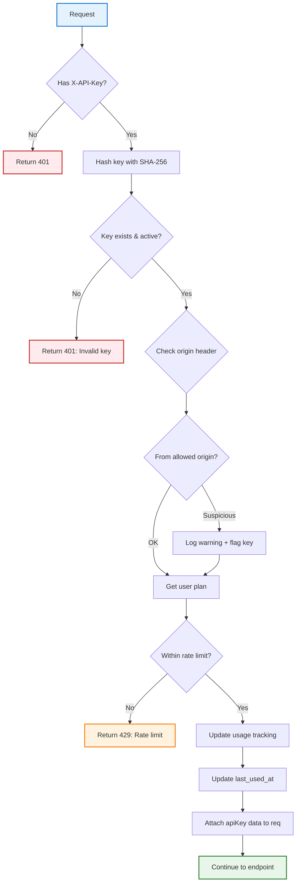

# Freemium API Protection Guide

**Project:** CodeScribe AI
**Status:** ✅ Tier 2 Implementation Complete
**Date:** October 25, 2025
**Security Model:** API Keys + Tiered Rate Limiting + Origin Verification

---

## Overview

This guide covers the comprehensive API protection strategy for CodeScribe AI's freemium model, balancing security, user experience, and cost control.

**The Challenge:**
- Public API endpoints (no auth) allow anyone to use the service
- Each request costs money (Claude API: ~$0.01-0.10 per generation)
- Need to prevent abuse while keeping "try before signup" UX smooth

**The Solution:**
- Multi-tier protection system
- API keys for tracking and limiting usage
- Graceful degradation (anonymous → free → paid tiers)

---

## Protection Tiers

### Tier 1: Baseline (Always On) ✅

**What:** Basic protections that run on every request

1. **Rate Limiting by IP**
   - 10 requests/minute per IP
   - 100 requests/hour for generation endpoints
   - See [server/src/middleware/rateLimiter.js](../../server/src/middleware/rateLimiter.js)

2. **CORS**
   - Browser-based requests only from allowed origins
   - Blocks cross-site API scraping in browsers
   - See [api/index.js](../../api/index.js)

3. **Input Validation**
   - Max code size: 100,000 characters
   - Max file size: 500KB
   - Allowed file types only

**Effectiveness:** Stops casual abuse, not determined attackers

**Cost:** Negligible (built-in Express middleware)

---

### Tier 2: API Key System (Implemented) ✅

**What:** API keys for all users (anonymous + authenticated)

#### Components

1. **API Keys**
   - Anonymous keys: Generated on first visit, stored in localStorage
   - User keys: Permanent, associated with account
   - Format: `ak_anon_xxx` (anonymous) or `ak_user_xxx` (authenticated)

2. **Usage Tracking**
   - Track requests per key (not just per IP)
   - Daily usage buckets in database
   - Enforce per-user limits

3. **Tiered Rate Limits**
   - Anonymous: 5 requests/hour
   - Free (signed up): 50 requests/hour
   - Pro: 500 requests/hour
   - Enterprise: 1000+ requests/hour

4. **Origin Verification**
   - Check `Origin` or `Referer` header
   - Flag suspicious requests (API key from wrong origin)
   - Log for security monitoring

**Effectiveness:** Prevents most abuse, enables business model

**Cost:** Database storage (~1KB per key, ~10KB per user/month)

---

### Tier 3: Advanced (Future) 📋

**What:** Additional protections for scale

1. **Hard Cost Limits**
   - Track Claude API tokens used per key
   - Hard stop at monthly limit (requires upgrade)
   - See [Tier 3 Implementation](#tier-3-advanced-future) below

2. **CAPTCHA for Suspicious Activity**
   - After multiple rate limit violations
   - Prevents automated abuse

3. **Real-Time Blocking**
   - Vercel Edge Config for instant blocking
   - No deployment required to block abusive keys

**Effectiveness:** Enterprise-grade protection

**Cost:** CAPTCHA (~$1/1000 challenges), Edge Config ($10/mo)

---

## Architecture

### Database Schema

```sql
-- API Keys table
CREATE TABLE api_keys (
  id SERIAL PRIMARY KEY,
  key_hash VARCHAR(64) NOT NULL UNIQUE,
  user_id INTEGER REFERENCES users(id) ON DELETE CASCADE,
  key_prefix VARCHAR(20) NOT NULL,  -- 'ak_anon_xxx' for display
  name VARCHAR(100) DEFAULT 'Default Key',
  is_active BOOLEAN DEFAULT true,
  last_used_at TIMESTAMP,
  usage_count INTEGER DEFAULT 0,
  created_at TIMESTAMP DEFAULT NOW(),
  expires_at TIMESTAMP  -- NULL for user keys, set for anonymous keys
);

CREATE INDEX idx_api_keys_key_hash ON api_keys(key_hash);
CREATE INDEX idx_api_keys_user_id ON api_keys(user_id);
CREATE INDEX idx_api_keys_expires_at ON api_keys(expires_at) WHERE expires_at IS NOT NULL;

-- Daily usage tracking
CREATE TABLE api_key_usage (
  id SERIAL PRIMARY KEY,
  api_key_id INTEGER REFERENCES api_keys(id) ON DELETE CASCADE,
  date DATE NOT NULL,
  request_count INTEGER DEFAULT 0,
  tokens_used INTEGER DEFAULT 0,  -- Future: Track Claude API tokens
  cost_usd DECIMAL(10,4) DEFAULT 0.00,  -- Future: Track actual cost
  UNIQUE(api_key_id, date)
);

CREATE INDEX idx_api_key_usage_date ON api_key_usage(date);
CREATE INDEX idx_api_key_usage_api_key_id ON api_key_usage(api_key_id);
```

### Middleware Flow



---

## Implementation

### 1. Database Migration

**File:** `server/src/db/migrations/003-add-api-keys.sql`

```sql
-- Migration: Add API Keys and Usage Tracking
-- Version: 003
-- Date: 2025-10-25
-- Description: Adds API key system for freemium protection

-- API Keys table
CREATE TABLE IF NOT EXISTS api_keys (
  id SERIAL PRIMARY KEY,
  key_hash VARCHAR(64) NOT NULL UNIQUE,
  user_id INTEGER REFERENCES users(id) ON DELETE CASCADE,
  key_prefix VARCHAR(20) NOT NULL,
  name VARCHAR(100) DEFAULT 'Default Key',
  is_active BOOLEAN DEFAULT true,
  last_used_at TIMESTAMP,
  usage_count INTEGER DEFAULT 0,
  created_at TIMESTAMP DEFAULT NOW(),
  expires_at TIMESTAMP
);

CREATE INDEX IF NOT EXISTS idx_api_keys_key_hash ON api_keys(key_hash);
CREATE INDEX IF NOT EXISTS idx_api_keys_user_id ON api_keys(user_id);
CREATE INDEX IF NOT EXISTS idx_api_keys_expires_at ON api_keys(expires_at) WHERE expires_at IS NOT NULL;

-- Daily usage tracking
CREATE TABLE IF NOT EXISTS api_key_usage (
  id SERIAL PRIMARY KEY,
  api_key_id INTEGER REFERENCES api_keys(id) ON DELETE CASCADE,
  date DATE NOT NULL,
  request_count INTEGER DEFAULT 0,
  tokens_used INTEGER DEFAULT 0,
  cost_usd DECIMAL(10,4) DEFAULT 0.00,
  UNIQUE(api_key_id, date)
);

CREATE INDEX IF NOT EXISTS idx_api_key_usage_date ON api_key_usage(date);
CREATE INDEX IF NOT EXISTS idx_api_key_usage_api_key_id ON api_key_usage(api_key_id);

-- Add plan column to users table if not exists
DO $$
BEGIN
  IF NOT EXISTS (SELECT 1 FROM information_schema.columns
                 WHERE table_name='users' AND column_name='plan') THEN
    ALTER TABLE users ADD COLUMN plan VARCHAR(20) DEFAULT 'free';
  END IF;
END $$;
```

### 2. API Key Model

**File:** `server/src/models/ApiKey.js`

```javascript
/**
 * API Key Model
 *
 * Manages API keys for freemium protection
 */

import { sql } from '@vercel/postgres';
import crypto from 'crypto';

class ApiKey {
  /**
   * Generate a new API key
   * @param {string} type - 'anonymous' or 'user'
   * @returns {string} The generated API key (plain text, show once)
   */
  static generateKey(type = 'anonymous') {
    const prefix = type === 'anonymous' ? 'ak_anon' : 'ak_user';
    const random = crypto.randomBytes(24).toString('hex');
    return `${prefix}_${random}`;
  }

  /**
   * Hash an API key for storage
   * @param {string} apiKey - Plain text API key
   * @returns {string} SHA-256 hash
   */
  static hashKey(apiKey) {
    return crypto.createHash('sha256').update(apiKey).digest('hex');
  }

  /**
   * Get key prefix for display (first 15 chars + '...')
   * @param {string} apiKey - Plain text API key
   * @returns {string} Display prefix
   */
  static getKeyPrefix(apiKey) {
    return apiKey.substring(0, 15) + '...';
  }

  /**
   * Create a new anonymous API key
   * @param {string} name - Optional name for the key
   * @returns {Promise<{id: number, apiKey: string, expiresAt: Date}>}
   */
  static async createAnonymous(name = 'Anonymous Key') {
    const apiKey = this.generateKey('anonymous');
    const keyHash = this.hashKey(apiKey);
    const keyPrefix = this.getKeyPrefix(apiKey);
    const expiresAt = new Date(Date.now() + 30 * 24 * 60 * 60 * 1000); // 30 days

    const result = await sql`
      INSERT INTO api_keys (key_hash, key_prefix, name, expires_at)
      VALUES (${keyHash}, ${keyPrefix}, ${name}, ${expiresAt})
      RETURNING id
    `;

    return {
      id: result.rows[0].id,
      apiKey, // Return plain text once, never stored
      expiresAt
    };
  }

  /**
   * Create a new user API key
   * @param {number} userId - User ID
   * @param {string} name - Optional name for the key
   * @returns {Promise<{id: number, apiKey: string}>}
   */
  static async createForUser(userId, name = 'Default Key') {
    const apiKey = this.generateKey('user');
    const keyHash = this.hashKey(apiKey);
    const keyPrefix = this.getKeyPrefix(apiKey);

    const result = await sql`
      INSERT INTO api_keys (key_hash, key_prefix, user_id, name)
      VALUES (${keyHash}, ${keyPrefix}, ${userId}, ${name})
      RETURNING id
    `;

    return {
      id: result.rows[0].id,
      apiKey // Return plain text once, never stored
    };
  }

  /**
   * Validate an API key and return associated data
   * @param {string} apiKey - Plain text API key
   * @returns {Promise<Object|null>} Key data with user info, or null if invalid
   */
  static async validate(apiKey) {
    const keyHash = this.hashKey(apiKey);

    const result = await sql`
      SELECT
        k.id,
        k.user_id,
        k.key_prefix,
        k.name,
        k.is_active,
        k.last_used_at,
        k.usage_count,
        k.created_at,
        k.expires_at,
        u.email,
        u.plan
      FROM api_keys k
      LEFT JOIN users u ON k.user_id = u.id
      WHERE k.key_hash = ${keyHash}
        AND k.is_active = true
        AND (k.expires_at IS NULL OR k.expires_at > NOW())
    `;

    if (result.rows.length === 0) {
      return null;
    }

    return result.rows[0];
  }

  /**
   * Update last used timestamp and increment usage count
   * @param {number} keyId - API key ID
   */
  static async updateLastUsed(keyId) {
    await sql`
      UPDATE api_keys
      SET last_used_at = NOW(), usage_count = usage_count + 1
      WHERE id = ${keyId}
    `;
  }

  /**
   * Track daily usage
   * @param {number} keyId - API key ID
   * @param {number} tokensUsed - Optional: Claude API tokens used
   * @param {number} costUsd - Optional: Cost in USD
   */
  static async trackUsage(keyId, tokensUsed = 0, costUsd = 0) {
    await sql`
      INSERT INTO api_key_usage (api_key_id, date, request_count, tokens_used, cost_usd)
      VALUES (${keyId}, CURRENT_DATE, 1, ${tokensUsed}, ${costUsd})
      ON CONFLICT (api_key_id, date)
      DO UPDATE SET
        request_count = api_key_usage.request_count + 1,
        tokens_used = api_key_usage.tokens_used + ${tokensUsed},
        cost_usd = api_key_usage.cost_usd + ${costUsd}
    `;
  }

  /**
   * Get usage for a specific date range
   * @param {number} keyId - API key ID
   * @param {Date} startDate - Start date
   * @param {Date} endDate - End date
   * @returns {Promise<Array>} Usage records
   */
  static async getUsage(keyId, startDate, endDate) {
    const result = await sql`
      SELECT date, request_count, tokens_used, cost_usd
      FROM api_key_usage
      WHERE api_key_id = ${keyId}
        AND date BETWEEN ${startDate} AND ${endDate}
      ORDER BY date DESC
    `;

    return result.rows;
  }

  /**
   * Get today's usage count for rate limiting
   * @param {number} keyId - API key ID
   * @returns {Promise<number>} Request count today
   */
  static async getTodayUsage(keyId) {
    const result = await sql`
      SELECT request_count
      FROM api_key_usage
      WHERE api_key_id = ${keyId}
        AND date = CURRENT_DATE
    `;

    return result.rows[0]?.request_count || 0;
  }

  /**
   * Deactivate an API key
   * @param {number} keyId - API key ID
   */
  static async deactivate(keyId) {
    await sql`
      UPDATE api_keys
      SET is_active = false
      WHERE id = ${keyId}
    `;
  }

  /**
   * Get all keys for a user
   * @param {number} userId - User ID
   * @returns {Promise<Array>} User's API keys (without hashes)
   */
  static async getByUserId(userId) {
    const result = await sql`
      SELECT id, key_prefix, name, is_active, last_used_at, usage_count, created_at
      FROM api_keys
      WHERE user_id = ${userId}
      ORDER BY created_at DESC
    `;

    return result.rows;
  }

  /**
   * Clean up expired anonymous keys (run daily via cron)
   * @returns {Promise<number>} Number of keys deleted
   */
  static async cleanupExpired() {
    const result = await sql`
      DELETE FROM api_keys
      WHERE expires_at IS NOT NULL
        AND expires_at < NOW()
      RETURNING id
    `;

    return result.rows.length;
  }
}

export default ApiKey;
```

### 3. API Key Middleware

**File:** `server/src/middleware/apiKey.js`

```javascript
/**
 * API Key Middleware
 *
 * Validates API keys and enforces rate limits based on user tier
 */

import ApiKey from '../models/ApiKey.js';

/**
 * Rate limits by plan
 */
const RATE_LIMITS = {
  anonymous: {
    hourly: 5,
    daily: 20
  },
  free: {
    hourly: 50,
    daily: 200
  },
  pro: {
    hourly: 500,
    daily: 2000
  },
  enterprise: {
    hourly: 1000,
    daily: 10000
  }
};

/**
 * Get rate limit for a plan
 * @param {string} plan - User plan (anonymous, free, pro, enterprise)
 * @returns {Object} Rate limit config
 */
function getRateLimit(plan) {
  return RATE_LIMITS[plan] || RATE_LIMITS.free;
}

/**
 * Middleware: Require and validate API key
 */
export const requireApiKey = async (req, res, next) => {
  const apiKey = req.headers['x-api-key'];

  // Missing API key
  if (!apiKey) {
    return res.status(401).json({
      error: 'API key required',
      message: 'Include X-API-Key header. Get a key at /api/keys/anonymous',
      documentation: 'https://docs.codescribeai.com/api/authentication'
    });
  }

  // Invalid format
  if (!apiKey.startsWith('ak_')) {
    return res.status(401).json({
      error: 'Invalid API key format',
      message: 'API key must start with "ak_"'
    });
  }

  try {
    // Validate key
    const keyData = await ApiKey.validate(apiKey);

    if (!keyData) {
      return res.status(401).json({
        error: 'Invalid API key',
        message: 'API key not found, inactive, or expired'
      });
    }

    // Determine plan
    const plan = keyData.user_id ? (keyData.plan || 'free') : 'anonymous';
    const rateLimit = getRateLimit(plan);

    // Check today's usage for rate limiting
    const todayUsage = await ApiKey.getTodayUsage(keyData.id);

    // Calculate hourly usage (approximate: daily / 24)
    const estimatedHourlyUsage = Math.ceil(todayUsage / 24);

    // Check rate limits
    if (todayUsage >= rateLimit.daily) {
      return res.status(429).json({
        error: 'Daily limit exceeded',
        message: `You have exceeded ${rateLimit.daily} requests per day.`,
        limit: rateLimit.daily,
        used: todayUsage,
        resetsAt: new Date(new Date().setHours(24, 0, 0, 0)).toISOString(),
        upgrade: plan === 'anonymous' ? '/signup' : (plan === 'free' ? '/pricing' : null)
      });
    }

    // Note: Hourly limit is approximate based on daily usage
    // For precise hourly limits, implement time-based buckets in api_key_usage

    // Update usage tracking
    await ApiKey.updateLastUsed(keyData.id);
    await ApiKey.trackUsage(keyData.id);

    // Attach to request
    req.apiKey = {
      ...keyData,
      plan,
      rateLimit,
      usage: {
        today: todayUsage,
        estimatedHourly: estimatedHourlyUsage
      }
    };

    // Add rate limit headers
    res.setHeader('X-RateLimit-Limit-Daily', rateLimit.daily);
    res.setHeader('X-RateLimit-Remaining-Daily', Math.max(0, rateLimit.daily - todayUsage));
    res.setHeader('X-RateLimit-Reset', new Date(new Date().setHours(24, 0, 0, 0)).toISOString());

    next();
  } catch (error) {
    console.error('API key validation error:', error);
    res.status(500).json({
      error: 'Failed to validate API key',
      message: 'Internal server error'
    });
  }
};

/**
 * Middleware: Verify request origin (defense in depth)
 */
export const verifyOrigin = (req, res, next) => {
  const origin = req.headers.origin || req.headers.referer;

  // No origin = server-to-server or curl (rely on API key only)
  if (!origin) {
    return next();
  }

  // Allowed origins
  const allowedOrigins = [
    'https://codescribeai.com',
    'https://codescribe-ai.vercel.app',
    'https://codescribe-ai-*.vercel.app',
    'http://localhost:5173',
    'http://localhost:5174'
  ];

  // Check if origin matches
  const isAllowed = allowedOrigins.some(allowed => {
    if (allowed.includes('*')) {
      const pattern = allowed.replace('*', '.*');
      return new RegExp(pattern).test(origin);
    }
    return origin.startsWith(allowed);
  });

  if (!isAllowed) {
    // Log suspicious activity
    console.warn('[Security] Suspicious request:', {
      apiKey: req.apiKey?.key_prefix || 'none',
      origin,
      ip: req.ip,
      userAgent: req.headers['user-agent']
    });

    // Could block here, but for now just flag
    req.suspiciousOrigin = true;
  }

  next();
};

/**
 * Optional: Require authentication (user API key, not anonymous)
 */
export const requireUserApiKey = (req, res, next) => {
  if (!req.apiKey?.user_id) {
    return res.status(403).json({
      error: 'User authentication required',
      message: 'This endpoint requires a user API key. Sign up at /signup'
    });
  }

  next();
};
```

### 4. API Key Routes

**File:** `server/src/routes/apiKeys.js`

```javascript
/**
 * API Key Management Routes
 */

import express from 'express';
import ApiKey from '../models/ApiKey.js';
import { requireAuth } from '../middleware/auth.js';

const router = express.Router();

// ============================================================================
// POST /api/keys/anonymous - Generate Anonymous API Key
// ============================================================================
router.post('/anonymous', async (req, res) => {
  try {
    const { name } = req.body;
    const result = await ApiKey.createAnonymous(name);

    res.json({
      success: true,
      apiKey: result.apiKey,
      expiresAt: result.expiresAt,
      message: 'Store this key securely. It will not be shown again.',
      usage: {
        daily: 20,
        hourly: 5
      }
    });
  } catch (error) {
    console.error('Failed to create anonymous key:', error);
    res.status(500).json({
      error: 'Failed to generate API key'
    });
  }
});

// ============================================================================
// GET /api/keys/me - Get Current User's Keys
// ============================================================================
router.get('/me', requireAuth, async (req, res) => {
  try {
    const keys = await ApiKey.getByUserId(req.user.id);

    res.json({
      success: true,
      keys: keys.map(k => ({
        id: k.id,
        keyPrefix: k.key_prefix,
        name: k.name,
        isActive: k.is_active,
        lastUsedAt: k.last_used_at,
        usageCount: k.usage_count,
        createdAt: k.created_at
      }))
    });
  } catch (error) {
    console.error('Failed to fetch keys:', error);
    res.status(500).json({
      error: 'Failed to fetch API keys'
    });
  }
});

// ============================================================================
// POST /api/keys - Create New User API Key
// ============================================================================
router.post('/', requireAuth, async (req, res) => {
  try {
    const { name } = req.body;
    const result = await ApiKey.createForUser(req.user.id, name);

    res.json({
      success: true,
      apiKey: result.apiKey,
      message: 'Store this key securely. It will not be shown again.'
    });
  } catch (error) {
    console.error('Failed to create user key:', error);
    res.status(500).json({
      error: 'Failed to generate API key'
    });
  }
});

// ============================================================================
// DELETE /api/keys/:id - Deactivate API Key
// ============================================================================
router.delete('/:id', requireAuth, async (req, res) => {
  try {
    const keyId = parseInt(req.params.id);

    // Verify ownership
    const keys = await ApiKey.getByUserId(req.user.id);
    if (!keys.find(k => k.id === keyId)) {
      return res.status(404).json({
        error: 'API key not found'
      });
    }

    await ApiKey.deactivate(keyId);

    res.json({
      success: true,
      message: 'API key deactivated successfully'
    });
  } catch (error) {
    console.error('Failed to deactivate key:', error);
    res.status(500).json({
      error: 'Failed to deactivate API key'
    });
  }
});

// ============================================================================
// GET /api/keys/:id/usage - Get Usage Stats
// ============================================================================
router.get('/:id/usage', requireAuth, async (req, res) => {
  try {
    const keyId = parseInt(req.params.id);

    // Verify ownership
    const keys = await ApiKey.getByUserId(req.user.id);
    if (!keys.find(k => k.id === keyId)) {
      return res.status(404).json({
        error: 'API key not found'
      });
    }

    // Get last 30 days
    const endDate = new Date();
    const startDate = new Date(endDate.getTime() - 30 * 24 * 60 * 60 * 1000);

    const usage = await ApiKey.getUsage(keyId, startDate, endDate);

    res.json({
      success: true,
      usage
    });
  } catch (error) {
    console.error('Failed to fetch usage:', error);
    res.status(500).json({
      error: 'Failed to fetch usage statistics'
    });
  }
});

export default router;
```

### 5. Update API Routes

**File:** `server/src/routes/api.js` (modifications)

```javascript
import { requireApiKey, verifyOrigin } from '../middleware/apiKey.js';

// Apply to generation endpoints
router.post('/generate',
  requireApiKey,    // NEW: Require API key
  verifyOrigin,     // NEW: Check origin
  apiLimiter,       // Existing: IP-based rate limit (backup)
  async (req, res) => {
    // ... existing code
  }
);

router.post('/generate-stream',
  requireApiKey,    // NEW: Require API key
  verifyOrigin,     // NEW: Check origin
  apiLimiter,       // Existing: IP-based rate limit (backup)
  async (req, res) => {
    // ... existing code
  }
);

// Upload endpoint - optional API key for tracking
router.post('/upload',
  // Optional: Could add requireApiKey here too
  apiLimiter,
  (req, res) => {
    // ... existing code
  }
);

// Health check - no API key required
router.get('/health', (req, res) => {
  // ... existing code
});
```

### 6. Frontend Integration

**File:** `client/src/utils/apiKey.js`

```javascript
/**
 * API Key Management Utility
 */

const API_KEY_STORAGE_KEY = 'codescribe_api_key';

/**
 * Get or create API key
 * @returns {Promise<string>} API key
 */
export async function getOrCreateApiKey() {
  // Check if key exists in localStorage
  let apiKey = localStorage.getItem(API_KEY_STORAGE_KEY);

  if (apiKey) {
    return apiKey;
  }

  // Generate new anonymous key
  try {
    const response = await fetch('/api/keys/anonymous', {
      method: 'POST',
      headers: {
        'Content-Type': 'application/json'
      }
    });

    if (!response.ok) {
      throw new Error('Failed to generate API key');
    }

    const data = await response.json();
    apiKey = data.apiKey;

    // Store in localStorage
    localStorage.setItem(API_KEY_STORAGE_KEY, apiKey);

    return apiKey;
  } catch (error) {
    console.error('Failed to get or create API key:', error);
    throw error;
  }
}

/**
 * Set API key (for logged-in users)
 * @param {string} apiKey - User's API key
 */
export function setApiKey(apiKey) {
  localStorage.setItem(API_KEY_STORAGE_KEY, apiKey);
}

/**
 * Clear API key (on logout)
 */
export function clearApiKey() {
  localStorage.removeItem(API_KEY_STORAGE_KEY);
}

/**
 * Get stored API key (without creating)
 * @returns {string|null} API key or null
 */
export function getApiKey() {
  return localStorage.getItem(API_KEY_STORAGE_KEY);
}
```

**File:** `client/src/services/api.js` (modifications)

```javascript
import { getOrCreateApiKey } from '../utils/apiKey';

export async function generateDocumentation(code, options) {
  // Ensure we have an API key
  const apiKey = await getOrCreateApiKey();

  const response = await fetch('/api/generate', {
    method: 'POST',
    headers: {
      'Content-Type': 'application/json',
      'X-API-Key': apiKey  // NEW: Include API key
    },
    body: JSON.stringify({
      code,
      docType: options.docType || 'README',
      language: options.language || 'javascript'
    })
  });

  if (!response.ok) {
    const error = await response.json();
    throw new Error(error.message || 'Generation failed');
  }

  return response.json();
}

// Similar updates for generateDocumentationStream, uploadFile, etc.
```

---

## Testing

### Unit Tests

**File:** `server/src/models/__tests__/ApiKey.test.js`

```javascript
import ApiKey from '../ApiKey.js';
import { sql } from '@vercel/postgres';

describe('ApiKey Model', () => {
  describe('generateKey', () => {
    it('should generate anonymous key with correct prefix', () => {
      const key = ApiKey.generateKey('anonymous');
      expect(key).toMatch(/^ak_anon_[a-f0-9]{48}$/);
    });

    it('should generate user key with correct prefix', () => {
      const key = ApiKey.generateKey('user');
      expect(key).toMatch(/^ak_user_[a-f0-9]{48}$/);
    });
  });

  describe('hashKey', () => {
    it('should produce consistent hash', () => {
      const key = 'ak_anon_test123';
      const hash1 = ApiKey.hashKey(key);
      const hash2 = ApiKey.hashKey(key);
      expect(hash1).toBe(hash2);
      expect(hash1).toHaveLength(64);
    });
  });

  describe('createAnonymous', () => {
    it('should create anonymous key with expiration', async () => {
      const result = await ApiKey.createAnonymous('Test Key');

      expect(result.id).toBeDefined();
      expect(result.apiKey).toMatch(/^ak_anon_/);
      expect(result.expiresAt).toBeInstanceOf(Date);

      // Verify in database
      const keyData = await ApiKey.validate(result.apiKey);
      expect(keyData).toBeDefined();
      expect(keyData.name).toBe('Test Key');
      expect(keyData.user_id).toBeNull();
    });
  });

  // Add more tests...
});
```

### Integration Tests

**File:** `server/src/routes/__tests__/apiKeys.test.js`

```javascript
import request from 'supertest';
import app from '../../../api/index.js';

describe('API Key Routes', () => {
  describe('POST /api/keys/anonymous', () => {
    it('should generate anonymous API key', async () => {
      const response = await request(app)
        .post('/api/keys/anonymous')
        .send({ name: 'Test Key' })
        .expect(200);

      expect(response.body.success).toBe(true);
      expect(response.body.apiKey).toMatch(/^ak_anon_/);
      expect(response.body.expiresAt).toBeDefined();
    });
  });

  describe('GET /api/keys/me', () => {
    it('should require authentication', async () => {
      await request(app)
        .get('/api/keys/me')
        .expect(401);
    });

    it('should return user keys when authenticated', async () => {
      // Login first
      const loginRes = await request(app)
        .post('/api/auth/login')
        .send({ email: 'test@example.com', password: 'password123' });

      const token = loginRes.body.token;

      // Get keys
      const response = await request(app)
        .get('/api/keys/me')
        .set('Authorization', `Bearer ${token}`)
        .expect(200);

      expect(response.body.success).toBe(true);
      expect(Array.isArray(response.body.keys)).toBe(true);
    });
  });

  // Add more tests...
});
```

### E2E Tests

**File:** `tests/e2e/api-key-protection.spec.js`

```javascript
import { test, expect } from '@playwright/test';

test.describe('API Key Protection', () => {
  test('should require API key for generation', async ({ request }) => {
    const response = await request.post('/api/generate', {
      data: {
        code: 'console.log("test")',
        docType: 'README'
      }
    });

    expect(response.status()).toBe(401);
    const data = await response.json();
    expect(data.error).toBe('API key required');
  });

  test('should accept valid API key', async ({ request }) => {
    // Get anonymous key
    const keyResponse = await request.post('/api/keys/anonymous');
    const keyData = await keyResponse.json();
    const apiKey = keyData.apiKey;

    // Use key for generation
    const response = await request.post('/api/generate', {
      headers: {
        'X-API-Key': apiKey
      },
      data: {
        code: 'console.log("test")',
        docType: 'README'
      }
    });

    expect(response.status()).toBe(200);
  });

  test('should enforce rate limits', async ({ request }) => {
    // Get anonymous key
    const keyResponse = await request.post('/api/keys/anonymous');
    const keyData = await keyResponse.json();
    const apiKey = keyData.apiKey;

    // Make 6 requests (anonymous limit is 5/hour)
    for (let i = 0; i < 6; i++) {
      const response = await request.post('/api/generate', {
        headers: {
          'X-API-Key': apiKey
        },
        data: {
          code: `console.log("test ${i}")`,
          docType: 'README'
        }
      });

      if (i < 5) {
        expect(response.status()).toBe(200);
      } else {
        expect(response.status()).toBe(429);
        const data = await response.json();
        expect(data.error).toBe('Daily limit exceeded');
      }
    }
  });
});
```

---

## Monitoring & Alerts

### Key Metrics to Track

1. **API Key Creation**
   - Anonymous keys created per day
   - User keys created per day
   - Conversion rate (anonymous → user)

2. **Usage Patterns**
   - Requests per key (detect abuse)
   - Keys with zero usage (cleanup candidates)
   - Top users by request count

3. **Security Events**
   - Suspicious origin requests
   - Invalid key attempts
   - Rate limit violations

4. **Cost Tracking**
   - Claude API tokens used per key
   - Cost per user tier
   - Total daily/monthly costs

### Queries for Monitoring

```sql
-- Daily API key creation
SELECT
  DATE(created_at) as date,
  COUNT(*) FILTER (WHERE user_id IS NULL) as anonymous,
  COUNT(*) FILTER (WHERE user_id IS NOT NULL) as users
FROM api_keys
WHERE created_at > NOW() - INTERVAL '7 days'
GROUP BY DATE(created_at)
ORDER BY date DESC;

-- Top users by request count
SELECT
  k.key_prefix,
  k.name,
  u.email,
  u.plan,
  SUM(aku.request_count) as total_requests
FROM api_keys k
LEFT JOIN users u ON k.user_id = u.id
JOIN api_key_usage aku ON k.id = aku.api_key_id
WHERE aku.date > NOW() - INTERVAL '7 days'
GROUP BY k.id, k.key_prefix, k.name, u.email, u.plan
ORDER BY total_requests DESC
LIMIT 20;

-- Keys hitting rate limits
SELECT
  k.key_prefix,
  k.name,
  u.email,
  u.plan,
  aku.request_count,
  aku.date
FROM api_keys k
LEFT JOIN users u ON k.user_id = u.id
JOIN api_key_usage aku ON k.id = aku.api_key_id
WHERE aku.request_count >
  CASE
    WHEN k.user_id IS NULL THEN 20  -- Anonymous daily limit
    WHEN u.plan = 'free' THEN 200
    WHEN u.plan = 'pro' THEN 2000
    ELSE 10000
  END
ORDER BY aku.date DESC, aku.request_count DESC;

-- Expired keys cleanup candidates
SELECT COUNT(*) as expired_count
FROM api_keys
WHERE expires_at < NOW();
```

### Cron Job for Cleanup

**File:** `server/src/jobs/cleanupExpiredKeys.js`

```javascript
/**
 * Cleanup expired anonymous API keys
 *
 * Run daily via cron or Vercel Cron
 */

import ApiKey from '../models/ApiKey.js';

export async function cleanupExpiredKeys() {
  try {
    const deleted = await ApiKey.cleanupExpired();
    console.log(`[Cron] Cleaned up ${deleted} expired API keys`);
    return { success: true, deleted };
  } catch (error) {
    console.error('[Cron] Failed to cleanup expired keys:', error);
    return { success: false, error: error.message };
  }
}

// If running as standalone script
if (import.meta.url === `file://${process.argv[1]}`) {
  cleanupExpiredKeys().then(() => process.exit(0));
}
```

**Vercel Cron Configuration** (`vercel.json`):

```json
{
  "crons": [{
    "path": "/api/cron/cleanup-keys",
    "schedule": "0 2 * * *"
  }]
}
```

**Cron Endpoint** (`api/cron/cleanup-keys.js`):

```javascript
import { cleanupExpiredKeys } from '../server/src/jobs/cleanupExpiredKeys.js';

export default async function handler(req, res) {
  // Verify cron secret
  if (req.headers.authorization !== `Bearer ${process.env.CRON_SECRET}`) {
    return res.status(401).json({ error: 'Unauthorized' });
  }

  const result = await cleanupExpiredKeys();
  res.json(result);
}
```

---

## Tier 3: Advanced (Future Implementation)

### Hard Cost Limits

Track Claude API token usage and enforce hard limits:

```javascript
// In docGenerator.js
export async function generateDocumentation(code, options) {
  // ... existing code

  const response = await anthropic.messages.create({
    // ... existing config
  });

  // Track tokens used
  const tokensUsed = response.usage.input_tokens + response.usage.output_tokens;
  const costUsd = (tokensUsed / 1000) * 0.003; // ~$0.003 per 1K tokens

  // Update usage tracking
  if (options.apiKeyId) {
    await ApiKey.trackUsage(options.apiKeyId, tokensUsed, costUsd);
  }

  // Check monthly limit
  const monthlyUsage = await ApiKey.getMonthlyUsage(options.apiKeyId);
  const plan = await getUserPlan(options.apiKeyId);

  if (monthlyUsage.tokens_used > plan.monthlyTokenLimit) {
    throw new Error('Monthly token limit exceeded. Please upgrade.');
  }

  // ... return results
}
```

### CAPTCHA Integration

Add CAPTCHA for rate limit violations:

```javascript
// Track violations
const violations = await redis.get(`rate_limit_violations:${keyId}`);

if (violations >= 3) {
  return res.status(429).json({
    error: 'Rate limit exceeded',
    requiresCaptcha: true,
    captchaSiteKey: process.env.RECAPTCHA_SITE_KEY
  });
}

// On next request, verify CAPTCHA token
if (req.body.captchaToken) {
  const isValid = await verifyRecaptcha(req.body.captchaToken);
  if (isValid) {
    await redis.del(`rate_limit_violations:${keyId}`);
    // Continue...
  }
}
```

### Edge Config Blocking

Real-time blocking without deployment:

```javascript
import { get } from '@vercel/edge-config';

export const checkBlocklist = async (req, res, next) => {
  const keyId = req.apiKey.id;

  const blockedKeys = await get('blocked_api_keys') || [];

  if (blockedKeys.includes(keyId)) {
    return res.status(403).json({
      error: 'API key blocked',
      message: 'This key has been blocked for violations. Contact support.'
    });
  }

  next();
};
```

---

## Cost Analysis

### Current Costs (Tier 2)

**Database Storage:**
- API keys: ~1KB per key × 10,000 users = 10MB
- Usage tracking: ~10KB per user/month × 10,000 = 100MB/month
- Total: ~100MB/month ≈ **$0** (within Neon free tier)

**Compute:**
- Middleware overhead: ~5ms per request
- Negligible on serverless (included in request time)

**Total Tier 2 Cost:** ~$0/month

### Projected Costs at Scale

**At 100K users:**
- Database: ~1GB storage + 10GB usage = **$2-5/month** (Neon)
- No additional compute costs (serverless scales automatically)

**Tier 3 additions:**
- CAPTCHA: ~$1 per 1,000 challenges = **$10-50/month** (depends on abuse rate)
- Edge Config: **$10/month** (Vercel)
- Total Tier 3: **$22-65/month**

---

## Migration Path

### Phase 1: Deploy Tier 2 (This PR)
1. Add database migration for API keys
2. Deploy API key models and middleware
3. Update frontend to use API keys
4. Monitor for 1-2 weeks

### Phase 2: Enforce (1-2 weeks after)
1. Make API keys required (remove fallback)
2. Monitor abuse patterns
3. Adjust rate limits if needed

### Phase 3: Scale (As needed)
1. Add hard cost limits (when monthly cost > $100)
2. Add CAPTCHA (if abuse detected)
3. Add Edge Config (for instant blocking)

---

## Security Considerations

### What's Protected
- ✅ Abuse prevention (rate limits per user)
- ✅ Cost control (track usage per key)
- ✅ Business model enablement (tiered limits)
- ✅ Anonymous usage tracking
- ✅ Origin verification (defense in depth)

### What's NOT Protected
- ❌ Key sharing (users can share keys with others)
- ❌ Sophisticated attacks (need Tier 3 for that)
- ❌ DDoS at network level (need Cloudflare for that)

### Best Practices
1. **Never log API keys in plain text**
2. **Hash keys before storage** (SHA-256)
3. **Use HTTPS only** (keys in headers)
4. **Rotate suspicious keys** (deactivate + notify user)
5. **Monitor for anomalies** (sudden usage spikes)

---

## FAQ

### Q: Why allow anonymous API keys?
A: Maintains "try before signup" UX while still tracking usage. Converts better than requiring signup upfront.

### Q: What if someone shares their API key?
A: Acceptable for free tier. Pro/Enterprise can have stricter enforcement (IP whitelisting, etc.).

### Q: How do we prevent key scraping from the frontend?
A: We don't. Keys are meant to be in the client. Protection comes from rate limits and usage tracking.

### Q: Why not use JWTs for API keys?
A: JWTs are stateless (can't revoke). We need database tracking for usage limits and instant revocation.

### Q: What about API key rotation?
A: Users can create multiple keys. Deactivate old ones. No forced rotation (annoying for developers).

---

## References

- [API Key Model](../../server/src/models/ApiKey.js)
- [API Key Middleware](../../server/src/middleware/apiKey.js)
- [API Key Routes](../../server/src/routes/apiKeys.js)
- [Rate Limiter](../../server/src/middleware/rateLimiter.js)
- [Database Migration](../../server/src/db/migrations/003-add-api-keys.sql)

---

**Last Updated:** October 25, 2025
**Status:** Tier 2 Implementation Complete
**Next Review:** 2 weeks after deployment
