```mermaid
flowchart TD
    A[User Arrives] --> B[See Value Proposition]
    B --> C{Has own code?}
    C -->|No| D[Explore Sample]
    C -->|Yes| E[Paste Code]
    D --> E
    E --> F[Select Doc Type]
    F --> G[Click Generate]
    G --> H[Watch Streaming Output]
    H --> I[See Quality Score]
    I --> J{Satisfied?}
    J -->|Yes| K[Copy/Download Docs]
    J -->|No| L[Adjust & Regenerate]
    L --> G
    K --> M[✓ First Value Achieved]

    style M fill:#10b981,color:#fff
```

# Workflow-First PRD: CodeScribe AI

> **Example Implementation** of the [Workflow-First PRD Template](./WORKFLOW-FIRST-PRD-TEMPLATE.md)
>
> This document demonstrates how to write a PRD anchored on business workflows and outcomes, not feature inventories.

---

## 🎯 Business Context

**Project Name:** CodeScribe AI

**Problem Statement:** Developers spend 20-30% of their time writing documentation, yet 60% of codebases have outdated or missing docs. This creates onboarding friction, knowledge silos, and maintenance burden. The cost: slower teams, higher churn, lost institutional knowledge.

**Target Outcome:** Developers generate production-quality documentation in minutes instead of hours, with consistent quality and formatting across their codebase.

**Value Proposition:** Paste code, get docs. AI understands your code's intent and generates documentation that developers actually want to read—with quality scoring to ensure it meets professional standards.

**Timeline:** 3 Phases (Foundation → Scale → Monetize)

**Timezone:** EST/EDT

---

## 📊 Business Outcomes (Primary Anchor)

### Outcome 1: Eliminate Documentation Time Tax

- **Current State:** Developer spends 45-90 minutes writing README for a new module
- **Desired State:** Developer generates comprehensive README in < 3 minutes
- **Success Metric:** Time-to-documentation
- **Baseline → Target:** 45 min manual → 3 min with CodeScribe (93% reduction)

### Outcome 2: Consistent Documentation Quality

- **Current State:** Documentation quality varies wildly by author; no enforced standard
- **Desired State:** All generated docs meet 80+ quality score with consistent structure
- **Success Metric:** Quality score distribution
- **Baseline → Target:** Unmeasured → 90% of outputs score 80+

### Outcome 3: Documentation Coverage

- **Current State:** Teams document ~40% of their codebase (critical paths only)
- **Desired State:** Teams document 80%+ because the friction is gone
- **Success Metric:** Files documented per project
- **Baseline → Target:** 40% coverage → 80% coverage

### Outcome 4: Sustainable Business Model

- **Current State:** No product exists
- **Desired State:** Free tier drives adoption; paid tiers capture value for power users
- **Success Metric:** Free → Paid conversion rate
- **Baseline → Target:** N/A → 5% conversion within 30 days

---

## 👤 User Personas & Jobs-to-Be-Done

### Persona: Solo Developer (Sam)

**Context:** Building side projects or freelance work. Works alone, wears all hats. Documentation is the thing that always gets skipped because shipping features feels more urgent.

**Core Job:** When I finish a feature or project, I want to quickly generate professional docs so I can share my work credibly without spending hours writing.

**Job Map:**

| Stage | Description |
|-------|-------------|
| 1. Define | "I need docs for this code I just wrote" |
| 2. Locate | Find/select the code that needs documentation |
| 3. Prepare | Decide what type of docs (README, API, etc.) |
| 4. Confirm | Verify the code is ready (no sensitive data) |
| 5. Execute | Submit code, receive documentation |
| 6. Monitor | Watch generation progress (streaming) |
| 7. Resolve | Review output, make minor edits if needed |
| 8. Conclude | Copy/download docs, add to project |

**Pain Points in Current Workflow:**

- Starting from blank page is paralyzing
- Unsure what "good" documentation looks like
- Time spent on docs feels like time not coding

**Success Criteria:** "I know this works when I can go from finished code to published README in under 5 minutes."

---

### Persona: Tech Lead (Taylor)

**Context:** Manages a team of 5-10 developers. Responsible for code quality, onboarding new team members, and maintaining architectural decisions. Documentation debt is a constant battle.

**Core Job:** When onboarding new team members or maintaining a growing codebase, I want consistent, high-quality documentation across all our projects so the team can move fast without tribal knowledge bottlenecks.

**Job Map:**

| Stage | Description |
|-------|-------------|
| 1. Define | "Our project docs are outdated/missing" |
| 2. Locate | Identify which files/modules need docs |
| 3. Prepare | Import project from GitHub or upload files |
| 4. Confirm | Select relevant files, exclude generated code |
| 5. Execute | Batch generate documentation for multiple files |
| 6. Monitor | Track progress across file set |
| 7. Resolve | Review quality scores, regenerate low-scoring docs |
| 8. Conclude | Export docs, integrate into project |

**Pain Points in Current Workflow:**

- Documentation standards aren't followed consistently
- New hires take weeks to understand the codebase
- "It's documented in Slack somewhere" syndrome

**Success Criteria:** "I know this works when new developers can understand a module by reading its generated docs without asking questions."

---

## 🔄 Core Workflows

### Workflow 1: First Value Moment (Critical Path)

**Business Outcome Served:** Outcome 1 (Eliminate Documentation Time Tax)

**Trigger:** User arrives at CodeScribe with code they want to document
**Actor:** Any user (authenticated or not)
**End State:** User has generated, reviewed, and copied documentation they find valuable

**Journey Map:**

```
┌─────────────┐    ┌─────────────┐    ┌─────────────┐    ┌─────────────┐
│   ARRIVE    │───▶│    INPUT    │───▶│   OBSERVE   │───▶│  CAPTURE    │
│             │    │             │    │             │    │   VALUE     │
│ User lands  │    │ User pastes │    │ User watches│    │ User copies │
│ sees value  │    │ their code  │    │ AI generate │    │ their docs  │
│ proposition │    │             │    │ (streaming) │    │             │
└─────────────┘    └─────────────┘    └─────────────┘    └─────────────┘
     │                   │                  │                  │
     ▼                   ▼                  ▼                  ▼
  < 5 sec to          < 30 sec to       Quality score      User exports
  understand          paste & submit     visible live       or copies
```

**Step-by-Step Workflow:**

| Step | User Intent | System Response | Success Signal | Failure Recovery |
|------|-------------|-----------------|----------------|------------------|
| 1. Land | "What is this?" | Show clear value prop: "Paste code → Get docs" | User scrolls to editor | Simplify headline if bounce rate high |
| 2. Explore | "Let me see an example" | Pre-loaded sample code in editor | User views sample output | Add "See Example" CTA if not discovered |
| 3. Input | "Let me try my own code" | Monaco editor with syntax highlighting | Code successfully pasted | Show format guidance if parse fails |
| 4. Configure | "What type of docs?" | Doc type selector (README, JSDoc, API, Architecture) | Selection made | Default to README if no selection |
| 5. Generate | "Create my docs" | Stream documentation with live quality scoring | Streaming begins within 1s | Show error with retry option |
| 6. Review | "Is this good?" | Display quality score inline (0-100 + letter grade) | User sees score without extra clicks | Breakdown modal available but optional |
| 7. Capture | "I want to keep this" | Copy button, download button, export options | User clicks copy/download | Persist in browser if accidental navigation |

**Workflow Diagram:**



**Capabilities Required:**

| Step | Capability | Technical Implication |
|------|------------|----------------------|
| Step 3 | Accept and parse code in multiple languages | Monaco editor, language detection |
| Step 5 | Stream AI-generated content in real-time | SSE (Server-Sent Events) |
| Step 6 | Calculate and display quality score | 5-criteria scoring algorithm |
| Step 7 | Enable one-click copy to clipboard | Clipboard API, download generation |

**Acceptance Criteria:**

```gherkin
GIVEN a new user who has never used CodeScribe
WHEN they paste 50 lines of JavaScript and click Generate
THEN they receive a complete README with quality score
AND the total time from paste to copy is under 3 minutes
AND the quality score is 75 or higher
AND they can copy the output with one click
```

- [ ] User completes workflow (paste → copy) in < 3 minutes
- [ ] 70%+ of users who paste code complete the workflow
- [ ] Generated documentation scores 75+ quality on first attempt
- [ ] User can accomplish this without authentication (free tier)

---

### Workflow 2: GitHub Project Documentation

**Business Outcome Served:** Outcome 3 (Documentation Coverage)

**Trigger:** User wants to document code from a GitHub repository
**Actor:** Tech Lead (Taylor) or Solo Developer with existing project
**End State:** Multiple files from repository have documentation generated

**Journey Map:**

```
┌─────────────┐    ┌─────────────┐    ┌─────────────┐    ┌─────────────┐    ┌─────────────┐
│   CONNECT   │───▶│   BROWSE    │───▶│   SELECT    │───▶│  GENERATE   │───▶│   EXPORT    │
│             │    │             │    │             │    │             │    │             │
│ Link GitHub │    │ Navigate    │    │ Choose files│    │ Batch create│    │ Download    │
│ repository  │    │ file tree   │    │ to document │    │ docs        │    │ all docs    │
└─────────────┘    └─────────────┘    └─────────────┘    └─────────────┘    └─────────────┘
```

**Step-by-Step Workflow:**

| Step | User Intent | System Response | Success Signal | Failure Recovery |
|------|-------------|-----------------|----------------|------------------|
| 1. Connect | "Import from my repo" | GitHub OAuth (private) or URL input (public) | Repo connected | Clear error if auth fails |
| 2. Navigate | "Find the files I need" | Display file tree with branch selector | User navigates to target folder | Search/filter if tree too large |
| 3. Select | "These are the ones" | Multi-select with shift+click, select all | Files added to workspace | Show selection count, allow deselect |
| 4. Configure | "Same doc type for all" | Bulk doc type assignment or per-file | Configuration complete | Smart defaults based on file type |
| 5. Generate | "Document everything" | Batch generation with progress indicator | All files processing | Individual retry for failures |
| 6. Review | "Check the results" | Quality scores per file, sorted by score | User reviews lowest scores | Highlight files needing attention |
| 7. Export | "Get all docs" | Bulk download as ZIP or individual files | Download complete | Retry failed downloads |

**Workflow Diagram:**


**Capabilities Required:**

| Step | Capability | Technical Implication |
|------|------------|----------------------|
| Step 1 | GitHub API integration | OAuth 2.0, @octokit/rest |
| Step 2 | Render navigable file tree | Recursive tree component, lazy loading |
| Step 3 | Multi-select with keyboard modifiers | Shift+click, Ctrl+click support |
| Step 5 | Queue and process batch generation | Job queue, rate limiting, progress tracking |
| Step 7 | Bundle files into archive | ZIP generation, streaming download |

**Acceptance Criteria:**

```gherkin
GIVEN a user with a connected GitHub repository
WHEN they select 10 JavaScript files and click "Generate All"
THEN all 10 files are processed with visible progress
AND each file receives a quality score
AND the total time is under 5 minutes
AND they can download all docs as a single ZIP
```

- [ ] User documents 10-file project in < 15 minutes
- [ ] Batch generation handles 50+ files without timeout
- [ ] User can identify and regenerate low-quality outputs easily
- [ ] Private repository access works with single OAuth flow

---

### Workflow 3: Documentation Quality Improvement

**Business Outcome Served:** Outcome 2 (Consistent Documentation Quality)

**Trigger:** User receives documentation with quality score below their threshold
**Actor:** Any user who cares about quality
**End State:** Documentation meets quality standards (80+ score)

**Journey Map:**

```
┌─────────────┐    ┌─────────────┐    ┌─────────────┐    ┌─────────────┐
│   ASSESS    │───▶│ UNDERSTAND  │───▶│   IMPROVE   │───▶│   VERIFY    │
│             │    │             │    │             │    │             │
│ See score & │    │ Read score  │    │ Regenerate  │    │ Confirm     │
│ grade       │    │ breakdown   │    │ or edit     │    │ improvement │
└─────────────┘    └─────────────┘    └─────────────┘    └─────────────┘
```

**Step-by-Step Workflow:**

| Step | User Intent | System Response | Success Signal | Failure Recovery |
|------|-------------|-----------------|----------------|------------------|
| 1. Assess | "How good is this?" | Display letter grade (A-F) and numeric score | User notices score | Score always visible, not hidden |
| 2. Understand | "Why this score?" | Show 5-category breakdown | User identifies weak areas | Tooltips explain each category |
| 3. Decide | "Can I do better?" | Show "Regenerate" option | User chooses action | Preserve current until new ready |
| 4. Improve | "Try again" | Regenerate with AI or enable manual editing | New output generated | Side-by-side comparison option |
| 5. Verify | "Is it better now?" | Show updated score with delta indicator | Score improved | Explain if score decreased |

**Quality Score Categories (100 points total):**

| Category | Points | What It Measures |
|----------|--------|------------------|
| Overview/Description | 20 | Clear explanation of purpose |
| Installation | 15 | Setup instructions |
| Usage Examples | 20 | Code samples and use cases |
| API Documentation | 25 | Function/method documentation |
| Structure | 20 | Organization and formatting |

**Acceptance Criteria:**

```gherkin
GIVEN a user viewing documentation with a 65 quality score
WHEN they click "Regenerate"
THEN a new version is generated
AND the previous version is preserved until new one completes
AND the new score is displayed with comparison to previous
```

- [ ] Users understand their score within 5 seconds of generation
- [ ] 80% of users who regenerate see improved scores
- [ ] Score breakdown clearly identifies actionable improvements
- [ ] User can compare before/after when regenerating

---

### Workflow 4: Free-to-Paid Conversion

**Business Outcome Served:** Outcome 4 (Sustainable Business Model)

**Trigger:** Free user hits usage limit or wants premium features
**Actor:** User who has experienced value and wants more
**End State:** User successfully subscribes to paid tier

**Journey Map:**

```
┌─────────────┐    ┌─────────────┐    ┌─────────────┐    ┌─────────────┐    ┌─────────────┐
│  REALIZE    │───▶│   INFORM    │───▶│   DECIDE    │───▶│   COMMIT    │───▶│   CONFIRM   │
│   LIMIT     │    │             │    │             │    │             │    │             │
│ Hit usage   │    │ Show tier   │    │ Compare     │    │ Payment     │    │ Access      │
│ boundary    │    │ options     │    │ options     │    │ flow        │    │ unlocked    │
└─────────────┘    └─────────────┘    └─────────────┘    └─────────────┘    └─────────────┘
```

**Step-by-Step Workflow:**

| Step | User Intent | System Response | Success Signal | Failure Recovery |
|------|-------------|-----------------|----------------|------------------|
| 1. Encounter | "I need more" | Usage warning at 80%, limit modal at 100% | User understands limit | Clear messaging, not punitive |
| 2. Explore | "What are my options?" | Tier comparison (Free vs Pro vs Team) | User views pricing | Highlight value, not restrictions |
| 3. Evaluate | "Is it worth it?" | Show ROI: "Save X hours/month at $Y" | User sees value prop | Calculator or testimonials |
| 4. Decide | "I'll upgrade" | Clear CTA to selected tier | User clicks upgrade | Easy to return if not ready |
| 5. Pay | "Complete purchase" | Stripe checkout, minimal friction | Payment succeeds | Clear error handling, retry |
| 6. Confirm | "Did it work?" | Confirmation modal, updated tier badge | User sees new status | Email confirmation as backup |
| 7. Resume | "Back to work" | Limits removed, workflow continues | User generates docs | No re-login required |

**Workflow Diagram:**


**Acceptance Criteria:**

```gherkin
GIVEN a free user who has used 100% of their monthly quota
WHEN they attempt to generate documentation
THEN they see a clear explanation of their limit
AND they can view tier comparison within 2 clicks
AND checkout completes in under 2 minutes
AND they can immediately use new tier without refresh
```

- [ ] User understands why they're seeing upgrade prompt
- [ ] Pricing comparison is clear within 10 seconds
- [ ] Checkout completes in < 2 minutes
- [ ] User immediately uses new tier without refresh/re-login
- [ ] 5%+ of users who hit limits convert within session

---

### Workflow 5: Returning User Session

**Business Outcome Served:** Outcome 1 (Eliminate Documentation Time Tax) - repeat value

**Trigger:** Authenticated user returns to continue work
**Actor:** Any returning user
**End State:** User seamlessly continues previous work or starts new

**Journey Map:**

```
┌─────────────┐    ┌─────────────┐    ┌─────────────┐
│  RECOGNIZE  │───▶│   RESTORE   │───▶│   RESUME    │
│             │    │             │    │             │
│ Welcome     │    │ Show recent │    │ Continue    │
│ back, [Name]│    │ workspace   │    │ or new      │
└─────────────┘    └─────────────┘    └─────────────┘
```

**Step-by-Step Workflow:**

| Step | User Intent | System Response | Success Signal | Failure Recovery |
|------|-------------|-----------------|----------------|------------------|
| 1. Return | "I'm back" | Auto-authenticate from stored token | User recognized | Login prompt if token expired |
| 2. Orient | "Where was I?" | Show recent projects, last workspace | User sees familiar context | Clear "Start Fresh" option |
| 3. Continue | "Pick up where I left off" | Restore workspace state | Previous state available | Graceful degradation if lost |
| 4. Or New | "New project today" | Clear workspace, fresh start | Clean slate ready | Confirm if unsaved work |

**Acceptance Criteria:**

- [ ] Returning user sees their workspace in < 3 seconds
- [ ] No re-authentication required within 7 days
- [ ] Previous work is recoverable for at least 30 days
- [ ] User can start fresh without losing history

---

## 📈 Success Metrics Framework

### Lagging Indicators (Business Outcomes)

| Metric | Definition | Baseline | Target | Data Source | Coverage |
|--------|------------|----------|--------|-------------|----------|
| Time-to-First-Doc | Time from landing to first completed generation | N/A | < 3 min | Client Analytics | ~85-95% (opt-out applies) |
| Workflow Completion Rate | % who paste code AND copy output | N/A | > 60% | Client Analytics | ~85-95% (opt-out applies) |
| Quality Score Distribution | % of generations scoring 80+ | N/A | > 85% | Database | 100% (operational) |
| Documentation Coverage | Avg files documented per batch session | N/A | > 10 files | Database | 100% (operational) |
| Free-to-Paid Conversion | % of free users who upgrade in 30 days | N/A | > 5% | Database + Stripe | 100% (operational) |

### Leading Indicators (Predictive)

| Metric | What It Predicts | Target | Data Source | Coverage |
|--------|------------------|--------|-------------|----------|
| Sample code interaction | User will try own code | > 40% view sample | Client Analytics | ~85-95% |
| Second generation in session | User finds value, will return | > 30% generate 2+ | Database | 100% |
| Quality breakdown modal opened | User cares about improving quality | > 30% open modal | Client Analytics | ~85-95% |
| Workspace file count | Power user, conversion candidate | > 5 files = high-value | Database | 100% |

> **Note on Coverage:** Client Analytics metrics respect user opt-out preferences (typically 5-15% opt out). Database/Stripe metrics are operational data required to provide the service and have 100% coverage. See [WORKFLOW-OUTCOME-METRICS-PLAN.md](../planning/WORKFLOW-OUTCOME-METRICS-PLAN.md) for implementation details.

### Anti-Metrics (What We Won't Optimize For)

| Anti-Metric | Why We Avoid |
|-------------|--------------|
| Total generations | Encourages low-quality spam |
| Time on site | Could mean confusion |
| Page views | Vanity metric |
| Feature usage count | Using ≠ achieving outcomes |

---

## 🚫 Scope Boundaries (Outcome-Based)

### In Scope: Workflows We Enable

| Workflow | Coverage | Rationale |
|----------|----------|-----------|
| First Value Moment | Full | Core conversion path |
| GitHub Import | Full | Key differentiator for power users |
| Quality Improvement | Full | Drives quality outcome |
| Free-to-Paid | Full | Business sustainability |
| Returning User | Full | Retention driver |

### Out of Scope: Workflows We Won't Enable (This Phase)

| Workflow | Rationale | Future Signal |
|----------|-----------|---------------|
| Team Collaboration | Solo/lead personas first | When > 20% request sharing |
| CI/CD Integration | Focus on manual value first | When power users request automation |
| Documentation Hosting | Out of core value prop | Partner opportunity |
| Code Refactoring | Different product | Separate product if validated |

### Adjacent: May Emerge

| Workflow | Trigger to Consider |
|----------|---------------------|
| VS Code Extension | 30%+ users request inline generation |
| CLI Tool | Developer surveys show terminal preference |
| Custom Templates | Enterprise users need brand consistency |

---

## 🔀 Workflow Dependencies & Sequencing


**Phase 1 Outcomes Unlocked:**
- Users can generate documentation (Outcome 1)
- Users can return and continue (Outcome 1 repeat value)

**Phase 2 Outcomes Unlocked:**
- Users can document entire projects (Outcome 3)
- Users can improve quality systematically (Outcome 2)

**Phase 3 Outcomes Unlocked:**
- Business sustains through conversions (Outcome 4)

---

## ⚠️ Risks to Outcomes

| Risk | Impact on Outcome | Mitigation | Detection Signal |
|------|-------------------|------------|------------------|
| Value prop unclear | Low conversion | User testing headlines | < 20% scroll to editor |
| Generation too slow | Abandonment | Streaming, progress indicators | > 30% abandon during generation |
| Quality too low | No repeat usage | Improve prompts, scoring | < 70 avg quality score |
| Pricing too high | Low conversion | A/B test price points | < 2% conversion rate |

---

## 📐 Capability Derivation (From Workflows)

Features exist ONLY because workflows require them:

| Workflow.Step | User Need | Derived Capability | Technical Implication |
|---------------|-----------|-------------------|----------------------|
| W1.Step3 | Paste code easily | Monaco Editor | monaco-editor package |
| W1.Step5 | See progress live | SSE Streaming | Server-sent events |
| W1.Step6 | Know if output good | Quality Scoring | 5-criteria algorithm |
| W2.Step1 | Access private repos | GitHub OAuth | OAuth 2.0, token encryption |
| W2.Step2 | Navigate large repos | File Tree Component | Recursive rendering |
| W2.Step5 | Document many files | Batch Generation | Queue, rate limiting |
| W4.Step5 | Pay securely | Stripe Integration | Stripe Checkout, webhooks |

---

## 🔐 Security & Compliance (Workflow-Integrated)

### Per-Workflow Security Requirements

| Workflow | Sensitive Data | Threat | Required Control |
|----------|---------------|--------|------------------|
| First Value | User's source code | IP exposure | HTTPS, memory-only processing |
| GitHub Import | OAuth tokens | Token theft | AES-256-GCM encryption |
| Free-to-Paid | Payment credentials | Payment fraud | Stripe-hosted checkout (PCI) |
| Returning User | Session tokens | Session hijacking | HTTP-only cookies, JWT expiration |

### Compliance Workflows

**GDPR/CCPA: User Data Request**
- Trigger: User requests data export/deletion
- Steps: Verify identity → Compile data → Deliver or delete
- End State: User has their data or it's deleted within 30 days

---

## ♿ Accessibility Requirements

### WCAG 2.1 AA Compliance

| Requirement | Target | Validation |
|-------------|--------|------------|
| Color contrast | 4.5:1 normal, 3:1 large | axe-core automated |
| Keyboard navigation | All interactive elements | Manual testing |
| Screen reader | Full content accessible | VoiceOver/NVDA |
| Focus indicators | Visible on all elements | Visual review |

### Per-Workflow Accessibility

| Workflow | Critical Considerations |
|----------|------------------------|
| First Value | Editor must be keyboard accessible |
| GitHub Import | File tree navigable via keyboard |
| Quality Improvement | Score breakdown screen reader friendly |

---

## 🧪 Validation Checkpoints

| Checkpoint | What We're Validating | Method | Go/No-Go |
|------------|----------------------|--------|----------|
| After W1 build | Users complete first generation | Usability test (5 users) | 4/5 succeed < 5 min |
| After Phase 1 | Core value realized | Analytics | 50%+ paste-to-copy |
| After W2 build | Power users adopt batch | Beta testing | 10+ files/session avg |
| After W4 build | Conversions happen | A/B test | 3%+ conversion rate |

---

## 🎯 Definition of Done

### Workflow Complete When:
- [ ] Users complete end-to-end journey without assistance
- [ ] Success metrics are being captured
- [ ] Failure states have graceful recovery paths
- [ ] Acceptance criteria pass in user testing
- [ ] No accessibility barriers prevent completion
- [ ] Security controls are verified

### Phase Complete When:
- [ ] Target outcomes show measurable improvement
- [ ] Users report value delivered
- [ ] System qualities meet thresholds
- [ ] No critical bugs in workflow paths

---

## See Also

- [WORKFLOW-FIRST-PRD-TEMPLATE.md](./WORKFLOW-FIRST-PRD-TEMPLATE.md) - The meta prompt template
- [01-PRD.md](../planning/mvp/01-PRD.md) - Original CodeScribe PRD (for comparison)
- [02-Epics-Stories.md](../planning/mvp/02-Epics-Stories.md) - User stories derived from workflows
