# Workflow-First PRD Meta Prompt

> **Purpose:** A comprehensive template for generating new web projects anchored on business workflows and outcomes, not feature inventories. This prompt ensures PRDs read like business cases, not backlogs.

---

## Why Workflow-First?

| Feature-First (Avoid) | Workflow-First (Use) |
|----------------------|----------------------|
| "Build login page" | "User can securely access their personalized workspace" |
| FR-1.1, FR-1.2, FR-1.3... | Journey: Awareness → Onboarding → First Value → Retention |
| Measures: features shipped | Measures: time-to-first-value, conversion rate |
| Reads like a backlog | Reads like a business case |
| Answers "what to build" | Answers "why it matters" |

---

## The Meta Prompt

```markdown
# Project Generation Prompt (Workflow-First)

## 🎯 Business Context

**Project Name:** [PROJECT_NAME]
**Problem Statement:** [What pain exists today? For whom? What's the cost of inaction?]
**Target Outcome:** [What does success look like in business terms?]
**Value Proposition:** [Why will users choose this over alternatives?]
**Timeline:** [ESTIMATED_PHASES - no time estimates, just sequencing]
**Timezone:** [TIMEZONE for all timestamps]

---

## 📊 Business Outcomes (Primary Anchor)

Define 3-5 measurable outcomes that justify this project's existence.
These are the PRIMARY ANCHOR for all decisions.

### Outcome 1: [Name]
- **Current State:** [How things work today - the pain]
- **Desired State:** [How things should work - the gain]
- **Success Metric:** [Quantifiable measure]
- **Baseline → Target:** [e.g., "Manual process: 2 hours → Automated: 5 minutes"]

### Outcome 2: [Name]
- **Current State:** [Description]
- **Desired State:** [Description]
- **Success Metric:** [Quantifiable measure]
- **Baseline → Target:** [Current → Goal]

### Outcome 3: [Name]
...

**Outcome Framing Guide:**
- ❌ "Users can upload files" (this is a feature)
- ✅ "Reduce document processing time from 2 hours to 5 minutes" (this is an outcome)
- ❌ "Build dashboard with charts" (this is a feature)
- ✅ "Users identify revenue opportunities 3x faster" (this is an outcome)

---

## 👤 User Personas & Jobs-to-Be-Done

For each persona, define their jobs, not your features.

### Persona: [Name]
**Context:** [Who are they? What's their day like? What pressures do they face?]

**Core Job:** When [situation], I want to [motivation], so I can [expected outcome].

**Job Map:**
1. **Define:** How do they frame the problem?
2. **Locate:** What inputs do they need?
3. **Prepare:** What setup is required?
4. **Confirm:** How do they validate readiness?
5. **Execute:** What's the core action?
6. **Monitor:** How do they track progress?
7. **Resolve:** How do they handle exceptions?
8. **Conclude:** What signals completion?

**Pain Points in Current Workflow:**
- [Pain 1]: [Impact on their job]
- [Pain 2]: [Impact on their job]
- [Pain 3]: [Impact on their job]

**Success Criteria (from user's perspective):**
- "I know this works when..." [observable outcome]

### Persona: [Name 2]
...

---

## 🔄 Core Workflows (The Heart of the PRD)

Define the end-to-end workflows that deliver business outcomes.
Features are DERIVED from these workflows, not listed separately.

### Workflow 1: [Name - verb phrase, e.g., "Onboard New User"]

**Business Outcome Served:** [Link to outcome above]

**Trigger:** [What initiates this workflow?]
**Actor:** [Which persona?]
**End State:** [What signals successful completion?]

**Journey Map:**
```
┌─────────────┐    ┌─────────────┐    ┌─────────────┐    ┌─────────────┐
│  STAGE 1    │───▶│  STAGE 2    │───▶│  STAGE 3    │───▶│  STAGE 4    │
│             │    │             │    │             │    │             │
│ [Action]    │    │ [Action]    │    │ [Action]    │    │ [Action]    │
│             │    │             │    │             │    │             │
└─────────────┘    └─────────────┘    └─────────────┘    └─────────────┘
     │                   │                  │                  │
     ▼                   ▼                  ▼                  ▼
  [Metric]           [Metric]           [Metric]           [Metric]
```

**Step-by-Step Workflow:**

| Step | User Intent | System Response | Success Signal | Failure Recovery |
|------|-------------|-----------------|----------------|------------------|
| 1 | "I want to..." | System does... | User sees... | If fails, then... |
| 2 | "Now I need to..." | System does... | User sees... | If fails, then... |
| 3 | "Next I..." | System does... | User sees... | If fails, then... |

**Workflow Diagram (Mermaid):**

```mermaid
flowchart TD
    A[Trigger] --> B{Decision Point}
    B -->|Path 1| C[Action]
    B -->|Path 2| D[Alternative]
    C --> E[Outcome]
    D --> E
    E --> F[✓ Success State]

    style F fill:#10b981,color:#fff
```


**Capabilities Required:** (derived from workflow, not pre-defined)
- To complete Step 1, the system must: [capability]
- To complete Step 2, the system must: [capability]
- To complete Step 3, the system must: [capability]

**Acceptance Criteria (outcome-based):**
- [ ] User completes workflow in < [time threshold]
- [ ] User achieves [specific measurable outcome]
- [ ] [X]% of users complete without support intervention
- [ ] [Quality metric] meets [threshold]

---

### Workflow 2: [Name]
[Repeat structure above]

---

### Workflow 3: [Name]
[Repeat structure above]

---

## 📈 Success Metrics Framework

Metrics tied to outcomes, not outputs.

### Lagging Indicators (Business Outcomes)

| Metric | Definition | Baseline | Target | Data Source | Coverage |
|--------|------------|----------|--------|-------------|----------|
| Time-to-First-Value | Time from signup to first successful [outcome] | N/A | < X min | Client Analytics | ~85-95% |
| Workflow Completion Rate | % of users who complete [core workflow] | N/A | > X% | Client Analytics | ~85-95% |
| [Transaction metric] | [Definition] | [Baseline] | [Target] | Database | 100% |
| [Revenue metric] | [Definition] | [Baseline] | [Target] | Payments (Stripe) | 100% |

**Data Source Types:**
- **Client Analytics** - Behavioral tracking (opt-out applies, ~85-95% coverage)
- **Database** - Operational data from service usage (100% coverage)
- **Payments/Webhooks** - Transaction records (100% coverage)

### Leading Indicators (Predictive)

| Metric | What It Predicts | Target | Data Source | Coverage |
|--------|------------------|--------|-------------|----------|
| [Early behavior] | [Later outcome] | [Threshold] | [Source] | [Coverage] |
| [Engagement signal] | [Retention/conversion] | [Threshold] | [Source] | [Coverage] |

> **Privacy Note:** Client Analytics metrics respect user opt-out preferences. Database and payment metrics are operational data required to provide the service. Design metrics to maximize database coverage for critical business outcomes.

### Anti-Metrics (What We Won't Optimize For)

| Anti-Metric | Why We Avoid It |
|-------------|-----------------|
| [Vanity metric] | [Reason it misleads] |
| [Gameable metric] | [How it could be gamed] |

---

## 🚫 Scope Boundaries (Outcome-Based)

Not a feature list of "won't build" - instead, workflows we won't support.

### In Scope: Workflows We Will Enable
| Workflow | Coverage Level | Rationale |
|----------|---------------|-----------|
| [Workflow 1] | Full support | [Why critical] |
| [Workflow 2] | Full support | [Why critical] |

### Out of Scope: Workflows We Will NOT Enable (This Phase)
| Workflow | Rationale | Future Consideration Signal |
|----------|-----------|---------------------------|
| [Workflow X] | [Why not now] | [When it might make sense] |
| [Workflow Y] | [Why not now] | [What would trigger reconsideration] |

### Adjacent Workflows (May Emerge, Not Committed)
| Workflow | Trigger to Consider |
|----------|---------------------|
| [Workflow Z] | If [Outcome metric] shows [signal] |

---

## 🔀 Workflow Dependencies & Sequencing

Which workflows must exist before others can work?


**Phase 1 Outcomes:** [What business outcomes are achievable after Phase 1?]
**Phase 2 Outcomes:** [What additional outcomes unlock after Phase 2?]

---

## ⚠️ Risks to Outcomes (Not Technical Risks)

| Risk | Impact on Outcome | Mitigation | Detection Signal |
|------|-------------------|------------|------------------|
| Users don't understand value prop | Low conversion | User testing before build | < X% signup rate |
| Workflow too complex | High abandonment | Simplify to essential steps | > X% drop-off at step Y |
| Wrong persona prioritized | Build for wrong jobs | Validate with interviews | Low engagement scores |

---

## 🧪 Outcome Validation Plan

How we'll know if workflows deliver outcomes BEFORE building everything.

### Validation Checkpoints

| Checkpoint | What We're Validating | Method | Go/No-Go Criteria |
|------------|----------------------|--------|-------------------|
| After Workflow 1 | Users complete core job | Usability test (5 users) | 4/5 users succeed |
| After Phase 1 | Outcome 1 is achievable | Beta metrics | [Target] achieved |
| After Phase 2 | Outcomes 2-3 achievable | Production metrics | [Targets] achieved |

### Experiment Design (for uncertain workflows)

**Hypothesis:** We believe [user] will [behavior] because [reason]
**Test:** [How we'll validate - prototype, A/B, interview, etc.]
**Success Criteria:** [Measurable threshold]
**Decision:** If true → [proceed], if false → [pivot/kill]

---

## 📐 From Workflows to Implementation

Only AFTER workflows are defined, derive implementation needs.

### Capability Inventory (Derived from Workflows)

| Workflow.Step | Required Capability | Technical Implication |
|---------------|--------------------|-----------------------|
| W1.Step1 | [What system must do] | [Tech requirement] |
| W1.Step2 | [What system must do] | [Tech requirement] |
| W2.Step1 | [What system must do] | [Tech requirement] |

### System Qualities (Derived from Outcome Requirements)

| Outcome Requirement | System Quality | Target |
|--------------------|----------------|--------|
| "Complete in < X min" | Performance | < Y sec response times |
| "Works for X users" | Scalability | Handle Y concurrent |
| "Sensitive data handled" | Security | Encryption, auth, audit |

---

## 🔐 Security & Compliance (Workflow-Integrated)

Security as workflow enabler, not checkbox.

### Per-Workflow Security Requirements

| Workflow | Sensitive Data Involved | Threat Model | Required Controls |
|----------|------------------------|--------------|-------------------|
| [Workflow 1] | [Data types] | [Threat] | [Controls] |
| [Workflow 2] | [Data types] | [Threat] | [Controls] |

### Compliance Workflows (if applicable)

**Data Deletion Request (GDPR/CCPA):**
- Trigger: User requests deletion
- Steps: [Verification → Compilation → Deletion → Confirmation]
- End State: All user data removed within 30 days

**Data Export Request:**
- Trigger: User requests their data
- Steps: [Verification → Compilation → Delivery]
- End State: User receives downloadable data package

---

## ♿ Accessibility Requirements

### WCAG 2.1 AA Compliance (Minimum)

| Requirement | Target | Validation Method |
|-------------|--------|-------------------|
| Color contrast | 4.5:1 normal, 3:1 large | Automated testing |
| Keyboard navigation | All interactive elements | Manual testing |
| Screen reader | Full content accessible | NVDA/VoiceOver testing |
| Focus indicators | Visible on all elements | Visual review |

### Per-Workflow Accessibility

| Workflow | Critical A11y Considerations |
|----------|------------------------------|
| [Workflow 1] | [Specific requirements] |
| [Workflow 2] | [Specific requirements] |

---

## 📝 Acceptance Criteria Format (Outcome-Based)

Not: "Feature X exists"
But: "User achieves outcome Y"

**Template:**
```gherkin
GIVEN [user context/state]
WHEN [user attempts workflow step]
THEN [observable outcome that delivers value]
AND [measurable quality attribute]
```

**Example:**
```gherkin
GIVEN a new user who just signed up
WHEN they complete the onboarding workflow
THEN they have achieved their first [value moment]
AND the time from start to value is < X minutes
AND they report understanding the value (satisfaction score > Y)
```

---

## 🎯 Definition of Done (Outcome-Focused)

### Workflow Complete When:
- [ ] Users complete end-to-end journey without assistance
- [ ] Success metrics are being captured
- [ ] Failure states have graceful recovery paths
- [ ] Acceptance criteria pass in user testing
- [ ] No accessibility barriers prevent completion
- [ ] Security controls are verified

### Phase Complete When:
- [ ] Target outcomes show measurable improvement
- [ ] Users report value delivered (qualitative validation)
- [ ] System qualities meet thresholds
- [ ] No critical bugs in workflow paths

---

## 🚦 PRD Quality Validation Checklist

Before accepting this PRD, verify:

### Outcome Anchoring
- [ ] Every workflow links to a measurable business outcome
- [ ] Success metrics are quantifiable with baselines and targets
- [ ] No orphan features (everything traces to a workflow step)

### Workflow Completeness
- [ ] Each workflow has trigger, steps, and end state
- [ ] Failure/exception paths are defined (not just happy path)
- [ ] User intent is clear at each step
- [ ] Workflow diagrams included

### Anti-Patterns Avoided
- ❌ "Build feature X" without workflow context
- ❌ Metrics like "number of features shipped"
- ❌ Acceptance criteria: "Component exists" or "Button works"
- ❌ Scope defined as feature list
- ❌ Time estimates on tasks

### Required Artifacts Present
- [ ] Business outcomes with metrics
- [ ] Persona job maps
- [ ] Workflow diagrams (Mermaid)
- [ ] Step-by-step workflow tables
- [ ] Capability derivation from workflows
- [ ] Security per workflow
- [ ] Accessibility requirements
- [ ] Validation checkpoints

---
```

---

## Expected Outputs

When this meta prompt is executed with filled-in project details:

### Immediate Deliverables

| Artifact | Description |
|----------|-------------|
| **Business Outcomes** | 3-5 measurable outcomes with baselines and targets |
| **Persona Job Maps** | Jobs-to-be-done for each user type |
| **Core Workflows** | End-to-end journeys with step tables and diagrams |
| **Success Metrics** | Lagging, leading, and anti-metrics defined |
| **Capability Inventory** | Features derived from workflow requirements |
| **Validation Plan** | Checkpoints to verify outcomes before full build |
| **Security Framework** | Per-workflow threat models and controls |

### Quality Outcomes

| Quality | Measure |
|---------|---------|
| Business Alignment | Every capability traces to an outcome |
| User-Centricity | Workflows based on jobs-to-be-done |
| Measurability | All success criteria are quantifiable |
| Prioritization | Workflows ranked by outcome impact |
| Scope Control | Features only exist if they serve workflows |

---

## Usage Instructions

1. **Fill in Business Context** - Problem, outcome, value proposition
2. **Define 3-5 Business Outcomes** - Measurable, with baselines and targets
3. **Map Personas to Jobs** - What are they trying to accomplish?
4. **Design Core Workflows** - End-to-end journeys that deliver outcomes
5. **Derive Capabilities** - What must the system do to enable each workflow step?
6. **Define Success Metrics** - How will you know outcomes are achieved?
7. **Validate Against Checklist** - Ensure no feature-first anti-patterns
8. **Create Validation Plan** - How to test outcomes before full build

---

## See Also

- [WORKFLOW-FIRST-PRD-EXAMPLE-CODESCRIBE.md](./WORKFLOW-FIRST-PRD-EXAMPLE-CODESCRIBE.md) - Complete example using CodeScribe AI
